# /k: 文脈 Peras (Kairos)

> **Hegemonikón Layer**: Kairos (K-series)
> **定義**: `/k` = `lim(K1·K2·K3·K4)` — L1.5×L1.75 の極限演算
> **目的**: 好機・時間・目的・知恵の4定理を**1つの文脈的判断に収束**させる
> **統合**: /pri (優先順位判定) を吸収済み
>
> **制約**: 全4定理 → 融合(Convergence)。途中の省略は`-`モード実行時のみ許容。

---

## Limit / Colimit

| 演算 | 記号 | 圏論 | 意味 |
|:-----|:-----|:-----|:-----|
| `/k` | `/` | **Limit** | 4定理 → 最適な1収束点 |
| `\k` | `\` | **Colimit** | 4定理 → 全組み合わせに展開 |
| `/k+` | `+` | Limit強度↑ | より深い収束 |
| `/k-` | `-` | Limit強度↓ | 軽い収束 |

### 米田の補題 (Yoneda)

> 各定理 T は Hom(-, T) で完全に決まる。X-series が定理の意味そのもの。
> Limit `/k` = 4定理の文脈射が一致する Cone の頂点。
> @converge = Cone を構築し、「好機・時間・目的・知恵が整合する唯一の文脈」を見つける。

---

## 発動条件

| トリガー | 説明 |
|:---------|:-----|
| `/k` または `/kairos` | Kairos シリーズを起動 |
| `/k [1-4]` | 特定の定理を指定して起動 |
| `/k pri` | **優先順位判定モード** (Eisenhower Matrix) ← 旧 /pri |
| `/k pri auto` | 現在のチャットから自動抽出して分類 |
| 「どれを先に？」 | 暗黙的トリガー → `/k pri` |

---

## K-series 定理一覧

| # | ID | Name | Greek | 生成 | 役割 |
|:-:|:---|:-----|:------|:-----|:-----|
| 1 | **K1** | Eukairia | Εὐκαιρία | Scale × Valence | **好機判定** — 今が適時か |
| 2 | **K2** | Chronos | Χρόνος | Scale × Precision | **時間配置** — 時間軸上の配置 |
| 3 | **K3** | Telos | Τέλος | Function × Valence | **目的整合** — 目的との整合確認 |
| 4 | **K4** | Sophia | Σοφία | Function × Precision | **知恵適用** — 経験からの知恵 |

---

## 処理フロー

### `/k` (Limit — 収束) `@converge`

> **米田**: 各定理 Kn は Hom(-, Kn) で完全に決まる。
> @converge = 文脈射の Cone を構築し、「好機・時間・目的・知恵が整合する唯一の文脈」を見つける。

#### ⊕ C0: Precision Weighting (PW) — 実行時精度の決定

> **FEP**: Precision Weighting = 各情報チャネルの信頼度を動的に決定する操作。
> `+`/`-` は均等 PW（省略形）。`pw:` は不均等 PW（一般化）。

**明示指定**: `/k{pw: K1+, K4+}` → K1 (好機) と K4 (知恵) を強化

**暗黙推定**:

| 条件 | PW 推定 | 理由 |
|:-----|:--------|:-----|
| 緊急文脈 | K1+, K2+ | 好機と時間を重視 |
| 戦略文脈 | K3+, K4+ | 目的と知恵を重視 |
| 優先順位判定 (/k pri) | K1+, K3+ | 好機と目的で分類 |
| 指定なし | 全0 (均等) | default |

→ **pw[K1..K4]** = 各定理の実行時精度重み [-1, +1]

---

**Cone 自動構築** (C1 の射の対比完了後に実行):

// turbo

```bash
cd ~/oikos/hegemonikon && PYTHONPATH=. .venv/bin/python mekhane/fep/cone_builder.py \
  --series K --pw "${PW_K:-}" \
  --file "$(PYTHONPATH=. .venv/bin/python -m mekhane.fep.wf_env_bridge export K)"
```

**射の列挙** (各定理の文脈射を計算):

1. **[K1 Eukairia]** Scale×Valence: Hom(-, K1) = 好機の射 — 今か？待つか？
2. **[K2 Chronos]** Scale×Precision: Hom(-, K2) = 時間の射 — いつ？どの期間？
3. **[K3 Telos]** Function×Valence: Hom(-, K3) = 目的の射 — 目的に合うか？
4. **[K4 Sophia]** Function×Precision: Hom(-, K4) = 知恵の射 — 過去の経験は？

#### ⊕ C1: 射の対比 (Contrast) — Cone の射後検査

> **圏論**: 4つの文脈射が整合するか検査。好機と目的が矛盾 = Cone が存在しない。

| 定理 | Hom(X, Kn) | pw | 出力要点 (1行) |
|:-----|:-----------|:--:|:---------------|
| K1 | 好機の射 | {pw₁} | {好機判定: GO/WAIT} |
| K2 | 時間の射 | {pw₂} | {時間配置: いつ/どの期間} |
| K3 | 目的の射 | {pw₃} | {目的整合: Y/N} |
| K4 | 知恵の射 | {pw₄} | {知恵のレッスン: ...} |

→ **V[outputs]** = 文脈射の散布度 (矛盾度: 0.0-1.0)

#### ⊕ C2: Cone の頂点探索 (Resolve) — PW 加重融合

> **圏論**: V[outputs] + PW 重み に応じて、加重融合で中介射を構築する。
> 統合出力 = Σ(定理_i × (1 + pw_i)) / Σ(1 + pw_i)

| V[outputs] | Cone 状態 | 中介射の構築法 |
|:-----------|:---------|:-------------------|
| > 0.3 | 文脈矛盾 | `/dia.root` + **PW 加重融合** |
| > 0.1 | 微妙な不整合 | **PW 加重融合** (`@reduce(*, pw)`) |
| ≤ 0.1 | 文脈整合 | PW ≠ 0 なら加重集約、= 0 なら `Σ` |

#### ⊕ C3: Kalon 普遍性検証 (Verify) — Cone の普遍性

> **圏論**: 「この文脈的判断が唯一の自然な収束点か？」を検証。
> `/noe` Phase 3 (Kalon) と同じ原理を `/k` のコンテキストに適用。

##### C3-a: 図式化 — 各定理出力を候補解として配置

| 定理 | 候補解 | 射 |
|:------|:-------|:---|
| K1 Eukairia | 好機の結論 | タイミング |
| K2 Chronos | 時間の結論 | 期限 |
| K3 Telos | 目的の結論 | 意図 |
| K4 Sophia | 知恵の結論 | 調査結果 |
| C2 | 融合判断 | 統合出力 |

##### C3-b: 因子分解テスト — 候補間の包含関係を判定

> **使用**: `mekhane.fep.universality.kalon_verify()`
> C2 の統合判断が他の全候補を特殊ケースとして含むか検証。

##### C3-c: Kalon スコア + 統合

| 項目 | 圏論的意味 | 内容 |
|:-----|:-------------|:-----|
| 矛盾度 | 射の散布 | V[outputs] = {0.0-1.0} |
| 解消法 | 中介射の構築法 | {root/weighted/simple} |
| **Kalon** | **普遍性の強さ** | {0.0-1.0} — 統合判断の包含力 |
| **文脈的判断** | **Cone の頂点** | {1文で} |
| **確信度** | **普遍性 × 確信** | {C/U} ({confidence}%) |

---

### `\k` (Colimit — 展開) `@diverge`

#### ⊗ D1: スキャン (Scan) — 6対の張力評価

| # | 対 | 交差 | 問い | 張力 |
|:-:|:---|:-----|:-----|:----:|
| 1 | K1⊗K2 | (Sc×Val)⊗(Sc×Prec) | 好機が時間配置をどう決めるか | 低(同軸Sc) |
| 2 | K1⊗K3 | (Sc×Val)⊗(Fn×Val) | 好機が目的をどう制約するか | 中(半直交) |
| 3 | K1⊗K4 | (Sc×Val)⊗(Fn×Prec) | 好機が知恵をどう活用するか | **高(完全直交)** |
| 4 | K2⊗K3 | (Sc×Prec)⊗(Fn×Val) | 時間が目的をどう整合させるか | **高(完全直交)** |
| 5 | K2⊗K4 | (Sc×Prec)⊗(Fn×Prec) | 時間が知恵をどう精緻化するか | 中(半直交) |
| 6 | K3⊗K4 | (Fn×Val)⊗(Fn×Prec) | 目的が知恵をどう引き出すか | 低(同軸Fn) |

#### ⊗ D2: 深掘り (Probe) — 上位3対

高張力対 (#3, #4, #2 or #5) に `/zet+` → `/noe-` を適用:

- **K1⊗K4**: 好機(Sc×Val)と知恵(Fn×Prec)の完全直交 → 直感と経験の乖離
- **K2⊗K3**: 時間(Sc×Prec)と目的(Fn×Val)の完全直交 → 期限と理想の葛藤

#### ⊗ D3: 盲点レポート

| 項目 | 内容 |
|:-----|:-----|
| 最高張力対 | {pair} (tension: {score}) |
| 盲点 | 1. {発見1} / 2. {発見2} / 3. {発見3} |
| 確信度 | {C/U} ({confidence}%) |
| 記録先 | `/dox.sens` → {path} |

### `/k [N]` (単体駆動)

SKILL.md を参照し、指定定理のみ実行。

---

## `/k pri`: 優先順位判定モード

> **Origin**: 旧 `/pri.md` v3.0 を吸収
> **設計思想**: 「雑な入力 → 整理された出力」

### 処理フロー

1. **Precondition Check** (発動前確認)
2. **タスク抽出** (Input Extraction)
3. **評価** — Goal Alignment (40%) + Urgency (30%) + Commitment (30%)
4. **分類** (Eisenhower Matrix)
5. **Q2 保護メカニズム**
6. **出力**: Priority Decision → Artifact 保存

### Eisenhower Matrix

| 象限 | 定義 | アクション |
|:-----|:-----|:-----------|
| **Q1** | 重要 & 緊急 | 🔥 即時実行 → `/ene` |
| **Q2** | 重要 & 非緊急 | 🛡️ 計画・保護 → `/s` |
| **Q3** | 非重要 & 緊急 | 📤 委任・縮小 |
| **Q4** | 非重要 & 非緊急 | 🗑️ 削除・後回し |

### Urgency マッピング

| 時間軸 | 期限 | urgency |
|:-------|:-----|:-------:|
| today | ≤ 24h | 1.0 |
| 3days | ≤ 72h | 0.8 |
| week | ≤ 7d | 0.6 |
| 3weeks | ≤ 21d | 0.4 |
| 2months | ≤ 60d | 0.2 |

### Q2 保護メカニズム

> Q2 タスクは日常のQ1/Q3に埋もれやすい。強制的に浮上させる。

```yaml
min_q2_ratio: 0.2     # 出力の 20% 以上は Q2 を含める
q2_boost: 0.15        # Q2 タスクの priority_score に +0.15 ボーナス
daily_q2_slot: 1      # Top 3 に必ず 1 つは Q2 を含める
```

---

## 出力形式

| 項目 | 内容 |
|:-----|:-----|
| 定理 | K{N} {Name} |
| 対象 | {対象} |
| 判定 | {Go/Wait/Pass} |
| 時間軸 | {即時/短期/中期/長期} |
| 次の推奨 | → A{X} / O{Y} |

---

## X-series 接続

```mermaid
graph LR
    P1[P1 Khōra] -->|X-PK1| K1[K1 Eukairia]
    P2[P2 Hodos] -->|X-PK3| K1
    P3[P3 Trokhia] -->|X-PK5| K3[K3 Telos]
    P4[P4 Tekhnē] -->|X-PK7| K3
    K1 -->|X-KA2| A2[A2 Krisis]
    K3 -->|X-KA3| A3[A3 Gnōmē]
    K4[K4 Sophia] -->|X-KA4| A4[A4 Epistēmē]
```



---

## Hegemonikon Status

| Module | Workflow | Status |
|:-------|:---------|:-------|
| K1-K4 + Pri | /k | v6.0 Ready |

---

*v6.0 — Limit演算復元 (2026-02-07)*
*v6.1 — 米田の補題統合 (2026-02-08)*
*v6.2 — 米田深層統合。@converge C1-C3 を Cone 構築として再定義 (2026-02-08)*
