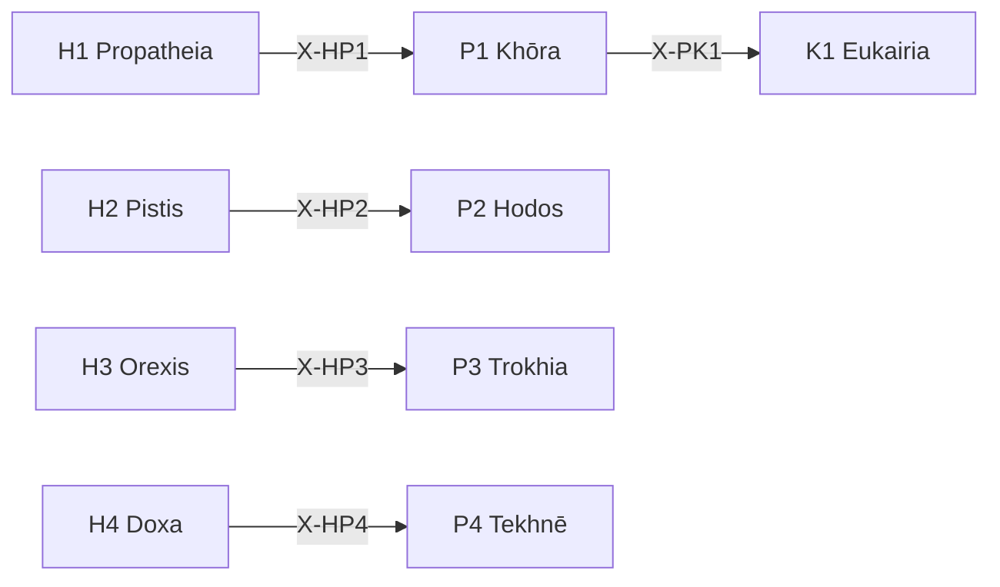

# /p: 環境配置 Peras (Perigraphē)

> **Hegemonikón Layer**: Perigraphē (P-series)
> **定義**: `/p` = `lim(P1·P2·P3·P4)` — L1.5×L1.5 の極限演算
> **目的**: 空間・経路・軌道・技術の4定理を**1つの環境配置判断に収束**させる
> **派生**: 12派生（P1-P4 各3派生）
>
> **制約**: 全4定理 → 融合(Convergence)。途中の省略は`-`モード実行時のみ許容。

---

## Limit / Colimit

| 演算 | 記号 | 圏論 | 意味 |
|:-----|:-----|:-----|:-----|
| `/p` | `/` | **Limit** | 4定理 → 最適な1収束点 |
| `\p` | `\` | **Colimit** | 4定理 → 全組み合わせに展開 |
| `/p+` | `+` | Limit強度↑ | より深い収束 |
| `/p-` | `-` | Limit強度↓ | 軽い収束 |

### 米田の補題 (Yoneda)

> 各定理 T は Hom(-, T) で完全に決まる。X-series が定理の意味そのもの。
> Limit `/p` = 4定理の環境配置射が一致する Cone の頂点。
> @converge = Cone を構築し、「空間・経路・軌道・技術が整合する唯一の環境」を見つける。

---

## P-Series 12派生マトリックス

| 定理 | 問い | 派生1 | 派生2 | 派生3 |
|:-----|:-----|:------|:------|:------|
| **P1 Khōra** | どの空間で？ | `phys` (物理的) | `conc` (概念的) | `rela` (関係的) |
| **P2 Hodos** | どの経路で？ | `line` (線形) | `bran` (分岐) | `cycl` (循環) |
| **P3 Trokhia** | どのパターンで？ | `fixe` (固定) | `adap` (適応) | `emer` (創発) |
| **P4 Tekhnē** | どの技術で？ | `manu` (手動) | `mech` (機械) | `auto` (自動) |

### 派生選択ロジック

```python
from mekhane.fep.derivative_selector import select_derivative

result = select_derivative("P1", problem_context)
# → phys: 物理的場所 → conc: 概念モデル → rela: 関係ネットワーク
```

---

## 発動条件

| トリガー | 説明 |
|:---------|:-----|
| `/p` または `/peri` | Perigraphē シリーズを起動 |
| `/p [1-4]` | 特定の定理を指定して起動 |
| 環境・制約の分析が必要 | 空間配置、経路設計 |

---

## P-series 定理一覧

| # | ID | Name | Greek | 生成 | 役割 |
|:-:|:---|:-----|:------|:-----|:-----|
| 1 | **P1** | Khōra | Χώρα | Scale × Scale | **空間配置** — 存在空間の定義 |
| 2 | **P2** | Hodos | Ὁδός | Scale × Function | **経路配置** — 移動・遷移の経路 |
| 3 | **P3** | Trokhia | Τροχιά | Function × Scale | **軌道配置** — 運動・進行の軌道 |
| 4 | **P4** | Tekhnē | Τέχνη | Function × Function | **技術配置** — 技術的方法論 |

---

## 処理フロー

### `/p` (Limit — 収束) `@converge`

> **米田**: 各定理 Pn は Hom(-, Pn) で完全に決まる。
> @converge = 環境配置射の Cone を構築し、「空間・経路・軌道・技術が整合する唯一の配置」を見つける。

#### ⊕ C0: Precision Weighting (PW) — 実行時精度の決定

> **FEP**: Precision Weighting = 各情報チャネルの信頼度を動的に決定する操作。
> `+`/`-` は均等 PW（省略形）。`pw:` は不均等 PW（一般化）。

**明示指定**: `/p{pw: P1+, P4-}` → P1 (空間) を強化、P4 (技術) を抑制

**暗黙推定**:

| 条件 | PW 推定 | 理由 |
|:-----|:--------|:-----|
| スコーピング文脈 | P1+ | 空間定義を重視 |
| 技術選定文脈 | P4+ | 技術を重視 |
| 新規経路設計 | P2+ | 経路を重視 |
| 指定なし | 全0 (均等) | default |

→ **pw[P1..P4]** = 各定理の実行時精度重み [-1, +1]

---

**Cone 自動構築** (C1 の射の対比完了後に実行):

// turbo

```bash
cd ~/oikos/hegemonikon && PYTHONPATH=. .venv/bin/python mekhane/fep/cone_builder.py \
  --series P --pw "${PW_P:-}" \
  --file "$(PYTHONPATH=. .venv/bin/python -m mekhane.fep.wf_env_bridge export P)"
```

**射の列挙** (各定理の環境射を計算):

1. **[P1 Khōra]** Scale×Scale: Hom(-, P1) = 空間の射 — 範囲・境界を定義
2. **[P2 Hodos]** Scale×Function: Hom(-, P2) = 経路の射 — A→B を設計
3. **[P3 Trokhia]** Function×Scale: Hom(-, P3) = 軌道の射 — 動的パターンを予測
4. **[P4 Tekhnē]** Function×Function: Hom(-, P4) = 技術の射 — 手段を選定

#### ⊕ C1: 射の対比 (Contrast) — Cone の射後検査

> **圏論**: 4つの環境射が整合するか検査。空間と技術が矛盾 = Cone が存在しない。

| 定理 | Hom(X, Pn) | pw | 出力要点 (1行) |
|:-----|:-----------|:--:|:---------------|
| P1 | 空間の射 | {pw₁} | {空間定義: スコープ/境界} |
| P2 | 経路の射 | {pw₂} | {経路: A→B} |
| P3 | 軌道の射 | {pw₃} | {軌道: 動的パターン} |
| P4 | 技術の射 | {pw₄} | {技術: 選定手段} |

→ **V[outputs]** = 環境射の散布度 (矛盾度: 0.0-1.0)

#### ⊕ C2: Cone の頂点探索 (Resolve) — PW 加重融合

> **圏論**: V[outputs] + PW 重み に応じて、加重融合で中介射を構築する。
> 統合出力 = Σ(定理_i × (1 + pw_i)) / Σ(1 + pw_i)

| V[outputs] | Cone 状態 | 中介射の構築法 |
|:-----------|:---------|:-------------------|
| > 0.3 | 配置矛盾 | `/dia.root` + **PW 加重融合** |
| > 0.1 | 微妙な不整合 | **PW 加重融合** (`@reduce(*, pw)`) |
| ≤ 0.1 | 配置整合 | PW ≠ 0 なら加重集約、= 0 なら `Σ` |

#### ⊕ C3: Kalon 普遍性検証 (Verify) — Cone の普遍性

> **圏論**: 「この環境配置判断が唯一の自然な収束点か？」を検証。
> `/noe` Phase 3 (Kalon) と同じ原理を `/p` のコンテキストに適用。

##### C3-a: 図式化 — 各定理出力を候補解として配置

| 定理 | 候補解 | 射 |
|:------|:-------|:---|
| P1 Khōra | 場の結論 | スコープ |
| P2 Hodos | 道の結論 | 経路 |
| P3 Trokhia | 軌道の結論 | サイクル |
| P4 Tekhnē | 技法の結論 | 手法 |
| C2 | 融合判断 | 統合出力 |

##### C3-b: 因子分解テスト — 候補間の包含関係を判定

> **使用**: `mekhane.fep.universality.kalon_verify()`
> C2 の統合判断が他の全候補を特殊ケースとして含むか検証。

##### C3-c: Kalon スコア + 統合

| 項目 | 圏論的意味 | 内容 |
|:-----|:-------------|:-----|
| 矛盾度 | 射の散布 | V[outputs] = {0.0-1.0} |
| 解消法 | 中介射の構築法 | {root/weighted/simple} |
| **Kalon** | **普遍性の強さ** | {0.0-1.0} — 統合判断の包含力 |
| **環境配置判断** | **Cone の頂点** | {1文で} |
| **確信度** | **普遍性 × 確信** | {C/U} ({confidence}%) |

---

### `\p` (Colimit — 展開) `@diverge`

#### ⊗ D1: スキャン (Scan) — 6対の張力評価

| # | 対 | 交差 | 問い | 張力 |
|:-:|:---|:-----|:-----|:----:|
| 1 | P1⊗P2 | (Sc×Sc)⊗(Sc×Fn) | 空間が経路をどう制約するか | 低(同軸Sc) |
| 2 | P1⊗P3 | (Sc×Sc)⊗(Fn×Sc) | 空間が軌道をどう規定するか | 中(半直交) |
| 3 | P1⊗P4 | (Sc×Sc)⊗(Fn×Fn) | 空間が技術をどう選定するか | **高(完全直交)** |
| 4 | P2⊗P3 | (Sc×Fn)⊗(Fn×Sc) | 経路が軌道をどう分岐させるか | **高(完全直交)** |
| 5 | P2⊗P4 | (Sc×Fn)⊗(Fn×Fn) | 経路が技術をどう要求するか | 中(半直交) |
| 6 | P3⊗P4 | (Fn×Sc)⊗(Fn×Fn) | 軌道が技術をどう進化させるか | 低(同軸Fn) |

#### ⊗ D2: 深掘り (Probe) — 上位3対

高張力対 (#3, #4, #2 or #5) に `/zet+` → `/noe-` を適用:

- **P1⊗P4**: 空間(Sc×Sc)と技術(Fn×Fn)の完全直交 → スコープと手段の乖離
- **P2⊗P3**: 経路(Sc×Fn)と軌道(Fn×Sc)の完全直交 → 計画と実態の乖離

#### ⊗ D3: 盲点レポート

| 項目 | 内容 |
|:-----|:-----|
| 最高張力対 | {pair} (tension: {score}) |
| 盲点 | 1. {発見1} / 2. {発見2} / 3. {発見3} |
| 確信度 | {C/U} ({confidence}%) |
| 記録先 | `/dox.sens` → {path} |

### `/p [N]` (単体駆動)

SKILL.md を参照し、指定定理のみ実行。

---

## 出力形式

| 項目 | 内容 |
|:-----|:-----|
| 定理 | P{N} {Name} |
| 対象 | {対象} |
| 空間 | {範囲} |
| 経路 | {A → B} |
| 次の推奨 | → K{X} / A{Y} |

---

## X-series 接続



---

## Hegemonikon Status

| Module | Workflow | Status |
|:-------|:---------|:-------|
| P1-P4 | /p | v5.0 Ready |

---

*v5.0 — Limit演算復元 (2026-02-07)*
*v5.1 — 米田の補題統合 (2026-02-08)*
*v5.2 — 米田深層統合。@converge C1-C3 を Cone 構築として再定義 (2026-02-08)*
