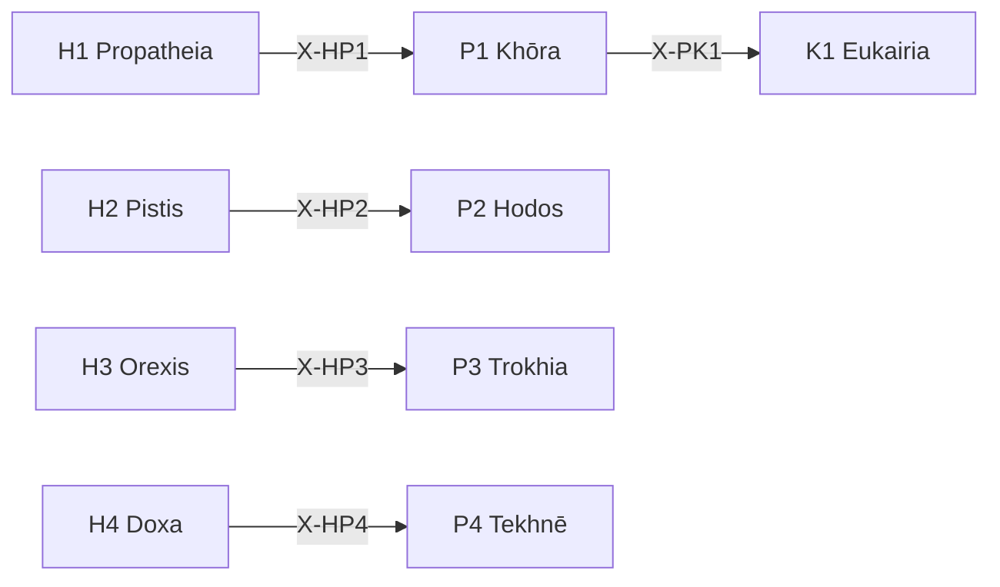

# /p: 環境定理ワークフロー

> **Hegemonikón Layer**: Perigraphē (P-series)
> **目的**: 空間・経路・軌道・技術の4軸で環境を処理する
> **派生**: 12派生（P1-P4 各3派生）

---

## P-Series 12派生マトリックス

| 定理 | 問い | 派生1 | 派生2 | 派生3 |
|:-----|:-----|:------|:------|:------|
| **P1 Khōra** | どの空間で？ | `phys` (物理的) | `conc` (概念的) | `rela` (関係的) |
| **P2 Hodos** | どの経路で？ | `line` (線形) | `bran` (分岐) | `cycl` (循環) |
| **P3 Trokhia** | どのパターンで？ | `fixe` (固定) | `adap` (適応) | `emer` (創発) |
| **P4 Tekhnē** | どの技術で？ | `manu` (手動) | `mech` (機械) | `auto` (自動) |

### FEP 派生選択

```python
from mekhane.fep.derivative_selector import select_derivative

# 例: 空間タイプ
result = select_derivative("P1", "チームとのネットワーク、関係性を重視")
# → DerivativeRecommendation(derivative="rela", confidence=0.75)

# 例: 技術レベル
result = select_derivative("P4", "AI による完全自動化")
# → DerivativeRecommendation(derivative="auto", confidence=0.80)
```

---

## 発動条件

| トリガー | 説明 |
| :-------- | :---- |
| `/p` または `/peri` | Perigraphē シリーズを起動 |
| `/p [1-4]` | 特定の定理を指定して起動 |
| 環境・制約の分析が必要 | 空間配置、経路設計 |

---

## P-series 定理一覧

| # | ID | Name | Greek | 役割 |
|:-:| :--- | :----- | :------ | :----- |
| 1 | **P1** | Khōra | Χώρα | **空間配置** — 存在空間の定義 |
| 2 | **P2** | Hodos | Ὁδός | **経路配置** — 移動・遷移の経路 |
| 3 | **P3** | Trokhia | Τροχιά | **軌道配置** — 運動・進行の軌道 |
| 4 | **P4** | Tekhnē | Τέχνη | **技術配置** — 技術的方法論 |

---

## Process

### `/p` (全体駆動)

```text
入力: 対象環境 E
  ↓
[P1 Khōra] 空間を定義（範囲・境界）
  ↓
[P2 Hodos] 経路を設計（A→B）
  ↓
[P3 Trokhia] 軌道を予測（動的パターン）
  ↓
[P4 Tekhnē] 技術的手段を選定
  ↓
出力: 環境配置
```

### `/p 4` (P4 Tekhnē 単体)

```text
入力: 技術的課題
  ↓
SKILL.md 参照: .agent/skills/perigraphe/p4-tekhne/SKILL.md
  ↓
[STEP 1] 技術オプション列挙
[STEP 2] 適用可能性評価
[STEP 3] 推奨技術選定
  ↓
出力: 技術的配置
```

---

## 出力形式

```markdown
┌─[Hegemonikón]──────────────────────┐
│ P{N} {Name}: 環境配置完了          │
│ 対象: {対象}                       │
│ 空間: {範囲}                       │
│ 経路: {A → B}                      │
│ 次の推奨: → K{X} / A{Y}            │
└────────────────────────────────────┘
```

---

## X-series 接続



---

## Hegemonikon Status

| Module | Workflow | Status |
| :------ | :-------- | :------ |
| P1-P4 | /p | v2.1 Ready |
