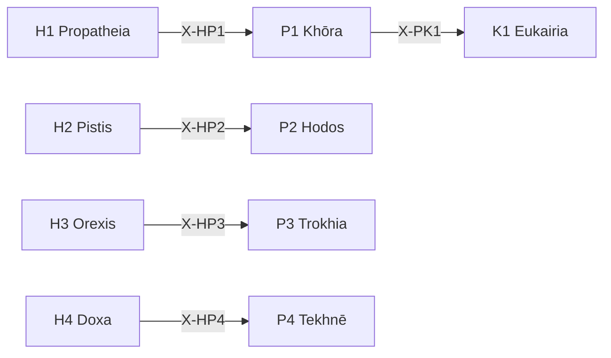

# /p: 環境配置 Peras (Perigraphē)

> **Hegemonikón Layer**: Perigraphē (P-series)
> **定義**: `/p` = `lim(P1·P2·P3·P4)` — L1.5×L1.5 の極限演算
> **目的**: 空間・経路・軌道・技術の4定理を**1つの環境配置判断に収束**させる
> **派生**: 12派生（P1-P4 各3派生）
>
> **制約**: 全4定理 → 融合(Convergence)。途中の省略は`-`モード実行時のみ許容。

---

## Limit / Colimit

| 演算 | 記号 | 圏論 | 意味 |
|:-----|:-----|:-----|:-----|
| `/p` | `/` | **Limit** | 4定理 → 最適な1収束点 |
| `\p` | `\` | **Colimit** | 4定理 → 全組み合わせに展開 |
| `/p+` | `+` | Limit強度↑ | より深い収束 |
| `/p-` | `-` | Limit強度↓ | 軽い収束 |

---

## P-Series 12派生マトリックス

| 定理 | 問い | 派生1 | 派生2 | 派生3 |
|:-----|:-----|:------|:------|:------|
| **P1 Khōra** | どの空間で？ | `phys` (物理的) | `conc` (概念的) | `rela` (関係的) |
| **P2 Hodos** | どの経路で？ | `line` (線形) | `bran` (分岐) | `cycl` (循環) |
| **P3 Trokhia** | どのパターンで？ | `fixe` (固定) | `adap` (適応) | `emer` (創発) |
| **P4 Tekhnē** | どの技術で？ | `manu` (手動) | `mech` (機械) | `auto` (自動) |

### 派生選択ロジック

```python
from mekhane.fep.derivative_selector import select_derivative

result = select_derivative("P1", problem_context)
# → phys: 物理的場所 → conc: 概念モデル → rela: 関係ネットワーク
```

---

## 発動条件

| トリガー | 説明 |
|:---------|:-----|
| `/p` または `/peri` | Perigraphē シリーズを起動 |
| `/p [1-4]` | 特定の定理を指定して起動 |
| 環境・制約の分析が必要 | 空間配置、経路設計 |

---

## P-series 定理一覧

| # | ID | Name | Greek | 生成 | 役割 |
|:-:|:---|:-----|:------|:-----|:-----|
| 1 | **P1** | Khōra | Χώρα | Scale × Scale | **空間配置** — 存在空間の定義 |
| 2 | **P2** | Hodos | Ὁδός | Scale × Function | **経路配置** — 移動・遷移の経路 |
| 3 | **P3** | Trokhia | Τροχιά | Function × Scale | **軌道配置** — 運動・進行の軌道 |
| 4 | **P4** | Tekhnē | Τέχνη | Function × Function | **技術配置** — 技術的方法論 |

---

## 処理フロー

### `/p` (Limit — 収束) `@converge`

1. **[P1 Khōra]** Scale×Scale: 空間を定義(範囲・境界)
2. **[P2 Hodos]** Scale×Function: 経路を設計(A→B)
3. **[P3 Trokhia]** Function×Scale: 軌道を予測(動的パターン)
4. **[P4 Tekhnē]** Function×Function: 技術的手段を選定

#### ⊕ C1: 対比 (Contrast)

| 定理 | 出力要点 (1行) |
|:-----|:---------------|
| P1 | {空間定義: スコープ/境界} |
| P2 | {経路: A→B} |
| P3 | {軌道: 動的パターン} |
| P4 | {技術: 選定手段} |

→ **V[outputs]** = 分散 (環境配置の矛盾度: 0.0-1.0)

#### ⊕ C2: 解消 (Resolve)

| V[outputs] | 状態 | 処理 |
|:-----------|:-----|:-----|
| > 0.3 | 配置矛盾 | `/dia.root` → 重み付け融合 |
| > 0.1 | 微妙な不整合 | 通常融合 (`@reduce(*)`) |
| ≤ 0.1 | 配置整合 | 単純集約 (`Σ`) |

#### ⊕ C3: 検証 (Verify)

| 項目 | 内容 |
|:-----|:-----|
| 矛盾度 | V[outputs] = {0.0-1.0} |
| 解消法 | {root/weighted/simple} |
| **環境配置判断** | {1文で} |
| **確信度** | {C/U} ({confidence}%) |

---

### `\p` (Colimit — 展開) `@diverge`

#### ⊗ D1: スキャン (Scan) — 6対の張力評価

| # | 対 | 交差 | 問い | 張力 |
|:-:|:---|:-----|:-----|:----:|
| 1 | P1⊗P2 | (Sc×Sc)⊗(Sc×Fn) | 空間が経路をどう制約するか | 低(同軸Sc) |
| 2 | P1⊗P3 | (Sc×Sc)⊗(Fn×Sc) | 空間が軌道をどう規定するか | 中(半直交) |
| 3 | P1⊗P4 | (Sc×Sc)⊗(Fn×Fn) | 空間が技術をどう選定するか | **高(完全直交)** |
| 4 | P2⊗P3 | (Sc×Fn)⊗(Fn×Sc) | 経路が軌道をどう分岐させるか | **高(完全直交)** |
| 5 | P2⊗P4 | (Sc×Fn)⊗(Fn×Fn) | 経路が技術をどう要求するか | 中(半直交) |
| 6 | P3⊗P4 | (Fn×Sc)⊗(Fn×Fn) | 軌道が技術をどう進化させるか | 低(同軸Fn) |

#### ⊗ D2: 深掘り (Probe) — 上位3対

高張力対 (#3, #4, #2 or #5) に `/zet+` → `/noe-` を適用:

- **P1⊗P4**: 空間(Sc×Sc)と技術(Fn×Fn)の完全直交 → スコープと手段の乖離
- **P2⊗P3**: 経路(Sc×Fn)と軌道(Fn×Sc)の完全直交 → 計画と実態の乖離

#### ⊗ D3: 盲点レポート

| 項目 | 内容 |
|:-----|:-----|
| 最高張力対 | {pair} (tension: {score}) |
| 盲点 | 1. {発見1} / 2. {発見2} / 3. {発見3} |
| 確信度 | {C/U} ({confidence}%) |
| 記録先 | `/dox.sens` → {path} |

### `/p [N]` (単体駆動)

SKILL.md を参照し、指定定理のみ実行。

---

## 出力形式

| 項目 | 内容 |
|:-----|:-----|
| 定理 | P{N} {Name} |
| 対象 | {対象} |
| 空間 | {範囲} |
| 経路 | {A → B} |
| 次の推奨 | → K{X} / A{Y} |

---

## X-series 接続



---

## Hegemonikon Status

| Module | Workflow | Status |
|:-------|:---------|:-------|
| P1-P4 | /p | v5.0 Ready |

---

*v5.0 — Limit演算復元 (2026-02-07)*
