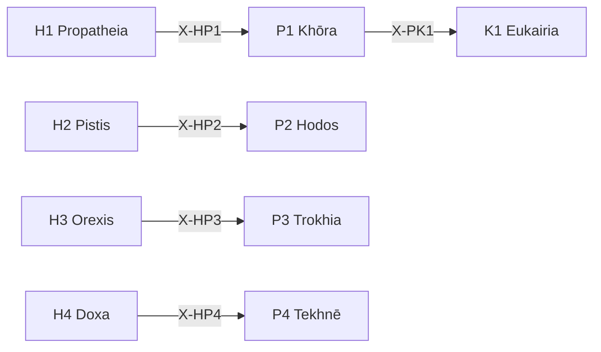

# /p: 環境定理ワークフロー (Perigraphē)

> **Hegemonikón Layer**: Perigraphē (P-series)
> **定義**: `/p` = `lim(P1·P2·P3·P4)` — L1.5×L1.5 の極限演算
> **目的**: 空間・経路・軌道・技術の4定理を**1つの環境配置判断に収束**させる
> **派生**: 12派生（P1-P4 各3派生）
>
> **制約**: 全4定理 → 融合(Convergence)。途中の省略は`-`モード実行時のみ許容。

---

## Limit / Colimit

| 演算 | 記号 | 圏論 | 意味 |
|:-----|:-----|:-----|:-----|
| `/p` | `/` | **Limit** | 4定理 → 最適な1収束点 |
| `\p` | `\` | **Colimit** | 4定理 → 全組み合わせに展開 |
| `/p+` | `+` | Limit強度↑ | より深い収束 |
| `/p-` | `-` | Limit強度↓ | 軽い収束 |

---

## P-Series 12派生マトリックス

| 定理 | 問い | 派生1 | 派生2 | 派生3 |
|:-----|:-----|:------|:------|:------|
| **P1 Khōra** | どの空間で？ | `phys` (物理的) | `conc` (概念的) | `rela` (関係的) |
| **P2 Hodos** | どの経路で？ | `line` (線形) | `bran` (分岐) | `cycl` (循環) |
| **P3 Trokhia** | どのパターンで？ | `fixe` (固定) | `adap` (適応) | `emer` (創発) |
| **P4 Tekhnē** | どの技術で？ | `manu` (手動) | `mech` (機械) | `auto` (自動) |

### 派生選択ロジック

```python
from mekhane.fep.derivative_selector import select_derivative

result = select_derivative("P1", problem_context)
# → phys: 物理的場所 → conc: 概念モデル → rela: 関係ネットワーク
```

---

## 発動条件

| トリガー | 説明 |
|:---------|:-----|
| `/p` または `/peri` | Perigraphē シリーズを起動 |
| `/p [1-4]` | 特定の定理を指定して起動 |
| 環境・制約の分析が必要 | 空間配置、経路設計 |

---

## P-series 定理一覧

| # | ID | Name | Greek | 生成 | 役割 |
|:-:|:---|:-----|:------|:-----|:-----|
| 1 | **P1** | Khōra | Χώρα | Scale × Scale | **空間配置** — 存在空間の定義 |
| 2 | **P2** | Hodos | Ὁδός | Scale × Function | **経路配置** — 移動・遷移の経路 |
| 3 | **P3** | Trokhia | Τροχιά | Function × Scale | **軌道配置** — 運動・進行の軌道 |
| 4 | **P4** | Tekhnē | Τέχνη | Function × Function | **技術配置** — 技術的方法論 |

---

## 処理フロー

### `/p` (Limit — 収束)

1. **[P1 Khōra]** Scale×Scale: 空間を定義(範囲・境界)
2. **[P2 Hodos]** Scale×Function: 経路を設計(A→B)
3. **[P3 Trokhia]** Function×Scale: 軌道を予測(動的パターン)
4. **[P4 Tekhnē]** Function×Function: 技術的手段を選定
5. **⊕ Convergence**: 4定理の出力を**1つの環境配置判断**に融合

### `\p` (Colimit — 展開)

4定理の**全6対の交差関係**を展開し、環境間の相互作用を可視化する。

| # | 対 | 交差 | 問い |
|:-:|:---|:-----|:-----|
| 1 | P1⊗P2 | (Sc×Sc)⊗(Sc×Fn) | 空間が経路をどう制約するか |
| 2 | P1⊗P3 | (Sc×Sc)⊗(Fn×Sc) | 空間が軌道をどう規定するか |
| 3 | P1⊗P4 | (Sc×Sc)⊗(Fn×Fn) | 空間が技術をどう選定するか |
| 4 | P2⊗P3 | (Sc×Fn)⊗(Fn×Sc) | 経路が軌道をどう分岐させるか |
| 5 | P2⊗P4 | (Sc×Fn)⊗(Fn×Fn) | 経路が技術をどう要求するか |
| 6 | P3⊗P4 | (Fn×Sc)⊗(Fn×Fn) | 軌道が技術をどう進化させるか |

**⊗ Divergence**: 6対の交差から**環境の盲点・未開拓経路**を抽出

### `/p [N]` (単体駆動)

SKILL.md を参照し、指定定理のみ実行。

---

## 出力形式

| 項目 | 内容 |
|:-----|:-----|
| 定理 | P{N} {Name} |
| 対象 | {対象} |
| 空間 | {範囲} |
| 経路 | {A → B} |
| 次の推奨 | → K{X} / A{Y} |

---

## X-series 接続



---

## Hegemonikon Status

| Module | Workflow | Status |
|:-------|:---------|:-------|
| P1-P4 | /p | v5.0 Ready |

---

*v5.0 — Limit演算復元 (2026-02-07)*
