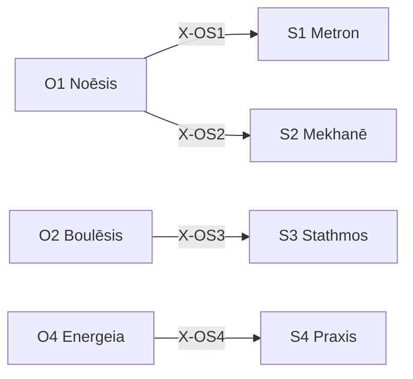

# /s: 戦略定理ワークフロー (認知的設計プロトコル)

> **Hegemonikón Layer**: Schema (S-series)
> **目的**: 盲点・戦略・基準・行動設計・敵対的検証を経た高品質計画の策定
> **発動条件**: 5行以上のコード変更、新機能実装、アーキテクチャ変更
> **派生**: 12派生（S1-S4 各3派生）

---

## S-Series 12派生マトリックス

| 定理 | 問い | 派生1 | 派生2 | 派生3 |
|:-----|:-----|:------|:------|:------|
| **S1 Metron** | どのスケールで？ | `cont` (連続量) | `disc` (離散量) | `abst` (抽象度) |
| **S2 Mekhanē** | どの手法で？ | `comp` (組立) | `inve` (創出) | `adap` (適応) |
| **S3 Stathmos** | 何を基準に？ | `norm` (規範) | `empi` (経験) | `rela` (相対) |
| **S4 Praxis** | どう実現する？ | `prax` (内在目的) | `pois` (外的産出) | `temp` (時間構造) |

### FEP 派生選択

```python
from mekhane.fep.derivative_selector import select_derivative

# 例: スケール選択
result = select_derivative("S1", "この変更の粒度はどのレベルで考えるべき？")
# → DerivativeRecommendation(derivative="abst", confidence=0.75)

# 例: 方法選択
result = select_derivative("S2", "既存のライブラリを組み合わせて実装")
# → DerivativeRecommendation(derivative="comp", confidence=0.80)
```

---

## 5-STAGE 認知プロセス

> **SE原則: タイムボックス** — 無限に考えない。合計45分以内。

```text
┌─────────────────────────────────────────────────────────────────────────┐
│  STAGE 0: Prior Art + Blindspot + Scale (S1 Metron)   ⏱️ 5分            │
│    ↓ 先人の知恵を調べたか？見落としはないか？                            │
│    📊 出力: 「✅ STAGE 0: Scale = {Micro/Meso/Macro}」                   │
│                                                                          │
│  STAGE 1: Strategy Selection (S2 Mekhanē)             ⏱️ 10分           │
│    ↓ Explore vs Exploit？どのアプローチで進めるか？                      │
│    📊 出力: 「✅ STAGE 1: Strategy = {E/E}, Plan = {A/B/C}」             │
│                                                                          │
│  STAGE 2: Success Criteria (S3 Stathmos)              ⏱️ 5分            │
│    ↓ 何をもって成功とするか？評価基準は？                                │
│    📊 出力: 「✅ STAGE 2: Must = {N}, Should = {M}, Could = {K}」        │
│                                                                          │
│  STAGE 3: Blueprint + Goal Decomposition (S4 Praxis)  ⏱️ 15分           │
│    ↓ 目標から逆算した設計書を作成                                        │
│    📊 出力: 「✅ STAGE 3: Blueprint saved」                              │
│                                                                          │
│  STAGE 4: Devil's Advocate (/dia)                     ⏱️ 5分            │
│    ↓ 敵対的視点で計画を破壊テスト                                        │
│    📊 出力: 「✅ STAGE 4: Risks = {N}件, Mitigations = {M}件」           │
│                                                                          │
│  STAGE 5: SE振り返り (/gno派生)                       ⏱️ 5分            │
│    ↓ Keep / Problem / Try の記録                                         │
│    📊 出力: 「✅ STAGE 5: Retrospective → Doxa」                         │
│                                                                          │
│  ⏱️ 合計: 45分                                                          │
│  ⚠️ 超過する場合 → スコープを縮小 (S1 Metron 再検討)                     │
└─────────────────────────────────────────────────────────────────────────┘
```

---

## STAGE 0: Blindspot + Scale Detection [S1 Metron]

### Phase 0.0: Prior Art Check

| 確認事項 | 調査先 |
|:---------|:-------|
| 同じ問題を既に解決した人がいないか？ | Stack Overflow, GitHub |
| 公式ドキュメントに推奨手法はないか？ | 公式ドキュメント |
| 社内で類似の解決策はないか？ | KI, Handoff, Sophia |

### Phase 0.1: Blindspot Check

| カテゴリ | 質問 |
|:---------| :----- |
| 🎯 Framing | 問題の定義自体が間違っていないか？ |
| 📐 Scope | 広すぎ/狭すぎないか？ |
| 🔗 Dependencies | 見落としている依存関係は？ |

### Phase 0.2: Scale Determination [必須: 宣言必須]

> **⛔ ブロック**: スケールを宣言しないと STAGE 1 に進めない

| Scale | 範囲 | 例 | 強制レベル |
|:------|:-----|:---|:-----------|
| 🔬 Micro | 単一ファイル | バグ修正 | L2-min |
| 🔭 Meso | モジュール | 機能追加 | L2-std |
| 🌍 Macro | システム全体 | アーキテクチャ変更 | L3 |

**出力形式 (必須)**:

```text
📊 Scale 宣言: {🔬 Micro / 🔭 Meso / 🌍 Macro}
   → 強制レベル: {L2-min / L2-std / L3}
```

---

## STAGE 1: Strategy Selection [S2 Mekhanē]

### Explore vs Exploit 判定

| 軸 | Explore | Exploit |
|:---|:--------|:--------|
| 失敗コスト | 低い | 高い |
| 環境確実性 | 不確実 | 確実 |
| 時間制約 | 余裕あり | 緊急 |

### 3プラン提示

| Plan | 特徴 | リスク |
|:-----|:-----|:-------|
| A Conservative | 最小限の変更 | 柔軟性低 |
| B Robust | 拡張性重視 (推奨) | 工数増 |
| C Aggressive | 抜本的リファクタ | リスク高 |

### Y-1 & D-1 時間軸評価 ← 旧 /plan から復元

> **Origin**: Legacy Module Y-1（七世代先の視点）+ D-1（システム・ダイナミクス）

#### Y-1: Fast / Slow / Eternal 3層評価

選択したプランを3つの時間スケールで評価:

| 層 | 時間軸 | 問い |
|:---|:-------|:-----|
| **Fast** | 今日〜1週間 | 即座に得られる成果は？ |
| **Slow** | 1ヶ月〜1年 | 中期的に何が変わるか？ |
| **Eternal** | 5年〜100年 | 長期的・構造的影響は？ |

**出力例**:

```text
Y-1 評価:
  Fast:    ✅ バグ修正で即時品質向上
  Slow:    ⚠️ 技術負債が6ヶ月後に顕在化
  Eternal: ✅ アーキテクチャは10年耐えうる
```

#### D-1: T+0 / T+1 / T+2 波紋効果評価

変更が及ぼす影響を時間経過で評価:

| フェーズ | 時点 | 問い |
|:---------|:-----|:-----|
| **T+0** | 変更直後 | 直接の影響範囲は？ |
| **T+1** | 1次波紋 | 依存コンポーネントへの影響は？ |
| **T+2** | 2次波紋 | システム全体への遅延効果は？ |

**出力例**:

```text
D-1 評価:
  T+0:     変更対象ファイル 3件
  T+1:     依存モジュール 5件に影響
  T+2:     CI/CD パイプライン再構成が必要
```

### STAGE 1 出力形式

```markdown
[Hegemonikon] STAGE 1: Strategy Selection
  ⚖️ Explore/Exploit: {判定}
  📋 Plans: A/B/C → 選択: {B}

  📅 Y-1 評価:
    Fast: {評価}
    Slow: {評価}
    Eternal: {評価}

  🌊 D-1 評価:
    T+0: {直接影響}
    T+1: {1次波紋}
    T+2: {2次波紋}
```

---

## STAGE 2: Success Criteria [S3 Stathmos]

| 軸 | Must | Should | Could |
|:---|:-----|:-------|:------|
| 機能性 | 必須要件 | 期待要件 | 理想要件 |
| 品質 | 必須品質 | 期待品質 | 理想品質 |
| 性能 | 必須性能 | 期待性能 | 理想性能 |

---

## STAGE 3: Blueprint [S4 Praxis]

### Goal Decomposition

```text
最終目標
  ↑
サブゴール 1
  ↑
サブゴール 2
  ↑
現在地
```

### Implementation Plan 形式

```markdown
# Implementation Plan

## 目的
## 変更対象ファイル
## 依存関係
## リスクと対策
## 検証計画
```

### リーンキャンバス (事業計画モード)

> **Origin**: AI Zen 技法26 を消化 — 2026-01-29
> **発動**: `/s --lean` または「リーンキャンバスで整理して」

新規事業・プロダクトの計画時に使用:

| カテゴリ | 要素 | 問い |
|:---------|:-----|:-----|
| **市場** | 顧客セグメント | 誰のためのサービス？ |
| | 初期顧客ペルソナ | 最初の100人はどんな人？ |
| **問題** | 課題 | 何を解決する？ |
| | 既存代替品 | 競合・代替手段は？ |
| **解決策** | UVP | 他と何が違う？ |
| | ソリューション | どう解決する？ |
| **ビジネス** | チャネル | どうやって届ける？ |
| | 収益の流れ | どうマネタイズ？ |
| | コスト構造 | 何にコストがかかる？ |
| **指標** | 主要指標 | KPIは？ |
| | 圧倒的優位性 | 模倣困難な強みは？ |
| | リソース | 何が必要？ |

**出力形式**:

```text
┌─[Lean Canvas]──────────────────────────────────────────┐
│ 【市場】                                               │
│   顧客セグメント: [ターゲット]                          │
│   初期顧客: [最初の100人]                              │
│ 【問題】                                               │
│   課題: [解決する問題]                                 │
│   既存代替: [競合]                                     │
│ 【解決策】                                             │
│   UVP: [差別化]                                        │
│   ソリューション: [解決策]                              │
│ 【ビジネス】                                           │
│   チャネル: [販路]                                     │
│   収益: [マネタイズ]                                   │
│   コスト: [主要コスト]                                 │
│ 【指標】                                               │
│   KPI: [主要指標]                                      │
│   優位性: [模倣困難]                                   │
│   リソース: [必要なもの]                               │
└────────────────────────────────────────────────────────┘
```

---

## STAGE 3.5: Quality Gate Check [自動品質門]

> **Origin**: 2026-01-29 /bou+ 優先順位3 — quality_gate 連携
> **発動**: STAGE 3 完了時に自動実行（オプトアウト: `--no-quality-gate`）

変更対象ファイルに対して Metrika/Chreos/Palimpsest を自動検証:

```bash
# 変更ファイルの品質チェック
python3 $HOME/oikos/hegemonikon/mekhane/quality_gate.py <変更ファイル>
```

### 出力形式

```text
┌─[Quality Gate]─────────────────────────────────────────┐
│ 対象: [ファイル名]                                      │
│ Metrika: ✅ PASS (5/5)                                 │
│ Chreos:  ⚠️ WARNING (TODO 2件, 期限超過 0件)            │
│ Palimpsest: 📝 INFO (HACK 1件)                         │
│                                                        │
│ 判定: 続行可 (警告あり)                                 │
└────────────────────────────────────────────────────────┘
```

### 判定基準

| 状態 | 条件 | アクション |
|:-----|:-----|:-----------|
| ✅ PASS | 全チェック通過 | STAGE 4 へ進行 |
| ⚠️ WARNING | Chreos/Palimpsest 検出 | 情報表示して続行 |
| ❌ FAIL | Metrika 違反 | STAGE 3 差し戻し推奨 |

---

## STAGE 4: Devil's Advocate [/dia]

| 視点 | 質問 |
|:-----|:-----|
| Feasibility | 本当に実現可能か？ |
| Necessity | 本当に必要か？ |
| Alternatives | より良い代替案は？ |
| Risks | 見落としリスクは？ |

---

## STAGE 5: SE振り返り原則 [/gno派生] 🔄

> **Origin**: SE思想「継続的改善 (Kaizen)」を処理フローに埋め込み
> **必須**: このステージはスキップ禁止。どんなに急いでも1分は使う。

### 5.1 KPT フレームワーク

| ステップ | 問い | 最低回答数 |
|:---------|:-----|:-----------|
| **Keep** | この /s で上手くいったことは？ | 1つ以上 |
| **Problem** | 改善すべき点・想定外だったことは？ | 1つ以上 |
| **Try** | 次回 /s で試すことは？ | 1つ以上 |

### 5.2 失敗パターン収集

> **SE原則: 早期失敗の蓄積**

| 質問 | 目的 |
|:-----|:-----|
| 今回、どこで躓いたか？ | 失敗パターンの特定 |
| なぜ躓いたか？（5 Whys 簡易版） | 根本原因の特定 |
| 次回どう回避するか？ | 具体的対策 |

→ **失敗パターンは Doxa に必ず記録**（成功より重要）

### 5.3 時間振り返り

> **SE原則: タイムボックスの検証**

| 質問 | 判定基準 |
|:-----|:---------|
| 45分以内に完了したか？ | Yes → 適切なスコープ |
| どの STAGE で時間超過したか？ | → 次回のスコープ調整対象 |
| スコープは適切だったか？ | 大きすぎ → 分割、小さすぎ → 統合 |

### 出力形式

```text
┌─[SE振り返り: 継続的改善]────────────────────────────────┐
│ 🔄 KPT                                                  │
│   Keep:    {継続すべきこと}                              │
│   Problem: {問題点}                                      │
│   Try:     {次回試すこと}                                │
│                                                          │
│ 🔴 失敗パターン                                          │
│   躓き:   {どこで}                                       │
│   原因:   {なぜ}                                         │
│   対策:   {どう回避}                                     │
│                                                          │
│ ⏱️ 時間検証                                              │
│   所要時間: {N}分 / 45分 ({X}%)                          │
│   超過STAGE: {STAGE N}                                   │
│                                                          │
│ → Doxa に記録 [必須]                                     │
└──────────────────────────────────────────────────────────┘
```

---

## 出力形式

```markdown
┌─[Hegemonikón]──────────────────────────────────────────┐
│ /s v5.3 完了                                           │
│ STAGE 0: ✅ Scale: {Micro/Meso/Macro}                  │
│ STAGE 1: ✅ Strategy: {Explore/Exploit}, Plan: {A/B/C} │
│ STAGE 2: ✅ Rubric: Must/Should/Could                  │
│ STAGE 3: ✅ Blueprint: [artifact path]                 │
│ STAGE 4: ✅ Devil's Advocate: All PASS                 │
│ STAGE 5: 🔄 Retrospective: Keep/Problem/Try            │
└────────────────────────────────────────────────────────┘
```

---

## X-series 接続



---

## Anti-Skip Protocol + SE原則構造的強制

> [!CAUTION]
> **全 STAGE の実行が必須**。各 STAGE のゲート条件をクリアしない限り次に進めない。

**標準参照**: [workflow_artifact_standard.md](file:///home/laihuip001/oikos/.agent/standards/workflow_artifact_standard.md)
**SE原則強制**: 必須フィールドがないとブロック

### 必須フィールド（SE原則）

| フィールド | 必須条件 | 違反時 |
|:-----------|:---------|:-------|
| STAGE 0-5 全出力 | 全 Scale | ⛔ ブロック |
| `Keep:` / `Problem:` / `Try:` | 全 Scale | ⛔ ブロック |
| `⏱️ 合計: Xm/45m` | Meso 以上 | ⚠️ 警告 |

### 出力テンプレート [必須]

> **参照**: [s_output.md](file:///home/laihuip001/oikos/.agent/templates/s_output.md)

出力は上記テンプレートに従うこと。フィールドが欠けているとブロック。

### 検証 (validator)

```bash
python hegemonikon/mekhane/fep/se_principle_validator.py <output.md> --workflow s
```

---

## 🏛️ Schema 品質体系 (v4.3 新規)

> **S-series に統合された4つの品質概念**
> 各概念は対応する定理 SKILL.md に詳細定義

### 📏 Metrika: 5つの品質門 (S3 Stathmos)

| 門 | ギリシャ語 | 機能 |
|:---|:-----------|:-----|
| **Dokimē** | δοκιμή | テスト先行強制 |
| **Syntomia** | συντομία | 複雑度制限 (ネスト≤3, 関数≤30行) |
| **Prosbasimotēs** | προσβασιμότης | アクセシビリティ (WCAG 2.1 AA) |
| **Atomos** | ἄτομος | UI単一責任 (120行以下) |
| **Katharos** | καθαρός | 死コード/Zombie除去 |

### ⏰ Chreos: 技術負債管理 (S3 Stathmos)

```yaml
format: "# TODO({Owner}, {YYYY-MM-DD}): {Description}"
腐敗警告: 期限7日以内 ⚠️
腐敗検出: 期限超過 🔴 → 実装 or 延期強制
```

### 📜 Palimpsest: コード考古学 (H4 Doxa)

> **チェスタトンの柵**: 理由がわからない柵は撤去禁止

| 痕跡 | 意味 | アクション |
|:-----|:-----|:-----------|
| HACK/FIXME | 先人の戦場跡 | ⚠️ 削除禁止。理由確認必須 |
| マジックナンバー | 過去の修正 | 🔍 git log 考古学調査 |

### ✍️ Graphē: 構造化記録 (S4 Praxis)

| 層 | 対象 | 形式 |
|:---|:-----|:-----|
| **追跡** | ランタイム | 構造化ログ (JSON) |
| **変遷** | コード変更 | ナラティブコミット |
| **同期** | API/関数 | Docstring + README 同時更新 |

---

## Hegemonikon Status

| Module | Workflow | Status |
|:-------|:---------|:-------|
| S1-S4 (Schema) | /s | v4.3 Ready |

---

*v4.3 — 品質体系統合: Metrika + Chreos + Palimpsest + Graphē (2026-01-29)*
