# /s: 戦略設計 Peras (Schema)

> **Hegemonikón Layer**: Schema (S-series)
> **定義**: `/s` = `lim(S1·S2·S3·S4)` — L1×L1.5 の極限演算
> **目的**: 盲点・戦略・基準・行動設計の4定理を**1つの統合配置判断に収束**させる
> **発動条件**: 5行以上のコード変更、新機能実装、アーキテクチャ変更
> **派生**: 12派生（S1-S4 各3派生）
>
> **制約**: 全STAGE(0-5) → 融合(Convergence)。合計45分以内。超過時はスコープ縮小(S1再検討)。

---

## Limit / Colimit

| 演算 | 記号 | 圏論 | 意味 |
|:-----|:-----|:-----|:-----|
| `/s` | `/` | **Limit** | 4定理 → 最適な1収束点 |
| `\s` | `\` | **Colimit** | 4定理 → 全組み合わせに展開 |
| `/s+` | `+` | Limit強度↑ | より深い収束 |
| `/s-` | `-` | Limit強度↓ | 軽い収束 |

### 米田の補題 (Yoneda)

> 各定理 T は Hom(-, T) で完全に決まる。X-series が定理の意味そのもの。
> Limit `/s` = 4定理の戦略射が一致する Cone の頂点。
> S-series の特殊性: STAGE 4 (Devil's Advocate) = Cone への**敏対的検証**。C2 が受動的解消でなく能動的攻撃。

### `\s` (Colimit — 展開) `@diverge`

#### ⊗ D1: スキャン (Scan) — 6対の張力評価

| # | 対 | 交差 | 問い | 張力 |
|:-:|:---|:-----|:-----|:----:|
| 1 | S1⊗S2 | (Flow×Sc)⊗(Flow×Fn) | スケールが手法をどう制約するか | 低(同軸Flow) |
| 2 | S1⊗S3 | (Flow×Sc)⊗(Val×Sc) | スケールが基準をどう規定するか | 中(半直交) |
| 3 | S1⊗S4 | (Flow×Sc)⊗(Val×Fn) | スケールが実践をどう限定するか | **高(完全直交)** |
| 4 | S2⊗S3 | (Flow×Fn)⊗(Val×Sc) | 手法が基準をどう変えるか | **高(完全直交)** |
| 5 | S2⊗S4 | (Flow×Fn)⊗(Val×Fn) | 手法が実践をどう具現化するか | 中(半直交) |
| 6 | S3⊗S4 | (Val×Sc)⊗(Val×Fn) | 基準が実践をどう検証するか | 低(同軸Val) |

#### ⊗ D2: 深掘り (Probe) — 上位3対

高張力対 (#3, #4, #2 or #5) に `/zet+` → `/noe-` を適用:

- **S1⊗S4**: スケール(Flow×Sc)と実践(Val×Fn)の完全直交 → 粒度と実装の乖離
- **S2⊗S3**: 手法(Flow×Fn)と基準(Val×Sc)の完全直交 → 方法と評価の不整合

#### ⊗ D3: 盲点レポート

| 項目 | 内容 |
|:-----|:-----|
| 最高張力対 | {pair} (tension: {score}) |
| 盲点 | 1. {発見1} / 2. {発見2} / 3. {発見3} |
| 確信度 | {C/U} ({confidence}%) |
| 記録先 | `/dox.sens` → {path} |

## S-Series 12派生マトリックス

| 定理 | 問い | 生成 | 派生1 | 派生2 | 派生3 |
|:-----|:-----|:-----|:------|:------|:------|
| **S1 Metron** | どのスケールで？ | Flow × Scale | `cont` (連続量) | `disc` (離散量) | `abst` (抽象度) |
| **S2 Mekhanē** | どの手法で？ | Flow × Function | `comp` (組立) | `inve` (創出) | `adap` (適応) |
| **S3 Stathmos** | 何を基準に？ | Value × Scale | `norm` (規範) | `empi` (経験) | `rela` (相対) |
| **S4 Praxis** | どう実現する？ | Value × Function | `prax` (内在目的) | `pois` (外的産出) | `temp` (時間構造) |

### 派生選択ロジック

```python
from mekhane.fep.derivative_selector import select_derivative
result = select_derivative("S1", problem_context)
```

---

## 5-STAGE 認知プロセス

| STAGE | 担当 | 問い | ⏱️ |
|:------|:-----|:-----|:---|
| **0** | S1 Metron | Prior Art + Blindspot + Scale | 5分 |
| **1** | S2 Mekhanē | Strategy Selection (Explore/Exploit) | 10分 |
| **2** | S3 Stathmos | Success Criteria (Must/Should/Could) | 5分 |
| **3** | S4 Praxis | Blueprint + Goal Decomposition | 15分 |
| **3.5** | 自動 | Quality Gate Check | — |
| **4** | /dia | Devil's Advocate | 5分 |
| **5** | /gno派生 | SE振り返り (KPT) | 5分 |

> ⚠️ 超過する場合 → スコープ縮小 (S1 Metron 再検討)

---

## STAGE 0: Blindspot + Scale [S1 Metron]

### Phase 0.0: Prior Art Check

| 確認事項 | 調査先 |
|:---------|:-------|
| 同じ問題を既に解決したか？ | Stack Overflow, GitHub |
| 公式推奨手法はないか？ | 公式ドキュメント |
| 社内で類似解決策は？ | KI, Handoff, Sophia |

### Phase 0.1: Blindspot Check

| カテゴリ | 質問 |
|:---------|:-----|
| 🎯 Framing | 問題の定義自体が間違っていないか？ |
| 📐 Scope | 広すぎ/狭すぎないか？ |
| 🔗 Dependencies | 見落としている依存関係は？ |

### Phase 0.2: Scale 宣言 [必須]

> ⛔ ブロック: スケールを宣言しないと STAGE 1 に進めない

| Scale | 範囲 | 例 | 強制レベル |
|:------|:-----|:---|:-----------|
| 🔬 Micro | 単一ファイル | バグ修正 | L2-min |
| 🔭 Meso | モジュール | 機能追加 | L2-std |
| 🌍 Macro | システム全体 | アーキテクチャ変更 | L3 |

---

## STAGE 1: Strategy Selection [S2 Mekhanē]

### Explore vs Exploit

| 軸 | Explore | Exploit |
|:---|:--------|:--------|
| 失敗コスト | 低い | 高い |
| 環境確実性 | 不確実 | 確実 |
| 時間制約 | 余裕あり | 緊急 |

### 3プラン提示

| Plan | 特徴 | リスク |
|:-----|:-----|:-------|
| A Conservative | 最小限の変更 | 柔軟性低 |
| B Robust | 拡張性重視 (推奨) | 工数増 |
| C Aggressive | 抜本的リファクタ | リスク高 |

### Y-1: Fast / Slow / Eternal 3層評価

> **Origin**: Legacy Module Y-1

| 層 | 時間軸 | 問い |
|:---|:-------|:-----|
| **Fast** | 今日〜1週間 | 即座に得られる成果は？ |
| **Slow** | 1ヶ月〜1年 | 中期的に何が変わるか？ |
| **Eternal** | 5年〜100年 | 長期的・構造的影響は？ |

### D-1: T+0 / T+1 / T+2 波紋効果

> **Origin**: Legacy Module D-1

| フェーズ | 時点 | 問い |
|:---------|:-----|:-----|
| **T+0** | 変更直後 | 直接の影響範囲は？ |
| **T+1** | 1次波紋 | 依存コンポーネントへの影響は？ |
| **T+2** | 2次波紋 | システム全体への遅延効果は？ |

---

## STAGE 2: Success Criteria [S3 Stathmos]

| 軸 | Must | Should | Could |
|:---|:-----|:-------|:------|
| 機能性 | 必須要件 | 期待要件 | 理想要件 |
| 品質 | 必須品質 | 期待品質 | 理想品質 |
| 性能 | 必須性能 | 期待性能 | 理想性能 |

---

## STAGE 3: Blueprint [S4 Praxis]

### Goal Decomposition

最終目標 ← サブゴール1 ← サブゴール2 ← 現在地 (逆算設計)

### Implementation Plan 必須項目

目的 / 変更対象ファイル / 依存関係 / リスクと対策 / 検証計画

### リーンキャンバス (事業計画モード)

> **発動**: `/s --lean` または「リーンキャンバスで整理して」

| カテゴリ | 要素 | 問い |
|:---------|:-----|:-----|
| **市場** | 顧客セグメント / 初期ペルソナ | 誰のため？→ 最初の100人は？ |
| **問題** | 課題 / 既存代替品 | 何を解決？→ 競合は？ |
| **解決策** | UVP / ソリューション | 何が違う？→ どう解決？ |
| **ビジネス** | チャネル / 収益 / コスト | 届け方？→ マネタイズ？→ コスト？ |
| **指標** | KPI / 優位性 / リソース | 何を測る？→ 模倣困難な強み？→ 必要なもの？ |

---

## STAGE 3.5: Quality Gate [自動]

> STAGE 3 完了時に自動実行 (オプトアウト: `--no-quality-gate`)

```bash
python3 $HOME/oikos/hegemonikon/mekhane/quality_gate.py <変更ファイル>
```

| 状態 | 条件 | アクション |
|:-----|:-----|:-----------|
| ✅ PASS | 全チェック通過 | STAGE 4 へ進行 |
| ⚠️ WARNING | Chreos/Palimpsest検出 | 情報表示して続行 |
| ❌ FAIL | Metrika違反 | STAGE 3 差し戻し推奨 |

---

## STAGE 4: Devil's Advocate [/dia]

| 視点 | 質問 |
|:-----|:-----|
| Feasibility | 本当に実現可能か？ |
| Necessity | 本当に必要か？ |
| Alternatives | より良い代替案は？ |
| Risks | 見落としリスクは？ |

---

## STAGE 5: SE振り返り [/gno派生] 🔄

> **必須**: スキップ禁止。どんなに急いでも1分は使う。

### KPT フレームワーク

| ステップ | 問い | 最低回答数 |
|:---------|:-----|:-----------|
| **Keep** | 上手くいったことは？ | 1つ以上 |
| **Problem** | 改善すべき点は？ | 1つ以上 |
| **Try** | 次回試すことは？ | 1つ以上 |

### 失敗パターン収集

| 質問 | 目的 |
|:-----|:-----|
| どこで躓いたか？ | 失敗パターン特定 |
| なぜ躓いたか？ | 根本原因特定 |
| 次回どう回避するか？ | 具体的対策 |

→ **失敗パターンは Doxa に必ず記録** (成功より重要)

### 時間振り返り

45分以内に完了したか？ → どの STAGE で超過？ → 次回のスコープ調整

---

## 出力形式 `@converge`

| 項目 | 内容 |
|:-----|:-----|
| STAGE 0 | Scale: {Micro/Meso/Macro} |
| STAGE 1 | Strategy: {Explore/Exploit}, Plan: {A/B/C} |
| STAGE 2 | Rubric: Must/Should/Could |
| STAGE 3 | Blueprint: [artifact path] |
| STAGE 4 | Devil's Advocate: {result} |
| STAGE 5 | KPT: Keep/Problem/Try |

#### ⊕ C0: Precision Weighting (PW) — 実行時精度の決定

> **FEP**: Precision Weighting = 各情報チャネルの信頼度を動的に決定する操作。
> `+`/`-` は均等 PW（省略形）。`pw:` は不均等 PW（一般化）。

**明示指定**: `/s{pw: S1+, S3-}` → S1 (スケール) を強化、S3 (基準) を抑制

**暗黙推定**:

| 条件 | PW 推定 | 理由 |
|:-----|:--------|:-----|
| 新規設計 | S2+ (Mekhanē) | 手法探索を重視 |
| リファクタリング | S1+, S3+ | スケールと基準を重視 |
| 実装フェーズ | S4+ (Praxis) | 実践を重視 |
| 指定なし | 全0 (均等) | default |

→ **pw[S1..S4]** = 各定理の実行時精度重み [-1, +1]

---

#### ⊕ C1: 射の対比 (Contrast) — STAGE 0-3 出力 = Cone の射後検査

> **圏論**: 4つの戦略射 Hom(X, Sn) を列挙し、整合性を検査する。
> STAGE 0-3 が各定理の Yoneda 表現を計算するフェーズ。

**Cone 自動構築** (C1 の射の対比完了後に実行):

// turbo

```bash
cd ~/oikos/hegemonikon && PYTHONPATH=. .venv/bin/python -c "
from mekhane.fep.cone_builder import converge, describe_cone
from mekhane.fep.category import Series
cone = converge(Series.S, {'S1': '<S1出力>', 'S2': '<S2出力>', 'S3': '<S3出力>', 'S4': '<S4出力>'})
print(describe_cone(cone))
"
```

| STAGE | 定理 | Hom(X, Sn) | pw | 出力要点 (1行) |
|:------|:-----|:-----------|:--:|:---------------|
| 0 | S1 Metron | スケールの射 | {pw₁} | {Scale: Micro/Meso/Macro} |
| 1 | S2 Mekhanē | 手法の射 | {pw₂} | {Strategy: Explore/Exploit, Plan: A/B/C} |
| 2 | S3 Stathmos | 基準の射 | {pw₃} | {Rubric: Must/Should/Could} |
| 3 | S4 Praxis | 実践の射 | {pw₄} | {Blueprint: path} |

→ **V[outputs]** = 戦略射の散布度 (矛盾度: 0.0-1.0)
　V = 0: 全射が自然に整合 = Cone が自明に存在
　V > 0: スケールと実践が矛盾、基準と手法が不整合 = Cone の頂点探索が必要

#### ⊕ C2: Cone への敏対的検証 (Resolve) — STAGE 4 Devil's Advocate + PW 加重融合

> **圏論**: S-series 独自の構造。Devil's Advocate が Cone を能動的に攻撃し、
> PW 重みで加重融合する。統合出力 = Σ(定理_i × (1 + pw_i)) / Σ(1 + pw_i)

| V[outputs] | Cone 状態 | Devil の攻撃方法 |
|:-----------|:---------|:-------------------|
| > 0.3 | 戦略矛盾 | `/dia.root` + **PW 加重融合** |
| > 0.1 | 微妙な不整合 | **PW 加重融合** (`@reduce(*, pw)`) |
| ≤ 0.1 | 戦略整合 | PW ≠ 0 なら加重集約、= 0 なら `Σ` |

#### ⊕ C3: 普遍性検証 (Verify) — STAGE 5 KPT 統合

> **圏論**: STAGE 5 (KPT) = Cone の普遍性検証。
> Keep = 「この射は正しかった」(普遍性の証拠)
> Problem = 「この射は崩れた」(普遍性の反例)
> Try = 「次回の Cone を改善する」(普遍性の強化)

| 項目 | 圏論的意味 | 内容 |
|:-----|:-------------|:-----|
| 矛盾度 | 射の散布 | V[STAGE 0-3 outputs] = {0.0-1.0} |
| 解消法 | Devil の攻撃結果 | {root/weighted/simple} |
| **統合配置判断** | **Cone の頂点** | {1文で} |
| **確信度** | **普遍性の強さ** | {C/U} ({confidence}%) |

---

## X-series 接続

```mermaid
graph LR
    O1[O1 Noēsis] -->|X-OS1| S1[S1 Metron]
    O1 -->|X-OS2| S2[S2 Mekhanē]
    O2[O2 Boulēsis] -->|X-OS3| S3[S3 Stathmos]
    O4[O4 Energeia] -->|X-OS4| S4[S4 Praxis]
```



---

## Anti-Skip + SE原則

> [!CAUTION]
> **全 STAGE の実行が必須**。各 STAGE のゲート条件をクリアしない限り次に進めない。

| フィールド | 必須条件 | 違反時 |
|:-----------|:---------|:-------|
| STAGE 0-5 全出力 | 全 Scale | ⛔ ブロック |
| Keep/Problem/Try | 全 Scale | ⛔ ブロック |
| ⏱️ 合計: Xm/45m | Meso 以上 | ⚠️ 警告 |

**出力テンプレート**: [s_output.md](file:///home/makaron8426/oikos/.agent/templates/s_output.md)

**検証**: `python hegemonikon/mekhane/fep/se_principle_validator.py <output.md> --workflow s`

---

## Schema 品質体系

| 概念 | Greek | 機能 | 対応定理 |
|:-----|:------|:-----|:---------|
| **Metrika** | 5品質門 | テスト先行/複雑度制限/アクセシビリティ/単一責任/死コード除去 | S3 |
| **Chreos** | 技術負債 | `TODO({Owner}, {YYYY-MM-DD})` 形式 / 期限7日⚠️ / 超過🔴 | S3 |
| **Palimpsest** | コード考古学 | HACK/FIXME削除禁止 / マジックナンバーはgit log調査 | H4 |
| **Graphē** | 構造化記録 | ランタイム:JSON / コード変更:ナラティブコミット / API:Docstring同期 | S4 |

---

## Hegemonikon Status

| Module | Workflow | Status |
|:-------|:---------|:-------|
| S1-S4 (Schema) | /s | v6.0 Ready |

---

*v6.0 — Limit演算復元 (2026-02-07)*
*v6.1 — 米田の補題統合 (2026-02-08)*
*v6.2 — 米田深層統合。STAGE 0-3=射の列挙, STAGE 4 Devil=敏対的Cone検証, STAGE 5 KPT=普遍性検証 (2026-02-08)*
