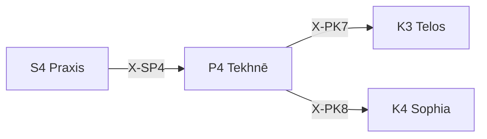

# /tek: 技法選択ワークフロー (Tekhnē)

> **正本参照**: [P4 Tekhnē SKILL.md](file:///home/makaron8426/oikos/.agent/skills/perigraphe/p4-tekhne/SKILL.md)
> **目的**: 「どの技法で」を決定する — 技術的条件空間の評価
> **役割**: 方法論的条件空間の定義
>
> **制約**: 技法選択は必ず根拠を付与すること。判定は採用/検証/却下の3択。

---

## 本質

**P4 Tekhnē** = τέχνη (技術・技法・芸術) = **技法空間の評価と選択**

> 「この課題に、どの技法が適切か？」

---

## 発動条件

| トリガー | 説明 |
|:---------|:-----|
| `/tek` | 技法選択を開始 |
| `/tek [課題]` | 特定課題の技法を評価 |
| 「どの技法で」 | 暗黙トリガー |

---

## STEP 0: SKILL.md 読込（必須・省略不可）

> **環境強制**: このステップを飛ばして PHASE に進んではならない。
> パスは以下にリテラルで記載されている。「パスがわからない」は発生しない。

// turbo

```
view_file /home/makaron8426/oikos/hegemonikon/.agent/skills/perigraphe/p4-tekhne/SKILL.md
```

---

## 処理フロー

1. **技法空間マッピング**: 2×2マトリクスで象限を特定
2. **制約評価**: 時間制約(K2), 専門性要件, リスク許容度
3. **技法選択**: 最適技法 + 代替技法を列挙
4. **技法適用判定**: 採用 / 検証 / 却下

---

## 技法空間マトリクス (Explore × Exploit)

| | 高い探索性 (Explore) | 高い活用性 (Exploit) |
|:-----------|:-----|:-----|
| **Explore** | Experimental (実験的: PoC, R&D) | Innovative (革新的: 新NLP, 新FW) |
| **Exploit** | Applied (応用的: 既存拡張) | Established (確立: Python, REST) |

---

## 判定基準

| 判定 | 条件 |
|:-----|:-----|
| **採用** | 制約を満たし、リスクが許容範囲 |
| **検証** | 技法が適切だが、PoC が必要 |
| **却下** | 制約を満たさない or リスク過大 |

---

## 出力形式

| 項目 | 内容 |
|:-----|:-----|
| 課題 | {課題} |
| 技法空間 | {象限} |
| 選択技法 | {技法名} |
| 代替技法 | {リスト} |
| 判定 | {採用/検証/却下} |
| 根拠 | {選択理由} |
| 次の推奨 | {推奨アクション} |

---

## X-series 接続



---

## 使用例

**例1**: `/tek 「自然言語からの意図抽出機能」` → 象限: Innovative → 選択: LLM Function Calling → 判定: 採用

**例2**: `/tek 「レスポンス時間を 100ms 以下に」` → 象限: Established → 選択: キャッシュ+インデックス → 判定: 採用

---

## 派生モード概要

| 派生 | CCL | 自動化レベル | Scale |
|:-----|:----|:------------|:------|
| **manu** | `/tek.manu` = `/tek+{automation=manual}` | 手動 | Micro |
| **mech** | `/tek.mech` = `/tek+{automation=semi}` | 半自動 | Meso |
| **auto** | `/tek.auto` = `/tek+{automation=full}` | 全自動 | Meso |
| **template** | `/tek.template` = `/tek+{method=template}` | 構造化テンプレート | Micro |
| **formal** | `/tek.formal` = `/tek+{rigor=formal}` | 形式的手法 | Macro |
| **arch** | `/tek.arch` = `/tek+{scope=architecture}` | アーキテクチャ設計 | Macro |
| **interface** | `/tek.interface` = `/tek+{focus=contract}` | インターフェース設計 | Meso |
| **api** | `/tek.api` = `/tek+{target=interface}` | API設計 | Meso |

---

## 派生モード

### --mode=manu (手動技法)

> **CCL**: `/tek.manu` = `/tek+{automation=manual}`
> **目的**: 手動で実行すべき技法を特定する (Scale: Micro)

**発動**: `/tek manu` または「手動」「人力」「マニュアル」

**プロセス**:

1. タスクの特性を評価
2. 自動化コストを算出
3. 手動のメリットを確認
4. 手動実行手順を設計

**出力形式**:

| 項目 | 内容 |
|:-----|:-----|
| タスク | {対象タスク} |
| 手動を選ぶ理由 | {頻度低/自動化コスト>手動コスト/人間判断必要} |
| 手順 | 1. {ステップ1} / 2. {ステップ2} |
| 自動化閾値 | {N回/週を超えたら自動化を検討} |

---

### --mode=mech (機械技法)

> **CCL**: `/tek.mech` = `/tek+{automation=semi}`
> **目的**: 半自動化の技法を設計する (Scale: Meso)

**発動**: `/tek mech` または「半自動」「支援」「ツール」

**プロセス**:

1. 人間と機械の役割分担を定義
2. インターフェースを設計
3. エラーハンドリングを設計
4. フィードバックループを設計

**出力形式**:

| 項目 | 内容 |
|:-----|:-----|
| タスク | {対象タスク} |
| 人間の役割 | {判断、承認、例外処理} |
| 機械の役割 | {データ収集、計算、通知} |
| インターフェース | 入力: {人間→機械} / 出力: {機械→人間} |
| エラー時 | {人間に通知 / 自動リトライ} |

---

### --mode=auto (自動技法)

> **CCL**: `/tek.auto` = `/tek+{automation=full}`
> **目的**: 完全自動化の技法を設計する (Scale: Meso)

**発動**: `/tek auto` または「自動」「全自動」「バッチ」

**プロセス**:

1. 自動化対象を明確化
2. トリガー条件を定義
3. 実行ロジックを設計
4. 監視・アラートを設計

**出力形式**:

| 項目 | 内容 |
|:-----|:-----|
| 自動化対象 | {何を自動化するか} |
| トリガー | {スケジュール/イベント/条件} |
| 実行ロジック | 1. {自動ステップ1} / 2. {自動ステップ2} |
| 監視 | 成功: {ログ記録} / 失敗: {アラート→人間介入} |

---

### --mode=template (テンプレート技法)

> **CCL**: `/tek.template` = `/tek+{method=template}`
> **目的**: 構造化されたテンプレートで実行する (Scale: Micro)

**発動**: `/tek template` または「テンプレ」「フォーマット」「定型」

**プロセス**:

1. Intent: 意図を明確化
2. Select: 適切なテンプレートを選択
3. Fill: テンプレートを埋める
4. Validate: 結果を検証

**出力形式**:

| 項目 | 内容 |
|:-----|:-----|
| 用途 | {何のためのテンプレートか} |
| テンプレート | {テンプレート構造} |
| 埋め込み変数 | {variable1}: {説明} / {variable2}: {説明} |
| 検証基準 | {何を確認すべきか} |

---

### --mode=formal (形式技法)

> **CCL**: `/tek.formal` = `/tek+{rigor=formal}`
> **目的**: 形式的手法で厳密性を担保する (Scale: Macro)

**発動**: `/tek formal` または「厳密」「形式的」「証明」

**プロセス**:

1. 形式化対象を定義
2. 形式言語を選択(TLA+/Alloy/Coq/Z)
3. 仕様を形式記述
4. 検証・証明を実行

**出力形式**:

| 項目 | 内容 |
|:-----|:-----|
| 対象 | {何を形式化するか} |
| 形式言語 | {TLA+/Alloy/Coq/Z} |
| 不変条件 | {満たす/違反} |
| デッドロック | {なし/あり} |
| 証明ステータス | {完了/未完了} |

---

### --mode=arch (アーキテクチャ技法)

> **CCL**: `/tek.arch` = `/tek+{scope=architecture}`
> **目的**: システムアーキテクチャを設計する (Scale: Macro)

**発動**: `/tek arch` または「アーキテクチャ」「設計」「構造」

**プロセス**:

1. 要件を分析
2. アーキテクチャパターンを選択
3. コンポーネントを定義
4. 接続を設計

**出力形式**:

| 項目 | 内容 |
|:-----|:-----|
| システム | {対象システム} |
| パターン | {Layered/Microservices/Event-Driven} |
| 選択理由 | {なぜこのパターンか} |
| コンポーネント | [A]→[B]→[C] / [B]→[D] |
| スケーラビリティ | {HIGH/MED/LOW} |
| 可用性 | {HIGH/MED/LOW} |

---

### --mode=interface (インターフェース技法)

> **CCL**: `/tek.interface` = `/tek+{focus=contract}`
> **目的**: コンポーネント間のインターフェースを設計する (Scale: Meso)

**発動**: `/tek interface` または「インターフェース」「契約」「境界」

**プロセス**:

1. 接続するコンポーネントを特定
2. データフローを分析
3. 契約を定義
4. エラーケースを設計

**出力形式**:

| 項目 | 内容 |
|:-----|:-----|
| 接続 | {コンポーネントA} ↔ {コンポーネントB} |
| 入力契約 | {型・形式・制約} |
| 出力契約 | {型・形式・保証} |
| エラーケース | {エラー1}: {対処法} / {エラー2}: {対処法} |
| バージョニング | {どう互換性を保つか} |

---

### --mode=api (API設計)

> **CCL**: `/tek.api` = `/tek+{target=interface}`
> **目的**: 外部インターフェースの設計と評価 (Scale: Meso)

**発動**: `/tek api` または「API設計」

**プロセス**:

1. API目的の明確化
2. 設計原則の選択(REST/GraphQL/RPC/Event)
3. 契約定義(エンドポイント/スキーマ/入出力型/エラー)
4. 実装ガイド作成

**出力形式**:

| 項目 | 内容 |
|:-----|:-----|
| API目的 | {何を提供するか} |
| 設計パターン | {REST/GraphQL/RPC/Event} |
| 根拠 | {なぜこのパターンか} |
| 主要エンドポイント | GET /resource / POST /resource |
| 契約 | OpenAPI 3.0 / GraphQL Schema |

---

## Artifact 自動保存

> **標準参照**: [workflow_artifact_standard.md](file:///home/makaron8426/oikos/.agent/standards/workflow_artifact_standard.md)

**保存先**: `/home/makaron8426/oikos/mneme/.hegemonikon/workflows/tek_<topic>_<date>.md`

**チャット出力**: 最小限の出力のみ。詳細は全てファイルに保存。

```
✅ /tek 完了
📄 /mneme/.hegemonikon/workflows/tek_{topic}_{date}.md
要約: {技法選択サマリー}
→ {推奨次ステップ}
```

---


---

## @complete: 射の提案 (暗黙発動 L1)

> WF完了時、`/x` 暗黙発動プロトコルにより射を提案する。
> 計算ツール: `python mekhane/taxis/morphism_proposer.py tek`

```
/tek 完了 → @complete 発動
→ 結果に確信がありますか？ (Y: Anchor優先 / N: Bridge優先 / 完了)
```

## Hegemonikon Status

| Module | Workflow | Skill (正本) | Status |
|:-------|:---------|:-------------|:-------|
| P4 Tekhnē | /tek | [SKILL.md](file:///home/makaron8426/oikos/.agent/skills/perigraphe/p4-tekhne/SKILL.md) | v2.3 Ready |

> **制約リマインダ**: 技法選択は必ず根拠を付与。判定は採用/検証/却下の3択。

---

*v2.2 — SEL統合 (2026-02-07)*
*v2.3 — FBR変換 (2026-02-07)*
