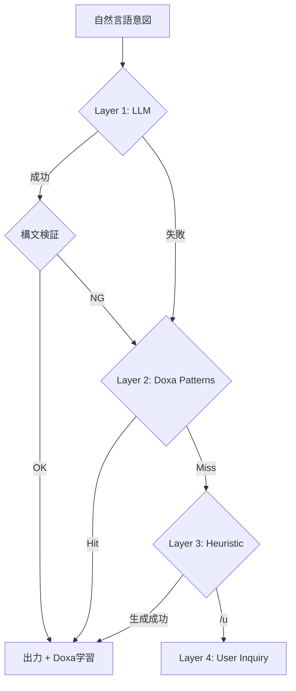

# LLM-Based CCL Generator 実装計画

> **日時**: 2026-01-29T20:50:00+09:00
> **CCL式**: `/s+_/mek+`
> **目標**: `ccl_generator.py` v1.0 → v2.0 (LLM ベース生成)

---

## 1. 現状分析

### 1.1 現在の `ccl_generator.py` v1.0

| 項目 | 内容 |
|:-----|:-----|
| **方式** | ルールベース（KEYWORD_MAP正規表現） |
| **対応構文** | 単純なワークフロー連結、`F:×N{}` ループ |
| **限界** | 複雑な意図の解釈不可、制御構文 (if/for) 非対応 |

```python
# 現在のフロー
intent → 正規表現マッチ → ハードコード出力
```

### 1.2 目標とする v2.0

```python
# 新フロー
intent → LLM 解釈 → CCL v2.0 構文生成 → 検証 → 出力
```

---

## 2. アーキテクチャ設計

> **改訂**: `/s+_/dia+~/noe+_/s+` 分析結果反映 (2026-01-29)

### 2.1 コンポーネント構成

```
mekhane/ccl/                    # [NEW] CCL モジュール
├── __init__.py
├── generator.py                # メイン生成器 v2.0
├── llm_parser.py               # LLM 解釈器
├── syntax_validator.py         # CCL v2.0 構文検証
├── pattern_cache.py            # [NEW] パターンキャッシュ
├── doxa_learner.py             # [NEW] Doxa 連携学習器
└── tracer.py                   # [REFACTOR] セッション分離対応
```

### 2.2 4層フォールバック設計 ⚠️ Creator提案反映



| Layer | 名前 | データソース | 特性 |
|:------|:-----|:-------------|:-----|
| 1 | **LLM** | Gemini/Claude API | 高精度、遅延、コスト |
| 2 | **Doxa Patterns** | H4 永続化済みパターン | 高速、Creator学習済み |
| 3 | **Heuristic** | 静的 KEYWORD_MAP | 高速、限定的 |
| 4 | **User Inquiry** | Creator 問い合わせ | 最終手段 |

### 2.3 Tracer セッション分離 ⚠️ Creator提案反映

```
現状:
  logs/ccl.log          ← 全セッション混在
  logs/ccl_state.json   ← 最新セッションのみ

改善後:
  mneme/.hegemonikon/ccl_traces/
  ├── 20260129-205100/
  │   ├── trace.log
  │   ├── state.json
  │   └── summary.md     # 自動生成サマリー
  └── 20260129-210000/
      └── ...
```

---

## 3. LLM プロンプト設計

### 3.1 System Prompt

```
You are a CCL (Cognitive Control Language) v2.0 compiler.
Convert natural language intent into CCL expressions.

## CCL Syntax Reference

### Workflows
- /noe (認識), /bou (意志), /zet (探求), /ene (実行)
- /s (設計), /mek (方法), /sta (基準), /pra (実践)
- /dia (判定), /syn (評議会)

### Operators (Unary)
- + (詳細), - (縮約), ^ (メタ), / (具体)

### Operators (Binary)
- _ (順序: A then B)
- * (融合: A merged with B)
- ~ (振動: A ↔ B oscillation)

### Control Syntax (v2.0)
- F:N{ ... } — 反復 (for N times)
- I:condition{ ... } else { ... } — 条件分岐
- [審査:人間] — HITL constraint

### Examples
| Intent | CCL |
|--------|-----|
| 分析して実行 | /s_/ene |
| 3回詳細分析 | F:×3{ /s+ } |
| 確信度高ければ実行 | I:confidence>0.7{ /ene } else { /dia^ } |
```

### 3.2 User Prompt Template

```
## Intent
{user_intent}

## Constraints
- Output CCL expression only (no explanation)
- Use v2.0 control syntax if applicable
- Add [審査:人間] for irreversible actions
```

---

## 4. 実装計画

### Phase A: LLM 統合 + 学習基盤 (P1)

#### A1. `llm_parser.py` 作成

```python
# mekhane/ccl/llm_parser.py
from typing import Optional
from pathlib import Path
import google.generativeai as genai

class LLMParser:
    """LLM-based CCL intent parser."""
    
    def __init__(self, model: str = "gemini-2.0-flash"):
        self.model = genai.GenerativeModel(model)
        self.system_prompt = self._load_system_prompt()
    
    def _load_system_prompt(self) -> str:
        prompt_path = Path(__file__).parent / "prompts" / "ccl_compiler.md"
        return prompt_path.read_text() if prompt_path.exists() else ""
    
    def parse(self, intent: str) -> Optional[str]:
        """Convert natural language intent to CCL."""
        try:
            response = self.model.generate_content(
                f"{self.system_prompt}\n\n## Intent\n{intent}\n\n## Output\nCCL expression only:"
            )
            return response.text.strip()
        except Exception:
            return None
```

#### A1.5 `doxa_learner.py` 作成 ⚠️ NEW

```python
# mekhane/ccl/doxa_learner.py
from dataclasses import dataclass
from typing import Optional, List
from pathlib import Path
import json

@dataclass
class LearnedPattern:
    intent: str
    ccl: str
    confidence: float
    usage_count: int

class DoxaLearner:
    """H4 Doxa 連携パターン学習器。Creator の意図パターンを永続化。"""
    
    STORE_PATH = Path("/home/laihuip001/oikos/mneme/.hegemonikon/ccl_patterns.json")
    
    def __init__(self):
        self.patterns: List[LearnedPattern] = self._load()
    
    def _load(self) -> List[LearnedPattern]:
        if self.STORE_PATH.exists():
            data = json.loads(self.STORE_PATH.read_text())
            return [LearnedPattern(**p) for p in data]
        return []
    
    def _save(self):
        self.STORE_PATH.parent.mkdir(parents=True, exist_ok=True)
        data = [p.__dict__ for p in self.patterns]
        self.STORE_PATH.write_text(json.dumps(data, indent=2, ensure_ascii=False))
    
    def record(self, intent: str, ccl: str, confidence: float = 0.8):
        """成功した変換を学習。"""
        existing = next((p for p in self.patterns if p.intent == intent), None)
        if existing:
            existing.usage_count += 1
            existing.confidence = min(1.0, existing.confidence + 0.05)
        else:
            self.patterns.append(LearnedPattern(intent, ccl, confidence, 1))
        self._save()
    
    def lookup(self, intent: str) -> Optional[str]:
        """類似パターンを検索。"""
        # 簡易マッチ (将来: 埋め込み類似度)
        for p in sorted(self.patterns, key=lambda x: -x.confidence):
            if p.intent in intent or intent in p.intent:
                return p.ccl
        return None
```

#### A2. `syntax_validator.py` 作成

```python
# mekhane/ccl/syntax_validator.py
import re
from dataclasses import dataclass
from typing import List, Tuple

@dataclass
class ValidationResult:
    valid: bool
    errors: List[str]
    warnings: List[str]

class CCLSyntaxValidator:
    """Validate CCL v2.0 expressions."""
    
    WORKFLOW_PATTERN = r'/[a-z]+'
    UNARY_OPS = r'[+\-^/]'
    BINARY_OPS = r'[_*~]'
    CONTROL_PATTERN = r'[FI]:[^{]+\{[^}]+\}'
    
    def validate(self, ccl: str) -> ValidationResult:
        """Validate CCL expression syntax."""
        errors, warnings = [], []
        
        # Check balanced braces
        if ccl.count('{') != ccl.count('}'):
            errors.append("Unbalanced braces")
        
        # Check workflow references
        workflows = re.findall(self.WORKFLOW_PATTERN, ccl)
        for wf in workflows:
            if wf[1:] not in VALID_WORKFLOWS:
                warnings.append(f"Unknown workflow: {wf}")
        
        return ValidationResult(
            valid=len(errors) == 0,
            errors=errors,
            warnings=warnings
        )
```

### Phase B: tekhne-maker 連携 (P2)

#### B1. `/mek --mode=ccl` 追加

tekhne-maker に CCL 生成モードを追加:

```yaml
# /mek workflow update
modes:
  ccl:
    description: "CCL v2.0 式を生成"
    trigger: "CCLを生成", "CCL式で"
    output: "CCL expression"
```

#### B2. `ccl_generator.py` をモジュール化

```python
# mekhane/ccl/__init__.py
from .llm_parser import LLMParser
from .syntax_validator import CCLSyntaxValidator
from .generator import CCLGenerator

__all__ = ['LLMParser', 'CCLSyntaxValidator', 'CCLGenerator']
```

### Phase C: Dogfooding 準備 (P3)

#### C1. `ccl_tracer.py` との連携

```python
# 生成した CCL を自動トレース
ccl = generate_ccl("ブログを分析して改善案を出す")
tracer.start(ccl)
# 手動実行...
tracer.step("/s", status="success")
tracer.end()
```

#### C2. 実行ログ収集

```yaml
# /home/laihuip001/oikos/mneme/.hegemonikon/ccl_traces/
trace_2026-01-29_2100.yaml:
  intent: "ブログを分析して改善案を出す"
  generated: "/s_/dia"
  executed: true
  success: true
  feedback: null
```

---

## 5. ファイル配置

```
hegemonikon/mekhane/
├── ccl/                          # [NEW] CCL モジュール
│   ├── __init__.py
│   ├── generator.py              # メイン生成器 v2.0 (4層フォールバック)
│   ├── llm_parser.py             # Layer 1: LLM 解釈器
│   ├── doxa_learner.py           # Layer 2: H4 Doxa パターン学習
│   ├── pattern_cache.py          # Layer 3: 静的パターン (旧 KEYWORD_MAP)
│   ├── syntax_validator.py       # 構文検証器
│   ├── tracer.py                 # [REFACTOR] セッション分離対応
│   └── prompts/
│       └── ccl_compiler.md       # LLM System Prompt
├── ccl_generator.py              # [DEPRECATE] → ccl/generator.py
└── ccl_tracer.py                 # [MIGRATE] → ccl/tracer.py

mneme/.hegemonikon/
├── ccl_patterns.json             # [NEW] Doxa 学習済みパターン
└── ccl_traces/                   # [NEW] セッション分離トレース
    └── {session_id}/
        ├── trace.log
        ├── state.json
        └── summary.md
```

---

## 6. 成功基準

| 基準 | 目標 |
|:-----|:-----|
| **意図解釈精度** | 80% の日本語意図から有効な CCL 生成 |
| **構文妥当性** | 100% の出力が CCL v2.0 準拠 |
| **4層フォールバック** | Layer 1-4 の cascade で 100% 応答 |
| **Doxa 学習** | 1週間で 30+ パターン蓄積 |
| **Dogfooding** | 1週間の実運用で 50+ トレース収集 |
| **セッション追跡** | 任意のセッションを ID で即座に特定可能 |

---

## 7. 次のステップ

1. **承認後**: Phase A (LLM 統合) の実装開始
2. **実装順序**:
   - [ ] `mekhane/ccl/` ディレクトリ作成
   - [ ] `llm_parser.py` 実装
   - [ ] `syntax_validator.py` 実装
   - [ ] `generator.py` (v2.0) 実装
   - [ ] テスト作成
   - [ ] `/mek --mode=ccl` 統合

---

*CCL: 知的作業のプログラム言語化*
