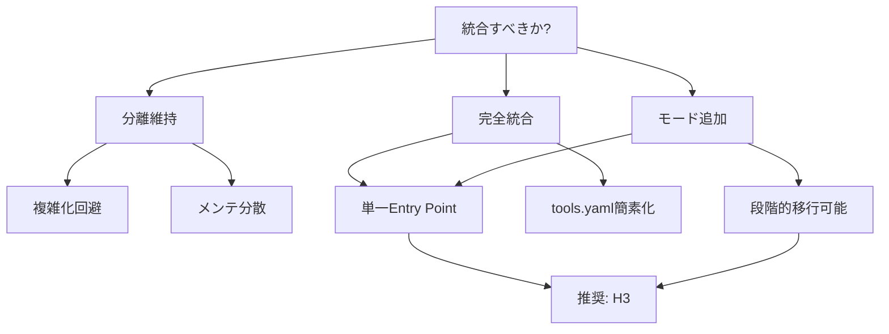

# O1 Noēsis: prompt-lang-generator / tekhne-maker 統合分析

> **問い**: prompt-lang-generatorはtekhne-makerに統合すべきか？

---

## ━━━ PHASE 0.5: 盲点カテゴリチェック ━━━

| カテゴリ | リスク | 理由 |
|:---------|:------:|:-----|
| 発動条件 | 低 | 設計判断の問いであり、/noe適切 |
| 問いの前提 | **中** | 「統合 = 良い」という暗黙の前提あり |
| フレーミング | 低 | 2つのSkillの関係性は明確 |
| ドメイン知識 | 低 | Prompt-Lang/Skill設計は既知領域 |
| 時間的文脈 | **中** | Antigravity IDEの.prompt対応状況 |
| 利害関係 | 低 | 内部ツールであり外部利害なし |
| メタ推論 | 低 | - |

**最高リスク領域**: 問いの前提（統合 = 良いとは限らない）

---

## ━━━ PHASE 1: 前提掘出 ━━━

### 暗黙の前提

| # | 前提 | 必要度 |
|:--|:-----|:------:|
| 1 | 機能が重複している | 95 |
| 2 | 1つにまとめた方が保守が楽 | 85 |
| 3 | ユーザーは使い分けに迷っている | 70 |
| 4 | 統合しても複雑化しない | 65 |
| 5 | 両方を同じチームが保守する | 80 |

### 反転テスト

| 前提 | TRUE | FALSE |
|:-----|:-----|:------|
| **機能重複** | 統合で冗長性削減 | 別々で維持が最適 |
| **保守容易** | 1ファイル管理 | 分離でモジュール性向上 |
| **使い分け混乱** | 統合でシンプル化 | 明確なIF文書化で解決可能 |

---

## ━━━ PHASE 2: ゼロ設計（3仮説） ━━━

### H1 (Contrarian): 統合すべきでない

> **主張**: 両者は根本的に異なる抽象レベルで動作しており、統合は複雑化を招く

**証拠**:

1. **prompt-lang-generator**: DSL構文 (.prompt) 生成に特化。パーサー連携あり。
2. **tekhne-maker**: 設計思考 (M0-M6) + 品質保証。アーキタイプ駆動。
3. Prompt-Lang v2.1では`@extends/@mixin`でtekhne-makerをprompt-lang形式で記述（既に実現済み）

**致命的弱点**: ユーザー視点では「プロンプト生成」という同一目的に見える

**信頼度**: 55

---

### H2 (Minimalist): 統合すべき

> **主張**: tekhne-makerの出力形式を .prompt に統一し、prompt-lang-generatorを吸収する

**証拠**:

1. tekhne-maker.prompt が既に存在（Prompt-Lang形式で記述済み）
2. 8参照ファイルはそのまま利用可能
3. tools.yamlの二重登録が解消される

**致命的弱点**: Antigravity IDE が .prompt を Skill として認識しない（現時点）

**信頼度**: 75

---

### H3 (Emergent): ハイブリッド統合

> **主張**: tekhne-maker を親Skillとし、prompt-lang-generator を「出力モード」として吸収

**証拠**:

1. tekhne-maker の Operating Modes に `Prompt-Lang Mode` を追加可能
2. 8参照ファイル + DSLテンプレートの共存が可能
3. ユーザーは「tekhne-maker」1つを覚えれば良い

**致命的弱点**: SKILL.md の肥大化リスク

**信頼度**: 80

---

### 議論結果

| 収斂点 | 分岐点 |
|:-------|:-------|
| prompt-lang-generator の独立維持は過剰 | 統合方法（吸収 vs モード追加） |
| tekhne-maker.prompt が証明した互換性 | IDE対応状況への依存 |

---

## ━━━ PHASE 3: GoT 分析 ━━━



**最有力パス**: H3 → C3 → FINAL

---

## ━━━ PHASE 4: 自己検証 ━━━

### 誤謬検出

| 誤謬 | 箇所 | 深刻度 |
|:-----|:-----|:------:|
| 権威論証 | 「既にtekhne-maker.promptがある」は状況証拠 | 2 |

### 最強の反論

> **反論**: Prompt-Lang 構文検証機能（パーサー連携）はtekhne-makerにはない。統合すると構文チェック機能が失われる。

**支持ポイント**:

1. prompt-lang-generator は `prompt_lang.py parse` と連携前提
2. tekhne-maker は SKILL.md 生成であり、.prompt 構文検証は範囲外

**反論が勝つ条件**: 構文検証が必須要件である場合

**反論妥当性**: 40 → 結論維持可能（検証機能は統合後もCLIで別途実行可能）

---

## ━━━ PHASE 5: メタ認知出力 ━━━

```json
{
  "final_answer": "H3採用: tekhne-makerにprompt-lang-generatorをモードとして統合",
  "confidence_score": 0.78,
  
  "key_assumptions": [
    "構文検証はCLI (prompt_lang.py) で別途実行可能 [critical]",
    "Antigravity IDEは近い将来 .prompt をSkillとして認識する [important]"
  ],
  
  "reasoning_structure": {
    "phases_executed": [0.5, 1, 2, 3, 4, 5],
    "convergence_nodes": 3,
    "divergence_nodes": 1
  },
  
  "uncertainty_zones": [
    {
      "zone": "IDE .prompt 対応",
      "doubt_score": 0.35,
      "reason": "現時点でAntigravityは.prompt未対応",
      "mitigation": "SKILL.md と .prompt を並行維持"
    }
  ],
  
  "falsifiability": {
    "is_falsifiable": true,
    "counter_examples": ["構文検証が頻繁に必要なワークフロー発見"],
    "evidence_needed_to_flip": "prompt-lang-generator固有機能の利用頻度データ"
  }
}
```

---

## 📌 最終結論

**tekhne-maker に prompt-lang-generator を統合すべき（H3: モード追加方式）**

| 項目 | 値 |
|:-----|:---|
| 信頼度 | **78%** |
| 推奨方式 | tekhne-maker に `Prompt-Lang Mode` を追加 |
| 不確実領域 | IDE .prompt 対応 |

---

## Proposed Changes

### 1. tekhne-maker SKILL.md 更新

#### [MODIFY] [SKILL.md](file:///home/laihuip001/oikos/.agent/skills/utils/tekhne-maker/SKILL.md)

**変更内容**:

- Operating Modes に `Prompt-Lang Mode` を追加
- prompt-lang-generator のテンプレート参照を追加
- `@rubric` セクションを取り込み

---

### 2. prompt-lang-generator の統合

#### [DELETE] [prompt-lang-generator/](file:///home/laihuip001/oikos/.agent/skills/utils/prompt-lang-generator/)

**移行内容**:

- `templates/` → `tekhne-maker/references/prompt-lang-templates/`
- 構文検証ロジックは `prompt_lang.py` CLI に統一

---

### 3. tools.yaml 更新

#### [MODIFY] [tools.yaml](file:///home/laihuip001/oikos/.agent/tools.yaml)

```yaml
skills:
  tekhne-maker:
    path: .agent/skills/utils/tekhne-maker/SKILL.md
    purpose: "汎用 SKILL.md / .prompt 生成（アーキタイプ駆動）"
    trigger: 
      - 「〇〇用のスキルを作成」
      - 「Prompt-Lang でスキルを作成」
      - 「.prompt ファイルを作って」
      - 「このプロンプトを診断」
    modes:
      - generate: SKILL.md 生成
      - prompt-lang: .prompt 生成
      - diagnose: 既存プロンプト診断
    status: production
  
  # meta-prompt-generator: DEPRECATED → tekhne-maker に統合済み
  # prompt-lang-generator: DEPRECATED → tekhne-maker に統合済み
```

---

## Verification Plan

### Automated Tests

1. **Prompt-Lang パーサーテスト** (既存):

   ```bash
   cd /home/laihuip001/oikos/hegemonikon
   source .venv/bin/activate
   pytest test_prompt_lang.py -v
   ```

   - 全20件PASSEDを確認

### Manual Verification

1. **統合後のtekhne-maker動作確認**:
   - 「TypeScript用のSKILL.mdを作成」→ SKILL.md形式で出力
   - 「Prompt-Langでレビュアースキルを作成」→ .prompt形式で出力

2. **tools.yaml反映確認**:
   - `/boot` 実行時にtekhne-makerのみが表示される
