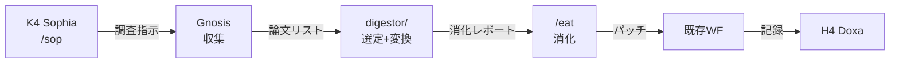

# Implementation Plan: Digestor Module

> **目標**: Gnosis → `/eat` 自動連携インフラ
> **配置**: `mekhane/ergasterion/digestor/`
> **Plan**: B Robust (CLI + MCP + トピックベース自動消化)

---

## User Review Required

> [!IMPORTANT]
> **新規 Mekhanē 機構の追加**
>
> - ergasterion/ に新規ディレクトリ `digestor/` を作成
> - 既存の Gnosis, /eat には影響なし（連携のみ）

---

## Proposed Changes

### [NEW] mekhane/ergasterion/digestor/

#### [NEW] `__init__.py`

- モジュール初期化

#### [NEW] `selector.py`

- 消化候補選定ロジック
- トピックベースフィルタリング
- 優先度スコアリング（将来）

```python
class DigestorSelector:
    def select_candidates(
        self,
        papers: list[Paper],
        topics: list[str],
        max_candidates: int = 10
    ) -> list[Paper]:
        """消化候補を選定"""
        ...
```

#### [NEW] `pipeline.py`

- Gnosis → /eat 連携パイプライン
- Hegemonikón 形式変換
- /fit 自動診断呼び出し

```python
class DigestorPipeline:
    def run(
        self,
        source: str = "gnosis",
        topics: list[str] | None = None,
        dry_run: bool = False
    ) -> DigestorResult:
        """消化パイプライン実行"""
        ...
```

#### [NEW] `topics.yaml`

- 消化対象トピック定義
- gnosis_topics.yaml との連携

---

### [NEW] mcp/digestor_mcp_server.py

- 消化パイプライン API 公開
- MCP ツール: `run_digestor`, `list_candidates`, `get_digest_status`

---

## Verification Plan

### Automated Tests

```bash
cd hegemonikon
python -m pytest mekhane/ergasterion/digestor/tests/ -v
```

### Manual Verification

```bash
# CLI 実行テスト
python -m mekhane.ergasterion.digestor.pipeline --dry-run

# MCP サーバーテスト
python mcp/digestor_mcp_server.py
```

---

## Implementation Order

1. **Phase 1**: `selector.py` — 消化候補選定ロジック
2. **Phase 2**: `pipeline.py` — Gnosis → /eat 連携
3. **Phase 3**: `topics.yaml` — トピック定義
4. **Phase 4**: MCP サーバー (optional — 先に CLI のみで可)

---

## X-series 連携



---

*Generated by /s v4.1 — 2026-01-29*
