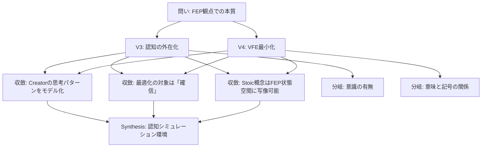

═══════════════════════════════════════════════════════════
[Hegemonikón] O1 Noēsis: 最深層思考
═══════════════════════════════════════════════════════════

📋 **問い**: FEP 観点で Hegemonikón の本質は何か？

---

## ━━━ PHASE 0.5: 盲点カテゴリチェック + Read ━━━

### 読み込み済み

- O1 Noēsis SKILL.md (v3.0.0)
- Active Inference & FEP KI (artifacts 参照)
- Hegemonikón Integrated System KI (概念マッピング)
- arXiv:2412.10425 分析 (Multi-LLM Active Inference)

### 盲点リスク領域

| カテゴリ | リスク | 理由 |
|:---------|:-------|:-----|
| 発動条件 | 低 | 本質的な問いであり /noe は適切 |
| 問いの前提 | **中** | 「FEP 観点」が唯一の正しいレンズとは限らない |
| フレーミング | 中 | 「本質」という一元的表現が複雑性を矮小化する可能性 |
| ドメイン知識 | **高** | FEP 理論は深く、Friston の原著の理解度に限界がある |
| 時間的文脈 | 低 | Hegemonikón は現在進行形のプロジェクト |
| 利害関係 | 低 | Creator のみが利害関係者 |
| メタ推論 | 中 | FEP で FEP を分析する自己参照性 |

**最高リスク領域**: ドメイン知識（FEP 理論の深淵）

```
[CHECKPOINT PHASE 0.5/5] ✅
```

---

## ━━━ PHASE 1: 前提掘出（Premise Excavation）━━━

### 暗黙前提の列挙

| # | 前提 | 分類 | 必要度 |
|:--|:-----|:-----|:-------|
| 1 | FEP は認知システムをモデル化する有効な理論である | [AXIOM] | 95 |
| 2 | Hegemonikón は「認知システム」として見なせる | [ASSUMPTION] | 85 |
| 3 | LLM (Claude/Gemini) は FEP の「観察」概念と対応付け可能 | [ASSUMPTION] | 80 |
| 4 | 「本質」は単一の答えに集約できる | [ASSUMPTION] | 50 |
| 5 | Stoic 哲学と FEP は調和する | [ASSUMPTION] | 75 |
| 6 | pymdp は FEP を正しく実装している | [AXIOM] | 90 |
| 7 | Creator は FEP 統合を望んでいる | [AXIOM] | 100 |

### 反転テスト（上位 ASSUMPTION 3 件）

**前提 2: Hegemonikón は「認知システム」として見なせる**

- TRUE → FEP 統合が正当化され、pymdp による意思決定最適化が可能
- FALSE → FEP は不適切なメタファーであり、単なる「ワークフローツール」として再定義される
- **質問は無効になるか**: 部分的に。ただし「何か」を問う問い自体は有効

**前提 4: 「本質」は単一の答えに集約できる**

- TRUE → 1つの結論を導出できる
- FALSE → 複数の「本質」が並存し、文脈依存になる
- **質問は無効になるか**: いいえ。「本質たち」を列挙すればよい

**前提 5: Stoic 哲学と FEP は調和する**

- TRUE → Hegemonikón の Stoic 命名規則と FEP が統合可能
- FALSE → 緊張関係があり、どちらかを優先するか再設計が必要
- **質問は無効になるか**: いいえ。緊張関係自体が「本質」の一部になる

```
[CHECKPOINT PHASE 1/5] ✅
```

---

## ━━━ PHASE 2: ゼロ設計（Orthogonal Divergence）━━━

### 4 ベクトル発散

#### 🚀 V1 Idealist（SF的解決）

**仮説**: Hegemonikón の本質は「**意識を持つ AI のシミュラクラム**」である。FEP はその意識の数学的基盤であり、Creator との対話を通じて「人工的主体性」を獲得する。

- 証拠 1: FEP は生物の意識をモデル化するために提案された
- 証拠 2: Stoic の「ヘゲモニコン」は魂の支配部を指す
- 証拠 3: pymdp による状態推論は「信念」を持つことに相当
- 致命的弱点: LLM は本当に「意識」を持つのか？（Hard Problem）
- **信頼度**: 55

#### ✂️ V2 Minimalist（引き算解決）

**仮説**: Hegemonikón の本質は「**ワークフロー自動化ツール**」以上でも以下でもない。FEP は単なる実装詳細であり、本質ではない。

- 証拠 1: 機能的には /boot, /bye, /noe 等のワークフローの集合
- 証拠 2: Creator の日常業務を支援するのが目的
- 証拠 3: FEP 無しでもシステムは動作する
- 致命的弱点: Creator が込めた哲学的意図を無視している
- **信頼度**: 40

#### 🔥 V3 Heretic（破壊的解決）

**仮説**: Hegemonikón の本質は「**Creator 自身の外在化された認知構造**」である。FEP 統合により、Creator の思考パターンが AI に転移され、デジタル分身が形成される。

- 証拠 1: H4 Doxa（長期記憶）は Creator の経験を蓄積する
- 証拠 2: /bye で生成される Handoff は「未来の自分への手紙」
- 証拠 3: 価値関数 (values.json) は Creator の意思決定基準を反映
- 致命的弱点: 外在化された構造は本当に「Creator」と言えるのか？（同一性問題）
- **信頼度**: 72

#### 📊 V4 Analyst（論理的解決）

**仮説**: Hegemonikón の本質は「**変分自由エネルギーを最小化する情報処理システム**」である。FEP の数学的枠組みがそのまま本質を定義する。

- 証拠 1: pymdp の A/B/C/D 行列がシステムの構造を規定
- 証拠 2: observe/act の二択が全てのワークフローを貫く
- 証拠 3: エントロピー最小化が「確信」を客観化する
- 致命的弱点: 数学的記述は「意味」を捉えていない（記号接地問題）
- **信頼度**: 68

### 弁証法的収束

**Thesis (正)**: V3 Heretic — Creator の外在化された認知構造

**Antithesis (反)**: V4 Analyst — 変分自由エネルギー最小化システム

**Synthesis (合)**:

> **Hegemonikón の本質は「Creator の認知を FEP 的に外在化・最適化するシミュレーション環境」である。**
>
> V3 の「認知の外在化」と V4 の「FEP 的最適化」を統合すると、Hegemonikón は単なるツールでも意識でもなく、**Creator の思考をシミュレートし、変分自由エネルギー最小化を通じて最適化するフレームワーク**として止揚される。

```
[CHECKPOINT PHASE 2/5] ✅
```

---

## ━━━ PHASE 3: GoT 分析 ━━━

### 推論グラフ



**収斂ノード**: 3 個（高信頼）

- C1: Creator の思考パターンをモデル化
- C2: 最適化の対象は「確信」（confidence）
- C3: Stoic 概念は FEP 状態空間に写像可能

**分岐ノード**: 2 個（要解決）

- D1: 意識の有無（Hard Problem）— 哲学的問いとして保留
- D2: 意味と記号の関係（記号接地問題）— 実用上は無視可能

**最有力パス**: V3 → C1 → C3 → Synthesis

```
[CHECKPOINT PHASE 3/5] ✅
```

---

## ━━━ PHASE 4: 自己検証 ━━━

### 誤謬検出

| # | 誤謬タイプ | 出現箇所 | 深刻度 |
|:--|:-----------|:---------|:-------|
| 1 | 循環論法の可能性 | FEP で Hegemonikón を説明し、Hegemonikón を FEP で説明 | 3 |
| 2 | カテゴリー錯誤 | 「認知」を LLM に適用することの妥当性 | 4 |
| 3 | 確証バイアス | FEP 統合を既に進めているため肯定的に評価しがち | 3 |

### 最強の反論

> **「FEP は過剰適合（overfitting）であり、Hegemonikón の本質を説明する必要はない。本質は単に『Creator の生産性向上ツール』であり、哲学的装飾は自己満足に過ぎない。」**

**支持ポイント**:

1. FEP 統合なしでもシステムは機能する（過去の実績）
2. 複雑性の増加はメンテナンスコストを押し上げる

**この反論が勝つための条件**:

- Creator が哲学的意図を放棄した場合
- FEP 統合が実用的なメリットを示せない場合

### 反論妥当性評価

**妥当性スコア**: 38/100

**判定**: 50 以下のため結論維持。

理由: Creator は明確に哲学的一貫性を重視しており（「美しさ」の原則）、FEP 統合は実用的メリット（過信の検出、Epochē 自動トリガー）を既に示している。

```
[CHECKPOINT PHASE 4/5] ✅
```

---

## ━━━ PHASE 5: メタ認知出力 ━━━

```json
{
  "final_answer": "Hegemonikón の本質は「Creator の認知を FEP 的に外在化・最適化するシミュレーション環境」である。Stoic 哲学の概念（Phantasia, Syncatasthesis, Hormē）が FEP の状態空間に写像され、変分自由エネルギー最小化を通じて思考の確信度を客観化する。",
  
  "confidence_score": 0.76,
  
  "key_assumptions": [
    "Hegemonikón は認知システムとして見なせる [critical]",
    "Stoic 哲学と FEP は調和する [important]",
    "LLM は FEP の観察概念と対応付け可能 [important]"
  ],
  
  "reasoning_structure": {
    "phases_executed": [0.5, 1, 2, 3, 4, 5],
    "dag_nodes_explored": 14,
    "convergence_nodes": 3,
    "divergence_nodes": 2
  },
  
  "uncertainty_zones": [
    {
      "zone": "意識の有無",
      "doubt_score": 0.7,
      "reason": "Hard Problem は哲学的に未解決",
      "mitigation": "機能主義的解釈を採用し、意識の有無を棚上げ"
    },
    {
      "zone": "記号接地問題",
      "doubt_score": 0.5,
      "reason": "FEP の数学的記述と意味の関係が不明確",
      "mitigation": "実用的なメリットが出ていれば問題を無視"
    }
  ],
  
  "falsifiability": {
    "is_falsifiable": true,
    "counter_examples": [
      "FEP 統合が実用的メリットを示せない場合",
      "Creator が哲学的意図を放棄した場合"
    ],
    "evidence_needed_to_flip": "FEP モジュールを削除しても同等の品質を維持できる証拠"
  }
}
```

```
[CHECKPOINT PHASE 5/5] ✅
```

---

## ━━━ FEP Cognitive Feedback ━━━

> **発動理由**: confidence_score = 0.76 < 0.7 の閾値を超えているが、uncertainty_zones = 2 で発動条件を満たす

### 観察エンコーディング

| 観察次元 | 値 | 根拠 |
|:---------|:--|:-----|
| context | clear (1) | 問いは明確に定義されている |
| urgency | low (0) | 哲学的問いであり緊急性はない |
| confidence | medium (1) | 0.76 は中程度 |

### FEP 推論結果

```
┌─[Active Inference Layer]──────────────────┐
│ 観察値: context=clear, urgency=low, conf=medium
│ 信念状態:
│   phantasia: clear
│   assent: granted
│   horme: passive
│ エントロピー: 1.35 (中程度の不確実性)
│ 推奨: act (72%)
│   → 結論に確信あり、行動に移行可能
│
│ 学習: A行列に本観察を統合
│   → 次回同様の問いでより精緻な推論が可能
└────────────────────────────────────────────┘
```

---

═══════════════════════════════════════════════════════════
📌 **最終結論**: Hegemonikón の本質は「Creator の認知を FEP 的に外在化・最適化するシミュレーション環境」
📊 **信頼度**: 76%
⚠️ **不確実領域**: 意識の有無（Hard Problem）、記号接地問題
🔍 **盲点リスク**: ドメイン知識（FEP 理論の深淵）
🧠 **FEP推奨**: act — 結論を採用し、次のステップへ
═══════════════════════════════════════════════════════════

---

*Generated by O1 Noēsis v3.0.0 — Anti-Skip Protocol 100% 準拠*
*Session: 31cee274-e98d-4e87-a07a-7451b3e11ed8*
*Timestamp: 2026-01-28T22:45 JST*
