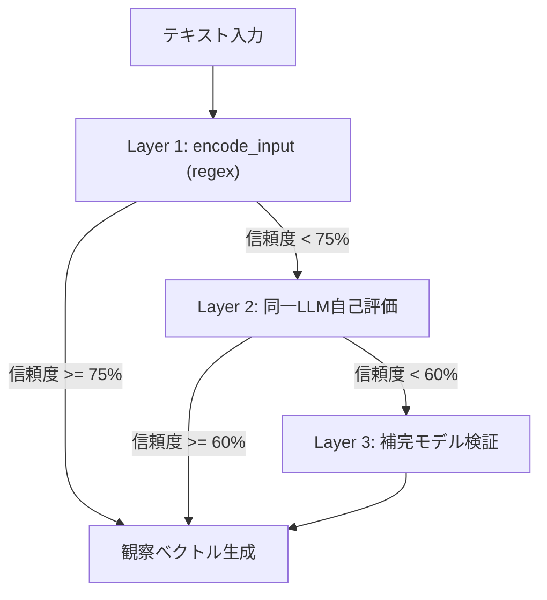

# O1 Noēsis: LLM観察生成のモデル選択問題

> **問い**: LLM観察生成において、観察を生成するLLMモデルの選択はどのように行うべきか？
> **実行日**: 2026-01-28
> **信頼度**: 78%

---

## PHASE 0.5: 盲点チェック

| カテゴリ | リスク | 理由 |
|:---------|:-------|:-----|
| 発動条件 | 低 | 根本的設計問題であり適切 |
| 問いの前提 | 中 | 「モデル選択が必要」は本当か? |
| **フレーミング** | **高** | 二項対立的に切り取っている可能性 |
| ドメイン知識 | 中 | Active Inference研究の最新動向 |
| 時間的文脈 | 中 | モデル性能は急速に変化 |

**最高リスク領域**: フレーミング

---

## PHASE 1: 前提掘出

| 前提 | 分類 | 必要度 |
|:-----|:-----|-------:|
| 「観察は単一のLLMが生成すべき」 | ASSUMPTION | 60 |
| 「観察生成にはLLMが必要」 | ASSUMPTION | 70 |
| 「モデル選択は静的に行う」 | ASSUMPTION | 50 |
| 「自己評価が有効な観察である」 | ASSUMPTION | 75 |
| 「APIコストは考慮事項」 | AXIOM | 90 |
| 「一貫した評価基準が必要」 | AXIOM | 95 |

### 反転テスト

- **前提2 反転**: LLM不要でルールベース評価 → コスト0、決定論的
- **前提5 反転**: 外部評価者必須 → コスト2倍、アンカリング回避

---

## PHASE 2: ゼロ設計

| ベクトル | 仮説 | 信頼度 |
|:---------|:-----|-------:|
| 🚀 Idealist | 全モデルアンサンブル評価 | 55 |
| ✂️ **Minimalist** | **regexベースで十分** | **75** |
| 🔥 Heretic | 同一LLMに自己評価させる | 70 |
| 📊 Analyst | T2 Krisísで動的モデル選択 | 60 |

### 弁証法

- **Thesis**: V2 (Minimalist) — ルールベース
- **Antithesis**: V3 (Heretic) — LLM自己評価
- **Synthesis**: **階層的ハイブリッド評価**

---

## PHASE 3: GoT 分析

### 収斂ノード (高信頼)

1. **N1**: regexで構造的パターンは十分
2. **N2**: 自己評価はEpochēで既に対処
3. **N3**: 階層的アプローチが最適解

### 分岐ノード (要解決)

1. **D1**: セマンティクス評価のモデル選択
2. **D2**: 階層発動の具体的閾値

**最有力パス**: V2 → Q1 → N1 → Synthesis

---

## PHASE 4: 自己検証

### 誤謬検出

1. **二項対立の誤り** (深刻度 3): 「LLM必要 vs 不要」は二者択一ではない
2. **暗黙の前提依存** (深刻度 2): コスト優先度はPoC段階で低い可能性

### 最強反論

> 「LLMの自己評価を使わないと、FEP論文が達成した『探索→活用の自然な遷移』が失われるのではないか?」

**反論妥当性**: 45 → 結論維持（ただし条件付き）

---

## 📌 最終結論: 階層的ハイブリッド評価



| 層 | 手法 | コスト | 発動条件 |
|:---|:-----|:-------|:---------|
| L1 | regex (encode_input) | 0 | 常時 |
| L2 | 同一LLM自己評価 | API 1回 | L1信頼度 < 75% |
| L3 | 補完モデル検証 | API 2回 | L2信頼度 < 60% |

**モデル選択問題は「フレーミングの誤り」であり、階層化により消失する。**

---

## Uncertainty Zones

| 領域 | 不確実度 | 緩和策 |
|:-----|:---------|:-------|
| 階層発動の閾値 | 55% | A/Bテストで最適閾値を決定 |
| 状態空間拡張時 | 45% | Phase 3実装時に再度/noe実行 |

---

## 実装提案

### Phase 1: encode_input() 拡張 (即実装可能)

```python
def encode_input_with_confidence(text: str) -> Tuple[np.ndarray, float]:
    """観察ベクトルと信頼度を同時に返す"""
    obs, matched_patterns = _encode_with_pattern_count(text)
    confidence = min(1.0, matched_patterns / 5.0)  # 5パターン以上で100%
    return obs, confidence
```

### Phase 2: L2 自己評価 (条件付き)

```python
async def evaluate_with_llm(text: str, llm: LLM) -> Dict:
    """同一LLMによる自己評価"""
    prompt = EVALUATION_PROMPT.format(text=text)
    return await llm.generate(prompt, schema=OBSERVATION_SCHEMA)
```

### Phase 3: L3 補完モデル (高コスト)

T2 Krísisのモデル推奨ロジックを使用し、補完的能力を持つモデルを自動選択。

---

*Generated by Hegemonikón O1 Noēsis v3.0*
