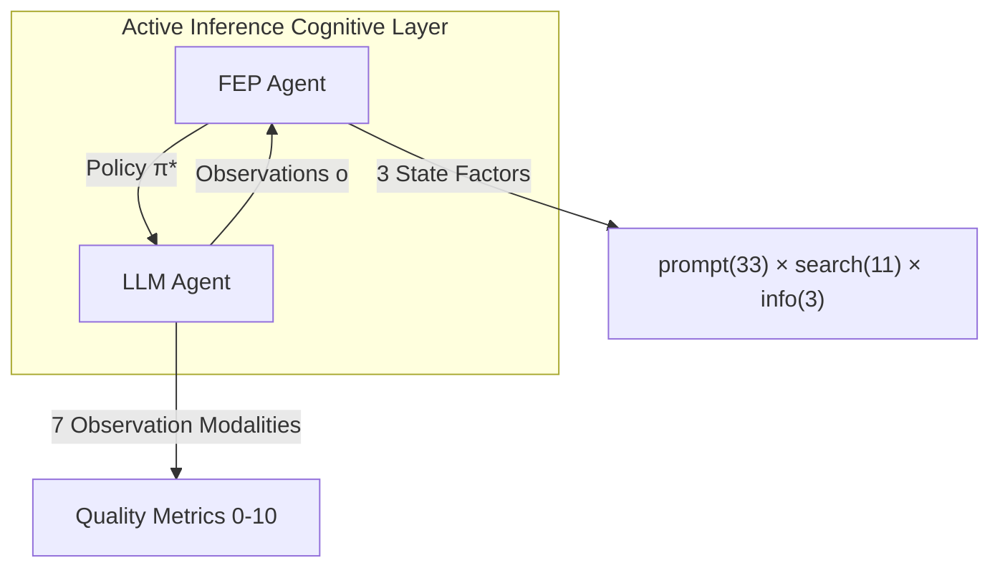

# arXiv:2412.10425 論文精読レポート

> **Active Inference for Self-Organizing Multi-LLM Systems**
> *A Bayesian Thermodynamic Approach to Adaptation*
> Rithvik Prakki, 2024

## 核心アイデア



**The Principle**: LLM を Neural Renderer として使用し、認知的決定は Active Inference が数学的に行う。

---

## Hegemonikón 実装との比較

| 項目 | arXiv:2412.10425 | Hegemonikón FEP |
|:-----|:-----------------|:----------------|
| **フレームワーク** | pymdp | pymdp |
| **状態空間** | 33×11×3 = 1,089 states | 2×2×2 = 8 states |
| **観察様式** | 7 modalities (0-10スケール) | 3 modalities (離散) |
| **行動空間** | prompt(33) + search(11) | observe(0) / act(1) |
| **学習率 η** | 50.0 (高速学習) | 固定行列 (学習なし) |
| **政策horizon** | 2-step lookahead | 1-step |
| **観察生成** | GPT-4o-mini (JSON) | 手動/encode_observation() |

---

## 論文から吸収すべきパターン

### 1. LLM を観察生成器として使用 (Priority: HIGH)

```python
# 論文のパターン
observation = gpt4o_mini.generate(
    prompt="Return JSON: {accuracy: 0.0-1.0, relevance: 0.0-1.0, ...}",
    system="Structured evaluation"
)
scaled_obs = int(observation["accuracy"] * 10)  # → 0-10
```

**Hegemonikón 適用案**: O1 Noēsis で LLM 自己評価を観察として取り込む。

### 2. 動的 A行列学習 (Dirichlet更新)

```python
# 論文の更新則
pA[modality] += η * outer_product(observation, beliefs)
```

**現状**: Hegemonikón は A行列固定。
**改善案**: セッション間で A行列を `patterns.yaml` に永続化。

### 3. 2-step 政策評価

**論文**: `policy_horizon = 2, inference_horizon = 1`

期待自由エネルギー G(π) を2ステップ先まで計算することで、より長期的な行動選択が可能。

### 4. Exploration → Exploitation 遷移の創発

```
Timeline:
├── Step 0-40:  Search actions dominant (探索)
├── Step 40+:   Prompt actions dominant (活用)
└── EFE landscape: 徐々に構造化
```

**洞察**: 明示的な探索フェーズを設計せずとも、EFE最小化から自然に創発する。

---

## Future Work（論文が指摘する限界）

1. **固定状態空間の制約**: 動的に拡張できない。
2. **階層的生成モデルの欠如**: 情報を直接エンコードできない。
3. **Universal Model への道**: 任意のエージェントに適用可能な汎用モデル。

---

## Hegemonikón への実装提案

### Phase 1: 観察生成の LLM 統合

```python
# encode_observation() 拡張
def generate_observation(text: str, llm: LLM) -> np.ndarray:
    """LLM を使用して観察ベクトルを生成"""
    metrics = llm.evaluate(text, schema=OBSERVATION_SCHEMA)
    return scale_to_obs_space(metrics)
```

### Phase 2: A行列の動的学習

```python
# /bye で永続化
def save_learned_A(agent: HegemonikónFEPAgent):
    learned_A = agent.agent.A  # pymdp内部行列
    np.save("mneme/.hegemonikon/learned_A.npy", learned_A)
```

---

## 結論

論文は Hegemonikón の設計が正しい方向であることを裏付ける。 Active Inference を LLM 上の「認知層」として配置し、pymdp による POMDP実装を行うことで、探索-活用バランスの自動創発を狙う H3 symplokē レイヤーの正当性が示された。

---
*Reference: arXiv:2412.10425*
