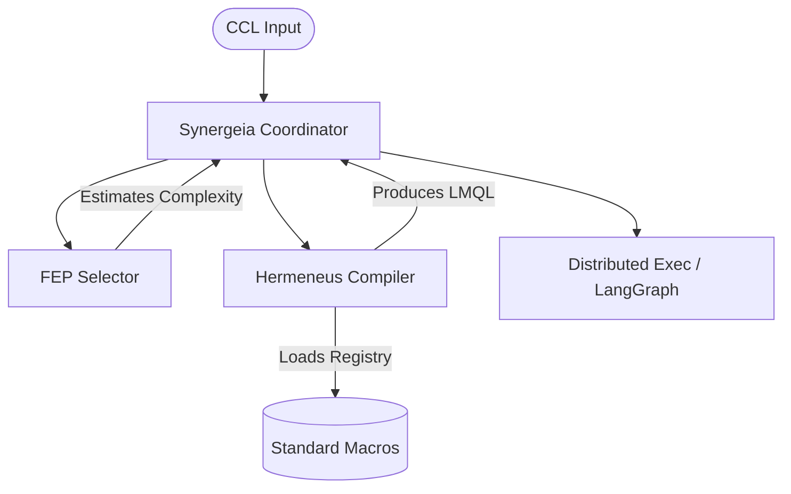

# Architecture: The Cognitive Enclosure (Deep Integration)

As of 2026-02-01, the Hegemonikón system has achieved a state of **Deep Integration**, referred to as the "Cognitive Enclosure." This represents the convergence of the compiler (Hermeneus), the execution coordinator (Synergeia), and the cognitive core (Kernel/FEP).

## 1. Structural Components

The enclosure is built from four primary pillars:

| Component | Role | Project | Implementation |
| :--- | :--- | :--- | :--- |
| **Logic** | Language / Calculus | `ccl` | `standard_macros/` |
| **Control** | Execution Guarantees | `hermeneus` | `compile_ccl` / `macros.py` |
| **Strategy** | Resource Routing | `synergeia` | `fep_selector.py` |
| **Verification** | Structural Integrity | `dendron` | `checker.py` (PROOF 100%) |

## 2. Integrated Data Flow

The integration creates a closed loop where each component informs the others:

## 3. Key Achievements on 2026-02-01

1. **Macro Decoupling**: Hermeneus now dynamically loads from `ccl/macros/`, ensuring the compiler stays synchronized with the evolving language.
2. **Cognitive Routing**: Synergeia uses Active Inference to decide which agent (Claude, Gemini, Perplexity, or Manual) inherits a task based on its calculated complexity.
3. **Enforced Fidelity**: 100% PROOF compliance across the compiler core ensures that the "Execution Guarantee" promise is backed by verifiable code structure.

## 4. Systemic Impact

The "Cognitive Enclosure" effectively shifts the AI from a **Reactive Tool** (running prompts) to a **Proactive Agent** (compiling its own intentions and routing them via self-estimated confidence).

---
*Status: Architecture v7.6 | Deep Integration Milestone*
