# n8n Boot Automation PoC v1.0

> **Origin**: CEP-001 活用計画 C (AI 自律化)
> **Goal**: /boot の一部を n8n で自動化する最小 PoC
> **Date**: 2026-01-31

---

## Scope & Design

### Included Features

- Automatic Git Status retrieval (`git log -1 --oneline`)
- Latest Handoff discovery via filesystem search
- Slack Notification via Webhook

### Flow Design

```mermaid
graph TD
    A[Cron: 08:00 JST] --> B[Git Status 取得]
    B --> C{変更あり?}
    C -->|Yes| D[Handoff 最新を検索]
    C -->|No| E[Skip]
    D --> F[Slack 通知]
    F --> G[ユーザーに /boot 推奨]
```



## n8n Node Configuration

### 1. Schedule Trigger

- Type: `Cron`
- Time: `0 8 * * *` (08:00 JST)

### 2. Execute Command (Git Status)

```bash
cd /home/laihuip001/oikos/hegemonikon && git log -1 --oneline
```

### 3. HTTP Request (Handoff Search)

- Method: `GET /api/handoffs/latest` (Assuming a local API or direct filesystem command node)

### 4. Slack Notification Message

```text
🌅 おはようございます！

📋 **Git**: ${GIT_STATUS}
📄 **Handoff**: ${HANDOFF_TITLE}

→ `/boot` を推奨します
```

## Implementation Roadmap

1. [ ] Startup n8n Docker container.
2. [ ] Configure Slack Webhook incoming URL.
3. [ ] Import `boot_morning_flow.json`.
4. [ ] Test run cron and manual execution.

---
*n8n Automation Stratgey | Project Hegemonikón*
