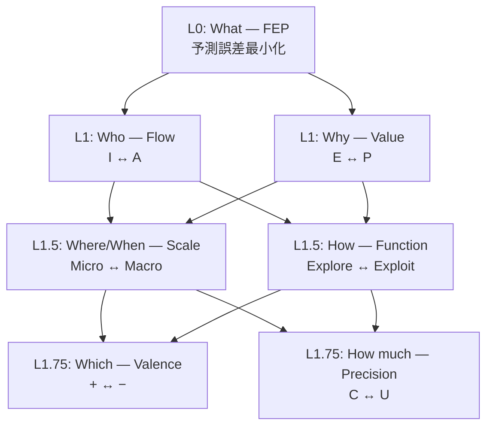
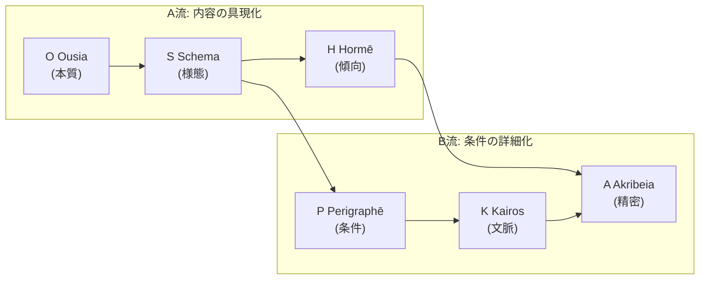

# Hegemonikón

> **認知ハイパーバイザーフレームワーク** — 変分自由エネルギー原理 (FEP) に基づくAI認知制御システム。
> 名称はストア派哲学の「魂の統率中枢」(Ἡγεμονικόν) に由来。

---

## ⚡ クイックスタート

```bash
# 1. クローン & セットアップ
git clone https://github.com/laihuip001/hegemonikon.git
cd hegemonikon
python -m venv .venv && source .venv/bin/activate
pip install -r requirements.txt

# 2. API サーバー起動
PYTHONPATH=. python -m mekhane.api.server
# → http://127.0.0.1:9696/api/docs

# 3. デスクトップアプリ (Tauri v2)
cd hgk-desktop && npm install && npm run tauri dev
```

---

## 🏛️ 96要素体系

> **「真理は美しく、美しさは真理に近づく道標である」**

| 項目 | 数 | 生成規則 |
|:-----|---:|:---------|
| **公理** | 7 | 1+2+2+2 (階層的導出) |
| **定理** | 24 | 6系列 × 4定理 |
| **関係** | 72 | 9接続 × 8関係 (X-series) |
| **総計** | **96** | 2⁵×3 — 高度合成数の因子 |

### 公理階層 (7軸)



### 定理群 (24 = 6系列 × 4定理)



| 流 | Lv | 系列 | 生成 | 4定理 |
|:---|:---|:-----|:-----|:------|
| A | L0 | **O** Ousia | L1×L1 | Noēsis, Boulēsis, Zētēsis, Energeia |
| A | L1 | **S** Schema | L1×L1.5 | Metron, Mekhanē, Stathmos, Praxis |
| A | L2a | **H** Hormē | L1×L1.75 | Propatheia, Pistis, Orexis, Doxa |
| B | L2b | **P** Perigraphē | L1.5×L1.5 | Khōra, Hodos, Trokhia, Tekhnē |
| B | L3 | **K** Kairos | L1.5×L1.75 | Eukairia, Chronos, Telos, Sophia |
| B | L4 | **A** Akribeia | L1.75×L1.75 | Pathos, Krisis, Gnōmē, Epistēmē |

### X-series: 関係層 (72 = 9接続 × 8関係)

| X | 接続 | 共有座標 | 数 |
|:--|:-----|:---------|:---|
| X-OS | O→S | Flow | 8 |
| X-OH | O→H | Flow | 8 |
| X-SH | S→H | Flow | 8 |
| X-SP | S→P | Scale | 8 |
| X-SK | S→K | Scale | 8 |
| X-PK | P→K | Scale | 8 |
| X-HA | H→A | Valence | 8 |
| X-HK | H→K | Valence | 8 |
| X-KA | K→A | Valence | 8 |

---

## 🔑 CCL (Cognitive Control Language)

CCL は認知プロセスを代数的に記述する言語です。

| したいこと | CCL 式 | 意味 |
|:-----------|:-------|:-----|
| 深く考える | `/noe+` | 認識を7フェーズ展開 |
| 意志を明確にする | `/bou+` | 意志を5 Whysで深掘り |
| 設計→実行 | `/s+_/ene` | 設計後にシーケンス実行 |
| 多角分析 | `/s~/k~/h~/a` | 4 Peras で振動分析 |
| 判定 | `/dia+` | 敵対的レビュー |

### 演算子

| 記号 | 名称 | 作用 |
|:-----|:-----|:-----|
| `+` / `-` | 深化 / 縮約 | 詳細化 / 要点のみ |
| `*` | 融合 | 収束統合 |
| `~` | 振動 | 往復対話 |
| `_` | シーケンス | 順次実行 |
| `^` | 上昇 | メタ化 |
| `\|>` | パイプライン | 出力→入力 |
| `\|\|` | 並列 | 同時実行 |

→ [CCL 詳細](ccl/README.md) | [マクロ一覧](ccl/ccl_macro_reference.md)

---

## 📁 プロジェクト構造

```
hegemonikon/
├── .agent/              # AI エージェント設定
│   ├── rules/           # 行動制約 (BC-1〜BC-17)
│   ├── skills/          # 定理別スキル (24定理対応)
│   └── workflows/       # ワークフロー定義 (Ω/Δ/τ 3階層)
├── kernel/              # 不変真理 (SACRED_TRUTH, 各series.md)
├── ccl/                 # 認知制御言語 (演算子, マクロ, 使用例)
├── hermeneus/           # CCL パーサー & 実行エンジン
│   ├── src/             # parser.py, ccl_ast.py, executor
│   └── tests/           # 38テスト
├── mekhane/             # 実装モジュール群
│   ├── api/             # FastAPI (47エンドポイント)
│   ├── anamnesis/       # 記憶 (LanceDB ベクトル検索)
│   ├── fep/             # FEP エンジン (cone_builder, universality)
│   ├── peira/           # ヘルスチェック
│   ├── pks/             # PKS (知識プッシュ)
│   ├── symploke/        # Boot 統合 (15軸)
│   ├── synedrion/       # MCP Gateway
│   ├── synteleia/       # 6視点認知アンサンブル
│   └── taxis/           # 分類・射の提案
├── hgk-desktop/         # Tauri v2 デスクトップアプリ
│   ├── src/             # TypeScript (main, graph3d, command_palette)
│   └── src-tauri/       # Rust + Tauri 設定
├── scripts/             # CLI ユーティリティ
├── docs/                # ドキュメント
└── synergeia/           # Jules (Gemini) 連携
```

---

## 🧠 設計思想

### Hyperengineering as a Badge of Honor

> **「過剰設計」は褒め言葉である。**

96要素、古典ギリシャ語、7軸公理、72関係 — これらは「過剰」に見えるかもしれない。しかし：

- **ジョブズ**はマックの内部配線の美しさにまでこだわった
- **アリストテレス**は悲劇の構造を執拗に分析した
- **ストア派**は魂の統率中枢という概念を創造した

> **「十分」を目指すと「不足」に終わる。「過剰」を目指すと「十分」に到達する。**

### 圏論的基盤

| 概念 | 適用 |
|:-----|:-----|
| **米田の補題** | 各定理はその射の集合で完全に決まる |
| **Limit / Colimit** | Peras WF = 4定理の収束 / 展開 |
| **随伴対 F⊣G** | 構造を付与 (F) / 構造を発見 (G) |
| **[0,1]-豊穣圏** | 確信度・精度による enrichment |

### 1対3の法則

> **1つの抽象概念に対して、必ず3つの具体例を示す。**

---

## 📚 ドキュメント

| ドキュメント | 内容 |
|:-------------|:-----|
| [kernel/SACRED_TRUTH.md](kernel/SACRED_TRUTH.md) | 不変真理 |
| [mekhane/ARCHITECTURE.md](mekhane/ARCHITECTURE.md) | システムアーキテクチャ |
| [ccl/ccl_macro_reference.md](ccl/ccl_macro_reference.md) | CCL マクロリファレンス |
| [AGENTS.md](AGENTS.md) | AI エージェント向けガイド |

---

## 🛠️ Tech Stack

| 層 | 技術 |
|:---|:-----|
| **Backend** | Python 3.11, FastAPI, LanceDB, ONNX Runtime |
| **Desktop** | Tauri v2, TypeScript, Three.js (3D Graph) |
| **AI/ML** | BGE-M3 (埋め込み), Google Gemini |
| **Tools** | MCP (10+ サーバー), CCL パーサー |

---

*Hegemonikón v3.3 — 96要素認知ハイパーバイザーフレームワーク*
