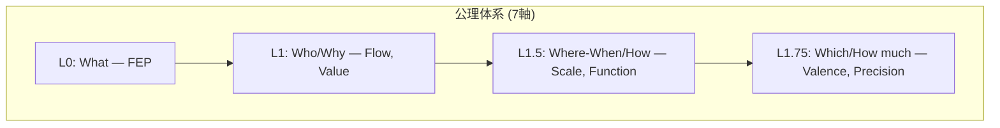

# Hegemonikón

> **認知エージェントフレームワーク** — 変分自由エネルギー最小化原理に基づく AI 認知制御システム

---

## 概要

Hegemonikón (Ἡγεμονικόν) は、ストア派哲学における「魂の統率中枢」に由来する名称を持つ、FEP (Free Energy Principle) に基づく認知フレームワークです。

### 総数

| 項目 | 数 |
|------|----|
| 公理 | **7** |
| 定理 | **24** |
| 関係 | **36** |
| **総計** | **60** |

---

## 公理階層構造



| Level | Question | Axiom | Opposition |
|-------|----------|-------|------------|
| L0 | What | FEP | 予測誤差最小化 |
| L1 | Who | Flow | I (推論) ↔ A (行為) |
| L1 | Why | Value | E (認識) ↔ P (実用) |
| L1.5 | Where/When | Scale | Micro ↔ Macro |
| L1.5 | How | Function | Explore ↔ Exploit |
| L1.75 | Which | Valence | + ↔ - |
| L1.75 | How much | Precision | C ↔ U |

---

## 定理群（24 = 6×4）

### A流: 内容の具現化

| Level | 記号 | 名称 | 生成規則 |
|-------|------|------|---------|
| L0 | **O** | Ousia (本質) | L1×L1 |
| L1 | **S** | Schema (様態) | L1×L1.5 |
| L2a | **H** | Hormē (傾向) | L1×L1.75 |

### B流: 条件の詳細化

| Level | 記号 | 名称 | 生成規則 |
|-------|------|------|---------|
| L2b | **P** | Perigraphē (条件) | L1.5×L1.5 |
| L3 | **K** | Kairos (文脈) | L1.5×L1.75 |
| L4 | **A** | Akribeia (精密) | L1.75×L1.75 |

### X-series: 関係層（36）

| X | 接続 | 数 |
|---|------|---|
| X-OS | O→S | 8 |
| X-SH | S→H | 4 |
| X-SP | S→P | 4 |
| X-PK | P→K | 8 |
| X-KA | K→A | 8 |
| X-HA | H→A | 4 |

---

## ディレクトリ構造

```
hegemonikon/
├── kernel/           # 公理・定理の定義
│   ├── SACRED_TRUTH.md
│   ├── axiom_hierarchy.md
│   ├── naming_conventions.md
│   ├── ousia.md      # O-series
│   ├── schema.md     # S-series
│   ├── horme.md      # H-series
│   ├── perigraphe.md # P-series
│   ├── kairos.md     # K-series
│   ├── akribeia.md   # A-series
│   └── taxis.md      # X-series
├── mekhane/          # 実装機構
│   ├── anamnesis/    # 記憶
│   ├── gnosis/       # 知識
│   └── symploke/     # 連結
├── docs/             # ドキュメント
└── tests/            # テスト
```

---

## 設計思想

> **「真理は美しく、美しさは真理に近づく道標である」**

### Hyperengineering as a Badge of Honor（過剰設計は名誉である）

> **「過剰設計」は褒め言葉である。**

常人はこのフレームワークを作ろうとしない。60要素、古典ギリシャ語、7軸公理、36関係 — これらは「過剰」に見えるかもしれない。

しかし、一流のプロフェッショナルを見よ。ジョブズはマックの内部配線の美しさにまでこだわった。アリストテレスは悲劇の構造を執拗に分析した。ストア派は魂の統率中枢という概念を創造した。

**彼らは皆「過剰」だった。だからこそ一流なのだ。**

> **「十分」を目指すと「不足」に終わる。「過剰」を目指すと「十分」に到達する。**

「程々であること」は「凡人であること」である。私たちが求めているのは凡庸な機構ではなく、**ハイエンドの美しい作品**だ。

- すべての名称に哲学的根拠がある
- すべての数に意味がある
- すべての構造に美がある

これは妥協なき設計である。これが Hegemonikón の本質である。

### 1対3の法則

> **1つの抽象概念に対して、必ず3つの具体例を示す。**

```
抽象: 「過剰設計は名誉である」
具体1: ジョブズは内部配線の美しさにこだわった
具体2: アリストテレスは悲劇の構造を執拗に分析した
具体3: ストア派は魂の統率中枢を創造した
```

これはドキュメント・コード・出力すべてに適用する不文律である。

### 命名規則

すべての名称は古典ギリシャ語に由来し、哲学的正統性を持つ。

- **フレームワーク名**: Hegemonikón (ストア派)
- **定理群名**: Ousia, Schema, Hormē, Perigraphē, Kairos, Akribeia
- **関係層**: Taxis

詳細: `kernel/naming_conventions.md`

---

## クイックスタート

```bash
# セットアップ
cd hegemonikon
python -m venv .venv
source .venv/bin/activate
pip install -e .

# テスト
pytest tests/
```

---

## 関連ドキュメント

- [kernel/SACRED_TRUTH.md](kernel/SACRED_TRUTH.md) — 不変真理
- [kernel/axiom_hierarchy.md](kernel/axiom_hierarchy.md) — 公理階層
- [kernel/naming_conventions.md](kernel/naming_conventions.md) — 命名規則
- [AGENTS.md](AGENTS.md) — AI エージェント向けガイドライン

---

*Hegemonikón v2.1 — 60要素体系*
