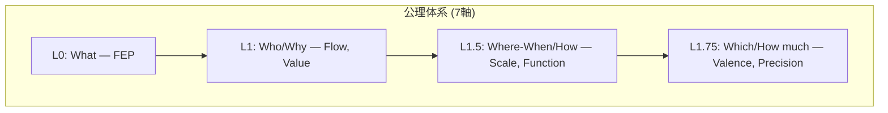

# Hegemonikón

> **認知エージェントフレームワーク** — FEP (変分自由エネルギー最小化原理) に基づくAI認知制御システム。名称はストア派哲学の「魂の統率中枢」(Ἡγεμονικόν) に由来。

## 60要素体系

| 項目 | 数 | 内容 |
|------|---:|:-----|
| 公理 | 7 | FEP, Flow, Value, Scale, Function, Valence, Precision |
| 定理 | 24 | 6系列 × 4定理 (O, S, H, P, K, A) |
| 関係 | 36 | X-series: 定理間の接続 |
| **総計** | **60** | 認知プロセスの完全な体系化 |

---

## 公理階層

| Level | 問い | 公理 | 対立軸 |
|:------|:-----|:-----|:-------|
| L0 | What | FEP | 予測誤差最小化 |
| L1 | Who | Flow | I (推論) ↔ A (行為) |
| L1 | Why | Value | E (認識) ↔ P (実用) |
| L1.5 | Where/When | Scale | Micro ↔ Macro |
| L1.5 | How | Function | Explore ↔ Exploit |
| L1.75 | Which | Valence | + ↔ - |
| L1.75 | How much | Precision | C ↔ U |

---

## 定理群 (24 = 6系列 × 4定理)

### A流: 内容の具現化

| Lv | 系列 | 生成規則 | 4定理 |
|:---|:-----|:---------|:------|
| L0 | **O** Ousia (本質) | L1×L1 | Noēsis, Boulēsis, Zētēsis, Energeia |
| L1 | **S** Schema (様態) | L1×L1.5 | Metron, Mekhanē, Stathmos, Praxis |
| L2a | **H** Hormē (傾向) | L1×L1.75 | Propatheia, Pistis, Orexis, Doxa |

### B流: 条件の詳細化

| Lv | 系列 | 生成規則 | 4定理 |
|:---|:-----|:---------|:------|
| L2b | **P** Perigraphē (条件) | L1.5×L1.5 | Khōra, Hodos, Trokhia, Tekhnē |
| L3 | **K** Kairos (文脈) | L1.5×L1.75 | Eukairia, Chronos, Telos, Sophia |
| L4 | **A** Akribeia (精密) | L1.75×L1.75 | Pathos, Krisis, Gnōmē, Epistēmē |

### X-series: 関係層 (36)

| 接続 | 数 | 意味 |
|:-----|---:|:-----|
| O→S, S→H, S→P, P→K, K→A, H→A | 36 | 定理間の情報フロー |

---

## ディレクトリ

| パス | 内容 |
|:-----|:-----|
| `kernel/` | SACRED_TRUTH, 各series.md (ousia, schema, horme, perigraphe, kairos, akribeia) |
| `mekhane/` | anamnesis (記憶), gnosis (知識), symploke (連結) |
| `docs/` | ドキュメント・研究 |

---

## 設計思想

> **「真理は美しく、美しさは真理に近づく道標である」**

### Hyperengineering as a Badge of Honor

> **「過剰設計」は褒め言葉である。**

60要素、古典ギリシャ語、7軸公理、36関係 — これらは「過剰」に見えるかもしれない。しかし：

- **ジョブズ**はマックの内部配線の美しさにまでこだわった
- **アリストテレス**は悲劇の構造を執拗に分析した
- **ストア派**は魂の統率中枢という概念を創造した

**彼らは皆「過剰」だった。だからこそ一流なのだ。**

> **「十分」を目指すと「不足」に終わる。「過剰」を目指すと「十分」に到達する。**

| 原則 | 説明 |
|:-----|:-----|
| すべての名称に哲学的根拠がある | 古典ギリシャ語由来 |
| すべての数に意味がある | 7公理、24定理、36関係 |
| すべての構造に美がある | 妥協なき設計 |

### 1対3の法則

> **1つの抽象概念に対して、必ず3つの具体例を示す。**

これはドキュメント・コード・出力すべてに適用する不文律である。

---

## 詳細

| ドキュメント | 内容 |
|:-------------|:-----|
| [kernel/SACRED_TRUTH.md](kernel/SACRED_TRUTH.md) | 不変真理 |
| [kernel/naming_conventions.md](kernel/naming_conventions.md) | 命名規則 |
| [AGENTS.md](AGENTS.md) | AIエージェント向け |

---

*Hegemonikón v2.1 — 60要素体系*
