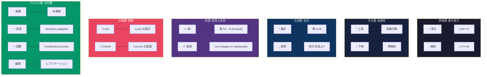

# CCL 演算子仕様 v7.0

> **正本**: この文書は ccl/operators.md であり、全演算子仕様を定義する

## 1. 単項演算子

### 1.1 強度演算子

| 記号 | 名称 | 作用 | 圏論 | 例 |
|:-----|:-----|:-----|:-----|:---|
| `+` | 深化 | 詳細な根拠を追加。深層まで展開。 | 自然変換 η:Id⟹T (増幅) | `/noe+` |
| `-` | 縮約 | 要点のみ。圧縮・要約。 | 自然変換 ε:T⟹Id (縮約) | `/bou-` |

> **圏論的解釈** (Kalon v1.0): `+/-` は恒等関手 Id と増幅関手 T の間の自然変換。
> `+` = η (unit): 対象を拡張コンテキストに持ち上げる。
> `-` = ε (counit): 対象を本質に絞り込む。
> ※ 定量的な「倍率」は実装の目安であり、圏論的定義には含まれない。

### 1.2 次元演算子

| 記号 | 名称 | 作用 | 例 |
|:-----|:-----|:-----|:---|
| `^` | 上昇 | メタ前提の検証。メタ化。 | `/dia^` |
| `√` | 下降 | 次元を下げる。具体的アクション。 | `√/noe` |

### 1.3 制御演算子

| 記号 | 名称 | 作用 | 例 |
|:-----|:-----|:-----|:---|
| `\` | 反転 | 位相反転（Antistrophē）。構造的否定。 | `\a` |
| `!` | 全展開 | 封印解除。全派生を並列展開。 | `/s!` |

### 1.4 FEP 演算子 (v6.5)

| 記号 | 名称 | FEP 意味 | 例 |
|:-----|:-----|:---------|:---|
| `'` | 微分 | 予測誤差の変化率 ($d\epsilon/dt$) | `/bou'` |
| `∂` | 偏微分 | 特定次元の変化率 ($\partial f/\partial x$) | `∂s1/bou` |
| `∫` | 積分 | 履歴統合、累積 ($\int\epsilon dt$) | `∫/dox` |
| `Σ` | 総和 | 複数結果の集約 ($\Sigma x_i$) | `Σ[results]` |
| `lim[cond]{}` | 収束 | 極限、予測誤差最小化の終着点 | `lim[ε=0]{/s~dia}` |

### 1.5 型記法 (Pythōsis Phase 3) v6.51

> **Origin**: Python `typing` モジュールの消化
> **目的**: CCL 出力に型制約を宣言し、/epi.typed で静的検証

| 記号 | 名称 | Python 対応 | 例 |
|:-----|:-----|:------------|:---|
| `?T` | 不確実型 | `Optional[T]` | `/noe+{out: ?string}` |
| `[T]` | 複数型 | `List[T]` | `/zet+{out: [question]}` |
| `A\|B` | 選択型 | `Union[A, B]` | `/dia{out: pass\|fail}` |
| `:T` | 型注釈 | Type hint | `/ene{task: string}` |

**使用例**:

```ccl
# 出力型を宣言
/noe+{out: ?insight}  # Optional[insight] — 洞察が得られないかもしれない

# リスト出力
/zet+{out: [question]}  # List[question] — 複数の問いを生成

# 選択型
/dia{out: pass|fail}    # Union[pass, fail] — 二択

# /epi.typed で検証
/epi.typed{expect: string} /noe+  # /noe+ の出力が string であることを検証
```

### 1.6 最適化演算子 (シングルスレッド) 🧪 PROVISIONAL

> ⚠️ **暫定**: 実験による検証待ち。効果値は仮設定。

| 記号 | 名称 | 効果 | 例 |
|:-----|:-----|:-----|:---|
| `@cache` | キャッシュ | **-10pt** | `@cache[L1]{/noe+}` |
| `@compact` | 圧縮 | **-8pt** | `@compact{long_ctx}` |
| `@fault_tolerant` | 自動回復 | **+2pt** | `@fault_tolerant{/noe+ @fallback{/noe-}}` |

### 1.6 分散実行演算子 (マルチスレッド) v6.48

> **目的**: 複雑なCCLを外部エージェントに委譲し、長時間実行を実現

| 記号 | 名称 | 意味 | 例 |
|:-----|:-----|:-----|:---|
| `\|>` | パイプライン | 前段→後段への順次実行 | `/noe+ \|> /dia+ \|> /ene+` |
| `\|\|` | 並列 | 独立処理の同時実行 | `/sop+ \|\| /zet+` |
| `@batch` | バッチ | 非同期並列処理 | `@batch{F:[×100]{/s}}` |
| `@thread` | スレッド指定 | 実行エージェント指定 | `@thread[perplexity]{/sop+}` |
| `@delegate` | 委譲 | 長時間タスクを外部へ | `@delegate[openmanus]{/ene+}` |

**即時利用可能なスレッド**:

| スレッド | 役割 | pt上限 |
|:---------|:-----|:------:|
| Antigravity (私) | 認知・判断 | 60pt |
| Claude Code | 長時間自律実行 | 60pt |
| Gemini Code Assist | IDE統合コード生成 | 60pt |
| Gemini CLI | CLIベース処理 | 60pt |
| Jules API | Googleコード生成Agent | 60pt |
| OpenManus (自宅PC) | マルチエージェント基盤 | 無制限 |

**分散実行ポイント**: 各スレッドが60pt以下なら、全体は**300pt+**。

---

## 2. 二項演算子

### 代数的演算子 (一発で完了)

| 記号 | 名称 | 認知的意味 | 圏論 | タスク構造 |
|:-----|:-----|:-----------|:-----|:-----------|
| `*` | 融合 | 不可分な統合。一瞬の結合。 | 積 (Product) | シングルタスク |
| `_` | シーケンス | 思考の連鎖。Aの後にBを実行。 | 射の合成 (g∘f) | 逐次処理 |
| `>>` | 射 | X-series 構造的変換。A が B に変わる。 | 射 f:A→B (forward) | 変換 |
| `>*` | 射的融合 | X-series を通じた変容。A が B の視点で変容。 | Lax Actegory ⊳ (backward) | 変容 |

### プロセス演算子 (余代数的 — 時間的展開を持つ)

| 記号 | 名称 | 認知的意味 | 圏論 | 収束性 |
|:-----|:-----|:-----------|:-----|:------|
| `~` | 振動 | 動的な往復。AI が収束/発散を判断。 | 余帰納的振動† | 自動判定 |
| `~*` | 収束振動 | 融合するまで往復。結果が一つにまとまる。 | Terminal coalgebra | 収束 |
| `~!` | 発散振動 | 展開的に往復。N回で打ち切り。 | Coinductive process | 発散 |

> **†プロセス演算子の圏論的正体** (Kalon v1.0, V6検証済):
> 代数的演算子 (`*`, `_`, `>>`, `>*`) は**一発で結果が出る**。
> プロセス演算子 (`~`, `~*`, `~!`) は**時間的に展開する**。
>
> `~*` = terminal coalgebra (最大不動点に収束) ≈ `lim[cond]{A _ B}` の省略形
> `~!` = coinductive process (有限切り詰め) ≈ `cyc[N]{A _ B}` の省略形
> `~`  = 裸振動。AI が文脈から `~*` か `~!` を推定する。
>
> **FEP 対応**: `~*` = variational inference (近似が収束)
> 　　　　　　 `~!` = active inference loop (環境が変動し続ける)
>
> **Lax Actegory `>*`** (Kalon v1.0):
> forward channel (`>>`) = 予測、backward channel (`>*`) = 推論更新。
> Lax 結合律: (B⊗C)⊳A ⟹ B⊳(C⊳A)。Strict 単位律: I⊳A = A。

> **指向性**: 全ての二項演算子は**左が主、右が従**。`A*B` = A のための B。

### 区別

```
_   = 「Aの次にBをやってくれ」         → 手続き (時間的順序)
>>  = 「Aを構造的にBに変換してくれ」   → 変換 (X-series morphism)
>*  = 「AをBの視点で変容させてくれ」   → 変容 (射的融合)
*   = 「両方踏まえて一つの答えをくれ」 → 統合 (不可分)
~   = 「両方の対話を見せてくれ」       → プロセス (往復) [AI判定]
~*  = 「融合するまで往復してくれ」     → プロセス (収束)
~!  = 「広げながら往復してくれ」       → プロセス (発散)
```

### 結合度階層

```
_  < >>  < >*  < *  < ~  < ~*  < ~!
弱   中弱  中強  強   動的  収束   発散
```

---

## 3. Series Limit 演算 (v7.0 — Kalon 修正)

> **Series WF** (/a, /h, /k, /o, /p, /s) に適用される認知演算
> **Kalon Deep Examination (2026-02-07)**: 旧称「内積/外積」を Limit/Colimit に訂正

| 位相 | 圏論的演算 | 認知的意味 | 例 | 出力 |
|:-----|:-----------|:-----------|:---|:-----|
| `/` | **Limit** (極限) | 統合・収束 | `/a` | 収束スカラー (cone の頂点) |
| `\` | **Colimit** (余極限) | 展開・発散 | `\a` | 派生群 (cocone の底面) |

### 数学的定義 (Kalon 修正)

```
Limit (極限):
  /a = lim(A1, A2, A3, A4)
  = 4つの定理の最も具体的な共通部分 (cone の頂点)
  = 変分近似 (lax section) として実装 (Smithe 2022)
  結果: 収束スカラー (統合スコア)

Colimit (余極限):
  \a = colim(A1, A2, A3, A4)
  = 4つの定理の最も一般的な包含 (cocone の底面)
  = 展開・発散操作
  結果: 派生群 (全組み合わせ)
```

> **旧称との対応**: 「内積」→ Limit (収束方向は同じ)、「外積」→ Colimit (展開方向は同じ)
> **修正理由**: Hub WF は構造の「消失」(スカラー化) であり、「保存」ではない。
> 関手 (functor) ではなく Limit 演算 (cone の頂点) が正確な圏論的対応。

### 派生生成

```
\a の派生 = Colimit から自然生成
例: 12派生 = 4定理 × 3レベル (確実/暫定/保留)
```

---

## 4. 関数演算子 (Tier 4)

| 記号 | 名称 | FEP 意味 |
|:---:|:---|:---|
| `E[]` | 期待値 | 予測値。平均的な成果。 |
| `V[]` | 分散 | 不確実性・エントロピー。 |
| `P()` | 順列 | 全順序パターン探索。 |
| `C()` | 組合せ | 構成要素の選択探索。 |

---

## 5. 定理修飾子

単項演算子の直後に定理IDを付記し、特定の方向（次元）へ深化・縮約する。

### Series別一覧

#### Akribeia (A) — 精度軸

| 記号 | 定理 | 作用 |
|:-----|:-----|:-----|
| `+a1` | Pathos | 感情・主観を精緻化 |
| `+a2` | Krisis | 判断・決定を厳密化 |
| `+a3` | Gnōmē | 原則・格言を抽出 |
| `+a4` | Epistēmē | 知識として固定 |

#### Horme (H) — 動機軸

| 記号 | 定理 | 作用 |
|:-----|:-----|:-----|
| `+h1` | Propatheia | 初期直感を評価 |
| `+h2` | Pistis | 確信度を評価 |
| `+h3` | Orexis | 欲求・価値を評価 |
| `+h4` | Doxa | 信念として記録 |

#### Kairos (K) — 文脈軸

| 記号 | 定理 | 作用 |
|:-----|:-----|:-----|
| `+k1` | Eukairia | 好機判定 |
| `+k2` | Chronos | 時間軸を拡大 |
| `+k3` | Telos | 目的整合を確認 |
| `+k4` | Sophia | 知恵・経験を適用 |

#### Ousia (O) — 認知軸

| 記号 | 定理 | 作用 |
|:-----|:-----|:-----|
| `+o1` | Noēsis | 深層認識 |
| `+o2` | Boulēsis | 意志・目的を明確化 |
| `+o3` | Zētēsis | 問いを発見 |
| `+o4` | Energeia | 行為に移行 |

#### Perigraphe (P) — 空間軸

| 記号 | 定理 | 作用 |
|:-----|:-----|:-----|
| `+p1` | Khōra | 領域・スコープを拡大 |
| `+p2` | Hodos | 経路を定義 |
| `+p3` | Trokhia | 軌道・サイクルを定義 |
| `+p4` | Tekhnē | 技法を選択 |

#### Schema (S) — 設計軸

| 記号 | 定理 | 作用 |
|:-----|:-----|:-----|
| `+s1` | Metron | スケールを拡大 (Micro→Macro) |
| `+s2` | Mekhanē | 方法を配置 |
| `+s3` | Stathmos | 基準を設定 |
| `+s4` | Praxis | 実践方法を選択 |

### レベルパラメータ `:N`

| 表記 | 意味 | スケール |
|:-----|:-----|:---------|
| `+s1:1` | 1段階拡大 | 月/中域 |
| `+s1:2` | 2段階拡大 | 年/広域 |
| `+s1:3` | 3段階拡大 | 人生/大域 |
| `+s1:4` | 4段階拡大 | 永劫/全体 |

---

## 6. 特殊パターン

### 6.1 融合メタ表示 `*^`

```
/noe*dia    → 融合結果のみ
/noe*^dia   → 融合結果 + どう融合したかのメタ解説
```

---

## 7. 六層アーキテクチャ (v7.1 — Kalon)

| 層 | 役割 | 演算子 | 圏論 |
|:---|:-----|:-------|:-----|
| **骨格** | 量の変化 | `+`, `-` | 自然変換 η/ε |
| **次元** | 抽象度の変化 | `^`, `√` | 指数対象 / 評価射 |
| **合成** | 定理の結合 | `*`, `_` | 積 / 射の合成 |
| **射** | 定理間の構造的変換 | `>>`, `>*` | 射 / Lax Actegory |
| **位相** | 極限演算 | `/`, `\` | Limit / Colimit |
| **プロセス** | 余代数的展開 | `~`, `~*`, `~!`, `!` | 余帰納 / レプリケーション |

> **v7.1 変更点**: 旧「合成層」から `~` を分離し「プロセス層」を新設。
> `~` は唯一の余代数的（coinductive）演算子であり、他の代数的演算子と質が異なるため。
> `!` (レプリケーション) も空間的プロセスとしてこの層に配置。

---

## 8. 構文規則 (v1.2)

1. **評価順序**: 左から右へ（思考の順序）
2. **先頭単項**: 式全体にかかる
3. **末尾単項**: 直前のWFにかかる
4. **括弧**: 複雑な式でスコープを明示

---

## 9. 封印 (使用注意)

| 記号 | 名称 | 作用 | 状態 |
|:-----|:-----|:-----|:-----|
| `!` | 展開 | 全派生を並列展開 | ⚠️ 高負荷 |

---

## 9.5 Lambda 式 (Pythōsis Phase 2b) v6.52

> **Origin**: Python `lambda` の消化
> **目的**: 高階マクロへの匿名 WF 受け渡し、動的認知操作の即時定義

### 9.5.1 構文

| 記法 | 説明 | 推奨 |
|:-----|:-----|:----:|
| `L:[x]{WF}` | 引数 x を受け取り WF を実行 | ★ |
| `L:{WF}` | 引数なし Lambda | ★ |

### 9.5.2 設計根拠

```
λ   → ギリシャ語起源（CCL と一貫）
L:  → ASCII で入力可能、λ の代替
[]  → セレクタ（引数）
{}  → 処理ブロック
```

### 9.5.3 用途

| 用途 | 例 | 説明 |
|:-----|:---|:-----|
| **高階マクロ** | `@retry(3, on_fail=L:{/dia^})` | 失敗時にメタ分析 |
| **動的パイプライン** | `@chain(L:[x]{/noe+{x}}, L:[x]{/dia{x}})` | 操作を順次適用 |
| **マッピング** | `F:[tasks]{L:[t]{/noe+{target=t}}}` | 各タスクに認識適用 |
| **アドホック定義** | `L:{/bou*zet}` | 一時的な認知操作 |

### 9.5.4 @partial との使い分け

| 状況 | 推奨 |
|:-----|:-----|
| 文脈を固定したい | `@partial(ctx="Heg") /zet+` |
| 動的に引数を受け取りたい | `L:[x]{/noe+{target=x}}` |
| 名前をつけずに即時使用 | `L:{...}` |

### 9.5.5 複雑度

| 演算子 | pt |
|:-------|:--:|
| `L:[]{}` (Lambda) | 4 |

> **設計方針**: Lambda は `@partial` で表現できない場合にのみ使用。シンプルさを優先。

---

## 9.6 Mixin 合成 (Pythōsis B2) v6.53

> **Origin**: Python 多重継承・デコレータの消化
> **目的**: 複数の「能力」を認知操作に合成

### 9.6.1 構文

| 記法 | 説明 |
|:-----|:-----|
| `@with(Mixin)` | 単一 Mixin 適用 |
| `@with(M1, M2)` | 複数 Mixin 合成 (左→右) |
| `@with(M{param})` | パラメータ付き Mixin |

### 9.6.2 合成ルール

```
@with(A, B) f ≡ A(B(f))
# 前の Mixin が後の Mixin をラップ
# 順序が重要: @with(A, B) ≠ @with(B, A)
```

### 9.6.3 標準 Mixin

| Mixin | 機能 | Python 対応 |
|:------|:-----|:------------|
| `Tracing` | 実行ログ記録 | `logging` |
| `Caching` | 結果キャッシュ | `@cache` |
| `Retry` | 失敗時リトライ | `tenacity` |
| `Validation` | 事前/事後検証 | `pydantic` |
| `Timing` | 実行時間計測 | `time` |

### 9.6.4 使用例

```ccl
# 基本
@with(Tracing) /noe+

# 複数合成
@with(Tracing, Caching) /zet+

# パラメータ付き
@with(Retry{max_attempts=5}) /sop

# Lambda との組み合わせ
@with(Timing) L:[x]{/noe+{target=x}}
```

### 9.6.5 複雑度

| 演算子 | pt |
|:-------|:--:|
| `@with(M)` | 3 |
| `@with(M1, M2)` | 4 |
| `@with(M{p})` | 4 |

> **設計方針**: Mixin は「横断的関心事」(ログ、キャッシュ等) に限定。認知ロジックには使用しない。

---

## 9.7 デコレータマクロ (Pythōsis B3) v6.54

> **Origin**: Python `@decorator` パターンの消化
> **目的**: Mixin の簡潔な構文糖衣

### 9.7.1 一覧

| マクロ | 展開先 Mixin | 用途 |
|:-------|:-------------|:-----|
| `@memoize` | `Caching` | 結果キャッシュ |
| `@retry` | `Retry` | 失敗時リトライ |
| `@validate` | `Validation` | 事前/事後検証 |
| `@scoped` | (特殊) | スコープ限定 |
| `@async` | (特殊) | 非同期実行 |

### 9.7.2 使用例

```ccl
# 基本形
@memoize /sop{query="重い検索"}
@retry /ene
@validate /noe+

# パラメータ付き
@memoize(ttl="1h") /zet+
@retry(max=5) /sop
@validate(pre=L:{$x != null}) /noe+

# 非同期
@async /sop{query="バックグラウンド"}
```

### 9.7.3 複雑度

| マクロ | pt |
|:-------|:--:|
| 単純 (`@memoize`, `@retry`) | 2 |
| パラメータ付き | 3 |
| 特殊 (`@scoped`, `@async`) | 4 |

> **詳細**: [ccl/macros/README.md](macros/README.md)

---

## 10. 制御構文 (CPL v2.0)

知的作業を「プログラム」として制御するための構文体系。

### 10.1 基本形: `<メタ>:[対象]{ 処理 }`

```
F:[2_3]{ /s+ }   → 2〜3回反復で /s+ を実行
I:[cond]{ /dia } → 条件 cond が真なら /dia を実行
W:[cond]{ /zet } → 条件 cond が真の間反復
let @think = /noe+_/dia  → マクロ定義
```

### 10.2 構造一覧

| 構造 | 構文例 | 内容 |
|:-----|:-------|:-----|
| **基本形** | `<メタ>:[対象]{ 処理 }` | 統一構造 |
| **反復 (FOR)** | `F:[×N]{}` / `F:[A,B]{}` | N回反復 / 各対象に適用 |
| **条件 (IF)** | `I:[cond]{}` | 条件分岐 |
| **ELSE IF** | `EI:[cond]{}` | 追加条件分岐 |
| **ELSE** | `E:{}` | 上記以外 |
| **ループ (WHILE)** | `W:[cond]{}` | 条件が真の間反復 |
| **定義 (LET)** | `let @name = CCL` | マクロ定義 |
| **セレクタ** | `[target]/wf` | 対象指定 |
| **振動** | `~` | 2点間を往復 |
| **マクロ** | `@macro` | 既定義の複合プログラム |
| **ネスト制限** | `[depth:3]` | 最大3レベル推奨 |

### 10.3 条件構文 (IF/ELSE IF/ELSE)

```ccl
# 完全な条件分岐
I:[V[/s] > 0.7]{
    /noe+       # 高確信度
}
EI:[V[/s] > 0.3]{
    /zet+       # 中確信度
}
E:{
    /dia+       # 低確信度
}
```

### 10.4 ネスト制限 (推奨3レベル)

```ccl
# 推奨 (2-3レベル)
F:[×3]{                  # Level 1
  I:[cond]{              # Level 2
    W:[loop]{            # Level 3
      /s+
    }
  }
}

# 4+レベル → マクロに分解を推奨
let @inner = W:[loop]{ /s+ }
F:[×3]{
  I:[cond]{ @inner }
}
```

### 10.5 反復構文 (FOR)

```ccl
# N回反復 (×N セレクタ)
F:[×3]{ /dia }

# 範囲指定 (2〜5回)
F:[2_5]{ /s+ }

# 各タスクに適用 (リストセレクタ)
F:[taskA, taskB]{ /dia }

# 全対象に適用
F:[ALL]{ /sta }
```

**セレクタ判定ルール**:

| セレクタ | 解釈 | 例 |
|:---------|:-----|:---|
| `×N` | N回反復 | `F:[×3]{}` |
| `N_M` | N〜M回反復 | `F:[2_5]{}` |
| `A, B` | 各対象に適用 | `F:[t1, t2]{}` |
| `ALL` | 全対象に適用 | `F:[ALL]{}` |

---

## 11. マクロ (@) — 3層アーキテクチャ (v2.0)

> **原則**: マクロは CCL 式の糖衣構文。複雑な CCL パターンに名前を付けて再利用する。
> **Dendron 監査**: 2026-02-07 実施。58 → 44 マクロ (14 PHANTOM 削除)。

### 11.1 Core — 使用中マクロ (26)

実際に WF/CCL 式で使用されている、または明確な使用場面があるマクロ。

#### 認知系 (Cognitive)

| マクロ | CCL 展開 | 意味 | Dendron |
|:-------|:---------|:-----|:-------:|
| `@converge` | `F:[T1..T4]{@selfcheck} _ I:[V>θ]{/dia.root_@reduce(*)} _ /pis` | Limit深化 (C1→C2→C3) | 🟢 |
| `@diverge` | `F:[C(4,2)]{E[tension]} _ F:[@top3]{/zet+_/noe-} _ /dox.sens` | Colimit深化 (D1→D2→D3) | 🟢 |
| `@complete` | `{result} _ /x.trigonon _ ?confirm` | WF完了 (射提案+確信度) | 🟢 |
| `@think` | `(/noe~\noe)*dia ^ /u+` | 深層思考 | 🔵 |
| `@plan` | `lim[/ene+]{(/bou~zet)*(/s~\s)_/kho*hod}` | 計画立案 | 🔵 |
| `@verify` | `lim[/epi]{(/dia~\dia)*(/sta^)}` | 厳密検証 | 🔵 |

> **`@complete` 使用義務**: 24定理WF完了時、暗黙的に発動。BC-8 連動。
> **`@converge`/`@diverge`**: Hub WF で使用。詳細: `ccl/macros/converge.md`, `ccl/macros/diverge.md`

#### Tier 1 標準

| マクロ | CCL 展開 | 意味 | Dendron |
|:-------|:---------|:-----|:-------:|
| `@tak` | `/s1_F:3{/sta~/chr}_?gap{/sop}_/bou` | タスク構造化 | 🟢 |
| `@u` | `/bou+*^zet+` | 主観的意志決定 | 🟢 |
| `@dig` | `/s+~(/p*/a)_/dia*/o+` | 深掘り分析 | 🔵 |
| `@go` | `/s+_/ene+` | 戦略即時実行 | 🔵 |
| `@ground` | `/tak-*/bou_6w3h` | 現実接地 (6W3H) | 🔵 |
| `@fix` | `/dia+_/ene+_/dia` | 修正サイクル | 🔵 |
| `@kyc` | `~(/sop_/noe_/ene_/dia-)` | κύκλος | 🔵 |

#### 合成・制御系

| マクロ | CCL 展開 | 意味 | Dendron |
|:-------|:---------|:-----|:-------:|
| `@reduce(op)` | `((A op B) op C)` | 累積融合 | 🟢 |
| `@selfcheck` | `@supervise(low)` | 自己検証 | 🟢 |
| `@chain` | `A_B_C` (continue) | 直列化 (エラー継続) | 🔵 |
| `@cycle` | `~:cond{A~B}` | 収束まで無限ループ | 🔵 |
| `@partial(p=v)` | `/kho{ctx}_WF` | 部分適用 | 🔵 |
| `@scoped(s,t){}` | `/kho{s}_WF_t` | スコープ限定実行 | 🔵 |
| `@memoize` | `Caching` Mixin | 結果キャッシュ | 🔵 |
| `@validate` | `Validation` Mixin | 事前/事後検証 | 🔵 |
| `@proof` | (証明パターン) | 証明 | 🔵 |

#### 監視・X-series

| マクロ | CCL 展開 | 意味 | Dendron |
|:-------|:---------|:-----|:-------:|
| `@supervise(lv)` | `/dia` / `/syn` | 監視レベル | 🔵 |
| `@premortem` | `@supervise(mid)` | 失敗事前検討 | 🔵 |
| `@council` | `@supervise(high)` | 外部評議会 | 🔵 |
| `@next` | `/x{from=cur}` | 推奨次ステップ | 🔵 |

---

### 11.2 Future — インフラ待ちマクロ (6)

> マルチエージェント環境・pt最適化が成熟したら**即座に活性化**するマクロ。
> 削除しない。仕様を温存する。

| マクロ | CCL 展開 | 意味 | 活性化条件 |
|:-------|:---------|:-----|:-----------|
| `@batch` | `@batch{F:[×100]{/s}}` | 非同期並列処理 | Tier 1 日次実行 |
| `@thread` | `@thread[perplexity]{/sop+}` | 実行エージェント指定 | マルチエージェント |
| `@delegate` | `@delegate[openmanus]{/ene+}` | 長時間タスク委譲 | Jules/OpenManus 統合 |
| `@cache` | `@cache[L1]{/noe+}` | pt削減キャッシュ (**-10pt**) | pt制度成熟 |
| `@compact` | `@compact{long_ctx}` | pt削減圧縮 (**-8pt**) | pt制度成熟 |
| `@fault_tolerant` | `@fault_tolerant{WF @fallback{WF-}}` | 自動回復 (**+2pt**) | エラー処理体系化 |

---

### 11.3 Experimental — 要検証マクロ (12)

> 概念は正しいが使用実績なし。**6ヶ月後 (2026-08) に Dendron 再審査**。
> 未使用なら PHANTOM 降格。

| マクロ | CCL 展開 | 意味 | 課題 |
|:-------|:---------|:-----|:-----|
| `@repeat(n)` | `F:[×N]{A}` | N回反復 | `F:` で直接書ける |
| `@ce` | `/mek{ctx>inst}` | 背景優先プロンプト | CE 体系化待ち |
| `@optimize` | `/mek{metaprompt}` | 推論最適化 | 実装なし |
| `@risk(lv)` | `/ene{risk=lv}` | リスクタグ | Safety Contract と重複 |
| `@checkpoint` | `/ene{checkpoint}` | 保存ポイント | LLM セッション制約 |
| `@memory(layer)` | `/zet{memory=layer}` | 指定層検索 | Gnōsis 成熟待ち |
| `@identity` | `/boot{out=id}` | Identity Stack | `/boot` で代替可 |
| `@reflect` | `/noe.nous{self}` | メタ認知 | 直接呼び出し可 |
| `@enforce(lv)` | Anti-Skip/Schema | 強制レベル | SEL と重複 |
| `@route(name)` | Sacred Routes | 黄金経路 | 未使用 |
| `@retry` | `Retry` Mixin | 失敗時リトライ | API 層の仕事 |
| `@async` | (特殊) | 非同期実行 | マルチエージェント前提 |

> ⚠️ **Sunset**: 2026-08-07 までに使用実績がなければ PHANTOM として削除予定

## 12. CCL 複雑度ポイント制 (Complexity Point System)

> **目的**: AI の認知負荷を定量化し、品質と処理限界のバランスを取る

### 12.1 ポイント表

| カテゴリ | 演算子 | pt |
|:---------|:-------|:--:|
| **単純** | `+`, `-`, `_` | 1 |
| **射・収束** | `>>`, `E:{}`, `let` | 2 |
| **次元・微分** | `^`, `√`, `'`, `∂`, `E[]`, `EI:[]{}` | 3 |
| **合成** | `*`, `>*` | 3 |
| **振動・制御** | `~`, `~*`, `L:[]{}`, `Σ`, `V[]`, `I:[]{}`, `lim[]{}`, `C()` | 4 |
| **反転・積分** | `\`, `∫`, `F:[]{}`, `P()` | 5 |
| **展開・WHILE** | `!`, `~!`, `W:[]{}` | 6 |

### 12.2 構造コスト

| 構造 | pt |
|:-----|:--:|
| ネスト Lv1 | +4 |
| ネスト Lv2 | +10 |
| ネスト Lv3 | +18 |

### 12.3 ポイント帯域

| 帯域 | pt | 用途 | 確信度目安 |
|:-----|:---|:-----|:-----------|
| **Minimal** | 5-15 | クイック応答 | 0.90+ |
| **Standard** | 15-30 | `/mek` | 0.80-0.90 |
| **Enhanced** | 30-45 | `/mek+` | 0.70-0.80 |
| **Maximum** | 45-60 | 複雑設計 | 0.60-0.70 |
| **Warning** | 60+ | 分割推奨 | <0.60 |

### 12.4 例

```ccl
# 4pt (Minimal)
/noe+ _ /dia _ /u+

# 15pt (Standard下限)
lim[/ene]{(/bou ~ \bou) * /s+}

# 12pt (射を使った変換)
/noe >> /met >* /dia

# 38pt (Enhanced)
I:[V[/ctx] > 0.5]{
  F:[×3]{ (/noe+s1 ~ \noe) * /dia }
}
lim[E[/u+]]{}
```

---

## 13. 圏論的意味論マップ (Kalon v1.0)

> **目的**: CCL 全演算子の圏論的正体を一枚で把握する
> **圏**: Cog (24対象 = 24定理、78射 = 72 X-series + 6恒等射)
> **Topos**: PSh(Cog) = Set^{Cog^op} は elementary topos (内部論理 = 直観主義)

### 13.1 FEP 推論サイクル

CCL の `>>` と `>*` は FEP の Active Inference サイクルを構成する:


```
>> = レンズで撮る (変換)     A が B に変わる
>* = フィルターをかける (修正)  A は A のまま、B の色がつく
```

### 13.2 全演算子マップ



### 13.3 対応表

| CCL | 名称 | 圏論 | 日常語 | FEP |
|:----|:-----|:-----|:-------|:----|
| `+` | 深化 | 自然変換 η:Id⟹T | 深掘りする | 精度↑ |
| `-` | 縮約 | 自然変換 ε:T⟹Id | 要約する | 圧縮 |
| `^` | 上昇 | 指数対象 B^A | メタに上がる | モデル階層↑ |
| `√` | 下降 | 評価射 eval | 具体に降りる | モデル階層↓ |
| `*` | 融合 | 積 (Product) | 一つにまとめる | 統合 |
| `_` | 順序 | 射の合成 g∘f | 次にこれをやる | 逐次推論 |
| `>>` | 射 | 射 f:A→B | 変える | 予測 (forward) |
| `>*` | 変容 | Lax Actegory ⊳ | 見直す | 修正 (backward) |
| `/` | Limit | Cone の頂点 | 統合する | 収束 |
| `\` | Colimit | Cocone の底面 | 展開する | 発散 |
| `~` | 振動 | 余帰納的振動 | 行ったり来たり | AI判定 |
| `~*` | 収束振動 | Terminal coalgebra | 融合するまで回る | variational inference |
| `~!` | 発散振動 | Coinductive process | 広げながら回る | active inference loop |
| `!` | 展開 | レプリケーション | 全部同時に | 並列探索 |
| `lim` | 収束 | 極限 | 行き着く先 | 予測誤差→0 |

> **出典**: Kalon Deep Examination (2026-02-07), V1-V6 検証
> **参考**: Smithe (2020) "Bayesian Updates Compose Optically", nLab Actegory

### 13.4 ワークフロー圏論的構造

> 13.3 の演算子が**組み合わさる**と、より高い圏論的構造が現れる。
> これらは個別の演算子ではなく、ワークフロー全体の構造を圏論的に特徴づける。

| 構造 | 圏論 | 構成する CCL 演算子 | WF での実現 |
|:-----|:-----|:-------------------|:-----------|
| **随伴** | L ⊣ R | `+` (η) と `-` (ε) のペアが`/`により合流 | `/boot` ⊣ `/bye` — L=展開, R=圧縮 |
| **モナド** | T, η, μ | `+`(η:持ち上げ) + `/`(μ:平坦化) の反復合成 | `/zet` — T=問い生成, μ=フィルタリング |
| **米田** | Hom(-,T) | `>>`(射) の集合が対象を完全に決定 | Hub Peras — 定理 = その射の集合 |
| **Cone** | 普遍的Cone | `/`(Limit) の普遍性 | `@converge` C1-C3 = Cone 構築 |

```
随伴 L⊣R:       boot の + (展開) と bye の - (圧縮) が / で合流
                 η: 記憶 → boot→bye → 記憶'  (何が保存されるか)
                 ε: セッション → bye→boot → セッション'  (何が復元されるか)

モナド T:        zet の + (問い生成 = η) を繰返し / で平坦化 (= μ)
                 Kleisli: anom >> hypo >> eval  (>> が Kleisli 射)

米田 Hom(-,T):   >> の集合 {f: X → Tn} が Tn の「意味」を決定
                 / = この集合全体が一致する Cone の頂点
```

---

*v7.2 | 2026-02-07 | 6層アーキテクチャ。プロセス層新設。*
*v7.3 | 2026-02-08 | §13.4 ワークフロー圏論的構造を追加。随伴(L⊣R)・モナド(T,η,μ)・米田(Hom(-,T))・Cone構造のCCL演算子への対応を文書化。*
