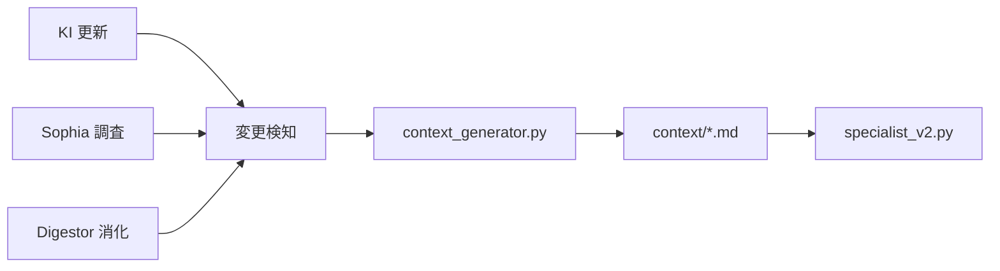

# F6: context/ 自動更新パイプライン設計

> **ステータス**: 設計のみ (実装は次セッション)
> **依存**: F4 (hegemonikon-kb), F8 (context/ 拡張)

## 目的

KI や Sophia の更新に追従して context/ を自動再生成し、
specialist review の品質を持続的に保証する。

## アーキテクチャ

## コンポーネント

### 1. 変更検知 (Trigger)

| ソース | 検知方法 |
|:-------|:---------|
| KI | `~/.gemini/antigravity/knowledge/` のタイムスタンプ監視 |
| Sophia | `~/oikos/mneme/.hegemonikon/sophia/` の新ファイル |
| Digestor | `incoming/` → `processed/` 移動イベント |

### 2. 生成器 (context_generator.py)

- KI の内容をテーマ別に分類 (FEP, CCL, Design, QA)
- 各テーマファイルのセクションを更新
- hgk_vocabulary.md は定理定義から自動生成

### 3. 品質ゲート

- 生成後に `test_generate_prompt.py` を自動実行
- HGK カバレッジ率が閾値 (80%) 以下なら警告

## 未解決の設計問題

1. **増分更新 vs 全再生成**: KI が1件追加されるたびに全ファイルを再生成するのは非効率
2. **テーマ分類ロジック**: KI のタイトル/内容からテーマを自動分類する方法が未定義
3. **手動作成コンテンツの保護**: 手書きの説明文を自動生成で上書きしない仕組み

## 次セッションでの実装計画

1. `scripts/context_generator.py` のスケルトン作成
2. KI → テーマ分類のヒューリスティック実装
3. n8n ワークフローとの連携検討
