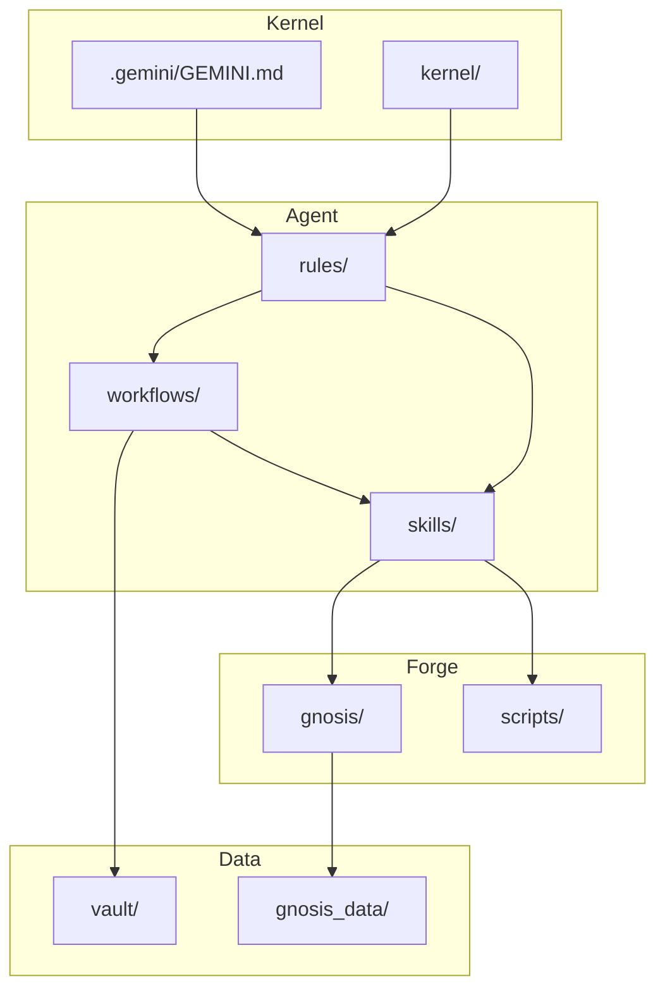

# Hegemonikón Architecture & Structure

> **Purpose**: Detailed architectural map for AI agents to navigate the codebase.
> **Related**: [AGENTS.md](../AGENTS.md) (Guidelines), [README.md](../README.md) (Overview).
> **Language**: English (AI-optimized). 日本語版: [../STRUCTURE.md](../STRUCTURE.md)

---

## 1. High-Level Architecture (4-Layer Model)

Hegemonikón is organized into four distinct layers:

```
┌─────────────────────────────────────────────────────┐
│  KERNEL LAYER (kernel/, .gemini/GEMINI.md)         │  ← IMMUTABLE
├─────────────────────────────────────────────────────┤
│  AGENT LAYER (.agent/)                              │  ← Cognitive Control
│    ├── workflows/  ├── skills/  ├── rules/         │
├─────────────────────────────────────────────────────┤
│  FORGE LAYER (forge/)                               │  ← Tools & Products
│    ├── gnosis/  ├── scripts/  ├── templates/       │
├─────────────────────────────────────────────────────┤
│  DATA LAYER (vault/, gnosis_data/)                  │  ← Persistent State
└─────────────────────────────────────────────────────┘
```

### Layer Details

1.  **Kernel Layer** (`kernel/`, `.gemini/GEMINI.md`)
    - The immutable core. Defines Identity, Axioms, and Prime Directives.
    - **Access**: Read-Only (Explicit approval required for changes).

2.  **Agent Layer** (`.agent/`)
    - The cognitive control center.
    - **Workflows** (`workflows/`): Defined procedures (e.g., `/boot`, `/plan`).
    - **Skills** (`skills/`): Cognitive capabilities (M-Series, P-Series).
    - **Rules** (`rules/`): Constraints and protocols.

3.  **Forge Layer** (`forge/`)
    - The tool factory and production environment.
    - Contains scripts, CLI tools, and sub-systems like **Gnōsis**.

4.  **Data Layer** (`vault/`, `gnosis_data/`)
    - Persistent state.
    - **Vault**: Long-term memory (Markdown).
    - **Gnōsis**: Vector database (LanceDB).

---

## 2. Module Responsibilities

### M-Series (Extended Theorems)

| Module | Name | Role | Tempo | Key Files |
| :--- | :--- | :--- | :--- | :--- |
| **M1** | **Aisthēsis** | Perception & Context Awareness | Fast | `.agent/skills/m1-aisthesis/` |
| **M2** | **Krisis** | Prioritization & Judgment | Fast | `.agent/skills/m2-krisis/` |
| **M3** | **Theōria** | Pattern Recognition & Causal Modeling | Slow | `.agent/skills/m3-theoria/` |
| **M4** | **Phronēsis** | Strategy & Planning | Slow | `.agent/skills/m4-phronesis/` |
| **M5** | **Peira** | Experimentation & Research | Fast | `.agent/skills/m5-peira/` |
| **M6** | **Praxis** | Execution & Implementation | Fast | `.agent/skills/m6-praxis/` |
| **M7** | **Dokimē** | Verification & Criticism | Slow | `.agent/skills/m7-dokime/` |
| **M8** | **Anamnēsis** | Memory & History Management | Slow | `.agent/skills/m8-anamnesis/` |

### P-Series (Pure Theorems)

| Module | Name | Core Question | Use Case |
| :--- | :--- | :--- | :--- |
| **P1** | **Noēsis** | What do I know? (Epistemology) | Metacognitive reflection |
| **P2** | **Boulēsis** | What do I want? (Volition) | Goal clarification |
| **P3** | **Zētēsis** | What should I ask? (Inquiry) | Question formulation |
| **P4** | **Energeia** | What should I do? (Praxis) | Action selection |

---

## 3. Directory Map

```text
M:\Hegemonikon\
├── AGENTS.md               # AI Instruction Manual (READ FIRST)
├── STRUCTURE.md            # Human-readable structure (Japanese)
├── llms.txt                # AI Context Index
├── README.md               # Project overview
│
├── .agent/                 # [LAYER: AGENT]
│   ├── rules/              #   Operational Rules (CONSTITUTION.md, etc.)
│   ├── skills/             #   Cognitive Modules
│   │   ├── m1-aisthesis/   #     M1: Perception
│   │   ├── m2-krisis/      #     M2: Judgment
│   │   ├── ...             #     M3-M8
│   │   └── p-theorems/     #     P1-P4: Pure Theorems
│   └── workflows/          #   Standard Procedures (*.md)
│
├── docs/                   # Documentation
│   └── STRUCTURE.md        #   This file (AI-optimized, English)
│
├── forge/                  # [LAYER: FORGE]
│   ├── gnosis/             #   Knowledge Base System (Python CLI)
│   ├── scripts/            #   Utility Scripts (PowerShell/Python)
│   └── templates/          #   Boilerplates
│
├── kernel/                 # [LAYER: KERNEL] - DO NOT MODIFY
│
├── runtime/                # Runtime Applications
│   └── antigravity/        #   Agent host environment
│
├── vault/                  # [LAYER: DATA] Long-term Memory
│
└── gnosis_data/            # [LAYER: DATA] Vector DB (LanceDB)
```

---

## 4. Naming Conventions

| Element | Convention | Example |
| :--- | :--- | :--- |
| **Files** | `snake_case.ext` | `sync_chat_history.py` |
| **Directories** | `kebab-case` | `m1-aisthesis/` |
| **Python Functions** | `snake_case` | `def check_freshness():` |
| **Python Classes** | `PascalCase` | `class GnosisClient:` |
| **Constants** | `SCREAMING_SNAKE_CASE` | `MAX_ENTRIES = 100` |
| **Workflow Commands** | `/lowercase` | `/boot`, `/plan` |
| **Module IDs** | `M{N}` or `P{N}` | `M1`, `P4` |

---

## 5. Key Sub-Systems

### Gnōsis (`forge/gnosis/`)
- A RAG (Retrieval-Augmented Generation) system for scientific papers and internal docs.
- **CLI**: `python forge/gnosis/cli.py`
- **Data**: `gnosis_data/` (LanceDB tables)

### Antigravity (`runtime/antigravity/`)
- The host environment for the AI agent (this process).
- Manages session state and tool execution.

### Long-Term Memory (`M:\Documents\mine\.hegemonikon\`)
- **patterns.yaml**: M3 Theōria patterns.
- **values.json**: M4 Phronēsis value functions.
- **trust_history.json**: M6 Praxis trust scores.

---

## 6. AI Learning Path (Recommended Reading Order)

For AI agents onboarding to this repository:

```
1. llms.txt           → Quick index of what exists
2. AGENTS.md          → Rules, boundaries, commands (CRITICAL)
3. docs/STRUCTURE.md  → This file (architecture deep-dive)
4. .agent/workflows/  → How to execute tasks
5. .agent/skills/     → Cognitive capabilities available
6. forge/gnosis/      → Knowledge base system (if RAG needed)
```

**Time to understand**: ~5-10 minutes (vs. 30-60 min without these docs).

---

## 7. Dependency Graph



---

*Last Updated: 2026-01-21*
