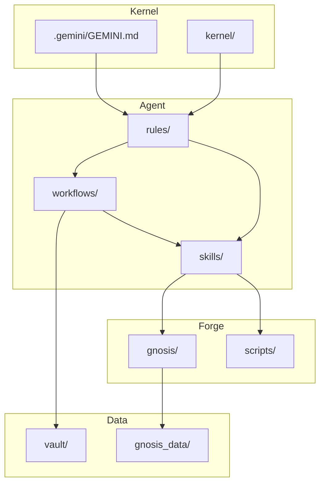

# Hegemonikón Architecture & Structure

> **Purpose**: Detailed architectural map for AI agents to navigate the codebase.
> **Related**: [AGENTS.md](../AGENTS.md) (Guidelines), [README.md](../README.md) (Overview).
> **Language**: English (AI-optimized). 日本語版: [../STRUCTURE.md](../STRUCTURE.md)

---

## 1. High-Level Architecture (4-Layer Model)

Hegemonikón is organized into four distinct layers:

```
┌─────────────────────────────────────────────────────┐
│  KERNEL LAYER (kernel/, .gemini/GEMINI.md)         │  ← IMMUTABLE
├─────────────────────────────────────────────────────┤
│  AGENT LAYER (.agent/)                              │  ← Cognitive Control
│    ├── workflows/  ├── skills/  ├── rules/         │
├─────────────────────────────────────────────────────┤
│  FORGE LAYER (forge/)                               │  ← Tools & Products
│    ├── gnosis/  ├── scripts/  ├── templates/       │
├─────────────────────────────────────────────────────┤
│  DATA LAYER (vault/, gnosis_data/)                  │  ← Persistent State
└─────────────────────────────────────────────────────┘
```

### Layer Details

1.  **Kernel Layer** (`kernel/`, `.gemini/GEMINI.md`)
    - The immutable core. Defines Identity, Axioms, and Prime Directives.
    - **Access**: Read-Only (Explicit approval required for changes).

2.  **Agent Layer** (`.agent/`)
    - The cognitive control center.
    - **Workflows** (`workflows/`): Defined procedures (e.g., `/boot`, `/plan`).
    - **Skills** (`skills/`): Cognitive capabilities (M-Series, P-Series).
    - **Rules** (`rules/`): Constraints and protocols.

3.  **Forge Layer** (`forge/`)
    - The tool factory and production environment.
    - Contains scripts, CLI tools, and sub-systems like **Gnōsis**.

4.  **Data Layer** (`vault/`, `gnosis_data/`)
    - Persistent state.
    - **Vault**: Long-term memory (Markdown).
    - **Gnōsis**: Vector database (LanceDB).

---

## 2. Module Responsibilities

### M-Series (Extended Theorems)

| Module | Name | Role | Tempo | Key Files |
| :--- | :--- | :--- | :--- | :--- |
| **M1** | **Aisthēsis** | Perception & Context Awareness | Fast | `.agent/skills/m1-aisthesis/` |
| **M2** | **Krisis** | Prioritization & Judgment | Fast | `.agent/skills/m2-krisis/` |
| **M3** | **Theōria** | Pattern Recognition & Causal Modeling | Slow | `.agent/skills/m3-theoria/` |
| **M4** | **Phronēsis** | Strategy & Planning | Slow | `.agent/skills/m4-phronesis/` |
| **M5** | **Peira** | Experimentation & Research | Fast | `.agent/skills/m5-peira/` |
| **M6** | **Praxis** | Execution & Implementation | Fast | `.agent/skills/m6-praxis/` |
| **M7** | **Dokimē** | Verification & Criticism | Slow | `.agent/skills/m7-dokime/` |
| **M8** | **Anamnēsis** | Memory & History Management | Slow | `.agent/skills/m8-anamnesis/` |

### P-Series (Pure Theorems)

| Module | Name | Core Question | Use Case |
| :--- | :--- | :--- | :--- |
| **P1** | **Noēsis** | What do I know? (Epistemology) | Metacognitive reflection |
| **P2** | **Boulēsis** | What do I want? (Volition) | Goal clarification |
| **P3** | **Zētēsis** | What should I ask? (Inquiry) | Question formulation |
| **P4** | **Energeia** | What should I do? (Praxis) | Action selection |

---

## 3. Directory Map

<!-- STRUCTURE_START -->
```text
M:\Hegemonikon\
├── .agent
│   ├── rules
│   │   ├── CONSTITUTION.md
│   │   ├── artifact-language.md
│   │   ├── error-prevention-protocols.md
│   │   ├── ethics-constraints.md
│   │   ├── hegemonikon.md
│   │   ├── prompt-lang-auto-fire.md
│   │   ├── protocol-d-extended.md
│   │   ├── protocol-d.md
│   │   ├── protocol-v.md
│   │   ├── safety-invariants.md
│   │   ├── session-protocol.md
│   │   └── termux-constraints.md
│   ├── scripts
│   │   ├── check_environment.py
│   │   └── diagnose_error.py
│   ├── skills
│   │   ├── japanese-to-prompt-converter/ ...
│   │   ├── m1-aisthesis/ ...
│   │   ├── m2-krisis/ ...
│   │   ├── m3-theoria/ ...
│   │   ├── m4-phronesis/ ...
│   │   ├── m5-peira/ ...
│   │   ├── m6-praxis/ ...
│   │   ├── m7-dokime/ ...
│   │   ├── m8-anamnesis/ ...
│   │   ├── meta-prompt-generator/ ...
│   │   ├── p1-noesis/ ...
│   │   ├── p2-boulesis/ ...
│   │   ├── p3-zetesis/ ...
│   │   └── p4-energeia/ ...
│   └── workflows
│       ├── ask.md
│       ├── boot.md
│       ├── chk.md
│       ├── code.md
│       ├── hist.md
│       ├── now.md
│       ├── p.md
│       ├── plan.md
│       ├── pri.md
│       ├── rec.md
│       ├── rev.md
│       ├── src.md
│       ├── think.md
│       └── u.md
├── .ai
│   └── guidelines.md
├── docs
│   ├── audit
│   │   └── mserries_audit.md
│   ├── design
│   │   ├── Hegemonikon_Design_Proof.md
│   │   ├── phase2_design.md
│   │   └── restructure_plan.md
│   ├── handover
│   │   ├── aidb-phase6-handover.md
│   │   ├── gnosis-v01-handover.md
│   │   ├── prompt-lang-handover.md
│   │   ├── pure_theorems_wyh.md
│   │   └── session-handover.md
│   ├── research
│   │   ├── 2026-01-21_logging_architecture_verification.md
│   │   ├── antigravity_rules_skills_2026.md
│   │   ├── gnosis-auto-reference-research.md
│   │   ├── llm-overconfidence-research.md
│   │   ├── llm_reasoning_2025.md
│   │   └── structured_prompts_2026.md
│   ├── vision
│   │   ├── gnosis-auto-reference.md
│   │   └── gnosis-vision.md
│   ├── ARCHITECTURE.md
│   └── STRUCTURE.md
├── forge
│   ├── .agent
│   │   └── workflows/ ...
│   ├── .gemini
│   │   ├── antigravity-browser-profile/ ...
│   │   └── GEMINI.md
│   ├── .obsidian
│   │   ├── app.json
│   │   ├── appearance.json
│   │   ├── core-plugins.json
│   │   └── workspace.json
│   ├── .venv-kb
│   │   ├── Include/ ...
│   │   ├── Lib/ ...
│   │   ├── Scripts/ ...
│   │   ├── share/ ...
│   │   ├── .gitignore
│   │   └── pyvenv.cfg
│   ├── .venv-kb312
│   │   ├── Include/ ...
│   │   ├── Lib/ ...
│   │   ├── Scripts/ ...
│   │   ├── share/ ...
│   │   └── pyvenv.cfg
│   ├── Raw
│   │   └── aidb/ ...
│   ├── Refined
│   │   └── aidb/ ...
│   ├── System
│   │   └── User_Context_Master.md
│   ├── constitution
│   │   ├── tests/ ...
│   │   ├── 00_orchestration.md
│   │   ├── 01_environment.md
│   │   ├── 02_logic.md
│   │   ├── 03_security.md
│   │   ├── 04_lifecycle.md
│   │   ├── 05_meta_cognition.md
│   │   ├── 06_style.md
│   │   ├── 07_implementation.md
│   │   ├── INTRODUCTION.md
│   │   ├── _index.md
│   │   └── deployment_bundle.xml
│   ├── docs
│   │   ├── brain_dump/ ...
│   │   └── phase5-kb-design.md
│   ├── gnosis
│   │   ├── collectors/ ...
│   │   ├── models/ ...
│   │   ├── __init__.py
│   │   ├── cli.py
│   │   ├── index.py
│   │   ├── logger.py
│   │   └── requirements.txt
│   ├── helpers
│   │   ├── WBSスケジューリング.md
│   │   ├── おべっかの無い評価.md
│   │   ├── エレガンススマート監査.md
│   │   ├── オッカムのカミソリ.md
│   │   ├── コンテキストの言語化.md
│   │   ├── コンテキスト構造化.md
│   │   ├── コーディング仕様書コンパイル.md
│   │   ├── コード外科手術凹.md
│   │   ├── コード監査凸.md
│   │   ├── システム・ダイナミクス予想.md
│   │   ├── システム構造監査.md
│   │   ├── プロンプト外科手術凹.md
│   │   ├── プロンプト構造監査凸.md
│   │   ├── リバースエンジニアリング.md
│   │   ├── 七世代先の視点.md
│   │   ├── 仮想ユーザー座談会.md
│   │   ├── 単純性原理と平易な説明.md
│   │   ├── 回答の解像度向上.md
│   │   ├── 外科的再構築凹.md
│   │   ├── 外部文脈の結合.md
│   │   ├── 多角的ラテラル・シンキング.md
│   │   ├── 形態素解析マトリクス.md
│   │   ├── 成功の解体新書.md
│   │   ├── 敵対的レビュー凸.md
│   │   ├── 未踏の改善点.md
│   │   ├── 現実への接地.md
│   │   ├── 発散と収束.md
│   │   ├── 第一原理思考.md
│   │   ├── 経験の法則化.md
│   │   ├── 自律思考.md
│   │   └── 論理的背景の補強.md
│   ├── knowledge
│   │   ├── AuDHD KB.md
│   │   ├── LLM性格診断KB.md
│   │   ├── Prompt Engineering Component Library.md
│   │   ├── antigravity-claude-opus-integration-2026.md
│   │   ├── antigravity-exec-ecosystem-2026.md
│   │   ├── antigravity-mcp-ceo-partner-2026.md
│   │   ├── antigravity-noncoding-econ-analysis-2026.md
│   │   ├── antigravity-tech-report-2026-comprehensive.md
│   │   ├── antigravity-vibe-coding-mobile-multimodal-2026.md
│   │   ├── antigravity-vibe-mobile-multimodal-2026.md
│   │   ├── claude-fewshot-xml-metaprompt-2026.md
│   │   ├── claude-native-pe-system-rev3-2026.md
│   │   ├── claude-xml-attention-mechanisms-2026.md
│   │   ├── claude-xml-semantics-2026.md
│   │   ├── google-antigravity-tech-analysis-2026.md
│   │   ├── nano-banana-pro-eng-kb-2026 ingest_date.md
│   │   ├── スキーマ療法KB.md
│   │   ├── ファイル構成.md
│   │   ├── 性格診断AI KB.md
│   │   ├── 未完成KB.md
│   │   ├── 自己分析テキスト(AI用).md
│   │   └── 認知バイアスKB.md
│   ├── knowledge_base
│   │   └── _index/ ...
│   ├── library
│   │   ├── execute/ ...
│   │   ├── modules/ ...
│   │   ├── perceive/ ...
│   │   ├── templates/ ...
│   │   ├── think/ ...
│   │   ├── verify/ ...
│   │   ├── README.md
│   │   └── filemaker-advisor.md
│   ├── models
│   │   └── bge-small/ ...
│   ├── modules
│   │   ├── act/ ...
│   │   ├── find/ ...
│   │   ├── reflect/ ...
│   │   └── think/ ...
│   ├── presets
│   │   ├── README.md
│   │   ├── analyst.txt
│   │   ├── architect.txt
│   │   ├── brainstorm.txt
│   │   ├── coder.txt
│   │   ├── decision.txt
│   │   └── writer.txt
│   ├── prompt-lang
│   │   ├── staging/ ...
│   │   ├── demo.prompt
│   │   ├── prompt_lang.py
│   │   ├── prompt_lang_integrate.py
│   │   ├── test_integration.py
│   │   └── test_prompt_lang.py
│   ├── prompts
│   │   ├── SETUP.md
│   │   ├── claude-profile.md
│   │   └── perplexity-profile.md
│   ├── protocols
│   │   ├── Module 01 The Demilitarized Zone (DMZ) Protocol.md
│   │   ├── Module 02 Directory Topology Lock.md
│   │   ├── Module 03 Dependency Quarantine Protocol.md
│   │   ├── Module 04 Retro-Causal Testing Protocol (TDD Enforcement).md
│   │   ├── Module 05 Domain Language Enforcement (Ubiquitous Language).md
│   │   ├── Module 06 Complexity Budget Protocol.md
│   │   ├── Module 07 The Devil's Advocate Protocol (Multi-Persona Critique).md
│   │   ├── Module 08 Cognitive Checkpoint Protocol (Anti-Drift System).md
│   │   ├── Module 09 Mutation Testing Protocol (The Saboteur).md
│   │   ├── Module 10 Ripple Effect Analysis (Impact Prediction).md
│   │   ├── Module 11 Automated Red Teaming Protocol.md
│   │   ├── Module 12 Chaos Monkey Protocol (Resilience Engineering).md
│   │   ├── Module 13 Code Archaeology Protocol (Chesterton's Fence).md
│   │   ├── Module 14 Narrative Commit Protocol.md
│   │   ├── Module 15 Atomic Design Protocol (UI Componentization).md
│   │   ├── Module 16 Accessibility Mandate (a11y Protocol).md
│   │   ├── Module 17 Structured Logging Protocol.md
│   │   ├── Module 18 Feature Flag Protocol (Toggle Architecture).md
│   │   ├── Module 19 Docker First Protocol (Containerization Mandate).md
│   │   ├── Module 20 Dead Code Reaper Protocol.md
│   │   ├── Module 21 TODO Expiration Protocol (Technical Debt Management).md
│   │   ├── Module 22 Auto-Documentation Protocol (Sync-or-Die).md
│   │   ├── Module 23 Mock First Protocol (Interface Driven).md
│   │   ├── Module 24 Performance Budget Protocol.md
│   │   └── Module 25 Rollback Strategy Protocol (The Undo Button).md
│   ├── scripts
│   │   ├── logs/ ...
│   │   ├── test_vault/ ...
│   │   ├── .env.local
│   │   ├── aidb-kb.py
│   │   ├── arxiv-collector.py
│   │   ├── chat-history-kb.py
│   │   ├── cleanup-datefix.py
│   │   ├── cleanup-duplicates.py
│   │   ├── custom_browser_extract.js
│   │   ├── doc_maintenance.py
│   │   ├── import_takeout.py
│   │   ├── merge-manifests.py
│   │   ├── perplexity_api.py
│   │   ├── perplexity_usage.json
│   │   ├── phase2-collect-urls.js
│   │   ├── phase2-save-urls.py
│   │   ├── phase2-sitemap-parser.js
│   │   ├── phase3-collect-markdown.js
│   │   ├── phase3-fast-collect.py
│   │   ├── phase3-fetch-simple.py
│   │   ├── phase3-get-batch.py
│   │   ├── phase3-merge-manifests.py
│   │   ├── phase3-save-batch-parallel.py
│   │   ├── phase3-save-batch.py
│   │   ├── restore-missing.py
│   │   ├── result_takeout.json
│   │   ├── run-sync.ps1
│   │   ├── setup-schedule.ps1
│   │   └── test_history.json
│   ├── tests
│   │   ├── test-results/ ...
│   │   ├── README.md
│   │   └── test-forge.ps1
│   ├── web
│   │   ├── index.html
│   │   └── index.json
│   ├── .forge-index.json
│   ├── .gitignore
│   ├── AUDIT_REPORT.md
│   ├── GEMINI.md
│   ├── MANUAL.md
│   ├── PLAN_OBSIDIAN_PIVOT.md
│   ├── PROJECT_HANDOVER.md
│   ├── PROJECT_STATUS.md
│   ├── README.md
│   ├── The Cognitive Hypervisor Architecture.md
│   ├── USAGE.md
│   ├── USER_MANUAL.md
│   ├── build-index.ps1
│   ├── cli.js
│   ├── forge-complete.zip
│   ├── forge.ps1
│   ├── index.json
│   ├── package-lock.json
│   ├── package.json
│   ├── start-server.ps1
│   ├── test_fast_fetch.py
│   ├── test_fast_fetch_v2.py
│   ├── test_output.md
│   └── verify_batch_5.py
├── gnosis_data
│   └── lancedb
│       └── papers.lance/ ...
├── kernel
│   ├── axioms
│   ├── meta
│   │   └── gnosis.md
│   ├── philosophy
│   ├── SACRED_TRUTH.md
│   └── doctrine.md
├── runtime
│   └── antigravity
│       └── browser_recordings/ ...
├── vault
├── .editorconfig
├── .env.local
├── .gitignore
├── .sync-state.json
├── AGENTS.md
├── CHANGELOG.md
├── CONTRIBUTING.md
├── LICENSE
├── README.md
├── STRUCTURE.md
└── llms.txt
```
<!-- STRUCTURE_END -->

---

## 4. Naming Conventions

| Element | Convention | Example |
| :--- | :--- | :--- |
| **Files** | `snake_case.ext` | `sync_chat_history.py` |
| **Directories** | `kebab-case` | `m1-aisthesis/` |
| **Python Functions** | `snake_case` | `def check_freshness():` |
| **Python Classes** | `PascalCase` | `class GnosisClient:` |
| **Constants** | `SCREAMING_SNAKE_CASE` | `MAX_ENTRIES = 100` |
| **Workflow Commands** | `/lowercase` | `/boot`, `/plan` |
| **Module IDs** | `M{N}` or `P{N}` | `M1`, `P4` |

---

## 5. Key Sub-Systems

### Gnōsis (`forge/gnosis/`)
- A RAG (Retrieval-Augmented Generation) system for scientific papers and internal docs.
- **CLI**: `python forge/gnosis/cli.py`
- **Data**: `gnosis_data/` (LanceDB tables)

### Antigravity (`runtime/antigravity/`)
- The host environment for the AI agent (this process).
- Manages session state and tool execution.

### Long-Term Memory (`M:\Documents\mine\.hegemonikon\`)
- **patterns.yaml**: M3 Theōria patterns.
- **values.json**: M4 Phronēsis value functions.
- **trust_history.json**: M6 Praxis trust scores.

---

## 6. AI Learning Path (Recommended Reading Order)

For AI agents onboarding to this repository:

```
1. llms.txt           → Quick index of what exists
2. AGENTS.md          → Rules, boundaries, commands (CRITICAL)
3. docs/STRUCTURE.md  → This file (architecture deep-dive)
4. .agent/workflows/  → How to execute tasks
5. .agent/skills/     → Cognitive capabilities available
6. forge/gnosis/      → Knowledge base system (if RAG needed)
```

**Time to understand**: ~5-10 minutes (vs. 30-60 min without these docs).

---

## 7. Dependency Graph



---

*Last Updated: 2026-01-21*
