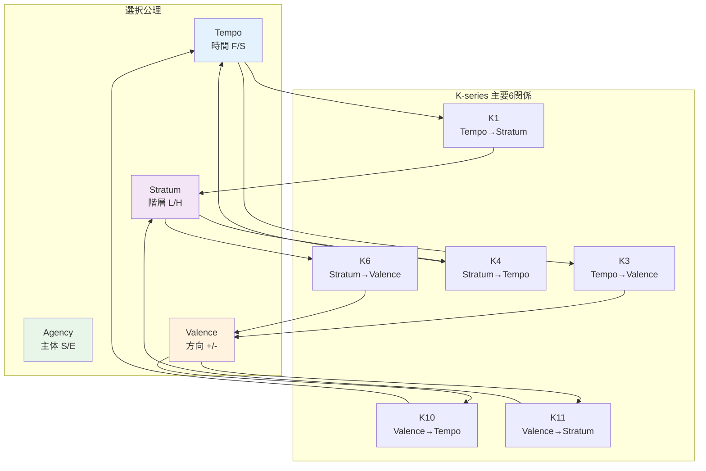

# X-K依存グラフ（K-series間依存関係）

> **Hegemonikón X-series**: Taxis（秩序）— K-series文脈定理間の関係

## Mermaid形式

## 依存関係一覧（優先6）

| ID | 軸 A → 軸 B | 問い | 優先度 |
|----|-------------|------|--------|
| K1 | Tempo → Stratum | 今すぐ/後で × 深く/浅く | **P1** |
| K3 | Tempo → Valence | 今すぐ/後で × 攻め/守り | **P2** |
| K4 | Stratum → Tempo | 深く/浅く × 今すぐ/後で | **P3** |
| K6 | Stratum → Valence | 深く/浅く × 攻め/守り | P4 |
| K10 | Valence → Tempo | 攻め/守り × 今すぐ/後で | P5 |
| K11 | Valence → Stratum | 攻め/守り × 深く/浅く | P6 |

## 発動条件 (k-series-activation.md 参照)

- **明示的**: `/k{N}` で指定
- **自動**: `context_ambiguity > 0.5` のとき最大2つ評価

## 用途

- **文脈判定**: T-series発動時に「どの状況か」を明確化
- **衝突解決**: 複数T-seriesが競合するときの調停

---
*Source: Claude Antigravity + kernel/kairos.md (2026-01-26)*
