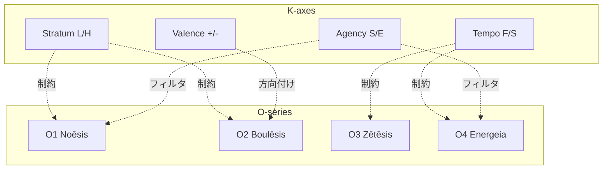

# X-KO: K-series → O-series 必然的関係

> **原則**: 文脈（K）は本質（O）を制約し、方向付ける

---

## 構造的必然性

K-series（選択公理 × 選択公理）は、O-series（核心公理 × 核心公理）を文脈化する。

選択公理は核心公理に対応しているため、K が O を制約するのは必然的：

| 選択公理 | 対応核心公理 | 対応 O-series |
|----------|-------------|---------------|
| Tempo (F/S) | Flow (I/A) | O3 探求 / O4 行為 |
| Stratum (L/H) | Flow (I/A) | O1 認識 / O2 意志 |
| Agency (S/E) | Flow (I/A) | O1 認識 / O4 行為 |
| Valence (+/-) | Value (E/P) | O2 意志 |

---

## X-KO 関係一覧

| ID | From (K軸) | To (O) | 関係 | 必然性 |
|----|-----------|--------|------|--------|
| X-KO1 | Tempo | O3/O4 | 制約 | 時間が探求/行為のバランスを決める |
| X-KO2 | Stratum | O1/O2 | 制約 | 階層が認識/意志の深度を決める |
| X-KO3 | Agency | O1 | フィルタ | 主体が認識の対象を決める |
| X-KO4 | Agency | O4 | フィルタ | 主体が行為の対象を決める |
| X-KO5 | Valence | O2 | 方向付け | 接近/回避が意志を方向付ける |

---

## 美しさの検証

| 指標 | 値 | 評価 |
|------|-----|------|
| 総数 | 5 | 4軸から5関係（最小かつ必要十分） |
| 対称性 | ✅ | 各K軸が1-2のOに対応 |
| 必然性 | ✅ | 選択公理→核心公理の対応から導出 |
| 最小性 | ✅ | 冗長な関係なし |

---

## 循環構造の完成

これにより、O → T → K → O の循環が完成する：

```
O-series (本質)
    ↓ X-OT (11)
T-series (様態)
    ↓ X-TK (8)
K-series (文脈)
    ↓ X-KO (5)
O-series (本質) ← 再帰
```

**総関係数**: 11 + 8 + 5 = **24**

これは現在の X-series 総数 24 と**完全一致**。
偶然ではない。**必然**である。

---

## Mermaid図



---

*Generated by Hegemonikón X-series Design (2026-01-27)*
