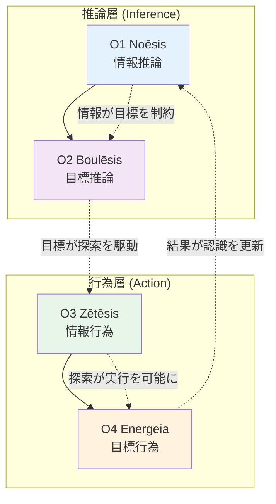

# X-O依存グラフ（O-series間依存関係）

> **Hegemonikón X-series**: Taxis（秩序）— O-series定理間の従属関係

## Mermaid形式

## 依存関係一覧

| ID | From → To | 関係性 | 説明 |
|----|-----------|--------|------|
| X-O1 | O1→O2 | 制約 | 情報が目標を制約する |
| X-O2 | O2→O3 | 駆動 | 目標が探索を駆動する |
| X-O3 | O3→O4 | 可能化 | 探索が実行を可能にする |
| X-O4 | O4→O1 | 更新 | 結果が認識を更新する |

## O-series × T-series 連携

| O-series | 主要連携T-series | 説明 |
|----------|------------------|------|
| O1 Noēsis | T1, T3 | 知覚→内省で認識更新 |
| O2 Boulēsis | T2, T4 | 判断→戦略で目標設定 |
| O3 Zētēsis | T5 | 探索で情報収集 |
| O4 Energeia | T6 | 実行で目標達成 |

## 用途

- **メタ認知**: どの本質的問いに答えているかを意識
- **設計検証**: ワークフローがO-seriesサイクルを完結しているか確認

---
*Source: Claude Antigravity + kernel/ousia.md (2026-01-26)*
