# X-Cross: シリーズ間関係定義

> **原則**: 美しさは偶然ではなく必然から生まれる

---

## X-OT: O-series → T-series 必然的関係

| ID | From | To | 記号 | 関係 | 必然性 |
|----|------|-----|------|------|--------|
| X-OT1 | O1 Noēsis | T1 Aisthēsis | ⇝ | 促進 | 認識は知覚から始まる |
| X-OT2 | O1 Noēsis | T3 Theōria | ↔ | 相互 | 認識と内省は相互依存 |
| X-OT3 | O2 Boulēsis | T2 Krisis | ⇝ | 促進 | 意志が判断を駆動 |
| X-OT4 | O2 Boulēsis | T4 Phronēsis | → | 因果 | 意志が戦略を規定 |
| X-OT5 | O3 Zētēsis | T5 Peira | ≡ | 同一 | 探求の様態的具現 |
| X-OT6 | O3 Zētēsis | T7 Dokimē | → | 因果 | 探求が検証を可能に |
| X-OT7 | O4 Energeia | T6 Praxis | ≡ | 同一 | 行為の様態的具現 |
| X-OT8 | O4 Energeia | T7 Dokimē | → | 因果 | 行為結果を検証 |
| X-OT9 | O4 Energeia | T8 Anamnēsis | → | 因果 | 行為結果を記憶 |

---

## X-TO: T-series → O-series 必然的関係（逆方向）

| ID | From | To | 記号 | 関係 | 必然性 |
|----|------|-----|------|------|--------|
| X-TO1 | T5 Peira | O1 Noēsis | → | 因果 | 探索結果が認識を更新 |
| X-TO2 | T8 Anamnēsis | O1 Noēsis | → | 因果 | 記憶が認識をフィルタリング |

---

## 美しさの検証

| 指標 | 値 | 評価 |
|------|-----|------|
| 総数 | 11 | 32通り中34%に絞り込み |
| 対称性 | ✅ | 各Oが1-3個のTに対応 |
| 必然性 | ✅ | 全関係に論理的根拠 |
| 最小性 | ✅ | 冗長な関係なし |

---

## Mermaid図

```mermaid
graph LR
    subgraph O-series
        O1[O1 Noēsis]
        O2[O2 Boulēsis]
        O3[O3 Zētēsis]
        O4[O4 Energeia]
    end
    
    subgraph T-series
        T1[T1 Aisthēsis]
        T2[T2 Krisis]
        T3[T3 Theōria]
        T4[T4 Phronēsis]
        T5[T5 Peira]
        T6[T6 Praxis]
        T7[T7 Dokimē]
        T8[T8 Anamnēsis]
    end
    
    O1 -.促進.-> T1
    O1 <-.相互.-> T3
    O2 -.促進.-> T2
    O2 --> T4
    O3 ==同一==> T5
    O3 --> T7
    O4 ==同一==> T6
    O4 --> T7
    O4 --> T8
    T5 --> O1
    T8 --> O1
```

---

*Generated by Hegemonikón X-series Design (2026-01-27)*
