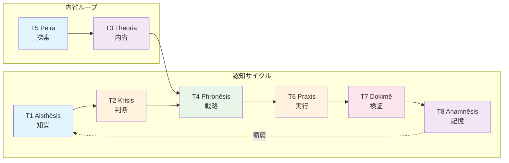

# X-T依存グラフ（T-series間依存関係）

> **Hegemonikón X-series**: Taxis（秩序）— 定理間の従属関係

## Mermaid形式

## 依存関係一覧

| ID | From → To | 関係性 | Workflow |
|----|-----------|--------|----------|
| X-T1 | T1→T2 | 因果 | `/boot` |
| X-T2 | T2→T4 | 因果 | `/plan` |
| X-T3 | T3→T4 | 促進 | `/think` |
| X-T4 | T4→T6 | 因果 | `/do` |
| X-T5 | T5→T3 | 促進 | `/src` |
| X-T6 | T6→T7 | 因果 | `/chk` |
| X-T7 | T7→T8 | 因果 | `/rev` |
| X-T8 | T8→T1 | 循環 | `/rec` |

## 用途

- **デバッグ**: 定理発動チェーンのトレース
- **監査**: 「なぜこの定理が発動したか」の説明
- **設計**: 新ワークフロー作成時の依存確認

---
*Source: Claude.ai (2026-01-26)*
