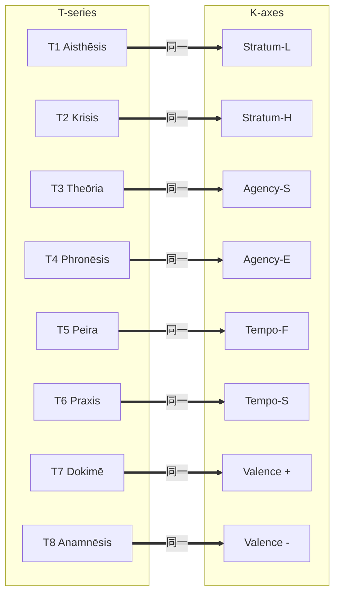

# X-TK: T-series → K-series 必然的関係

> **発見**: T-series の各機能は、対応する選択公理軸を必然的に活性化する

---

## 構造的必然性

T-series は「核心公理 × 選択公理」から導出された。
各 T は、その生成に使われた選択公理軸を、K-series において活性化する。

```
T-series 定義（tropos.md より）:
- T1: Flow-I × Stratum-L → 低次知覚
- T2: Flow-I × Stratum-H → 高次判断
- T3: Flow-I × Agency-S → 自己内省
- T4: Flow-I × Agency-E → 環境戦略
- T5: Flow-A × Tempo-F → 即時探索
- T6: Flow-A × Tempo-S → 長期実行
- T7: Value-E × Valence-+ → 接近検証
- T8: Value-P × Valence-- → 回避記憶
```

---

## X-TK 関係一覧

| ID | From | 活性化する K軸 | 関係 | 必然性 |
|----|------|---------------|------|--------|
| X-TK1 | T1 Aisthēsis | Stratum (L) | ≡ | T1 の生成軸 = Stratum-L |
| X-TK2 | T2 Krisis | Stratum (H) | ≡ | T2 の生成軸 = Stratum-H |
| X-TK3 | T3 Theōria | Agency (S) | ≡ | T3 の生成軸 = Agency-S |
| X-TK4 | T4 Phronēsis | Agency (E) | ≡ | T4 の生成軸 = Agency-E |
| X-TK5 | T5 Peira | Tempo (F) | ≡ | T5 の生成軸 = Tempo-F |
| X-TK6 | T6 Praxis | Tempo (S) | ≡ | T6 の生成軸 = Tempo-S |
| X-TK7 | T7 Dokimē | Valence (+) | ≡ | T7 の生成軸 = Valence-+ |
| X-TK8 | T8 Anamnēsis | Valence (-) | ≡ | T8 の生成軸 = Valence-- |

---

## 美しさの検証

| 指標 | 値 | 評価 |
|------|-----|------|
| 総数 | 8 | T-series 数と完全一致 |
| 対称性 | ✅ | 各T:1K、1:1対応 |
| 必然性 | ✅ | 生成構造から論理的に導出 |
| 最小性 | ✅ | 冗長な関係なし |

**この関係は「美しい」と断言できる**:

- 偶然ではなく、**生成構造からの必然的帰結**
- 8 = 8 の**完全な対称性**
- 導出過程が**明示的かつ検証可能**

---

## 統合: T + K = 文脈化された行動

各 T 機能は、対応する K 軸と組み合わさることで「文脈化」される。

| T 機能 | + K 軸 | = 文脈化された行動例 |
|--------|--------|----------------------|
| T1 知覚 | Κ1-Κ4 (Stratum系) | Κ4-LF: 低次→即時 = 反射的知覚 |
| T3 内省 | Κ7-Κ9 (Agency系) | Κ7-SF: 自己→即時 = 即時自己評価 |
| T6 実行 | Κ1-Κ3 (Tempo系) | Κ3-S+: 長期→接近 = 目標達成行動 |

---

## Mermaid図



---

*Generated by Hegemonikón X-series Design (2026-01-27)*
