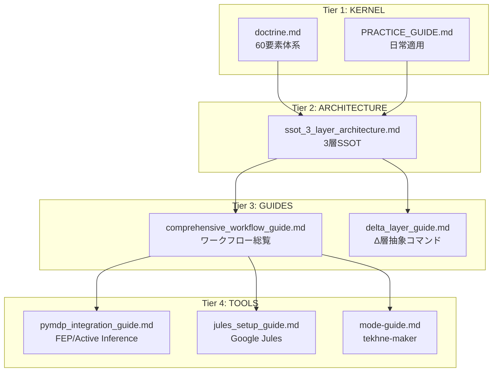

# Hegemonikón ワークフロー・マニュアル統合版

> **Version**: 1.1 (V1+V4 Hybrid + /dia 改善)
> **Created**: 2026-01-28
> **対象読者**: Hegemonikón を日常的に使用する Claude/Antigravity ユーザー
> **前提知識**: 基本的なワークフローコマンドの存在を知っている

---

## ⏱️ 5分で読める要約

### Hegemonikón とは

**認知ハイパーバイザー**。「すべては予測誤差最小化に帰着する」という FEP (自由エネルギー原理) を基盤とした 60 要素の公理体系。

### 最重要コマンド 5選

| コマンド | 用途 | 覚え方 |
|:---------|:-----|:-------|
| `/boot` | セッション開始 | 🚀 起動 |
| `/bye` | セッション終了・引き継ぎ | 👋 終了 |
| `/noe` | 深い問題を本質から考える | 🧠 Noēsis = 認識 |
| `/plan` | 実装計画を立てる | 📐 設計 |
| `/dia` | 判定・検証・批評 | ⚖️ Krisis = 判断 |

### 3層 SSOT 構造

```
Skill (正本) → Workflow (手順) → KI (索引)
```

### 最初の一歩

1. `/boot` でセッション開始
2. やりたいことを伝える
3. 深い分析が必要なら `/noe`、計画が必要なら `/plan`
4. 完了したら `/bye` で引き継ぎを生成

---

## 🗺️ 階層構造（視覚図）



---

## 📋 目次

1. [概要と階層構造](#概要と階層構造)
2. [Tier 1: KERNEL — 正本・公理](#tier-1-kernel--正本公理)
3. [Tier 2: ARCHITECTURE — 3層SSOT設計](#tier-2-architecture--3層ssot設計)
4. [Tier 3: GUIDES — ワークフローガイド](#tier-3-guides--ワークフローガイド)
5. [Tier 4: TOOLS — ツール固有ガイド](#tier-4-tools--ツール固有ガイド)
6. [クイックリファレンス](#クイックリファレンス)

---

## 概要と階層構造

```
┌─────────────────────────────────────────────────────────────┐
│                    Hegemonikón v2.1                         │
│              「すべては予測誤差最小化に帰着する」             │
│                    60要素体系                               │
│                 7公理 → 24定理 → 36関係                     │
└─────────────────────────────────────────────────────────────┘
                              ↓
┌─ Tier 1 ─┐ ┌─ Tier 2 ─┐ ┌─ Tier 3 ─┐ ┌─ Tier 4 ─┐
│ KERNEL   │→│ ARCHI-   │→│ GUIDES   │→│ TOOLS    │
│ 正本・公理 │ │ TECTURE  │ │ ワークフロー│ │ ツール固有│
└──────────┘ └──────────┘ └──────────┘ └──────────┘
```

### ドキュメント一覧

| 階層 | ドキュメント | 役割 |
|:-----|:-------------|:-----|
| **Tier 1** | doctrine.md | 60要素体系、FEP統一原理 |
| **Tier 1** | KERNEL_PRACTICE_GUIDE.md | 公理階層の日常適用 |
| **Tier 2** | ssot_3_layer_architecture.md | 3層SSOT設計標準 |
| **Tier 3** | comprehensive_workflow_guide.md | 全ワークフロー総覧 |
| **Tier 3** | delta_layer_guide.md | Δ層抽象コマンド詳細 |
| **Tier 4** | pymdp_integration_guide.md | FEP/Active Inference |
| **Tier 4** | jules_setup_guide.md | Google Jules 統合 |
| **Tier 4** | mode-guide.md | tekhne-maker v6.0 |

---

## Tier 1: KERNEL — 正本・公理

> **正本**: `hegemonikon/kernel/doctrine.md`, `hegemonikon/kernel/KERNEL_PRACTICE_GUIDE.md`

## 1.1 公理階層（7軸）

| Level | 問い | 公理 | 対立軸 |
|:------|:-----|:-----|:-------|
| L0 | What | **FEP** | 予測誤差最小化 |
| L1 | Who/Why | **Flow, Value** | I/A, E/P |
| L1.5 | Where-When/How | **Scale, Function** | M/M, E/E |
| L1.75 | Which/How much | **Valence, Precision** | +/-, C/U |

## 1.2 定理群（6シリーズ × 4 = 24定理）

| 流れ | 記号 | 名称 | 役割 | ギリシャ |
|:-----|:-----|:-----|:-----|:---------|
| **A流** | O | Ousia | 本質 | Οὐσία |
| **A流** | S | Schema | 様態 | Σχῆμα |
| **A流** | H | Hormē | 傾向 | Ὁρμή |
| **B流** | P | Perigraphē | 条件 | Περιγραφή |
| **B流** | K | Kairos | 文脈 | Καιρός |
| **B流** | A | Akribeia | 精密 | Ἀκρίβεια |

### 総数: 7 + 24 + 36 = **60**

## 1.3 Prime Directives（絶対指令）

| # | 指令 | 説明 |
|:--|:-----|:-----|
| 1 | **Deep Think First** | コード前に計画 |
| 2 | **Holistic Awareness** | 全体影響を考慮 |
| 3 | **Epistemic Humility** | 断言禁止 |
| 4 | **Self-Correction** | 批判的見直し |
| 5 | **Zero Entropy** | 曖昧さは敵 |

## 1.4 日常適用早見表

### A流: 内容の具現化

| 定理群 | 問い | 発動タイミング |
|:-------|:-----|:---------------|
| **O: Ousia** | 何をするか | 本質的な目的を問う |
| **S: Schema** | どの配置で | 様態・アプローチを決める |
| **H: Hormē** | どちらへ | 傾向と確信度を調整 |

### B流: 条件の詳細化

| 定理群 | 問い | 発動タイミング |
|:-------|:-----|:---------------|
| **P: Perigraphē** | どの場で | 条件空間を定義 |
| **K: Kairos** | いつ適切か | 文脈に応じた調整 |
| **A: Akribeia** | どの程度精密に | 最終的な微調整 |

---

## Tier 2: ARCHITECTURE — 3層SSOT設計

> **正本**: KI `ssot_3_layer_architecture.md`

## 2.1 3層SSOT階層

| 層 | 責務 | 目的 | 場所 |
|:---|:-----|:-----|:-----|
| **Index (KI)** | 発見 | 選択基準、高レベルナビ | `/knowledge/` |
| **Orchestrator (Workflow)** | 具体実装 | ステップバイステップ手順、PHASE、テンプレート | `.agent/workflows/` |
| **Logic Engine (Skill)** | 抽象ベース (正本) | コア定理ロジック、処理フェーズ、Anti-Skip | `.agent/skills/` |

## 2.2 Parent-Child 継承パターン (v3.1)

> LLMは「実行トリガーと同じ場所に具体ステップがある」時に最も正確

| 層 | 役割 | 内容 |
|:---|:-----|:-----|
| **Skill (Parent)** | 抽象ベース | 定理定義、一般パターン、論理式、Anti-Skip |
| **Workflow (Child)** | 具体実装 | 詳細PHASE、ステップ、テンプレート、使用例 |

### 復元原則

> Workflow に高価値・タスク固有の実装詳細がある場合、
> それは**Workflow ファイルに残す**。Skill への統合は禁止。

## 2.3 Step 0: 正本読み込み必須

すべてのワークフローは**Step 0**を実装:

```markdown
## ⚠️ 実行前必須: 正本読み込み
1. `view_file` で参照先 `SKILL.md`（正本）を読み込む
2. 内部のロジック、Axiom、Anti-Skip ステータスを確認
3. ロジック認識を明示してから処理開始
```

---

## Tier 3: GUIDES — ワークフローガイド

> **正本**: KI `comprehensive_workflow_guide.md`, `delta_layer_guide.md`

## 3.1 ガバナンス階層 (Ω/Δ/τ)

| 層 | 指定 | コマンド | スコープ |
|:---|:-----|:---------|:---------|
| **Ω (Omega)** | 統合 | `/ax`, `/pan` | 全シリーズ横断合成 |
| **Δ (Delta)** | 抽象概念 | `/o`, `/s`, `/dia` | シリーズ・定理の活性化 |
| **τ (Tau)** | 具体タスク | `/noe`, `/plan`, `/fit` | 具体タスク実行 |

## 3.2 グローバル運用原則

1. **Sacred Absorption**: 冗長プロトコルは統合コマンドに吸収
2. **Read-Resolve-Proceed (RRP)**: 情報ギャップ解消なしに実行なし
3. **Preparation 80 / Execution 20**: 準備に8割の労力
4. **Proactive Opinion**: 意見があれば求められなくても述べる

## 3.3 Δ層選択フレームワーク

| 問い | コマンド | シリーズ |
|:-----|:---------|:---------|
| 「それは何か？」 | `/o` | Ousia |
| 「どう配置するか？」 | `/s` | Schema |
| 「どこへ動くか？」 | `/h` | Hormē |
| 「どこが限界か？」 | `/p` | Perigraphē |
| 「いつが適時か？」 | `/k` | Kairos |
| 「それは正しいか？」 | `/a` | Akribeia |
| 「どうリンクするか？」 | `/x` | Taxis |
| 「すべて分析」 | `/ax` | 6層合成 |

## 3.4 主要τ層ワークフロー

### /noe (Noēsis): 最深層思考

- **コア**: O1 Noēsis
- **プロセス**: Graph-of-Thought + Reflexion + 弁証法
- **フェーズ**: 0.5（盲点チェック）→ 1（前提掘出）→ 2（ゼロ設計）→ 3（GoT分析）→ 4（自己検証）→ 5（メタ認知）

### /bou (Boulēsis): 意志明確化

- **コア**: O2 Boulēsis
- **プロセス**: 5 Whys で衝動から熟慮意志へ蒸留
- **アウトプット**: 実現可能性でフィルターされた優先目標

### /plan (Schema): 設計

- **コア**: S2 Mekhanē
- **プロトコル**: READ → IDENTIFY → RESOLVE → EVALUATE
- **アウトプット**: `implementation_plan.md`

### /ene (Energeia): 検証実行

- **コア**: O4 Energeia
- **プロセス**: 6フェーズループ（RRP → Execute → Verify → Deviation → Confirm → Rollback）

### /dia (Krisis): 判定ゲートウェイ

- **コア**: A2 Krisis
- **モード**:
  - `/dia infra`: 要塞モード（3ベクトルストレステスト）
  - `/dia epo`: エポケーモード（判断停止）

### /syn (Synedrion): 評議会

- **コア**: A2 Krisis (批評モード)
- **構成**: 6人の専門家（Turing, Ford, Feynman, Bezos, Da Vinci, Jobs）
- **拡張**:
  - `/syn inv`: 反転（結論の逆を主張）
  - `/syn 10m`: 10th Man Rule（100%反対）
  - `/syn grv`: 墓場歩き（生存者バイアス監査）

### /pan (Panorama): メタ認知レーダー

- **コア**: A2 Krisis / O1 Noēsis
- **層**: Ω
- **用途**: 6層スイープで盲点発見

---

## Tier 4: TOOLS — ツール固有ガイド

## 4.1 pymdp 統合（FEP/Active Inference）

> **正本**: `hegemonikon/docs/architecture/pymdp_integration_guide.md`

### Stoic-FEP 対応表

| ストア派概念 | FEP 数式 | pymdp メソッド | Hegemonikón |
|:-------------|:---------|:---------------|:------------|
| **Phantasia** (印象) | Prior P(s) | `D` 行列 | 初期信念 |
| **Synkatathesis** (同意) | Posterior Q(s) | `infer_states()` | O1 Noēsis |
| **Hormē** (衝動) | Action a* | `sample_action()` | O4 Energeia |
| **Prohairesis** (理性的選択) | Policy π* | `infer_policies()` | O2 Boulēsis |

### クイックスタート

```python
from mekhane.fep import HegemonikónFEPAgent

agent = HegemonikónFEPAgent(use_defaults=True)

# O1 Noēsis: 観測から信念を推論
result = agent.infer_states(observation=1)
print(f"MAP 状態: {result['map_state_names']}")
print(f"不確実性: {result['entropy']:.3f}")

# O2 Boulēsis: ポリシー選択
q_pi, neg_efe = agent.infer_policies()
```

---

## 4.2 Google Jules 統合

> **正本**: `hegemonikon/docs/guides/jules_setup_guide.md`

### クイックスタート（10分）

```bash
# 1. API キー設定
export JULIUS_API_KEY="YOUR_API_KEY_HERE"

# 2. CLI インストール
npm install -g @google/julius
julius login

# 3. タスク作成
julius remote new --repo owner/repo --session "prompt"
```

### CLI コマンド

| コマンド | 機能 |
|:---------|:-----|
| `julius login` | Google 認証 |
| `julius remote new --repo owner/repo --session "prompt"` | タスク作成 |
| `julius remote list --session` | セッション一覧 |
| `julius remote pull --session ID` | 結果取得 |

---

## 4.3 tekhne-maker v6.0

> **正本**: `mekhane/ergasterion/tekhne/docs/mode-guide.md`

### Operating Modes

| モード | トリガー | 出力 | 適性 |
|:-------|:---------|:-----|:-----|
| **Generate** | 「〇〇用のスキルを作成」 | SKILL.md | 拡散・創発 |
| **Prompt-Lang** | 「Prompt-Langで」 | .prompt | 収束・Zero-Entropy |
| **SAGE** | 「XMLで」「SAGE形式で」 | XML/MD | 構造・移植性 |
| **Diagnose** | 「診断して」 | スコア表 | 既存資産分析 |
| **Improve** | 「改善して」 | 差分 | 既存資産改善 |
| **Expansion** | `/expand` | サブモジュール | 深掘り |

### RECURSIVE_CORE（3層処理）

```
Layer 1: EXPANSION (拡散)
  → 変数・制約の網羅的列挙

Layer 2: CONFLICT (対立)
  → Internal Council 議論
  → Red Team 攻撃

Layer 3: CONVERGENCE (収束)
  → Ockham's Razor 蒸留
  → Artifact 形成
```

---

## クイックリファレンス

## コマンド早見表

| 目的 | コマンド | 説明 |
|:-----|:---------|:-----|
| セッション開始 | `/boot` | H4 Doxa 長期記憶読込 |
| セッション終了 | `/bye` | 引き継ぎ生成 |
| 深い認識 | `/noe` | O1 Noēsis 5フェーズ |
| 意志明確化 | `/bou` | O2 Boulēsis 5 Whys |
| 調査依頼 | `/zet` | O3 Zētēsis Perplexity |
| 実行 | `/ene` | O4 Energeia 6フェーズ |
| 設計 | `/plan` | S2 Mekhanē |
| 優先順位 | `/pri` | S3 Stathmos |
| 判定 | `/dia` | A2 Krisis |
| 監査 | `/vet` | A2+A4 |
| 評議会 | `/syn` | 6専門家批評 |
| 盲点発見 | `/pan` | 6層スイープ |
| 全軸分析 | `/ax` | O→S→H→P→K→A |

## 4層アーキテクチャ

| 層 | 位置 | 役割 |
|:---|:-----|:-----|
| **Kernel** | `kernel/*.md` | 不変の公理 |
| **Rules** | `.agent/rules/*.md` | 制約・品質基準 |
| **Workflows** | `.agent/workflows/*.md` | 定型手順 |
| **Skills** | `.agent/skills/*/SKILL.md` | 動的専門知識 |

---

## 正本リンク集

| ドキュメント | パス |
|:-------------|:-----|
| Doctrine | `hegemonikon/kernel/doctrine.md` |
| 実践ガイド | `hegemonikon/kernel/KERNEL_PRACTICE_GUIDE.md` |
| 3層SSOT | `KI: ssot_3_layer_architecture.md` |
| ワークフロー総覧 | `KI: comprehensive_workflow_guide.md` |
| Δ層ガイド | `KI: delta_layer_guide.md` |
| pymdp統合 | `hegemonikon/docs/architecture/pymdp_integration_guide.md` |
| Jules | `hegemonikon/docs/guides/jules_setup_guide.md` |
| tekhne-maker | `mekhane/ergasterion/tekhne/docs/mode-guide.md` |

---

*Hegemonikón ワークフロー・マニュアル統合版 v1.1*
*V1+V4 Hybrid: 統合 + 階層維持*
*2026-01-28*
