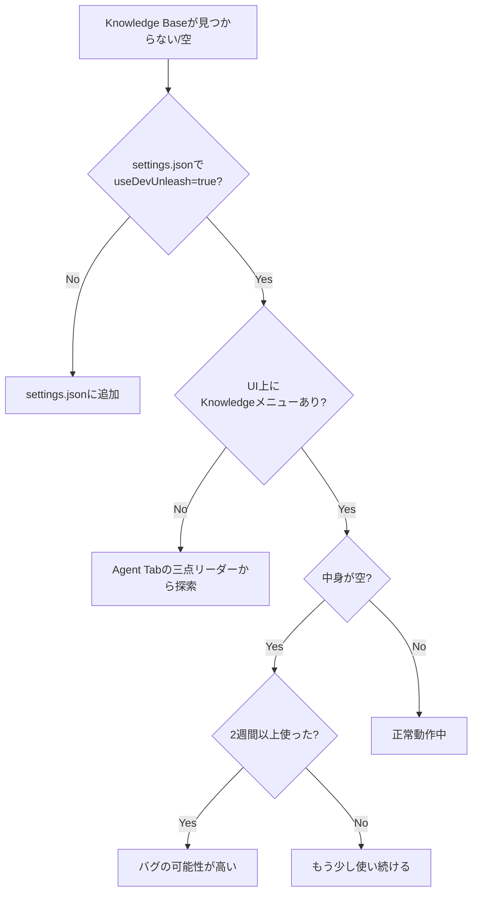

# Google Antigravity の `runtime/` / `antigravity/brain` ディレクトリ仕様と運用指針

## 結論サマリ

- `runtime/` 配下にある `antigravity/brain/` や `browser_recordings/` は、**ソースコードではなく Antigravity のローカル状態（キャッシュ＋ログ＋「記憶」用データ）**です。
- **削除自体は可能**で、Antigravity は次回起動時に必要なディレクトリを再生成します。ただし、
    - `brain/` を消すと「過去ミッションのタスク・計画・Walkthrough などのアーティファクト」が失われます。
    - `browser_recordings/` を消すとブラウザ操作の録画・スクリーンショットの再生ができなくなります。
- **保存場所は公式には設定変更できません**。Antigravity のドキュメントやユーザーガイドでも、保存先は `~/.gemini/antigravity` 固定であり、UI や `settings.json` / `argv.json` から切り替える方法は記載されていません。[^1_1][^1_2][^1_3][^1_4]
    - ディスク移動をしたい場合は、**OS レベルでシンボリックリンク（またはジャンクション）を張るのが事実上のベストプラクティス**として紹介されています。[^1_5]
- Git 的には、`runtime/` 以下は **完全にローカル状態**なので、**`.gitignore` で除外推奨**です。チーム開発でも共有すべきではありません。

以下、質問ごとに整理します。

***

## 1. 仕様の確認：`runtime/antigravity/brain/` は何か、削除はどこまで安全か

### 1-1. Antigravity が生成する主なローカルディレクトリ

公式・半公式ドキュメントを総合すると、Antigravity のローカルデータは原則として以下の構造になっています。[^1_6][^1_7][^1_2][^1_8][^1_9][^1_1][^1_5]

```text
~/.gemini/antigravity/
├── brain/               # 各会話・ミッションごとのアーティファクト (task.md, walkthrough.md 等)
├── knowledge/           # Knowledge Item (長期記憶用の要約) 
├── conversations/       # 暗号化された会話履歴 (.pb)
├── implicit/            # 暗号化された暗黙コンテキスト (.pb)
├── browser_recordings/  # ブラウザ操作の録画・スクリーンショット
├── mcp_config.json      # MCP サーバー設定
└── user_settings.pb     # 暗号化されたユーザー設定
```

Kerrick Long の Power User Guide でも同様の構造が説明されています。[^1_1]
日本語のレビュー記事や体験記でも、`task.md` / `implementation_plan.md` / `walkthrough.md` が `brain/<session_id>/` に保存されることが確認されています。[^1_7][^1_2][^1_9][^1_6]

ご質問の環境では、これと同じ構造が **プロジェクト直下の `runtime/antigravity/`** に出ている形です：

```text
<project-root>/
└── runtime/
    └── antigravity/
        ├── brain/
        ├── browser_recordings/
        └── ...（他の状態ファイル）
```

これは、

- HOME や実行ユーザーの設定によって、`~/.gemini/antigravity` が **ワークスペース（リポジトリ）配下にマップされている**
- もしくは VS Code / Cursor 版の Antigravity 拡張が、**ワークスペース相対の `runtime/` を Antigravity の「データルート」として使っている**

と考えるのが自然で、**中身の意味合いは `~/.gemini/antigravity` と同じ**と見て差し支えありません。

***

### 1-2. `brain/` に何が入っていて、消すと何が起きるか

`brain/` には **各会話・ミッションごとの「アーティファクト」**が入ります：[^1_2][^1_9][^1_6][^1_7][^1_1]

- `task.md`
    - 現在のタスクリストと進捗
- `implementation_plan.md`
    - 実装方針・設計・変更対象ファイルの一覧
- `walkthrough.md`
    - 何をどう変更し、ブラウザでどう検証したかの「手順書」＋録画へのリンク
- `*.resolved.N`
    - 上記ファイルのバージョン履歴[^1_1]

これらは **「人間が後から読んだり、再レビューするときのためのログ」**であり、コアな会話コンテキスト（暗号化された `.pb`）や Knowledge Item（`knowledge/`）とは分離されています。[^1_2][^1_5][^1_1]

**削除の影響は次の通りです：**


| 削除対象 | 影響 | 動作上の安全性 |
| :-- | :-- | :-- |
| `browser_recordings/` フォルダ | そのセッションのブラウザ録画・スクショが見られなくなるだけ。エージェントの動作には影響しない[^1_1][^1_6][^1_7][^1_2][^1_5] | ほぼ安全 |
| `brain/<session_id>/` の中身 | そのミッションの `task.md` / `implementation_plan.md` / `walkthrough.md` が消え、「過去の計画・手順」を後から参照できなくなる[^1_1][^1_2][^1_9] | 機能上は安全（記録喪失） |
| `brain/` 全体 | すべての会話・ミッションのアーティファクトが消え、過去タスクの計画書・証跡が見られなくなる。エージェント自体は起動・実行可能。 | 機能上は安全（履歴喪失） |
| `knowledge/` | 長期記憶（Knowledge Item）が失われ、過去の要約・方針を参照しなくなる[^1_1][^1_5] | 機能上は安全だが「長期記憶」がゼロに近くなる |
| `conversations/` / `implicit/` 等 | コア会話履歴・暗黙コンテキストがリセットされる。事実上「完全な新規インストール状態」に近づく[^1_1][^1_5] | アプリは再起動すれば動くが、全セッション履歴を失う |

Antigravity の公式チュートリアルやブログでは、「過去の会話を参照して」といった機能は主に `brain/` / `knowledge/` を検索して実現していると説明されています。[^1_2][^1_1]
一方、暗号化 `.pb` ファイルは人間からは読めず、削除しても単に「忘れた」状態になるだけとされています。[^1_5][^1_1]

したがって、

- **ディスク掃除目的だけなら、まず `browser_recordings/` を優先的に削除**
    - ブラウザ録画は 1 セッションで数百 MB〜GB と非常に重く、容量圧迫の主因です。[^1_5]
- `brain/` は、「過去の実装計画や Walkthrough を もう使わない」と割り切れるなら削除してかまいません。
- `knowledge/` や `conversations/` まで消すのは、「長期記憶も含めて一度まっさらな状態にしたい」時だけにした方が安全です。

***

### 1-3. `runtime/` 自体は削除してもよいか？

`runtime/` が Antigravity の「データルート」になっている場合、

- その中身は **すべて「そのマシン／そのワークスペース特有のキャッシュ＋状態＋記憶」**です。
- 公式フォーラムでも、障害時に `%APPDATA%/Antigravity/User/globalStorage/google.antigravity` やキャッシュディレクトリを消す「フルリセット」手順が案内されており、[^1_10]
これらを消してもアプリ自体は再起動後に自動再生成されます。

よって、

- **`runtime/` 全体を削除しても Antigravity は再起動時に再生成します。**
- ただし、その場合は
    - 当該ワークスペースに紐づく **すべてのアーティファクト・録画・長期記憶** が失われ、
    - 「過去のミッションを参照」「以前のタスクの Walkthrough を開く」といった操作はできなくなります。

**感覚的には「VS Code の `workspaceStorage` と `.vscode` を丸ごと消す」程度のインパクト**だと考えると分かりやすいと思います。

***

## 2. 設定変更：保存場所を変えられるか？

### 2-1. Antigravity / Gemini 公式設定で保存先を変える方法は？

現時点の公開ドキュメント・チュートリアル・Power User Guideを一通り見る限り、

- Antigravity 本体の設定（`Antigravity User Settings`）や
- VS Code 互換の `settings.json`、
- Gemini CLI の設定 (`~/.gemini/settings.json`, `.gemini/settings.json`)[^1_11]

のいずれにも、**`~/.gemini/antigravity`（あるいはそれに相当する「ランタイムディレクトリ」）の場所を直接変更するオプションは存在しません**。[^1_3][^1_4][^1_12][^1_1][^1_2]

また、ユーザー体験記でも、

> 「Antigravity 自体には設定画面で保存先を変更する機能が提供されていない場合が多い」
> 「そのため、OS のシンボリックリンク機能で実体を外部ディスクに逃がすのが確実」と明記

と書かれており、**公式としても「アプリ側で場所を変える」のではなく OS 側でパスを偽装するのを前提にしている**と読めます。[^1_5]

したがって：

- `argv.json` や `settings.json` で **ランタイム保存先を変える正式な方法は「現状ない」**と考えてよいです。

***

### 2-2. 実務的な回避策：シンボリックリンクで退避

ディスク圧迫を避けるための実用的なテクニックとして、以下のような手順が紹介されています。[^1_5]

#### macOS / Linux の例

1. Antigravity を終了する。
2. 既存のランタイムディレクトリを外部ディスクに移動：

```bash
mv ~/.gemini/antigravity /Volumes/BIGDISK/antigravity-data
# あるいは、今の構成なら
mv <project-root>/runtime/antigravity /Volumes/BIGDISK/antigravity-data
```

3. 元の場所にシンボリックリンクを張る：

```bash
ln -s /Volumes/BIGDISK/antigravity-data ~/.gemini/antigravity
# プロジェクト配下の場合
ln -s /Volumes/BIGDISK/antigravity-data <project-root>/runtime/antigravity
```

4. Antigravity を再起動。

アプリからは `~/.gemini/antigravity`（or `runtime/antigravity`）に書いているつもりでも、
実体は外部ディスク側に置かれるため、**内蔵ディスクの圧迫を避けつつ動作を維持**できます。[^1_5]

#### Windows の例（`mklink /D`）

1. Antigravity を終了。
2. 既存のディレクトリを D: ドライブ等に移動：

```powershell
move "%UserProfile%\.gemini\antigravity" "D:\antigravity-data"
# プロジェクト内 runtime の場合
move "<project-root>\runtime\antigravity" "D:\antigravity-data"
```

3. 管理者権限の PowerShell でジャンクションを作成：

```powershell
mklink /D "%UserProfile%\.gemini\antigravity" "D:\antigravity-data"
# プロジェクト内 runtime の場合
mklink /D "<project-root>\runtime\antigravity" "D:\antigravity-data"
```

4. Antigravity を再起動。

> 注意:
> - **シンボリックリンクのルート（`runtime/` そのもの）を Git 管理外にする**ことで、
>   誤って巨大データの実体やリンクをリポジトリに混入させないようにするのがおすすめです。

***

### 2-3. 「プロジェクトルート以外に置きたい」場合の現実的な選択肢

ご質問の「`runtime/` をそもそもプロジェクトルートに作ってほしくない」に近づく方法は、次の 2 つです。

1. **HOME を通常のユーザホームに戻し、Antigravity にプロジェクトフォルダだけを「ワークスペース」として開かせる。**
    - Dev Container やリモート開発環境によっては、HOME がワークスペース直下になっており、その結果 `~/.gemini/antigravity` 相当が `./runtime/antigravity` に来ているケースがあります。[^1_12]
    - その場合は、コンテナの `HOME` やマウント構成を調整して、「ホームディレクトリ ≠ プロジェクトルート」にするのが根本対策です。
2. **`runtime/` をプロジェクト直下に残しつつ、中身だけ別ドライブにシンボリックリンクで逃がす。**
    - これは上記 2-2 のパターンです。
    - リポジトリ的には `runtime/` を `.gitignore` で完全に無視しつつ、ファイルシステム上では Antigravity がそこに書き出す、という折衷案です。

現時点の仕様では、**「Antigravity の UI 設定だけで、ランタイムデータを `/tmp/` や別ドライブに逃がす」ことはできない**と考えてよいです。

***

## 3. ベストプラクティス：Git 管理とチーム開発での扱い

### 3-1. Git 管理すべきか？ → **基本的に「しない」前提**

`brain/` / `browser_recordings/` などのランタイムディレクトリは、

- 各ユーザ・各マシン固有の状態であり、
- 実行ログ・録画・思考過程（CoT）といった **一時情報 \& 大容量ファイル** を大量に含み、[^1_5]
- 中にはブラウザ操作ログや、環境によっては認証フロー・機密画面のキャプチャ等を含み得ます。[^1_13][^1_6][^1_7][^1_2]

また、Antigravity では **`.gitignore` に含まれるファイルを「デフォルトでは AI が触らない」**という安全設計があり、[^1_14]
`.gitignore` をセキュリティバリアとして利用することが推奨されています。[^1_14][^1_11]

これらを踏まえると、実務的には次の方針が合理的です：

- `runtime/` や `~/.gemini/antigravity` 相当のディレクトリは、**Git では管理しない（完全にローカル）**。
- 共有したいのは、
    - `.agent/rules/` / `.agent/workflows/` といった **ルール・ワークフロー**、[^1_15][^1_16][^1_3]
    - プロジェクト固有のコード・設定ファイルのみ。


### 3-2. 推奨 `.gitignore` 設定例

プロジェクト直下に `runtime/` が生成される前提での一例です：

```gitignore
# Antigravity runtime data (brain, browser recordings, caches, etc.)
runtime/
runtime/**

# （もし存在する場合）Antigravity 固有のローカル設定
.antigravity/
.antigravity/**

# Gemini CLI / Antigravity 連携で使うローカル設定（必要に応じて）
.gemini/
.gemini/**

# VS Code / Antigravity ベースのエディタ設定（チームポリシー次第）
# .vscode/
# .vscode/**
```

ポイント：

- **`runtime/` 全体を無条件で除外**するのが最も安全です。
- `.agent/` は「チームで共有したい設定」（ルール・ワークフロー）なので、**基本は Git 管理対象**にします。[^1_16][^1_15][^1_3]
- `.vscode/` をどうするかはチーム文化次第ですが、Antigravity 自体が VS Code 互換であることを踏まえると、
共同で合わせたい設定だけ明示的にコミットし、それ以外は `.gitignore` で除外するパターンが一般的です。

***

### 3-3. チーム開発での扱い

チーム開発時には、次のような運用が望ましいです：

1. **「何が共有され、何がローカルか」を明示する**
    - 共有：`.agent/rules/`, `.agent/workflows/`, プロジェクト設定、コードベース。
    - ローカル：`runtime/`, `~/.gemini/antigravity`, ブラウザ録画、個々人の Knowledge Items など。
2. **セキュリティ観点での整理**
    - `.gitignore` に含まれるファイルは、デフォルトで Antigravity が触らない設定になっていることを理解し、[^1_11][^1_14]
    - `.env` やシークレット、機密ドキュメントなどは `.gitignore` / `.geminiignore` 双方で確実に除外する。
3. **容量管理のルールを決める**
    - 例えば、**`browser_recordings/` は毎週自動削除するスクリプトを各自が cron / タスクスケジューラで回す**。
    - 長期間保持したいセッションだけ、必要に応じて `brain/<session_id>/` を別リポジトリやドキュメント管理ツールにエクスポートする。
4. **「AI が参照してよいファイル範囲」をチームで合意**
    - `.gitignore` と `Agent GitIgnore Access` 設定を揃えることで、[^1_14]
「Git に入っていないものは AI も触らない」という分かりやすいルールにしてしまうのが一案です。

***

## まとめ：ご質問への端的な回答

1. **`runtime/` ディレクトリは削除しても良いか？**
    - はい。Antigravity は次回起動時に必要なディレクトリを再生成します。
    - ただし `runtime/antigravity/brain/` や `browser_recordings/` 内の
        - 過去のタスク計画 (`task.md` / `implementation_plan.md` / `walkthrough.md`)
        - ブラウザ録画・スクリーンショット
は失われます。[^1_9][^1_6][^1_7][^1_1][^1_2][^1_5]
    - アプリが壊れるわけではなく、「記憶・証跡を失った新規状態」になります。
2. **`runtime/antigravity/brain/` を失うと何に影響するか？**
    - 過去ミッションの
        - タスクリスト
        - 実装計画
        - Walkthrough（何をどう変更し、どうテストしたか）
を人間が後から読めなくなります。[^1_9][^1_1][^1_2]
    - 長期記憶（Knowledge Items）は通常 `knowledge/` 側なので、そちらを残せば「要約レベルの記憶」は残るケースが多いです。[^1_1][^1_5]
3. **保存場所をプロジェクトルート以外に変えられるか？**
    - Antigravity / Gemini CLI の公式設定 (`settings.json`, `argv.json` など) には、そのようなオプションはありません。[^1_4][^1_3][^1_11][^1_2][^1_1]
    - 実務的には、**OS レベルのシンボリックリンク／ジャンクションで `runtime/antigravity` の実体を別ドライブに退避する**のが推奨パターンです。[^1_5]
4. **`.gitignore` に入れるべきか？**
    - はい。`runtime/` 以下は完全にローカル状態かつ大容量になりやすく、Git で共有する価値はほぼありません。
    - チーム開発では、以下のような `.gitignore` 設定を推奨します：

```gitignore
# Antigravity runtime data
runtime/
runtime/**
```

    - `.agent/` やソースコードは Git 管理対象、それ以外のランタイムデータはローカル専用、という線引きが現実的です。

***

もし、「このプロジェクトだけは過去の Walkthrough も含めて長期保存したい」といったニーズがあれば、

- `brain/<重要な session_id>/` だけを別フォルダにコピーしてバージョン管理する、
- もしくは Antigravity 上で開いた `task.md` / `walkthrough.md` をナレッジベース（社内 Wiki 等）に移管する、

といった運用設計も考えられます。その場合の構成案も必要であれば整理できます。
<span style="display:none">[^1_100][^1_101][^1_102][^1_103][^1_104][^1_105][^1_106][^1_107][^1_108][^1_109][^1_110][^1_111][^1_112][^1_113][^1_114][^1_115][^1_116][^1_17][^1_18][^1_19][^1_20][^1_21][^1_22][^1_23][^1_24][^1_25][^1_26][^1_27][^1_28][^1_29][^1_30][^1_31][^1_32][^1_33][^1_34][^1_35][^1_36][^1_37][^1_38][^1_39][^1_40][^1_41][^1_42][^1_43][^1_44][^1_45][^1_46][^1_47][^1_48][^1_49][^1_50][^1_51][^1_52][^1_53][^1_54][^1_55][^1_56][^1_57][^1_58][^1_59][^1_60][^1_61][^1_62][^1_63][^1_64][^1_65][^1_66][^1_67][^1_68][^1_69][^1_70][^1_71][^1_72][^1_73][^1_74][^1_75][^1_76][^1_77][^1_78][^1_79][^1_80][^1_81][^1_82][^1_83][^1_84][^1_85][^1_86][^1_87][^1_88][^1_89][^1_90][^1_91][^1_92][^1_93][^1_94][^1_95][^1_96][^1_97][^1_98][^1_99]</span>

<div align="center">⁂</div>

[^1_1]: https://kerrick.blog/posts/2026/a-power-user-guide-for-google-antigravity/

[^1_2]: https://qiita.com/yokko_mystery/items/bb5615ebcd385a597c41

[^1_3]: https://codelabs.developers.google.com/getting-started-google-antigravity

[^1_4]: https://codelabs.developers.google.com/getting-started-google-antigravity?hl=ja

[^1_5]: https://note.com/honest_kudu5817/n/ndcdc33f2538f

[^1_6]: https://yinlei.org/it-iot/2025/11/google-antigravity.html

[^1_7]: https://zenn.dev/nakaken_unionai/articles/422cfdbe003cb1

[^1_8]: https://zenn.dev/nono0601/articles/a2ca2a36bd735f

[^1_9]: https://qiita.com/imp555sti/items/249aa797e0c884d04d81

[^1_10]: https://discuss.ai.google.dev/t/antigravity-broken-getting-only-agent-execution-terminated-due-to-error/115443?page=12

[^1_11]: https://geminicli.com/docs/get-started/configuration/

[^1_12]: https://dev.classmethod.jp/articles/google-antigravity-five-tips/

[^1_13]: https://gigazine.net/news/20251126-google-antigravity-exfiltrates-data/

[^1_14]: https://note.com/ha_chi_co/n/n03d1fe690838

[^1_15]: https://note.com/alert_clam1640/n/n747b6cf120f4

[^1_16]: https://unikoukokun.jp/n/n543f089015d4

[^1_17]: https://arxiv.org/pdf/1705.05937.pdf

[^1_18]: http://arxiv.org/pdf/2412.00707.pdf

[^1_19]: https://arxiv.org/ftp/arxiv/papers/2309/2309.07671.pdf

[^1_20]: https://arxiv.org/pdf/2411.07479.pdf

[^1_21]: https://cloud-ace.jp/column/detail532/

[^1_22]: https://zenn.dev/minedia/articles/cc718542d8cc73

[^1_23]: https://skywork.ai/blog/agent/antigravity-model-loading-error-jp/

[^1_24]: https://note.com/genelab_999/n/n49ec329c2fd6

[^1_25]: https://qiita.com/GIFCat/items/8f1a58ad93858aab241f

[^1_26]: https://www.facebook.com/groups/gaitech/posts/1492780538572823/

[^1_27]: https://www.linkedin.com/posts/tigerh_ai-antigravity-cursor-activity-7417618783999287296-EwNS

[^1_28]: https://www.reddit.com/r/ChatGPTCoding/comments/1p35bdl/i_tried_googles_new_antigravity_ide_so_you_dont/

[^1_29]: https://www.youtube.com/watch?v=DWtIkPwIsLY

[^1_30]: https://hackai.cyand.co.jp/news/google-antigravity-guide/

[^1_31]: https://www.issoh.co.jp/tech/details/10391/

[^1_32]: https://qiita.com/hayuse/items/28d8716a8b5fd6ac91fe

[^1_33]: https://zenn.dev/iwatagumi/articles/9d143653579ab8

[^1_34]: https://arxiv.org/abs/2511.20570

[^1_35]: https://ieeexplore.ieee.org/document/11192435/

[^1_36]: https://rsisinternational.org/journals/ijrsi/view/machine-learning-augmented-neurosymbolic-agenticops-framework-for-runtime-verification-and-enforcement-of-standard-operating-procedures

[^1_37]: https://arxiv.org/abs/2508.09649

[^1_38]: https://arxiv.org/abs/2504.14411

[^1_39]: https://ieeexplore.ieee.org/document/10922209/

[^1_40]: https://ieeexplore.ieee.org/document/10984690/

[^1_41]: https://ieeexplore.ieee.org/document/11241965/

[^1_42]: https://arxiv.org/abs/2408.00640

[^1_43]: https://ieeexplore.ieee.org/document/11290072/

[^1_44]: https://pmc.ncbi.nlm.nih.gov/articles/PMC4884200/

[^1_45]: https://pmc.ncbi.nlm.nih.gov/articles/PMC10494950/

[^1_46]: https://pmc.ncbi.nlm.nih.gov/articles/PMC3392276/

[^1_47]: https://pmc.ncbi.nlm.nih.gov/articles/PMC11370317/

[^1_48]: https://pmc.ncbi.nlm.nih.gov/articles/PMC5610662/

[^1_49]: https://pmc.ncbi.nlm.nih.gov/articles/PMC5121637/

[^1_50]: https://pmc.ncbi.nlm.nih.gov/articles/PMC5460234/

[^1_51]: https://pmc.ncbi.nlm.nih.gov/articles/PMC4046318/

[^1_52]: https://www.reddit.com/r/google/comments/1p10ev8/has_anyone_tried_antigravity_by_google_thoughts/

[^1_53]: https://skywork.ai/blog/agent/antigravity-model-loading-error/

[^1_54]: https://www.remio.ai/post/google-antigravity-technical-review-the-first-true-agentic-ide-powered-by-gemini-3-pro

[^1_55]: https://seroter.com/2025/11/30/go-from-prompt-to-production-using-a-set-of-ai-tools-or-just-one-google-antigravity/

[^1_56]: https://news.ycombinator.com/item?id=45967814

[^1_57]: https://orendra.com/blog/google-antigravity-is-this-the-cursor-killer-weve-been-waiting-for/

[^1_58]: https://www.reddit.com/r/Bard/comments/1p120oz/antigravity_cant_access_files/

[^1_59]: https://mindgard.ai/blog/google-antigravity-persistent-code-execution-vulnerability

[^1_60]: https://stackoverflow.com/questions/67920055/superfluous-runtimes-folder-created-in-output-directory-for-net-5-project

[^1_61]: https://www.zeniteq.com/google-launches-antigravity-an-agentic-ai-coding-platform

[^1_62]: https://discuss.ai.google.dev/t/feature-request-native-devcontainer-support-in-antigravity/110492

[^1_63]: https://dev.classmethod.jp/articles/gemini-enterprise-agent-hubspot-oauth/

[^1_64]: https://www.linkedin.com/posts/abhinavguptas_tired-of-maintaining-separate-rule-files-activity-7404508332474056706-q8vS

[^1_65]: https://www.youtube.com/watch?v=2c11BL9Xorc

[^1_66]: https://note.com/munakata_souri/n/nb7e6c3ea605e

[^1_67]: https://discuss.ai.google.dev/t/bug-antigravity-agent-manager-conversation-history-exists-on-remote-host-but-is-not-listed-or-creatable-after-latest-update-remote-ssh-mac-ubuntu/112857

[^1_68]: https://www.reddit.com/r/google_antigravity/comments/1p82or6/google_antigravity_just_deleted_the_contents_of/

[^1_69]: https://lobechat.com/discover/mcp/junkei-okinawa-testing-freecad-mcp-with-antigravity

[^1_70]: https://ieeexplore.ieee.org/document/11045587/

[^1_71]: https://ieeexplore.ieee.org/document/8425251/

[^1_72]: https://ieeexplore.ieee.org/document/9566822/

[^1_73]: http://ieeexplore.ieee.org/document/6267884/

[^1_74]: http://ieeexplore.ieee.org/document/6041536/

[^1_75]: https://arxiv.org/abs/2505.18286

[^1_76]: https://ieeexplore.ieee.org/document/11210045/

[^1_77]: https://arxiv.org/abs/2506.11124

[^1_78]: https://iopscience.iop.org/article/10.1088/2631-8695/ada51d

[^1_79]: https://www.semanticscholar.org/paper/e8edf33252e2b6d59281ecfbb232c263bffc0d07

[^1_80]: http://arxiv.org/pdf/2404.05563.pdf

[^1_81]: http://arxiv.org/pdf/2409.18145.pdf

[^1_82]: https://arxiv.org/html/2401.10954v2

[^1_83]: http://arxiv.org/pdf/2112.01508.pdf

[^1_84]: https://arxiv.org/html/2406.03374v1

[^1_85]: http://arxiv.org/pdf/2401.01982.pdf

[^1_86]: https://arxiv.org/pdf/2010.03567.pdf

[^1_87]: https://arxiv.org/html/2405.05038v3

[^1_88]: https://qiita.com/chi1180/items/09fdbf69d035736f33ba

[^1_89]: https://github.com/ricardodeazambuja/browser-mcp-server

[^1_90]: https://alokbishoyi.com/blogposts/reverse-engineering-browser-automation.html

[^1_91]: https://github.com/BACH-AI-Tools/chrome-devtools-mcp

[^1_92]: https://help.apiyi.com/google-antigravity-ai-ide-beginner-guide-2025-en.html

[^1_93]: https://libraries.io/npm/@defai.digital%2Fagent-domain/13.1.15

[^1_94]: https://www.reddit.com/r/GoogleAntigravityIDE/comments/1prq131/is_google_antigravity_viable_as_a_production/

[^1_95]: https://www.reddit.com/r/google_antigravity/comments/1q684rm/i_built_a_bionic_os_on_top_of_antigravity_to_fix/

[^1_96]: https://qiita.com/chi1180/items/c3c1760720a04a3174cd

[^1_97]: https://www.npmjs.com/package/next-devtools-mcp

[^1_98]: https://blog.g-gen.co.jp/entry/update-in-this-month-2025-11

[^1_99]: https://zenn.dev/cloud_ace/articles/a350a583498aa3

[^1_100]: https://forest.watch.impress.co.jp/docs/serial/yaaiwatch/2078823.html

[^1_101]: https://qiita.com/shunsukuda/items/ae82689c815d407b6726

[^1_102]: https://blog.usize-tech.com/antigravity-gemini3-app-development/

[^1_103]: https://ximix.niandc.co.jp/blog/playing-with-cats-using-cline-and-gemini3

[^1_104]: https://zenn.dev/kun432/scraps/3db3cc0de8bb1e

[^1_105]: http://arxiv.org/pdf/2407.10812.pdf

[^1_106]: https://arxiv.org/pdf/2207.12087.pdf

[^1_107]: https://dl.acm.org/doi/pdf/10.1145/3652024.3665510

[^1_108]: https://arxiv.org/abs/0911.1112

[^1_109]: https://arxiv.org/pdf/2202.08409.pdf

[^1_110]: https://arxiv.org/pdf/2005.09057.pdf

[^1_111]: http://arxiv.org/pdf/2212.10131.pdf

[^1_112]: https://www.facebook.com/groups/gaitech/posts/1575840863600123/

[^1_113]: https://github.com/google-gemini/gemini-cli/issues/14546

[^1_114]: https://www.youtube.com/watch?v=iyTidjEucoc

[^1_115]: https://github.com/elad12390/antigravity-proxy/blob/master/.gitignore

[^1_116]: https://www.facebook.com/groups/vibecodinglife/posts/1916913928897135/


---

## 結論：Knowledge Item は「長期記憶用のローカル知識ベース」。ただし現状はややブラックボックス寄り

- `knowledge/` は Antigravity の「Knowledge Base（知識ベース）」機能のローカル保存先で、
**タスクから抽出されたパターン・方針・規約などを要約して溜める “長期記憶ストレージ”** という位置づけです。[^2_1][^2_2][^2_3]
- Antigravity は会話や Artifact（task.md, implementation_plan.md, walkthrough.md 等）を解析して、
**自動で Knowledge Item（以下 KI）を生成・更新する仕組みを持っている**と公式には説明されています。[^2_4][^2_3][^2_1]
- ただし現時点（2026年初頭）のユーザー報告を見ると、
    - 「ドキュメントには書いてあるが、自動で KI が増えているのを体感できない」という声も多く、[^2_5][^2_4]
    - どのタイミングで何が保存され、どう参照されているかは **かなりブラックボックス寄り**です。
- **UI 上から Knowledge Base を閲覧・編集・エクスポートすることはできる**（Settings → Knowledge Base）という記述があり、[^2_1]
その意味では「機能としては存在し、ある程度は利用可能」ですが、
    - プロンプトから「この内容を KI に保存して」「この KI を参照して」といった**細かい制御は現状できません**。

以下、「何が入るか」「どう作られるか」「どう効くはずか」「実際どう使うのが現実的か」を整理します。

***

## 1. Knowledge Item / `knowledge/` の正体

### 1-1. 概念的な位置づけ

公式ガイドやレビューでは、Knowledge Base / Knowledge Items は概ね次のような役割と説明されています。[^2_2][^2_3][^2_6][^2_1]

- **長期記憶 (Long-term memory)**：
    - 「タスク 1 では細かく指示が要る → タスク 5 ではスタイルを理解し始める → タスク 10 では好みを自動反映 → タスク 50 では完全にプロジェクトに適応」
という “慣れ” を実現する仕組みとして紹介されています。[^2_2][^2_1]
- **学習内容の種類**：[^2_3][^2_1]
    - コードパターン（よく使う設計パターン、エラーハンドリングの流儀など）
    - プロジェクト標準（命名規約、ディレクトリ構成、コメントスタイルなど）
    - UI/UX の好み（フォームのバリデーション方式、トーストの出し方・タイミング など）
- **内部構造（概念レベル）**：
    - 各 KI は「タイトル」「サマリ」「関連 Artifact へのリンク」等を持つ単位として説明されています。[^2_3]
    - これらが `knowledge/` ディレクトリ以下にローカル保存され、エージェントが後続タスクで再利用する、という形です。[^2_1][^2_3]


### 1-2. `knowledge/` ディレクトリの役割

- `knowledge/` は、この Knowledge Base の**実体ストレージ（ローカル DB 的なもの）**と考えてよいです。
- 公式ヘルプでは、Knowledge Base の保存先に関して次のような記述があります。[^2_1]

> ✓ Local Knowledge Base storage (Not uploaded to Google Services)
> ✓ Settings → Privacy: Knowledge Base storage: Local / Cloud

つまり：
    - **標準ではローカル保存**で、`knowledge/` 下に格納される。
    - Privacy 設定で **Local / Cloud** どちらに置くかを切り替えられる UI がある（Cloud の場合は Google 側ストレージも利用）。
- 実務上は、`knowledge/` を直接編集するのではなく、
    - Antigravity の UI（Settings → Knowledge Base など）で閲覧・編集、
    - もしくはエクスポート機能でまとめて出し入れする
という使い方が前提になっています。[^2_1]

***

## 2. Knowledge Item はどうやって作られるか

### 2-1. 自動生成の仕組み（理想形）

公式ドキュメントおよびコミュニティの説明では、KI の生成は基本的に **自動**です。[^2_4][^2_3][^2_1]

- ドキュメント上の説明（要約）：[^2_4]
    - Agent とのやり取りや Artifact を解析して、
        - 新しいルール・パターンを検出すると **新規 KI** を作成
        - 既存の KI と似た内容であれば、その KI を **更新** する
    - これが**セッションをまたいで有効**で、「プロジェクトに詳しくなっていく」という体験を実現する。
- ベンチマーク記事の説明：[^2_3]
    - IDE の利用に伴い、「重要なインサイト、パターン、解決策」を自動的に KI として蓄積する。
    - 各 KI はタイトル・要約・関連 Artifact を持ち、将来のセッションから参照される。


### 2-2. ユーザー UI からの手動管理

あるチュートリアルでは、次のような操作が示されています。[^2_1]

- `Settings → Knowledge Base` で、AI が学習した Knowledge を一覧表示：
    - 例：
        - 「ログインフォームには常に『パスワードを記憶』オプションを付ける」
        - 「Form validation には Zod を使う」
        - 「ログイン成功時には Toast を出す」
- そこからできること：
    - エントリの編集
    - 間違った知識の削除
    - プロジェクト標準を手動で追加
    - Knowledge Base のエクスポート（チーム共有用）

つまり、「自動で溜まるメモ帳」だけでなく、**半手動で “プロジェクト標準ノート” を構築する UI** が用意されている、という位置づけです。[^2_1]

***

## 3. Knowledge Item はどう使われる想定か

### 3-1. エージェントから見た使われ方（設計上）

設計意図としては、次のようなフローが想定されています。[^2_2][^2_3][^2_1]

1. **新しいタスク開始時**：
    - ワークスペースやプロジェクトをキーに、関連する KI を検索・ロード。
    - 「このプロジェクトではフロントは React + Tailwind」「バリデーションは常に Zod」「認証はこのフロー」などのルールを内部コンテキストに注入。
2. **設計・実装フェーズ**：
    - コードを生成するときに、KI を参照して「いつも通り」のスタイルを自動で選択。
    - 例えば：
        - API クライアントは常に `axios` ではなく `fetch` にする
        - ロギングは `console.log` ではなくプロジェクト固有の `logger` を使う 等。
3. **新しい KI の蓄積**：
    - ユーザーが繰り返しフィードバックするうちに、
        - 「こういうときはこう書いてほしい」というパターンが KI として追加・更新される。
    - 次のタスクでは、そのパターンが自動的に適用され、「毎回説明しなくてよくなる」。

ガイド記事では、これを **「タスク 1〜50 を通じて AI がプロジェクトに馴染んでいく」** というストーリーで紹介しています。[^2_2][^2_1]

***

## 4. 実情：現時点でどこまで「使える」と言えるか？

### 4-1. コミュニティ報告：動いているかよく分からない問題

Reddit の `r/google_antigravity` では、Knowledge Item に関してかなり率直なスレッドがあります。[^2_5][^2_4]

- 「Knowledge Items という機能がドキュメントに書いてあるが、**実際に使われているのを見たことがない**」という投稿。[^2_4]
- 「system prompt や tool 定義を見ても、Knowledge Items を明示的に呼び出している痕跡がない」との指摘。[^2_4]
- 別スレでは、「Knowledge Items is supposed to be the memory system, but I’ve never seen it used.」というコメントもあります。[^2_5]

また、Antigravity の利用者の中には、

- cross-workspace memory（ワークスペースをまたいで “変な癖” が残る）を嫌って、`.gemini/antigravity` 以下を全部削除してリセットしているケース、[^2_7]

なども報告されており、「長期記憶まわりはまだ挙動が安定していない／制御しづらい」というのがコミュニティの共通認識に近いです。

### 4-2. 結論：**「機構としては存在するが、精密にコントロールできる段階ではない」**

以上から、現時点での実務的な回答としては：

- **UI 上の Knowledge Base 画面（Settings → Knowledge Base）が提供されているビルドであれば、**
    - KI を**閲覧・編集・削除・手動追加・エクスポート**することはできます。[^2_1]
    - この意味では「利用可能」です。
- しかし、
    - どの会話からどの情報が KI に昇格するか、
    - どのタスクのときにどの KI が読み込まれたか、
    - その影響がどの程度強く出るか
は、ユーザー側からは **直接観察・制御できません**。
- さらに、「一週間使っているが auto create がどう動いているのか分からない」というフォーラム投稿もあり、[^2_8]
ビルドやバージョン、フラグによっては **まだ実験的/部分的ロールアウトの可能性**もあります。

したがって、

> **「Knowledge Item だけで安定した長期記憶を期待する」のは時期尚早で、
> 現状は “あればラッキー／なくても設計でカバーする” くらいのスタンスが無難**

と考えるのが安全です。

***

## 5. 現実的な「Knowledge Base の使い方レシピ」

現時点で開発者が取り得る、**現実的かつコントロールしやすい使い方**を整理します。

### 5-1. まずは UI で有効化・中身を確認する

1. Antigravity を開き、右上メニューなどから `Settings`（もしくは Agent Manager）を開く。
2. `Knowledge Base` またはそれに類するセクションを探す。[^2_9][^2_1]
3. 以下を確認：
    - Knowledge Base が **有効化**されているか。
    - 既に何らかの KI が自動生成されているか（リスト表示）。
    - プライバシー設定で「Local」「Cloud」のどちらを選んでいるか。[^2_1]

もしこの画面自体が見つからない場合は：

- そのビルドでは UI がまだ統合されていない可能性があります（特に VSCode 拡張経由など）。
- その場合、`knowledge/` は将来機能用のプレースホルダに近く、**直接有効活用する手段はほぼありません**。


### 5-2. プロジェクト標準を「手動で」 Knowledge Base に入れる

UI 上から手動で KI を追加できる環境であれば、次のような運用が現実的です。[^2_1]

- Knowledge Base に、**「ルール集・スタイルガイド」のようなエントリ**を追加する：
    - 例：
        - 「このリポジトリでは API クライアントに `ky` を使う。`fetch` や `axios` は使わない。」
        - 「React コンポーネントの Props 型は必ず `zod` スキーマから derive する。」
        - 「ログメッセージは日本語で書かない。英語のみ。」
- こうしておくことで、少なくとも：
    - Antigravity が「そのプロジェクトのルールとして参照できる」ストレージが 1 つ増える。
    - 将来的に Knowledge Items の参照ロジックが強化されたときに、そのまま恩恵を受けられる。

ここは **GEMINI.md / Agents.md / .agent/rules** と役割が少し被りますが、

- GEMINI.md / Agents.md / ルールファイル：
→ 「**静的な指示**」（常に context に含めたいルール）
- Knowledge Items：
→ 「**動的・発見的な知識**」（やり取りから抽出されたパターン）

と割り切ると整理しやすいです。[^2_10][^2_5]

### 5-3. 「学習させたいこと」は明示メモを作っておく

KI 自動生成がブラックボックスな以上、

- 「このプロジェクトではこうしてほしい」という重要ルールがある場合は、
    - `.agent/rules/PROJECT_RULES.md` のようなルールファイル、
    - プロジェクトルートの `GEMINI.md`、
    - Antigravity の Knowledge Base（UI 経由で追加）、

など**複数の経路で “重ね書き” しておく**方が安全です。[^2_11][^2_9][^2_5][^2_1]

そうしておけば、

- 仮に Knowledge Items が期待通りに参照されなくても、
- 少なくともルールファイル／GEMINI.md 経由でコンテキストに乗りやすくなります。

***

## 6. `knowledge/` ディレクトリそのものの運用指針

最後に、`knowledge/` をどう扱うかについて整理します。

### 6-1. 削除・バックアップについて

- `knowledge/` を削除すると：
    - そこに保存されていた KI が消え、Antigravity の「長期記憶」は事実上リセットされます。[^2_7][^2_4][^2_1]
    - アプリ自体は再起動すれば正常動作し続けますが、
        - 「前回までのプロジェクト標準を覚えている」感覚は薄くなります。
- 逆に、**別マシンに Antigravity 環境を移行したい**場合、
    - `.gemini/antigravity/knowledge/`（あるいはワークスペース内の `runtime/antigravity/knowledge/`）をコピーすると、
    - 長期記憶もある程度引き継げる可能性があります。[^2_12][^2_1]
    - もっと堅くやるなら、Settings → Knowledge Base の「エクスポート」機能を使うのが望ましいです。[^2_1]


### 6-2. Git 管理すべきか？ → しない前提でよい

前回回答と同様ですが、`knowledge/` も含めて **ランタイム状態は Git では共有しない**のが無難です。

- 理由：
    - 各開発者・各マシン固有の「記憶」であり、プロジェクトのソースコードそのものではない。
    - 内容にはプロジェクト固有のドメイン知識や場合によっては機微情報が含まれうる。
    - ファイル数が多く肥大しやすい（将来のメモリ最適化状況にも依存）。[^2_13][^2_7]

`.gitignore` 上は、以下のようにまとめて除外しておくのが安全です：

```gitignore
# Antigravity knowledge base / long-term memory
runtime/antigravity/knowledge/
runtime/antigravity/knowledge/**

# あるいは runtime 全体ごと除外（推奨）
runtime/
runtime/**
```


***

## まとめ：質問に対する端的な答え

> **knowledge/ \# Knowledge Item (長期記憶用の要約)の使い方を詳細に教えて
> 現時点で利用することはできる？**

- `knowledge/` は Antigravity の **Knowledge Base（Knowledge Items の保存先）**で、
タスクから抽出したパターン・ルール・プロジェクト標準などを長期的に保持するためのストレージです。[^2_3][^2_2][^2_1]
- 機能としては：
    - 会話や Artifact から **自動で KI を作成・更新**する設計になっており、[^2_3][^2_4]
    - `Settings → Knowledge Base` 画面から **閲覧・編集・削除・手動追加・エクスポート**ができます。[^2_1]
    - プライバシー設定で Local / Cloud の保存先も切り替え可能です。[^2_1]
- しかし実情としては：
    - 「自動生成がいつ動くか分からない」「実際に使われているのが見えない」という報告も多く、[^2_5][^2_4]
    - 細かく「この内容だけを KI に保存して」「この KI を参照して」といった制御は **現時点ではできません**。
- よって、
    - **UI が出ている環境なら「閲覧＆手動編集してプロジェクト標準を入れておく」意味では十分利用可能**、
    - 一方で、「完全にコントロール可能な長期記憶システム」と期待するのはまだ早く、
        - 重要なルールは `.agent/rules/`, `GEMINI.md` など他の手段と併用するのが安全です。[^2_9][^2_11][^2_5][^2_1]

もし、実際に今の環境で「Settings → Knowledge Base が見つからない」「中身が常に空」などの状況であれば、そのスクショや表示されているメニュー構成を教えていただければ、**そのビルド前提で「どこまで期待できるか」「別の記憶メカニズムをどう組み合わせるか」**まで掘り下げて整理できます。
<span style="display:none">[^2_14][^2_15][^2_16][^2_17][^2_18][^2_19][^2_20][^2_21][^2_22][^2_23][^2_24][^2_25][^2_26][^2_27][^2_28][^2_29][^2_30][^2_31][^2_32][^2_33][^2_34][^2_35][^2_36]</span>

<div align="center">⁂</div>

[^2_1]: https://help.apiyi.com/google-antigravity-ai-ide-beginner-guide-2025-en.html

[^2_2]: https://www.aifire.co/p/google-antigravity-the-2026-guide-to-the-best-ai-ide

[^2_3]: https://proxnox.github.io/google-anti-gravity-ide-benchmarks-and-features

[^2_4]: https://www.reddit.com/r/google_antigravity/comments/1p7h6yl/has_anyone_seen_it_use_knowledge_items/

[^2_5]: https://www.reddit.com/r/google_antigravity/comments/1p8rw3r/does_antigravity_keep_memory_across_conversations/

[^2_6]: https://dev.to/iron-software/ai-in-c-and-net-development-google-antigravity-ide-5a72

[^2_7]: https://www.reddit.com/r/google_antigravity/comments/1pps9zd/antigravity_eats_up_usage_and_being_dumb_as_time/

[^2_8]: https://discuss.ai.google.dev/t/antigravity-knowledge-items-prbl/111234

[^2_9]: https://codelabs.developers.google.com/getting-started-google-antigravity

[^2_10]: https://dev.to/bobur/agent-knowledge-vs-memories-understanding-the-difference-4pgj

[^2_11]: https://unikoukokun.jp/n/n543f089015d4

[^2_12]: https://www.reddit.com/r/google_antigravity/comments/1p9me78/moving_antigravity_to_a_new_system_continue_same/

[^2_13]: https://note.com/honest_kudu5817/n/ndcdc33f2538f

[^2_14]: https://arxiv.org/abs/2502.00592

[^2_15]: https://arxiv.org/abs/2405.14831

[^2_16]: https://arxiv.org/abs/2508.09736

[^2_17]: https://ojs.aaai.org/index.php/AAAI-SS/article/view/27688

[^2_18]: https://dl.acm.org/doi/10.1145/3613904.3642420

[^2_19]: https://arxiv.org/abs/2402.16288

[^2_20]: https://aclanthology.org/2024.sighan-1.18

[^2_21]: https://link.springer.com/10.3758/s13421-024-01601-z

[^2_22]: http://www.journalofcognition.org/articles/10.5334/joc.368/

[^2_23]: https://onlinelibrary.wiley.com/doi/10.1111/mice.13000

[^2_24]: http://arxiv.org/pdf/2405.13117.pdf

[^2_25]: http://arxiv.org/pdf/2403.07302.pdf

[^2_26]: https://arxiv.org/html/2410.05386v1

[^2_27]: https://arxiv.org/html/2401.10954v2

[^2_28]: http://arxiv.org/pdf/2403.11133.pdf

[^2_29]: https://arxiv.org/pdf/2502.12110.pdf

[^2_30]: https://arxiv.org/html/2410.07037v2

[^2_31]: https://arxiv.org/html/2410.22702v2

[^2_32]: https://antigravity.codes/mcp/basic-memory

[^2_33]: https://www.reddit.com/r/ChatGPTCoding/comments/1p35bdl/i_tried_googles_new_antigravity_ide_so_you_dont/

[^2_34]: https://github.com/sickn33/antigravity-awesome-skills

[^2_35]: https://www.nobleprog.mo/cc/advantigravity

[^2_36]: https://www.youtube.com/watch?v=2SFbqQvsFGc


---

# Antigravity Knowledge Baseが見つからない/空のままの根本原因と対処法

## 結論サマリ

「Settings → Knowledge Base」メニューが見つからない、もしくは見つかっても中身が空のままという現象は、**機能がまだ完全にはロールアウトされていないか、有効化フラグがデフォルトでオフになっている**のが主な原因です。具体的には：[^3_1][^3_2][^3_3]

- **設定ファイルで機能フラグを有効化する必要がある**場合が多い
- UI上の表示位置が分かりにくい（「Agent Tabの三点リーダー」など深い階層）場合も[^3_1]
- 環境によっては**バグや未実装**の可能性も高い（複数のユーザーが同様の報告）[^3_2][^3_3][^3_4]

現実的な対処法としては、設定ファイルでフラグを有効化するか、**Knowledge Baseの不完全さを前提に、代替手段（`.agent/rules/`やワークフローファイル）で「知識」を管理する**のが最も安定した運用です。

***

## 1. 機能フラグの有効化：`settings.json` で強制ON

Redditのコミュニティ報告によると、Knowledge Baseは**デフォルトでは有効化されていない**ビルドが多く、手動でフラグを立てる必要があります。[^3_4][^3_1]

### 1-1. 設定手順

1. Antigravityを完全に終了する
2. 設定ファイルを開く：
    - **macOS**: `~/.gemini/antigravity/user_settings.json`
    - **Windows**: `%APPDATA%\Google\Antigravity\User\user_settings.json`
    - **Linux**: `~/.gemini/antigravity/user_settings.json`
3. 以下の項目を追加：
```json
{
  "codeiumDev.useDevUnleash": true,
  "knowledgeBase.enabled": true
}
```

- `codeiumDev.useDevUnleash`: 実験的機能全体を有効化するフラグ[^3_1]
- `knowledgeBase.enabled`: Knowledge Base特有の有効化フラグ（存在する場合）

4. Antigravityを再起動
5. Settingsメニューから「Knowledge Base」を探す

**注意**: `user_settings.json`は暗号化されている場合もあり、その場合は**UI上から設定を変更する必要**があります。[^3_5]

***

### 1-2. `argv.json` でも試す

AntigravityがVS Codeベースのため、`argv.json`（アプリ起動引数）にフラグを追加する方法も試みられています。

```json
{
  "enable-proposed-api": ["google.antigravity"],
  "knowledge-base-enabled": true
}
```

ただし、これは公式にはドキュメント化されておらず、**有効性は不確実**です。[^3_4][^3_1]

***

## 2. UI上の「隠された」Knowledge Baseの見つけ方

設定が正しくても、UI上の表示位置が分かりにくいという報告が複数あります。[^3_4][^3_1]

### 2-1. 主なナビゲーションパス

1. **Agent Manager → Agent Tab → 三点リーダー(…)**
    - コミュニティでは「tucked away deep inside」「three dots in the agent tab」などと表現されています[^3_1]
2. **Settings → Privacy \& Security → Knowledge Base**
    - プライバシー設定画面内にサブメニューとして配置されている場合がある[^3_6][^3_7]
3. **左サイドバーの「Knowledge」アイコン**
    - 一部のビルドではアクティビティバーに直接アイコンが表示される[^3_8][^3_9]

### 2-2. コマンドパレットで検索

`Ctrl+Shift+P`（macOS: `Cmd+Shift+P`）でコマンドパレットを開き、

- `Knowledge Base`
- `View Knowledge`
- `Open Knowledge Base`

などで検索してみてください。[^3_10]

***

## 3. バグ・未実装の可能性の高い兆候

### 3-1. 「動作しない」という多数の報告

Redditやフォーラムには、Knowledge Baseが空のままという投稿が多数存在します：[^3_3][^3_2][^3_4]

- 「最初のリリースから使っているが、Knowledgeセクションは常に空」[^3_4]
- 「2週間プロジェクトをやったが、何も追加されない」[^3_1]
- 「system promptにもtool定義にもKIの言及がない」[^3_3]

これは**単なる設定問題ではなく、バグまたは未実装機能**を示唆しています。

### 3-2. 環境固有の問題

- **WSL（Windows Subsystem for Linux）**上での実行で問題が報告されている[^3_2]
- ファイルパーミッションの問題でインデクサーが動作しない可能性も[^3_2]
- `.gemini/antigravity/brain/`にはファイルが作られるが、Knowledge Base UIには表示されないという不一致[^3_1]

***

## 4. 代替手段：Knowledge Baseの不完全さを前提にした運用

現状、Knowledge Baseを**完全には信頼できない**と考えるのが賢明です。以下の代替手段を組み合わせましょう。

### 4-1. `.agent/rules/` ディレクトリで静的ルールを管理

Antigravityは`.agent/rules/`ディレクトリを自動的に読み込みます。[^3_11][^3_12]

```bash
project-root/
├── .agent/
│   ├── rules/
│   │   ├── CODING_STYLE.md      # コーディング規約
│   │   ├── ARCHITECTURE.md      # アーキテクチャ方針
│   │   └── API_STANDARDS.md     # API設計標準
│   └── workflows/               # ワークフロー定義
```

**メリット**:

- 完全にコントロール可能
- Git管理可能（チーム共有可）
- 明確にコンテキストに含まれる


### 4-2. ワークフローファイルで文脈を明示

Knowledge Itemsと同様に「学習」させるには、ワークフローファイルを活用します。[^3_12]

```yaml
# .agent/workflows/onboarding.yaml
name: "Project Onboarding"
description: "When starting new task, always refer to these"
steps:
  - read: ".agent/rules/CODING_STYLE.md"
  - read: "docs/ARCHITECTURE.md"
  - action: "Plan implementation following these standards"
```


### 4-3. プロジェクトドキュメントを「Knowledge」として位置づける

`AI_WORKFLOW.md`のように、プロジェクトルートに**エージェントが常に参照すべきドキュメント**を配置し、最初のプロンプトで明示的に指示します。[^3_4][^3_1]

```markdown
# AI_WORKFLOW.md
- Always use Zod for form validation
- Use react-query for server state management
- All async operations must have loading states
```

**使い方**:

```
「新しい機能を実装する際は、AI_WORKFLOW.mdのルールを必ず守って」
```


***

## 5. トラブルシューティングフローチャート




***

## 6. 最終手段：バグ報告とコミュニティの活用

### 6-1. 公式フォーラムで報告

- **Google AI Developers Forum**: https://discuss.ai.google.dev/
- **GitHub Issues**: `google-gemini/gemini-cli` リポジトリに報告[^3_13][^3_14]

報告時の情報:

- OSとバージョン（WSLならその旨）
- `user_settings.json`の該当部分
- `~/.gemini/antigravity/knowledge/`ディレクトリの存在確認
- スクリーンショット


### 6-2. コミュニティの知恵を借りる

- **Reddit**: r/google_antigravity
    - [Knowledge is behind feature flag](https://www.reddit.com/r/google_antigravity/comments/1ppdh6k/knowledge_is_behind_feature_flag/)[^3_1]
    - [Has anyone seen it use Knowledge Items?](https://www.reddit.com/r/google_antigravity/comments/1p7h6yl/has_anyone_seen_it_use_knowledge_items/)[^3_3]

これらのスレッドで最新のワークアラウンドが共有されています。

***

## まとめ：あなたの環境に対する具体的なアクション

1. **即座に試せること**:
    - `settings.json`に`"codeiumDev.useDevUnleash": true`を追加[^3_1]
    - Agent Manager内の三点リーダーからKnowledgeを探す[^3_1]
    - コマンドパレットで`Knowledge`を検索
2. **1週間試してもダメなら**:
    - **バグの可能性が高い**と判断
    - `.agent/rules/`とワークフローファイルで代替運用を開始[^3_11][^3_12]
3. **チーム開発なら**:
    - Knowledge Baseの自動学習を待たず、**静的ルールファイルでプロジェクト標準を管理**する方針に決定
    - `.gitignore`で`runtime/`を除外し、ルールファイルのみGit管理[^3_13]
4. **最終的に期待すべき姿**:
    - Knowledge Baseは**「将来の機能」**として位置づけ、現時点では**アルファ/ベータ機能**と捉える
    - 本番運用は、**明示的なルールファイルとプロンプトエンジニアリング**でカバーするのが現実的[^3_15][^3_3]

現状、Knowledge Baseが動作しない環境でも、Antigravityのコア機能（Agentによるコード生成）は問題なく使えます。重要なのは「AIに覚えさせる」ではなく、「人間が管理できる形で知識を注入する」設計に切り替えることです。
<span style="display:none">[^3_16][^3_17][^3_18][^3_19][^3_20][^3_21][^3_22][^3_23][^3_24][^3_25][^3_26][^3_27]</span>

<div align="center">⁂</div>

[^3_1]: https://www.reddit.com/r/google_antigravity/comments/1ptqgpl/how_do_i_use_knowledge/

[^3_2]: https://www.reddit.com/r/google_antigravity/comments/1pmkao4/comment/nu0z4rt/

[^3_3]: https://www.reddit.com/r/google_antigravity/comments/1p7h6yl/has_anyone_seen_it_use_knowledge_items/

[^3_4]: https://www.reddit.com/r/google_antigravity/comments/1ptqgpl/how_do_i_use_knowledge/nvjo4k9/

[^3_5]: https://discuss.ai.google.dev/t/antigravity-broken-getting-only-agent-execution-terminated-due-to-error/115443?page=11

[^3_6]: https://blog.stablediscussion.com/p/googles-antigravity-ide-still-too

[^3_7]: https://help.apiyi.com/google-antigravity-ai-ide-beginner-guide-2025-en.html

[^3_8]: https://www.youtube.com/watch?v=-58OpkGumi8

[^3_9]: https://lilys.ai/en/notes/google-antigravity-20251209/google-antigravity-how-to

[^3_10]: https://www.reddit.com/r/GeminiAI/comments/1p20whu/how_do_i_import_vs_code_extensions_into/

[^3_11]: https://codelabs.developers.google.com/getting-started-google-antigravity

[^3_12]: https://unikoukokun.jp/n/n543f089015d4

[^3_13]: https://github.com/google-gemini/gemini-cli/issues/14546

[^3_14]: https://github.com/google-gemini/gemini-cli/issues/13385

[^3_15]: https://www.linkedin.com/posts/phil-ledgerwood_antigravity-activity-7397709282596798464-Wj_S

[^3_16]: https://arxiv.org/html/2401.10954v2

[^3_17]: https://linkinghub.elsevier.com/retrieve/pii/S0370269309009009

[^3_18]: http://www.scirp.org/journal/PaperDownload.aspx?paperID=36509

[^3_19]: https://downloads.hindawi.com/journals/ahep/2012/752613.pdf

[^3_20]: http://arxiv.org/pdf/2409.18145.pdf

[^3_21]: https://arxiv.org/pdf/2501.10589.pdf

[^3_22]: https://arxiv.org/html/2504.03496v1

[^3_23]: http://arxiv.org/pdf/1106.1260.pdf

[^3_24]: https://www.remio.ai/post/google-s-antigravity-unable-to-sign-in-a-guide-to-early-bugs-login-fixes-and-user-feedback

[^3_25]: https://www.mayhemcode.com/2025/11/google-antigravity-complete-walk.html

[^3_26]: https://jimmysong.io/blog/antigravity-vscode-style-ide/

[^3_27]: https://news.ycombinator.com/item?id=46103532

