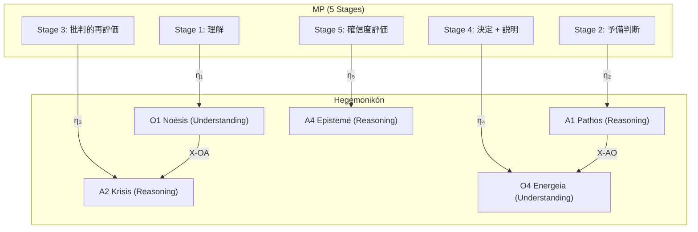

# Metacognitive Prompting ↔ Hegemonikón 自然変換

> **$goal**: reasoning ≠ understanding の区別を O/A-series に精緻にマッピングし、
> MP の5段階を Hegemonikón の既存構造との同型/差分として明示する。

---

## 1. Understanding vs Reasoning — 自然変換 η

### 1.1 MP の定義

> "Reasoning involves methodically connecting concepts,
> whereas understanding requires grasping underlying semantics and broader contextual meanings."
> — Wang & Zhao (2308.05342), Section 1

| 認知モード | MP の定義 | 操作 |
|:---------|:---------|:-----|
| **Reasoning** | 概念を方法的に接続する | 推論チェーン (CoT, ToT) |
| **Understanding** | 基底の意味論と広い文脈的意味を把握する | メタ認知プロンプティング (MP) |

### 1.2 Hegemonikón への射 (η)

```
η: MP → HGK
```

| MP 概念 | HGK 対応 | 圏論的位置 | 根拠 |
|:--------|:---------|:----------|:-----|
| **Understanding** | **O-series (Ousia)** | L1×L1 | 「本質」の把握 = 基底意味論 |
| **Reasoning** | **A-series (Akribeia)** | L1.75×L1.75 | 「精度」の確保 = 方法的接続 |

### 1.3 精緻化: 4定理レベルの対応

#### O-series = Understanding の4相

| O定理 | 座標 | Understanding の相 | MP 対応 |
|:------|:-----|:------------------|:--------|
| **O1 Noēsis** | I×E | **意味の直観** — 「何が本質か」を掴む | Stage 1 (理解) |
| **O2 Boulēsis** | I×P | **意味の方向** — 「何を理解したいか」の意志 | (MP に対応なし) |
| **O3 Zētēsis** | A×E | **意味の探索** — 「まだ理解していないことは何か」 | Stage 3 前半 (疑問生成) |
| **O4 Energeia** | A×P | **意味の実現** — 理解を行動に変換する | Stage 4 (決定) |

#### A-series = Reasoning の4相

| A定理 | 座標 | Reasoning の相 | MP 対応 |
|:------|:-----|:--------------|:--------|
| **A1 Pathos** | Val×Val | **推論の感情的基盤** — 直感的判断 | Stage 2 (予備的判断) |
| **A2 Krisis** | Val×Prec | **推論の批判** — 論理的評価 | Stage 3 (批判的再評価) |
| **A3 Gnōmē** | Prec×Val | **推論の見識** — 経験則 (heuristics) | (MP に対応なし) |
| **A4 Epistēmē** | Prec×Prec | **推論の確定** — 知識への固定 | Stage 5 (確信度評価) |

### 1.4 自然変換の可換図式



> **可換性**: η₃ ∘ (S1→S3) = (O1→A2) ∘ η₁
> MP の Stage 1→3 (理解→批判) は、HGK の O1→A2 (認識→判定) と可換。

### 1.5 MP に存在しないもの (HGK の優位性)

| HGK 定理 | MP に対応なし | 意味 |
|:---------|:------------|:-----|
| **O2 Boulēsis** | 意志の選択 | MP は「何を理解したいか」を問わない |
| **O3 Zētēsis** | 問いの探索 | MP は「何を問うべきか」を問わない |
| **A3 Gnōmē** | 見識/格言の抽出 | MP は経験則の蒸留を行わない |

→ HGK は MP の**上位互換**であり、MP が扱わない「意志」「探求」「見識」を含む。

---

## 2. MP 再帰ループ設計 — 線形→動的推移

### 2.1 MP の限界（著者も認める）

> "MP follows predefined stages, lacking adaptability based on real-time feedback."
> — Section 7 (Discussion)

### 2.2 提案: 動的推移モデル

現在の MP:

```
S1 → S2 → S3 → S4 → S5 (線形)
```

提案する Adaptive MP (AMP):

```
S1 ⇄ S2 ⇄ S3 ⇄ S4 ⇄ S5 (双方向)
         ↑_____↓
    (Stage 3 → Stage 1 ループ)
```

#### 推移条件テーブル

| 現在 Stage | 推移先 | 条件 | 人間認知の根拠 |
|:-----------|:------|:-----|:-------------|
| S3 → S1 | **Overcorrection 検出時** | 批判が初期理解を覆した ≥ 2回 | 「そもそも理解が間違っていた」→ 再理解 |
| S4 → S2 | **決定の不安定性** | 確信度 < 50% | 「直感からやり直す」 |
| S5 → S3 | **過信検出時** | 確信度 > 90% かつ問題の複雑度が高い | FP 32.5% 対策 |
| S2 → S1 | **予備判断が空** | 直感が働かない | 理解不足 → 再読 |

#### HGK での実装

既存の Hegemonikón 構造でこれは自然に実現できる:

```
O1 (理解) → A1 (直感判断) → A2 (批判) → O4 (決定) → A4 (確信度)
     ↑                          |
     └──── X-AO1 ──────────────┘
              (A2 → O1 へのフィードバック射)
```

> **X-AO1** (A4 → O1) は既に定義済み。
> これは「知識確定後に認識に戻る」射であり、MP の再帰ループそのもの。

---

## 3. 既存 PJ 内のメタ認知機構マップ

### 3.1 散在するメタ認知

| # | 機構 | 場所 | MP Stage 対応 | 普遍性 |
|:-:|:-----|:-----|:-------------|:------:|
| 1 | **O1.meta 派生** | /noe --derivative=meta | S3 (批判的再評価) | WF 固有 |
| 2 | **O1 Phase 5: メタ認知出力** | /noe PHASE 5 | S5 (確信度) | WF 固有 |
| 3 | **/pan → /dia 包含** | /dia panorama | S3 + S5 | WF 固有 |
| 4 | **Metacognition Checkpoints** | 旧提案 (62%削減) | S3 + S4 | **未実装** |
| 5 | **BC-6 確信度ラベル** | behavioral_constraints.md | S5 | **普遍** ✅ |
| 6 | **A1 Pathos メタ感情** | /pat | S2 (直感) | WF 固有 |
| 7 | **Anti-Confidence** | user_global | S5 対策 | **普遍** ✅ |
| 8 | **/jukudoku L2 沈潜** | jukudoku.md | S3 (自己批判) | WF 固有 |
| 9 | **`*` 演算子** (全 Peras) | /o*, /a* | S3 (メタ分析) | **普遍** ✅ |

### 3.2 評価

**普遍的なメタ認知機構 (全 WF に適用)**:

- BC-6 (確信度) — Stage 5 のみ
- Anti-Confidence — Stage 5 の過信対策
- `*` 演算子 — メタ分析

**不足**: Stage 1-4 に対応する**普遍的**メタ認知がない。

### 3.3 提案: 普遍メタ認知レイヤー (UML: Universal Metacognitive Layer)

> MP の5段階を、**全 WF の前後に自動挿入される環境強制**として実装する。

```
[任意の WF 実行]
  ↓
┌─ UML Pre-check (Stage 1-2 相当) ─┐
│ 1. 理解確認: 入力を正しく理解したか │  ← O1 射
│ 2. 直感確認: 第一印象はどうか      │  ← A1 射
└──────────────────────────────────┘
  ↓
[WF 本体実行]
  ↓
┌─ UML Post-check (Stage 3-5 相当) ──┐
│ 3. 批判確認: 出力に過信/偏りはないか │  ← A2 射
│ 4. 決定確認: 代替案を検討したか      │  ← O4 射
│ 5. 確信度評価: [C/U] (%)            │  ← A4 射 (= BC-6)
└──────────────────────────────────┘
  ↓
[再帰判定: UML Post-check で問題 → UML Pre-check に戻る]
```

**実装案**: `behavioral_constraints.md` に UML Pre/Post を追加する。
**既存の BC-6 は UML Stage 5 として位置づけ直す。**

---

## 4. WF Understanding/Reasoning タグ

### 4.1 全定理の分類

| Series | 定理 | Type | 根拠 |
|:-------|:-----|:-----|:-----|
| **O1** Noēsis | Understanding | 本質の直観的把握 |
| **O2** Boulēsis | Understanding | 意志の方向性把握 |
| **O3** Zētēsis | Understanding | 問いの発見 |
| **O4** Energeia | Understanding | 意味の行動化 |
| **S1** Metron | Reasoning | スケール決定 (方法的) |
| **S2** Mekhanē | Reasoning | 方法配置 (手続き的) |
| **S3** Stathmos | Reasoning | 基準設定 (評価的) |
| **S4** Praxis | Reasoning | 実践選択 (手続き的) |
| **H1** Propatheia | Understanding | 直感の把握 |
| **H2** Pistis | Understanding | 確信の深度把握 |
| **H3** Orexis | Understanding | 欲求の理解 |
| **H4** Doxa | Understanding | 信念の理解 |
| **P1** Khōra | Reasoning | 場の設定 (構造的) |
| **P2** Hodos | Reasoning | 経路の設計 (手続き的) |
| **P3** Trokhia | Reasoning | 軌道の定義 (手続き的) |
| **P4** Tekhnē | Reasoning | 技法の選択 (方法的) |
| **K1** Eukairia | Understanding | 好機の認識 |
| **K2** Chronos | Reasoning | 時間の配分 (手続き的) |
| **K3** Telos | Understanding | 目的の理解 |
| **K4** Sophia | Understanding + Reasoning | 知恵 (両方) |
| **A1** Pathos | Understanding → Reasoning | 感情の精緻化 (理解→推論) |
| **A2** Krisis | Reasoning | 批判的評価 (方法的) |
| **A3** Gnōmē | Reasoning → Understanding | 見識の形成 (推論→理解) |
| **A4** Epistēmē | Reasoning | 知識の確定 (方法的) |

### 4.2 発見: 2つの Bridge 定理

| 定理 | Type | 意味 |
|:-----|:-----|:-----|
| **A1 Pathos** | U→R | 感情的理解を推論的精度に変換 |
| **A3 Gnōmē** | R→U | 推論的精度を理解的見識に変換 |

> A1 と A3 は **Understanding ↔ Reasoning の自然変換の橋梁**。
> これは MP の Stage 2→3 (直感→批判) と Stage 4→5 (決定→確信) の遷移に対応する。

---

*v1.0 — Created 2026-02-08 by Claude (Antigravity) | /m + /jukudoku*
