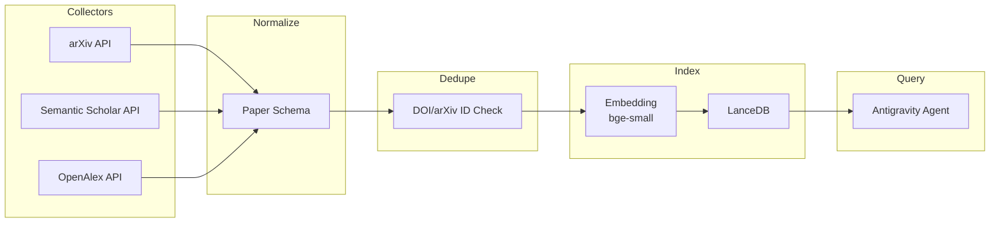

# Gnōsis (γνῶσις) - Knowledge Foundation of Hegemonikón

> **Hegemonikónの知識基盤。AIエージェントのための専門知識DB。**

---

## Why: 存在理由

### 解決する問題

| 問題 | Gnōsisの解決策 |
|------|----------------|
| **ナレッジカットオフ** | 最新論文を継続的に収集し、AIの知識を拡張 |
| **ハルシネーション** | 1次ソース（論文abstract）に基づく回答を強制 |
| **根拠なき提案** | 引用可能なソースを提示し、回答を検証可能に |

### 目指す関係性

> **Claudeを「コーチ、相談役、先生」として機能させる**

- 包括的な相談や依頼に対し、1次ソースに基づく回答と提案を行う
- 現時点では技術的制約があるが、インフラを今から構築しておく

---

## Mission

**生活に関わる全ての専門知識を収集・蓄積し、AIエージェントの認識精度を最大化する。**

| 対比 | AIDB（参照モデル） | Gnōsis |
|------|-------------------|--------|
| 読者 | 人間 | AI |
| 目的 | 公開 | 私用 |
| スコープ | AI/ML記事 | 全専門分野 |

---

## Design Principles

| 原則 | 理由 |
|------|------|
| **AI-First** | RAG検索に最適化。人間可読性より機械処理性を優先 |
| **Incremental** | 最小構成から段階的に拡張。v0.1は3ソースのみ |
| **Interoperable** | M1-M8 Skills、MCP、Antigravityと連携可能 |
| **Deduplicated** | DOI/arXiv IDで重複排除。冗長性は不要 |

---

## Data Flow



**処理フロー:**
1. **Collect**: 各ソースAPIから論文メタデータ取得
2. **Normalize**: 統一 `Paper` スキーマに正規化
3. **Dedupe**: `primary_key = doi or arxiv_id` で重複排除
4. **Embed**: bge-small でベクトル化
5. **Index**: LanceDB に格納
6. **Query**: Antigravity Agent から検索

---

## Architecture

```
forge/gnosis/
├── collectors/
│   ├── base.py           # 共通インタフェース
│   ├── arxiv.py
│   ├── semantic_scholar.py
│   └── openalex.py
├── models/
│   └── paper.py          # Paper dataclass
├── index.py              # LanceDB統合 + 重複排除
├── query.py              # 検索API
├── cli.py                # CLIエントリポイント
└── requirements.txt
```

---

## Deduplication Strategy

```python
def get_primary_key(paper: Paper) -> str:
    """DOI優先、なければarXiv ID、なければソース固有ID"""
    if paper.doi:
        return f"doi:{paper.doi}"
    if paper.arxiv_id:
        return f"arxiv:{paper.arxiv_id}"
    return f"{paper.source}:{paper.source_id}"
```

**マージ戦略:**
- 同一キーが存在 → メタデータを統合（citations等を更新）
- 新規キー → 新規レコードとして追加

---

## Query Interface (v0.2)

```python
# Antigravity Agent から呼び出すAPI
def search_papers(
    query: str,
    k: int = 10,
    filters: dict | None = None  # {"year": ">=2024", "source": "arxiv"}
) -> list[Paper]:
    """セマンティック検索で関連論文を取得"""
    ...

def get_paper_context(paper_ids: list[str]) -> str:
    """論文IDからRAG用コンテキスト文字列を生成"""
    ...
```

---

## Roadmap

| Phase | 内容 | 時期 |
|-------|------|------|
| **v0.1** | arXiv + Semantic Scholar + OpenAlex (AI/ML) | Week 4, 2026 |
| **v0.2** | Antigravityクエリインタフェース (MCP or 直接呼出) | Week 5, 2026 |
| **v1.0** | 差分更新 + ランキングスコア + GitHub Actions | Feb 2026 |
| **v2.0** | 日本語 (CiNii, J-STAGE) + 医学 (PubMed) | Q2 2026 |
| **v3.0** | 哲学・物理学・人文科学 | Future |

---

## Data Sources

### Tier 1: Core (v0.1)

| Source | API | Rate Limit | Coverage | 選定理由 |
|--------|-----|------------|----------|----------|
| arXiv | REST | 3 req/sec | CS, Physics, Math | 最新プレプリント |
| Semantic Scholar | REST + Key | 1 req/sec | Citations | 引用関係 |
| OpenAlex | REST | 10 req/sec | 250M+ | 広範なカバレッジ |

### Tier 2-3: Future

| Tier | Sources |
|------|---------|
| 2 | Crossref, Unpaywall, PubMed, CiNii |
| 3 | PhilPapers, INSPIRE-HEP, ACL Anthology |

---

## API Key Management

| Source | Key Location | 取得方法 |
|--------|--------------|----------|
| Semantic Scholar | `~/.gemini/.env.local` | [API Key Request](https://www.semanticscholar.org/product/api) |

---

## References

- Perplexity調査 (2026-01-21): 12ソース詳細比較
- AIDB収集機構: `forge/scripts/arxiv-collector.py`

---

```
┌─[Hegemonikon]──────────────────────┐
│ M8 Anamnēsis: Vision Revised       │
│ Component: Gnōsis                  │
│ Status: Foundation Complete        │
└────────────────────────────────────┘
```
