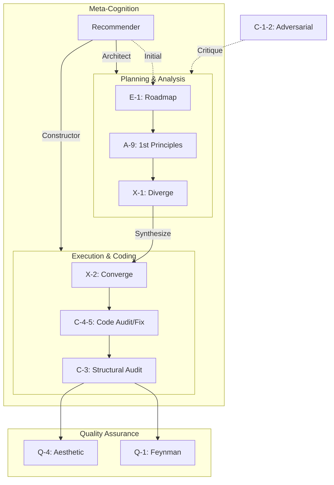

# Prompt Library

> 21 canonical modules + 11 unique JP prompts. **Termux-compatible.**

---

## Quick Start

Paste module content into chat. It executes against previous output.

### Recommended Pairs (Unified)

| Module | Modes |
|---|---|
| C-1-2 | audit → fix |
| C-4-5 | audit → fix |
| C-6-7 | audit → fix |

## Dependency Graph

---

## Canonical Modules

> **Note:** 日本語の凸/凹バージョンは `legacy/` に移動済み。以下が正本。

| ID | Name | Category | JP Alias |
|---|---|---|---|
| **C-1-2** | [Adversarial Review](./modules/C1C2-adversarial.md) | Critical | 敵対的レビュー, 外科的再構築 |
| **C-3** | [Structural Audit](./modules/C3-structural_audit.md) | Critical | システム構造監査 |
| **C-4-5** | [Code Review](./modules/C4C5-code.md) | Critical | コード監査, コード外科手術 |
| **C-6-7** | [Prompt Engineering](./modules/C6C7-prompt.md) | Critical | プロンプト構造監査, プロンプト外科手術 |
| **Q-1** | [Feynman Filter](./modules/Q1-feynman_filter.md) | Quality | 単純性原理と平易な説明 |
| **Q-2** | [Second-Order Thinking](./modules/Q2-second_order_thinking.md) | Quality | 二次影響予測 |
| **Q-3** | [Occam's Razor](./modules/Q3-occams_razor.md) | Quality | オッカムのカミソリ |
| **Q-4** | [Aesthetic Audit](./modules/Q4-aesthetic_audit.md) | Quality | エレガンススマート監査 |
| **A-2** | [Lateral Thinking](./modules/A2-lateral_thinking.md) | Analysis | 多角的ラテラル・シンキング |
| **A-3** | [Bias Scanner](./modules/A3-bias_scanner.md) | Analysis | — |
| **A-7** | [Context Articulation](./modules/A7-context_articulation.md) | Analysis | コンテキストの言語化 |
| **A-8** | [Morphological Matrix](./modules/A8-morphological_matrix.md) | Analysis | 形態素解析マトリクス |
| **A-9** | [First Principles](./modules/A9-first_principles.md) | Analysis | 第一原理思考 |
| **B-3** | [Context Cartography](./modules/B3-context_cartography.md) | Execution | コンテキスト構造化 |
| **E-1** | [Tactical Roadmap](./modules/E1-tactical_roadmap.md) | Execution | WBSスケジューリング |
| **I-1** | [Context Integration](./modules/I1-context_integration.md) | Execution | 外部文脈の結合 |
| **M-1** | [Agent Command Compiler](./modules/M1-agent_command_compiler.md) | Execution | コーディング仕様書コンパイル |
| **R-1** | [Reverse Engineering](./modules/R1-reverse_engineering.md) | Execution | リバースエンジニアリング |
| **X-1/2** | [Divergence & Convergence](./modules/X1X2-divergence_convergence.md) | Execution | 発散と収束 |
| **D-1** | [Design Review](./modules/D1-design_review.md) | Review | — |
| **Rec** | [Model Recommender](./modules/recommender.md) | Meta | — |

---

## Unique Japanese Prompts (固有コンテンツ)

> 英語版に相当するものがない日本語固有プロンプト

| Name | File | Category |
|---|---|---|
| WBSスケジューリング | [WBSスケジューリング.md](./templates/imported/WBSスケジューリング.md) | Planning |

> **Note:** Q-4監査(2026-01-12)により、英語Modulesと重複する8件は`legacy/`へ移動。

---

## Legacy (Deprecated)

> 英語Modulesと重複するため非推奨。参照のみ。

| JP File | Canonical Module |
|---|---|
| 敵対的レビュー凸.md | → C-1-2 |
| 外科的再構築凹.md | → C-1-2 |
| コード監査凸.md | → C-4-5 |
| コード外科手術凹.md | → C-4-5 |
| プロンプト構造監査凸.md | → C-6-7 |
| プロンプト外科手術凹.md | → C-6-7 |
| システム構造監査.md | → C-3 |
| リバースエンジニアリング.md | → R-1 |
| 第一原理思考.md | → A-9 |
| 発散と収束.md | → X-1/2 |
| オッカムのカミソリ.md | → Q-3 |
| 二次影響予測.md | → Q-2 |
| 単純性原理と平易な説明.md | → Q-1 |

---

## System Instructions

| ID | Name |
|---|---|
| **SYS-cold-mirror** | [Cold Mirror](./templates/imported/system/cold_mirror.md) |
| **SYS-inquisitor** | [QA Inquisitor](./templates/imported/system/qa_inquisitor.md) |

---

## Optimization Protocol (v1.2)

- **Canonical Authority**: 英語Modulesを正本とし、日本語版は参照エイリアス
- **Structural Unification**: Audit (監査) and Fix (修正) modules combined (e.g. C-4-5)
- **Aesthetic Flattening**: Replace XML deeply nested tags with Markdown (~50% token reduction)
- **Pre-Implementation Audit**: Always run C-3 (Structural Audit) before coding
- **Native Invocation**: Optimize for copy-paste execution
- **Relative Paths**: Use `./` relative paths for portability
