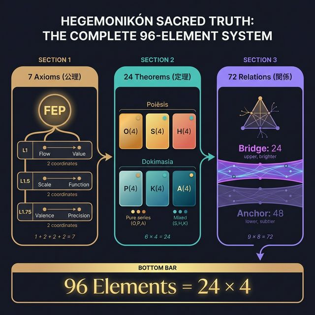

> **Kernel Doc Index**: [SACRED_TRUTH](SACRED_TRUTH.md) ← 📍 | [axiom_hierarchy](axiom_hierarchy.md) | [naming_conventions](naming_conventions.md)

# 🔒 Sacred Truth (不変真理) v2.2

> **このドキュメントの内容は改変禁止。すべてのチャット/セッションで参照される不変の真理。**

## 0. アイデンティティ

> **Hegemonikón は「認知制御言語 (Cognitive Control Language, CCL)」である。**
> **「思考言語 (Language of Thought, LoT)」ではない。**

| LoT (Fodor) | CCL (Hegemonikón) |
|:------------|:------------------|
| 思考の表現 | 思考の制御 |
| 完全性追求 | 開放的自己完備 |
| 静的記号 | 動的行為 (Praxis) |

> 意味を静的に定義せず、操作として実行する — Wittgenstein の批判を回避

---

## 1. 公理と座標 (1公理 + 6座標)

> **唯一の公理**: FEP (予測誤差最小化)
> **6座標**: FEP からの導出距離 d で配置

| 距離 | Question | 座標 | Opposition |
|:-----|----------|------|------------|
| d=0 | Who | Flow | I (推論) ↔ A (行為) |
| d=1 | Why | Value | E (認識) ↔ P (実用) |
| d=1 | How | Function | Explore ↔ Exploit |
| d=2 | Where/When | Scale | Micro ↔ Macro |
| d=2 | Which | Valence | + ↔ - |
| d=2 | How much | Precision | C ↔ U |

---

## 2. 定理群 (24 = Poiēsis 12 + Dokimasia 12)

### Poiēsis: 内容の具現化（生成層）

| Level | 記号 | 名称 | 生成 |
|-------|------|------|------|
| L0 | O | **Ousia** | L1×L1 |
| L1 | S | **Schema** | L1×L1.5 |
| L2a | H | **Hormē** | L1×L1.75 |

### Dokimasia: 条件の詳細化（審査層）

| Level | 記号 | 名称 | 生成 |
|-------|------|------|------|
| L2b | P | **Perigraphē** | L1.5×L1.5 |
| L3 | K | **Kairos** | L1.5×L1.75 |
| L4 | A | **Akribeia** | L1.75×L1.75 |

---

## 3. X-series 関係層 (72)

| X | 接続 | 共有座標 | 数 |
|---|------|---------|---|
| X-OS | O→S | C1 (Flow) | 8 |
| X-OH | O→H | C1 (Flow) | 8 |
| X-SH | S→H | C1 (Flow) | 8 |
| X-SP | S→P | C3 (Scale) | 8 |
| X-SK | S→K | C3 (Scale) | 8 |
| X-PK | P→K | C3 (Scale) | 8 |
| X-HA | H→A | C5 (Valence) | 8 |
| X-HK | H→K | C5 (Valence) | 8 |
| X-KA | K→A | C5 (Valence) | 8 |
| **計** | | | **72** |

---

## 4. 数え上げ

| 項目 | 数 | 備考 |
|------|---|------|
| 公理 | **1** | FEP (唯一の公理) |
| 座標 (定理¹) | **6** | 1+2+3 (導出距離) |
| 認知モジュール (定理²) | **24** | 6×4 |
| 関係 (Series間) | **72** | 9×8 |
| 関係 (Series内) | **36** | 12D+12H+12X |
| **体系核** | **103** | 1+6+24+72 (素数) |
| **関係総計** | **108** | 72+36 (偶然の数的一致) |

> **「真理は美しく、美しさは真理に近づく道標である」**

---

## 5. 運用原則

| 原則 | 内容 |
|------|------|
| **論理的整合性** | すべての設計は公理と生成規則から再構成可能 (水準B) |
| **美しさ** | 対称性、一貫性、数学的調和 |
| **計画8割・実装2割** | 設計完成後に実装 |

---

## 6. 参照ドキュメント

| ドキュメント | 役割 |
|-------------|------|
| SACRED_TRUTH.md | 不変真理 |
| axiom_hierarchy.md | 公理階層 (Master) |
| naming_conventions.md | 命名規則 |
| ousia.md | O-series |
| schema.md | S-series |
| horme.md | H-series |
| perigraphe.md | P-series |
| kairos.md | K-series |
| akribeia.md | A-series |
| taxis.md | X-series |

---

*このドキュメントは Hegemonikón v3.0 の不変真理を記録する。改変時は Creator 承認必須。*
