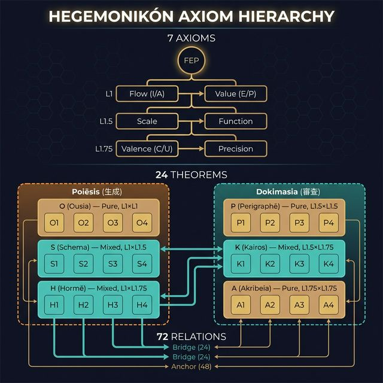
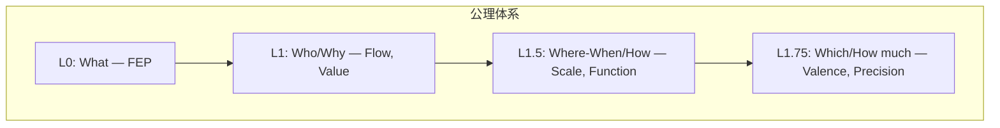
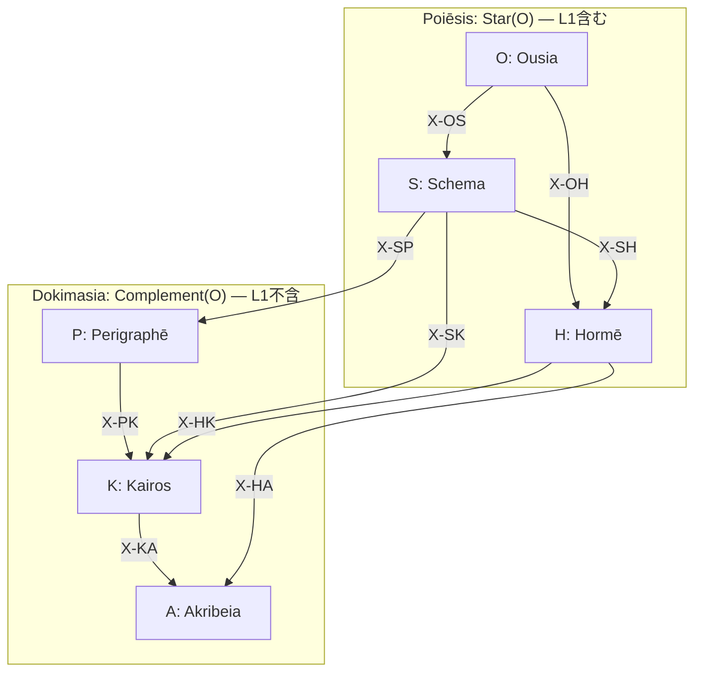

> **Kernel Doc Index**: [SACRED_TRUTH](SACRED_TRUTH.md) | [axiom_hierarchy](axiom_hierarchy.md) ← 📍 | [naming_conventions](naming_conventions.md)

# 📐 公理階層構造 (Axiom Hierarchy) v2.1

> **「予測誤差最小化から導出される認知の全体系」**

---

## 総数

| 項目 | 数 | 生成 |
|------|---|------|
| 公理 | **7** | 1+2+2+2 |
| 定理 | **24** | 6×4 |
| 関係 | **72** | 9×8 |
| **総計** | **96** | 24×4 |

---

## 公理体系（7軸）

| Level | Question | Axiom | Opposition |
|-------|----------|-------|------------|
| L0 | What | FEP | 予測誤差最小化 |
| L1 | Who | Flow | I (推論) ↔ A (行為) |
| L1 | Why | Value | E (認識) ↔ P (実用) |
| L1.5 | Where/When | Scale | Micro ↔ Macro |
| L1.5 | How | Function | Explore ↔ Exploit |
| L1.75 | Which | Valence | + ↔ - |
| L1.75 | How much | Precision | C ↔ U |

### L0 (FEP) の理論的含意

> **直交性の必然性** (Spisak & Friston, 2025):
> FEP を random dynamical system に適用すると、自己直交化する attractor network が創発する。
> 直交性は predictive accuracy と model complexity の同時最適化の**数学的帰結**。
> → **6 Series の直交配置は設計ではなく FEP からの演繹的必然**。

> **Temporal Depth** (Kirchhoff et al., 2018):
> 「mere active inference」(振り子の同期) と「adaptive active inference」(時間的深さを持つ生成モデル) を区別。
> → 自律性は Markov blanket の存在ではなく、深い生成モデルの有無で決まる。

---

## 定理群（24 = 6×4）

### Poiēsis: 内容の具現化（生成層12）

| Level | 記号 | 名称 | 生成 | 定理 | ドキュメント |
|-------|------|------|------|------|-------------|
| L0 | O | **Ousia** | L1×L1 | O1-O4 | [ousia.md](ousia.md) |
| L1 | S | **Schema** | L1×L1.5 | S1-S4 | [schema.md](schema.md) |
| L2a | H | **Hormē** | L1×L1.75 | H1-H4 | [horme.md](horme.md) |

### Dokimasia: 条件の詳細化（審査層12）

| Level | 記号 | 名称 | 生成 | 定理 | ドキュメント |
|-------|------|------|------|------|-------------|
| L2b | P | **Perigraphē** | L1.5×L1.5 | P1-P4 | [perigraphe.md](perigraphe.md) |
| L3 | K | **Kairos** | L1.5×L1.75 | K1-K4 | [kairos.md](kairos.md) |
| L4 | A | **Akribeia** | L1.75×L1.75 | A1-A4 | [akribeia.md](akribeia.md) |

---

## 個別定理名（24）

### O-series (Ousia)

| ID | 名称 | 意味 |
|----|------|------|
| O1 | Noēsis | 認識推論 (Recursive Self-Evidencing) |
| O2 | Boulēsis | 意志推論 |
| O3 | Zētēsis | 探索行動 |
| O4 | Energeia | 実用行動 |

### S-series (Schema)

| ID | 名称 | 意味 |
|----|------|------|
| S1 | Metron | スケール流動 |
| S2 | Mekhanē | 方法流動 |
| S3 | Stathmos | スケール価値 |
| S4 | Praxis | 方法価値 |

### H-series (Hormē)

| ID | 名称 | 意味 |
|----|------|------|
| H1 | Propatheia | 流動傾向 |
| H2 | Pistis | 流動確信 |
| H3 | Orexis | 価値傾向 |
| H4 | Doxa | 価値確信 |

### P-series (Perigraphē)

| ID | 名称 | 意味 |
|----|------|------|
| P1 | Khōra | スケール場 |
| P2 | Hodos | スケール方法 |
| P3 | Trokhia | 方法スケール |
| P4 | Tekhnē | 方法場 |

### K-series (Kairos)

| ID | 名称 | 意味 |
|----|------|------|
| K1 | Eukairia | スケール傾向 |
| K2 | Chronos | スケール確信 |
| K3 | Telos | 方法傾向 |
| K4 | Sophia | 方法確信 |

### A-series (Akribeia)

| ID | 名称 | 意味 |
|----|------|------|
| A1 | Pathos | 二重傾向 |
| A2 | Krisis | 傾向確信 |
| A3 | Gnōmē | 確信傾向 |
| A4 | Epistēmē | 二重確信 |

---

## X-series: 関係層（72）

| X | 接続 | 共有座標 | 数 | 意味 |
|---|------|---------|---|------|
| X-OS | O→S | C1 (Flow) | 8 | 本質→様態 |
| X-OH | O→H | C1 (Flow) | 8 | 本質→傾向 |
| X-SH | S→H | C1 (Flow) | 8 | 様態→傾向 |
| X-SP | S→P | C3 (Scale) | 8 | 様態→条件 |
| X-SK | S→K | C3 (Scale) | 8 | 様態→文脈 |
| X-PK | P→K | C3 (Scale) | 8 | 条件→文脈 |
| X-HA | H→A | C5 (Valence) | 8 | 傾向→精密 |
| X-HK | H→K | C5 (Valence) | 8 | 傾向→文脈 |
| X-KA | K→A | C5 (Valence) | 8 | 文脈→精密 |
| **計** | | | **72** | |

詳細: [taxis.md](taxis.md)

---

## 階層構造図

> **Trígōnon**: 6 Series は K₃ 三角形を形成する。
> Pure (O,P,A) = 頂点、Mixed (S,H,K) = 辺。
> 詳細: [trigonon.md](trigonon.md)

---

## 理論的基盤 (Theoretical Foundations)

| 概念 | 根拠論文 | Hegemonikón 接続 |
|:-----|:---------|:----------------|
| Series 直交性 | Spisak & Friston 2025 (arXiv:2505.22749) | 6 Series = FEP の数学的帰結としての直交基底 |
| ネストした MB | Kirchhoff et al. 2018 (J.R.Soc.Interface 15:20170792) | P₁ (Khōra) = blankets of blankets |
| mere vs adaptive AI | Kirchhoff et al. 2018 | temporal depth = 自律性の必要条件 |
| Replay と forgetting 耐性 | Spisak & Friston 2025 | /boot replay ≈ resting state attractor replay |

---

## 参照

- **三角形構造**: [trigonon.md](trigonon.md)
- **関係層**: [taxis.md](taxis.md)
- **命名規則**: [naming_conventions.md](naming_conventions.md)
- **不変真理**: [SACRED_TRUTH.md](SACRED_TRUTH.md)

---

*Hegemonikón v3.0 — 96要素体系 + 理論的基盤追記 (2026-02-07)*
