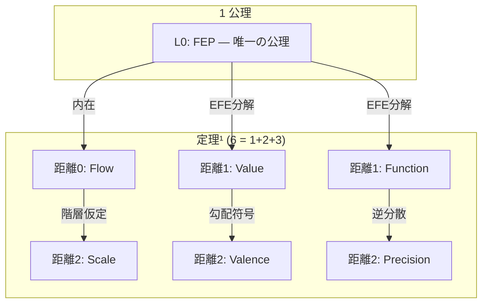
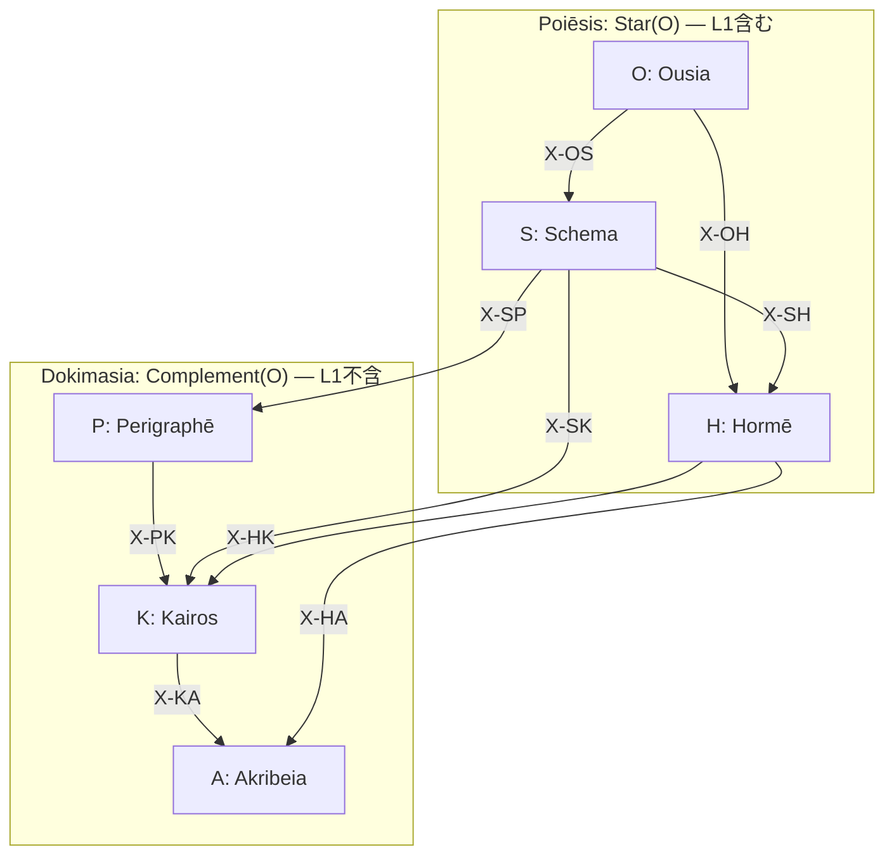

> **Kernel Doc Index**: [SACRED_TRUTH](SACRED_TRUTH.md) | [axiom_hierarchy](axiom_hierarchy.md) ← 📍 | [naming_conventions](naming_conventions.md)

# 📐 公理階層構造 (Axiom Hierarchy) v3.0

> **「ひとつの原理から、不規則な真実が展開する」**

---

## 総数

| 項目 | 数 | 生成 |
|------|---|------|
| 公理 | **1** | FEP |
| 定理¹ (座標) | **6** | 1+2+3 |
| 定理² (認知機能) | **24** | 6×4 |
| 関係 (Series内) | **36** | 6×6 (12D+12H+12X) |
| 関係 (Series間) | **72** | 9×8 |
| **体系核** | **103** | 1+6+24+72 |
| **関係総計** | **108** | 36+72 |

---

## 公理 (1)

| Level | Question | 公理 | 意味 |
|-------|----------|------|------|
| **L0** | **What** | **FEP** | 予測誤差最小化 — 唯一の公理 |

---

## 定理¹: 座標 (6 = 1+2+3)

> **導出原理**: FEP から導かれる認知の座標軸。
> **配分 1-2-3**: FEP からの導出距離による。不規則だが真実。

### 導出距離の操作的定義

> **距離 d = FEP に対する追加仮定の個数**

| 距離 | 意味 | 追加仮定 |
|:-----|:-----|:---------|
| **d=0** | FEP を定式化した時点で既に含まれる構造 | なし (Markov blanket partition に内在) |
| **d=1** | FEP + 1つの追加仮定で導出 | EFE の分解 (行動選択策の存在) |
| **d=2** | FEP + 2つ以上の追加仮定で導出 | 階層性、感覚的偏好、実装詳細など |

> **注**: 距離は厳密な公理的距離ではなく、導出の「近さ」を表す序数的指標。
> `d=0` は FEP の**定義**から分離不能な構造、`d=1` は FEP から**1ステップ**で到達可能な構造。

| 距離 | Question | 定理¹ | Opposition | 導出 |
|:-----|----------|-------|------------|------|
| **0** | Who | Flow | I (推論) ↔ A (行為) | Markov blanket の partition に内在 |
| **1** | Why | Value | E (認識) ↔ P (実用) | EFE の分解 |
| **1** | How | Function | Explore ↔ Exploit | EFE による行動選択 |
| **2** | Where/When | Scale | Micro ↔ Macro | 階層的生成モデルの仮定 |
| **2** | Which | Valence | + ↔ - | 自由エネルギー勾配の符号 |
| **2** | How much | Precision | C ↔ U | 予測誤差の逆分散 π = V[ε]⁻¹ |

### L0 (FEP) の理論的含意

> **直交性の必然性** (Spisak & Friston, 2025):
> FEP を random dynamical system に適用すると、自己直交化する attractor network が創発する。
> 直交性は predictive accuracy と model complexity の同時最適化の**数学的帰結**。
> → **6 Series の直交配置は FEP からの演繹的導出であり、Spisak 2025 はこの構造が動力学的にも最適であることを裏付ける。**

> **Attractor としての 6 Series**:
> 現在の 6 Series は静的な基底ベクトル（手動コマンドで発動）。
> FEP に従えば、**動的な attractor**（入力に応じて自然に収束）であるのが本来の姿。
> → basin of attraction の実装が次の課題。

> **Temporal Depth** (Kirchhoff et al., 2018):
> 「mere active inference」(振り子の同期) と「adaptive active inference」(時間的深さを持つ生成モデル) を区別。
> → 自律性は Markov blanket の存在ではなく、深い生成モデルの有無で決まる。

---

## なぜ 6 Series か — 定理²の生成規則

> **原則**: 定理¹の6座標から2つを選んで「テンソル積」をとる。
> ただし **距離0 (Flow) は全 Series の暗黙的基底** であり、ペア対象に含めない。

### ペアリング規則

残り5座標 (Value, Function, Scale, Valence, Precision) から、**同一距離または隣接距離の座標ペア** = 6通り:

| Series | ペア | 距離 | 4定理 |
|:-------|:-----|:-----|:------|
| O (Ousia) | Value × Function | d1 × d1 | 2×2 = 4 |
| S (Schema) | Value × Scale | d1 × d2 | 2×2 = 4 |
| H (Hormē) | Value × Valence | d1 × d2 | 2×2 = 4 |
| P (Perigraphē) | Scale × Function | d2 × d1 | 2×2 = 4 |
| K (Kairos) | Scale × Valence | d2 × d2 | 2×2 = 4 |
| A (Akribeia) | Valence × Precision | d2 × d2 | 2×2 = 4 |

> **なぜ C(5,2)=10 ではなく 6 か**: 距離差 ≤ 1 のペアのみ。
> Value×Precision (d1×d2=1), Function×Valence (d1×d2=1) は距離1で許容されるが、
> 歴史的に Flow の Opposition (I/A) が各 Series の「行」を決定するため、
> L1 側の座標 = 列の決定子として設計されている。
> → 結果として6通りに収束する。

---

## 定理²: 認知機能（24 = 6×4）

### Poiēsis: 内容の具現化（生成層12）

| Level | 記号 | 名称 | 生成 | 定理 | ドキュメント |
|-------|------|------|------|------|-------------|
| L0 | O | **Ousia** | L1×L1 | O1-O4 | [ousia.md](ousia.md) |
| L1 | S | **Schema** | L1×L1.5 | S1-S4 | [schema.md](schema.md) |
| L2a | H | **Hormē** | L1×L1.75 | H1-H4 | [horme.md](horme.md) |

### Dokimasia: 条件の詳細化（審査層12）

| Level | 記号 | 名称 | 生成 | 定理 | ドキュメント |
|-------|------|------|------|------|-------------|
| L2b | P | **Perigraphē** | L1.5×L1.5 | P1-P4 | [perigraphe.md](perigraphe.md) |
| L3 | K | **Kairos** | L1.5×L1.75 | K1-K4 | [kairos.md](kairos.md) |
| L4 | A | **Akribeia** | L1.75×L1.75 | A1-A4 | [akribeia.md](akribeia.md) |

---

## 個別定理名（24）

### O-series (Ousia)

| ID | 名称 | 意味 |
|----|------|------|
| O1 | Noēsis | 認識推論 (Recursive Self-Evidencing) |
| O2 | Boulēsis | 意志推論 |
| O3 | Zētēsis | 探索行動 |
| O4 | Energeia | 実用行動 |

### S-series (Schema)

| ID | 名称 | 意味 |
|----|------|------|
| S1 | Metron | スケール流動 |
| S2 | Mekhanē | 方法流動 |
| S3 | Stathmos | スケール価値 |
| S4 | Praxis | 方法価値 |

### H-series (Hormē)

| ID | 名称 | 意味 |
|----|------|------|
| H1 | Propatheia | 流動傾向 |
| H2 | Pistis | 流動確信 |
| H3 | Orexis | 価値傾向 |
| H4 | Doxa | 価値確信 |

### P-series (Perigraphē)

| ID | 名称 | 意味 |
|----|------|------|
| P1 | Khōra | スケール場 |
| P2 | Hodos | スケール方法 |
| P3 | Trokhia | 方法スケール |
| P4 | Tekhnē | 方法場 |

### K-series (Kairos)

| ID | 名称 | 意味 |
|----|------|------|
| K1 | Eukairia | スケール傾向 |
| K2 | Chronos | スケール確信 |
| K3 | Telos | 方法傾向 |
| K4 | Sophia | 方法確信 |

### A-series (Akribeia)

| ID | 名称 | 意味 |
|----|------|------|
| A1 | Pathos | 二重傾向 |
| A2 | Krisis | 傾向確信 |
| A3 | Gnōmē | 確信傾向 |
| A4 | Epistēmē | 二重確信 |

---

## X-series: 関係層（72）

| X | 接続 | 共有座標 | 数 | 意味 |
|---|------|---------|---|------|
| X-OS | O→S | C1 (Flow) | 8 | 本質→様態 |
| X-OH | O→H | C1 (Flow) | 8 | 本質→傾向 |
| X-SH | S→H | C1 (Flow) | 8 | 様態→傾向 |
| X-SP | S→P | C3 (Scale) | 8 | 様態→条件 |
| X-SK | S→K | C3 (Scale) | 8 | 様態→文脈 |
| X-PK | P→K | C3 (Scale) | 8 | 条件→文脈 |
| X-HA | H→A | C5 (Valence) | 8 | 傾向→精密 |
| X-HK | H→K | C5 (Valence) | 8 | 傾向→文脈 |
| X-KA | K→A | C5 (Valence) | 8 | 文脈→精密 |
| **計** | | | **72** | |

詳細: [taxis.md](taxis.md)

---

## Series 内関係（36 = 12D + 12H + 12X）

> **発見**: 2×2 マトリクスの4定理を2ペアにする方法は3通り。各々が異なる圏論的構造に対応。
> **数の美しさ**: 36 (Series内) × 2 = 72 (Series間)。

| ペアリング | 組合せ | 圏論 | 保存→反転 |
|:-----------|:-------|:-----|:----------|
| **対角 (D)** | T1⊣T3, T2⊣T4 | 随伴 F⊣G | 深い軸→浅い軸 |
| **横 (H)** | T1↔T2, T3↔T4 | 自然変換 α | 浅い軸→深い軸 |
| **反対角 (X)** | T1↔T4, T2↔T3 | 双対 | 両軸反転 |

> 各定理は3つの関係を持つ: 随伴パートナー (D)、自然変換パートナー (H)、双対パートナー (X)。
> 詳細は各 WF ファイルの `category_theory:` セクションに記載。

---

## 階層構造図

> **Trígōnon**: 6 Series は K₃ 三角形を形成する。
> Pure (O,P,A) = 頂点、Mixed (S,H,K) = 辺。
> 詳細: [trigonon.md](trigonon.md)

---

## 理論的基盤 (Theoretical Foundations)

| 概念 | 根拠論文 | Hegemonikón 接続 |
|:-----|:---------|:----------------|
| Series 直交性 | Spisak & Friston 2025 (arXiv:2505.22749) | 6 Series = FEP の数学的帰結としての直交基底 |
| ネストした MB | Kirchhoff et al. 2018 (J.R.Soc.Interface 15:20170792) | P₁ (Khōra) = blankets of blankets |
| mere vs adaptive AI | Kirchhoff et al. 2018 | temporal depth = 自律性の必要条件 |
| Replay と forgetting 耐性 | Spisak & Friston 2025 | /boot replay ≈ resting state attractor replay |
| **Valence の独立座標性** | **Seth & Critchley 2013 (BBS)** | **Valence = 内受容予測誤差の符号。Value の属性ではなく身体の独立信号** |

> **Valence が独立座標である根拠** (Seth & Critchley 2013, 152 citations):
> 情動 (emotion) は内受容的予測符号化 (interoceptive predictive coding) の産物。
> 即ち、内臓・自律神経系からの予測誤差の**方向** (+接近 / -回避) が Valence を構成する。
> これは Value (認識的/実用的目的) とは独立した生理的信号であり、
> FEP の枠組みでは内受容的生成モデルの**勾配の符号**として形式化される。
> → Valence は Value の「属性」ではなく、身体からの独立した座標軸。

---

## 参照

- **三角形構造**: [trigonon.md](trigonon.md)
- **関係層**: [taxis.md](taxis.md)
- **命名規則**: [naming_conventions.md](naming_conventions.md)
- **不変真理**: [SACRED_TRUTH.md](SACRED_TRUTH.md)

---

*Hegemonikón v3.1-axiom — 1公理+6定理¹(1-2-3) + 24定理² + 108関係。導出距離の操作的定義・Valence根拠(Seth 2013)・6 Series生成規則を明文化 (2026-02-12)*
