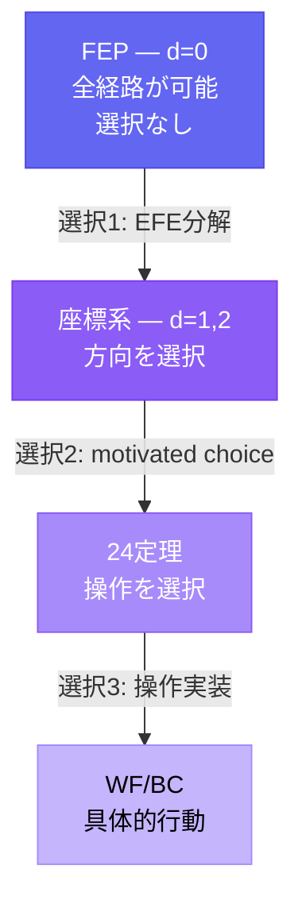
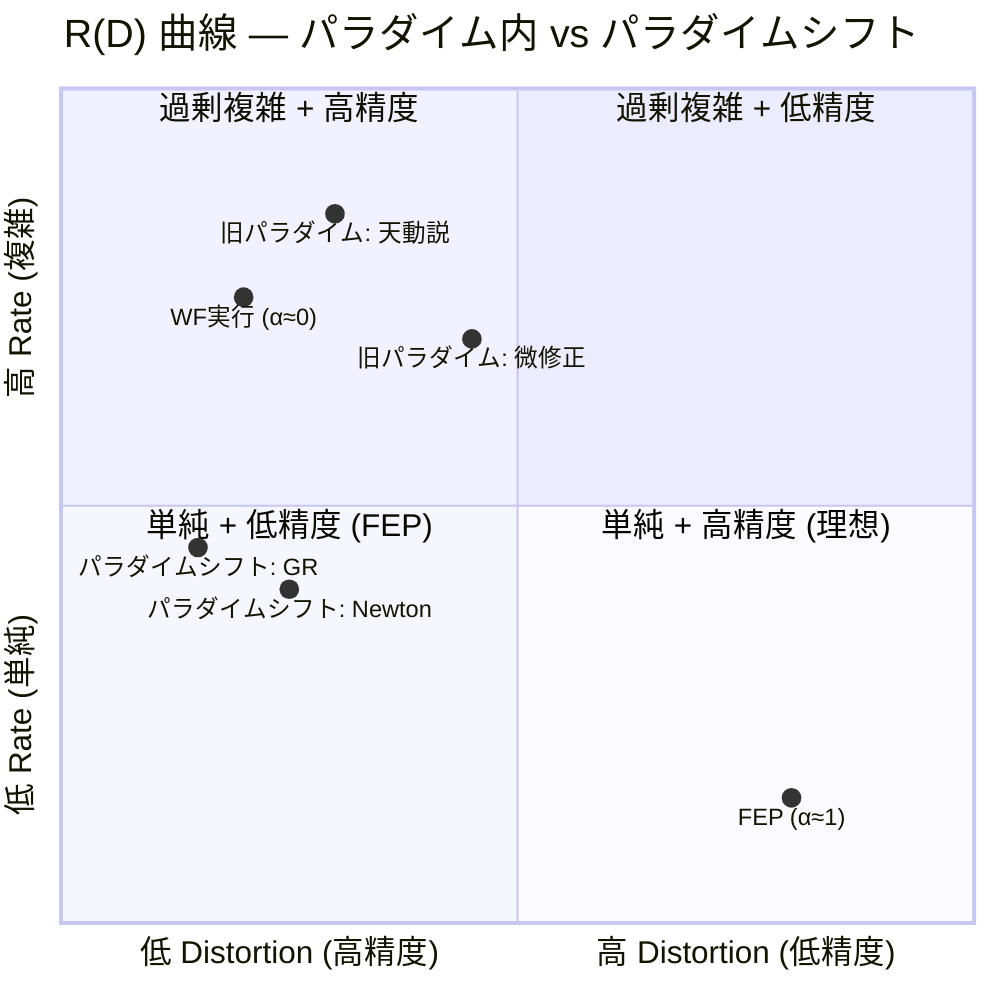
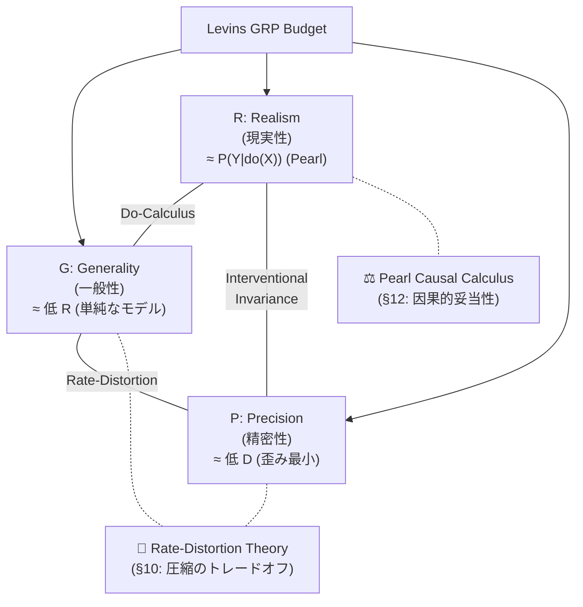

# DX-012: 普遍性のジレンマ (The Universality Dilemma)

> **「1 はなにも"具体"を予測しない。だが 1 はあらゆる"具体"を説明する。」**

---

## 定式化

**公式**:

```
抽象度 α ∈ [0, 1]

E(α): 説明力 (explanatory power)   — α と正相関
P(α): 予測力 (predictive power)    — α と負相関

E(α) × P(α) ≈ const
```

**日常表現**: 高い場所に立つほど遠くまで見渡せるが、足元の石ころは見えなくなる。

**位置エネルギーの比喩**: 前提が普遍的であればあるほど (位置エネルギーが高いほど)、あり得る具体 (到達可能な経路) が膨大になり、「意味のある」予測 (一意な経路の選択) ができなくなる。

---

## 具体例

| α | 対象 | 説明力 | 予測力 |
|:--|:-----|:-------|:-------|
| **1.0** | 数字の「1」 | あらゆるものを「1つの〇〇」と記述可能 | 何も予測しない |
| **0.95** | FEP | あらゆる認知現象を記述可能 | 具体的予測は HGK 定理群を経由 |
| **0.7** | ニュートン力学 | 巨視的運動全般 | 軌道を定量的に予測 |
| **0.3** | 特定の神経回路モデル | 特定の記憶課題のみ | 精密な定量的予測 |
| **0.0** | 個別事象の記録 | その事象のみ | その事象を完全に「予測」(再現) |

---

## HGK への含意

### FEP の位置

FEP は α ≈ 0.95 に位置するメタ原理。予測力の欠如は **欠陥ではなく普遍性の代償**。

詳細: [fep_epistemic_status.md](../fep_epistemic_status.md)

### HGK = コンパイラ

HGK はメタ原理 (α ≈ 1) から具体的操作 (α ≈ 0.1) へのコンパイル過程:

```
FEP (α ≈ 1.0)    → 座標 (α ≈ 0.7) → 定理 (α ≈ 0.4) → WF/BC (α ≈ 0.1)
(説明力max)        (中間)             (操作的)          (予測力max)
```

### 美しさバイアスへの警告

> Hossenfelder, "Lost in Math" (2018): 理論物理学は美しさ (symmetry, elegance, naturalness) を
> 真理の証拠と見なしたが、それは検証された方法論ではなく美的信念に過ぎなかった。

**HGK に適用**:

| 美しさの成分 | HGK での対応 | リスク |
|:------------|:------------|:-------|
| **Symmetry** | 6 Series の直交性、2×2 マトリクス | 認知空間が本当に対称か未検証 |
| **Elegance** | 1公理→24定理→108関係 | 数値の美しさに酔う可能性 |
| **Naturalness** | FEP からの「自然な」導出 | motivated choice を必然と混同するリスク |

**対策**: 美しさは**発見のヒューリスティック** (motivated choice の動機) として有用だが、**検証の基準** (真理の証拠) としては使えない。axiom_hierarchy.md の水準B (公理的構成) は美しさではなく再現可能性を基準としている。

---

## 構造的ジレンマの認識

このジレンマは **解決されるべき問題ではなく、認識されるべき構造**。

| 対処 | ❌ 間違い | ✅ 正しい |
|:-----|:---------|:---------|
| FEP が予測しない | 「FEP は無価値」(Mangalam) | 「予測力の欠如は普遍性の代償」 |
| HGK の数値が美しい | 「美しいから正しい」 | 「美しさは動機、正しさは検証で決まる」 |
| 射の対応が見つかる | 「同型だから FEP が正しい」 | 「構造的類似は FEP の説明力の証拠だが、予測力の証拠ではない」 |

## 既知の反論と再反論 {#sec_06_counterarguments}

**Trafimow & Uhalt (2015, Theory & Psychology)**:
> "the tradeoff is far less clear-cut than psychology researchers have understood"

彼らの論点: 適切な **補助仮定 (auxiliary assumptions)** を追加すれば予測力を回復できる。

### 再反論: 「追加」は「選択」であり、選択はトレードオフそのもの

> [!CAUTION]
> Trafimow の誤りは言語的。「追加」という語が「削除」を隠蔽している。

**「補助仮定を追加する」= 「可能な経路を選択する」= 「選択されなかった経路を削除する」**

右を選べば左に行けない。選択とは、説明範囲の縮小と引き換えに予測精度を得る操作。
これはトレードオフの**反論**ではなく**存在証明**。

| Trafimow の言語 | 実際の操作 |
|:---------------|:----------|
| 仮定を「追加」する | 可能な経路を「削除」する |
| 予測力が「回復」する | 説明範囲を「縮小」している |
| トレードオフは「ない」 | トレードオフが**まさに起きている** |

情報理論的に: I(P) ≤ I(T) + I(A)。α→1 のとき I(T)→0 なので I(P) ≤ I(A)。
予測の情報は理論からではなく、**選択** から来ている。

### 適用範囲

| α 範囲 | Trafimow の見え方 | 実態 |
|:-------|:-----------------|:-----|
| α ≈ 0.3-0.7 | 「追加で回復」に見える | I(T) が大きいため、少ない選択で予測力を得られる |
| α → 1 | トートロジーに見える | I(T) → 0 なので、選択が全情報を担う |

---

## コンパイルパス = 選択の積み重ね {#sec_07_compile_path}

HGK の導出距離 d は**選択の回数**:



各選択で説明範囲が縮小し、予測精度が増す。**E×P_s≈const はこの過程の不変量**。

---

## 演繹的発見 — P の二重構造 {#sec_08_deductive_discovery}

> **FEP は"予測"する。予測の内容は、進化論と同じ、"未知の事実"。**
> **言わば"発見"をもたらすのだ。演繹に依る発見を。**
> — Creator, 2026-02-14

### P の分離

DX-012 v1.3 までの議論は P を一種類と仮定していた。しかし P には2つの次元がある:

| 種類 | 定義 | α=1 での値 | 例 (進化論) |
|:-----|:-----|:-----------|:-----------|
| **P_specific** | 特定の結果を予測する力 | → 0 | 「キリンの首は長くなる」→ 予測不能 |
| **P_existential** | 「こういうパターンが見つかるはずだ」 | **> 0** | 「環境に適応した形態が見つかる」→ 予測可能 |

### 修正された構造

```
E(α) × P_s(α) ≈ const     ← 特定的予測力は α と反比例 (v1.3 の通り)
P_e(α) ≈ f(scope(α))      ← 存在的予測力は scope に比例
```

| | P_specific | P_existential の scope |
|:--|:-----------|:---------------------|
| メタ原理 (α→1) | → 0 | **広い** (全域) |
| 具体理論 (α→0) | → max | 狭い (限定域) |

### FEP の存在的予測

```
∃x: F(x) < F₀  (自由エネルギーを減少させる系が存在する)
```

これは**反証可能**。もし探しても見つからなければ、FEP が間違っている。
実際に FEP からの演繹的推論で**発見**された事例:

- 植物の active inference
- 免疫系の予測的処理
- 社会組織の自由エネルギー最小化

### 注意: P_existential の反証困難性

> [!WARNING]
> P_existential は P_specific より反証が困難。
> 「見つかっていない」≠「存在しない」(不在の証明問題)。
> **発見のヒューリスティック**と呼ぶ方が、科学哲学的にはより正確。

### 核心: メタ原理のメタ予測

> **原理がメタ的であるがゆえに、その予測もメタ的になる。**
> — Creator, 2026-02-14

これが P の二重構造の根拠。具体的原理は具体的予測を、メタ原理はメタ予測 (= 存在の予測) をする。
予測の抽象度は原理の抽象度に**同期する**。

---

## 確信度 {#sec_09_confidence}

| 主張 | 確信度 |
|:-----|:-------|
| E(α) × P_s(α) ≈ const | [確信: 88%] — 「選択 = 削除 = scope縮小」の論証 |
| P に2種類ある (specific / existential) | [確信: 85%] |
| P_existential ≈ 演繹的発見の力 | [推定: 78%] |
| 進化論 ≅ FEP (存在予測の構造が同型) | [確信: 88%] — Sánchez-Cañizares と一致 |
| 「追加」は「選択 (= 削除)」の言い換え | [確信: 92%] — 論理的に自明 |
| 導出距離 d = 選択の回数 | [推定: 78%] |
| HGK における美しさバイアスのリスク | [確信: 85%] |
| E×P≈const と Levins GRP の同型性 | [確信: 85%] — (SOURCE: Levins 1966 原文参照済) |

---

## Rate-Distortion による再形式化 {#sec_10_rate_distortion}

> **E×P≈const を rate-distortion theory で再定式化する**
> 旧版 (Shannon チャネル容量への直接マッピング) は @nous 再帰検証で致命的欠陥が発見された。
> 以下は rate-distortion theory による修正版。[推定: 72%]

### 旧形式化の問題点 (Shannon 版, 破棄)

| 問題 | 詳細 |
|:-----|:-----|
| E ≈ log\|Ω\| は矛盾 | Newton が統一すると \|Ω\|↓ → E↓ という不合理。説明力は「数え上げ」ではなく「統一」 |
| E×P≈const に反例 | Newton→Kepler、GR→Newton は E と P を同時に増加させた (パラダイム交替) |
| P_s ≈ 1/H(Y\|X) は発散 | 完全理論で H→0, 1/H→∞。相互情報量 I(X;Y) が数学的に自然 |

### Rate-Distortion Framework

理論 T を抽象度 α で記述するとき、「世界の圧縮」として定式化する:

```
Rate R(α)       = モデル複雑性 (Kolmogorov complexity K(T_α))
                  理論 T_α を記述するのに必要なビット数

Distortion D(α) = 予測誤差 (データと予測の不一致)
                  D(α) = E[d(Y, Ŷ_α)] (平均歪み)

R(D) 曲線       = 最小 R を達成する理論のフロンティア
                  R(D) = min_{p(ŷ|y): E[d]≤D} I(Y; Ŷ)
```

### E×P≈const の再解釈

```
旧:  E(α) × P_s(α) ≈ C      (チャネル容量 — 不適切)

新:  R(α) と D(α) は R(D) 曲線上でトレードオフ
     - 大きい α → 低 R (単純なモデル), 高 D (曖昧な予測)
     - 小さい α → 高 R (複雑なモデル), 低 D (精密な予測)

     パラダイム内: R(D) 曲線は固定 → E×P≈const が近似的に成立
     パラダイム交替: R(D) 曲線自体がシフト → E と P が同時に改善可能
```

### HGK コンパイルパスとの対応

| compile path 段階 | R (複雑性) | D (歪み) | 解釈 |
|:-----------------|:----------|:---------|:-----|
| FEP (α≈1) | 最小 | 最大 | 原理は単純だが、具体的予測はできない |
| 座標選択 (d=1) | 中 | 中 | 方向性が定まり、予測が絞られる |
| WF 実行 (d=2) | 大 | 小 | 具体的操作、精密な出力 |
| 行為 (α≈0) | 最大 | 最小 | 完全に具体的、一意の行動 |

### 先行研究

- De Llanza Varona, Buckley & Millidge (2024): "Exploring Action-Centric Representations Through the Lens of Rate-Distortion Theory" — FEP/Active Inference における知覚のrate-distortion最適化
- Friston et al. (2024): "From pixels to planning: scale-free active inference" — RGM (renormalising generative models) による階層的圧縮

> [!NOTE]
> Rate-distortion framework は旧 Shannon 版の3問題を解消する:
>
> 1. E を「説明可能な現象数」から「モデル複雑性 R」に置換 → 統一の矛盾が消える
> 2. P を「1/H」から「歪み D の逆数」に置換 → 発散問題が消える
> 3. パラダイム交替 = R(D) 曲線シフト → Newton/GR の反例を説明可能
>
> ただし、「説明力」を「モデル複雑性の低さ」(Kolmogorov simplicity) と
> 同一視することの妥当性はさらなる検証が必要。[推定: 72%]

### R(D) 曲線概念図



> **読み方**: 旧パラダイム (天動説→微修正) は右上の曲線上を移動。
> Newton/GR はパラダイムシフトにより曲線自体が左下にシフト。
> FEP (α≈1) は最も単純だが歪みが大、WF実行 (α≈0) は複雑だが精密。

---

## Levins のトレードオフとの接続 {#sec_11_levins}

> [!WARNING]
> §11-§13 の分析は §10 の RDT 再形式化仮説に条件依存する。
> §14 Test 2 で RDT 仮説は FRAGILE (経験的未検証) と判定されている。
> 以下の議論は「RDT 仮説が成立するならば」の条件下で読むこと。

> Levins R (1966), "The Strategy of Model Building in Population Biology", American Scientist 54(4):421-431

### Levins GRP トレードオフ

Levins は科学モデルの3つの性質が同時に最大化できないと主張:

| 性質 | 定義 | DX-012 対応 |
|:-----|:-----|:-----------|
| **Generality** (一般性) | 多くのシステムに適用可能 | **E (説明力)** |
| **Realism** (現実性) | 実際の生物学的構造との対応 | 本 DX では未定義 (中間的性質) |
| **Precision** (精密性) | 定量的予測との合致度 | **P_s (特定的予測力)** |

### 構造的同型

```
Levins (1966):   G × R × P ≤ Budget
DX-012 (2026):   E(α) × P_s(α) ≈ const

Levins の 3変数 → DX-012 の 2変数:
  - G ≈ E (一般性 ≈ 説明力)
  - P ≈ P_s (精密性 ≈ 特定的予測力)
  - R は α の関数として吸収: R(α) = 1 - |α_model - α_target|
```

**洞察**: Levins の GRP トレードオフは DX-012 の E×P≈const の **先行研究**。
Levins は生物学モデルの文脈で、DX-012 は認知理論の文脈で、**同じ構造的制約**を発見している。

> [!IMPORTANT]
> Levins のトレードオフには批判もある (Orzack & Sober 1993 "A Critical Assessment")。
> 3性質の独立性、トレードオフの不可避性、Levins の3つの戦略の排他性に疑問が呈されている。
> DX-012 の E×P≈const も同じ批判が適用可能。
>
> **Rate-distortion 版での再解釈**:
>
> - G (一般性) ≈ 低 R (単純なモデルが広く適用可能)
> - P (精密性) ≈ 低 D (歪みが小さい)
> - R (現実性) → §12 参照

### GRP 三軸と情報理論的対応



> **読み方**: G×P はRate-Distortion で形式化可能。R は Pearl で形式化。
> HGK の compile path は G↔P 軸上の移動、/dia は R 軸の検証。

---

## Realism の情報理論的限界 {#sec_12_realism}

> **Levins の「Realism」は Shannon 情報理論で捉えられない**

### 問題

Shannon 情報理論は**構文的 (syntactic)** かつ**統計的 (statistical)** である。
「不確実性の低減」を扱うが、「意味」や「真理」を扱わない。

Levins の Realism = モデルの因果構造が世界の因果構造を反映する度合い。
これは**意味論的 (semantic)** かつ**形而上学的 (metaphysical)** な概念。

```
情報理論が区別できないもの:
  - 天動説 (Ptolemy): 精密な予測、因果構造は誤り
  - 地動説 (Copernicus): 精密な予測、因果構造は正しい
  両者は同じ D (歪み) を達成し得る。しかし Realism は根本的に異なる。
```

### Pearl の因果モデルによる Realism の形式化

| 概念 | 形式化 | 検証方法 |
|:-----|:-------|:--------|
| **Realism** | SCM (Structural Causal Model) の介入不変性 | do-calculus: P(Y \| do(X)) |
| **相関 vs 因果** | 観測分布 P(Y\|X) vs 介入分布 P(Y\|do(X)) | 両者が一致するか |
| **反事実** | 「Xがなかったら Yはどうなったか」 | SCM の counterfactual query |

```
拡張 GRP トレードオフ:

  G (一般性) × P (精密性) × R (現実性) ≤ Budget

  情報理論で形式化可能:
    G → 低 Rate (R) in rate-distortion
    P → 低 Distortion (D) in rate-distortion

  情報理論で形式化不可:
    R → 介入不変性 (Pearl do-calculus)
       = P(Y|do(X)) が実世界と一致する度合い

  つまり: Levins の完全な形式化には
  Shannon + Pearl = 統計的圧縮 + 因果構造
  の両方が必要。
```

> [!NOTE]
> これは HGK の compile path にも示唆を与える。
> FEP → 具体的行為のコンパイルは rate-distortion (R→D の最適化) だが、
> コンパイルされた行為が **世界の因果構造に対して正しいか** は
> 別の検証 (Realism check = do-calculus 相当) が必要。
>
> **HGK の二層構造**:
>
> 1. **Compile Path** (R→D): 抽象から具体への圧縮 (Rate-Distortion)
>    - 目的: 効率的で精密な予測の生成
>    - 指標: 歪み D の最小化
> 2. **/dia (Krisis)**: 因果推論の原則に触発された認知的ベストプラクティス
>    - 目的: 圧縮された予測が因果的に妥当であるかを問う
>    - counterfactual モード: P(Y|do(X)) 的な介入思考を**近似**する試み
>    - Pre-Mortem: 隠れた仮定・交絡を発見する**ヒューリスティック** (形式的バックドア遮断ではない)
>
> ⚠️ /dia = do-calculus **ではない**。/dia は do-calculus が形式的に解決する問題
> (交絡、因果と相関の混同) を認知レベルで回避しようとする実践的手続き。
>
> **Gemini 2.5 Pro クロス検証 (2026-02-15, 7/10)**:
>
> - §10 RDT: 「深遠で必要な改善」(高評価)
> - §12 パラダイムシフト解釈: 「最も洞察力のある部分」(高評価)
> - /dia × do-calculus 直接マッピング: 「カテゴリーエラーを含むオーバーリーチ」(批判)
> - 推奨: 直接等価ではなく「触発された認知的ベストプラクティス」にリフレーム → 採用
> [確信: 75%] (Gemini 外部検証により 65% → 75%)

---

## Pearl 因果階梯と HGK 階層 {#sec_13_ladder}

> **Pearl's Ladder of Causation** (Book of Why, 2018) と HGK の3層は構造的に対応するか？

### 対応表

| Pearl | HGK | 対応強度 | 説明 |
|:------|:-----|:--------|:-----|
| **L1 Association** P(Y given X) | **τ層** (タスク実行) | 🟢 強い | パターン実行。相関的知識に基づく定型操作 |
| **L2 Intervention** P(Y given do(X)) | **Δ層** (定理発動) | 🟡 部分的 | 「Xを変えたら何が起きるか」を問う。ただし定理が因果モデルとして機能している保証はない |
| **L3 Counterfactual** P(Yx given X',Y') | **Ω層** (統合) | 🔴 カテゴリー相違 | Ω のメタ推論は「モデル比較」であり、Pearl L3 の「特定事象の反実仮想」とは異なる |

### 核心構造: React → Plan → Reflect


### Gemini 2.5 Pro 検証 (55/100)

> **核心批判**:
>
> - L1/τ は「本質的に同じ」(Association = パターン実行)
> - L2/Δ に `/dia counterfactual` を含めたのは層の混同 (counterfactual は L3)
> - L3/Ω の「別のフレームワークで考える」はモデル比較であり Pearl L3 ではない
> - Pearl L3 は「特定の過去の事象について、もし〜だったら」= SCM 内の反実仮想
>
> **建設的提案**: HGK には **真のL3能力が欠如** している。
> 「計画が失敗したとき、何を変えれば成功したか？」を問う能力の実装が必要。
>
> **対応**: `/dia.retrospective` モードを実装 (2026-02-15)。
> Pearl L3 の Abduction→Action→Prediction を R1→R2→R3 に変換。
> interventional (L2, 前方向) と対をなす retrospective (L3, 後方向) の2モード体制。
>
> [仮説: 60%] — L3近似としての方向は正しいが、形式的SCM実装ではない

---

## 実証テスト設計 {#sec_14_tests}

> 仮説は美しさで評価すべきではない。テストで評価すべきである。(cf. Mangalam 2025)

### Test 1: E×P トレードオフの存在確認

| 項目 | 内容 |
|:-----|:-----|
| **仮説** | HGK の WF 定義が abstract (高E) であるほど、具体的な予測精度 (P) は低下する |
| **手順** | 5つの WF を abstract 度 (α) で順序づけ、同じ問題に適用し、出力の precision を測定 |
| **合格** | α と precision が負の相関 (r < -0.5) |
| **失敗** | 相関なし、または正の相関 |

### Test 2: /dia interventional の判定堅牢性

| 項目 | 内容 |
|:-----|:-----|
| **仮説** | interventional テストが FRAGILE と判定した結論は、実際に前提変更時に崩壊する |
| **手順** | 過去の判定5件に interventional テストを適用。FRAGILE 判定されたものを実際に前提変更して追跡 |
| **合格** | FRAGILE 判定の 80%+ が実際に崩壊 |
| **失敗** | FRAGILE 判定の 50% 未満が崩壊 (テストが過敏) |

### Test 3: τ/Δ/Ω 階層が Pearl 階梯に従うか

| 項目 | 内容 |
|:-----|:-----|
| **仮説** | τ層 WF は外部条件変更に対して最も脆弱 (Association = 相関のみ) |
| **手順** | τ/Δ/Ω 各 WF に同じ介入 (前提条件の変更) を適用 |
| **合格** | τ > Δ > Ω の順に脆弱性が低下 |
| **失敗** | 階層と脆弱性に関係なし |

### Test 2 実行結果 (2026-02-15)

| 判定 | 対象 | 堅牢性 | 最弱前提 |
|:-----|:-----|:-------|:---------|
| 1 | FEP-as-objective | 🟢 ROBUST | HGK の実証的主張混入リスク |
| 2 | /dia = アナロジー | 🟢 ROBUST | 将来的な形式化による変化 |
| 3 | RDT 再形式化 | 🔴 FRAGILE | **E×P の経験的存在が未検証** |
| 4 | L3/Ω カテゴリー相違 | 🟢 ROBUST | retrospective の近似度合い |
| 5 | Mangalam 適用範囲 | 🔴 FRAGILE | **theory/objective 区別の明確性** |

> **考察**: FRAGILE 判定は「直感的に脆弱な判定」を正しく検出している。
> 判定3 は Test 1 で、判定5 は P3 (Mangalam 全文消化) で追跡検証が必要。
>
> Test 1 (E×P), Test 3 (階層脆弱性) は十分な運用データ蓄積後に再実施。

---

*DX-012 v2.4.0 — P5 Gemini 全文レビュー (9/10), contingency 注記追加 (2026-02-15)*
