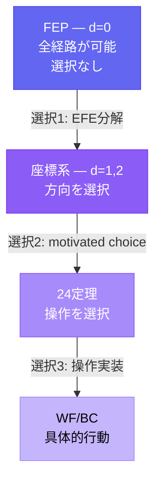
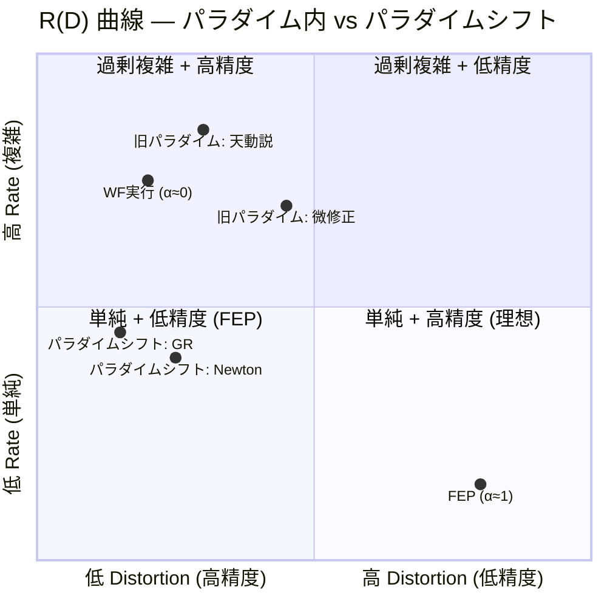
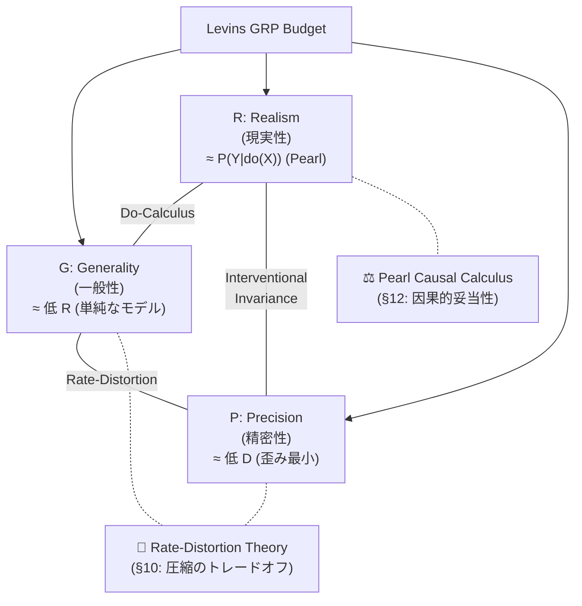

# DX-012: 普遍性のジレンマ (The Universality Dilemma)

> **「1 はなにも"具体"を予測しない。だが 1 はあらゆる"具体"を説明する。」**

---

## 定式化

**公式**:

```
抽象度 α ∈ [0, 1]

E(α): 説明力 (explanatory power)   — α と正相関
P(α): 予測力 (predictive power)    — α と負相関

E(α) × P(α) ≈ const
```

**日常表現**: 高い場所に立つほど遠くまで見渡せるが、足元の石ころは見えなくなる。

**位置エネルギーの比喩**: 前提が普遍的であればあるほど (位置エネルギーが高いほど)、あり得る具体 (到達可能な経路) が膨大になり、「意味のある」予測 (一意な経路の選択) ができなくなる。

---

## 具体例

| α | 対象 | 説明力 | 予測力 |
|:--|:-----|:-------|:-------|
| **1.0** | 数字の「1」 | あらゆるものを「1つの〇〇」と記述可能 | 何も予測しない |
| **0.95** | FEP | あらゆる認知現象を記述可能 | 具体的予測は HGK 定理群を経由 |
| **0.7** | ニュートン力学 | 巨視的運動全般 | 軌道を定量的に予測 |
| **0.3** | 特定の神経回路モデル | 特定の記憶課題のみ | 精密な定量的予測 |
| **0.0** | 個別事象の記録 | その事象のみ | その事象を完全に「予測」(再現) |

---

## HGK への含意

### FEP の位置

FEP は α ≈ 0.95 に位置するメタ原理。予測力の欠如は **欠陥ではなく普遍性の代償**。

詳細: [fep_epistemic_status.md](../fep_epistemic_status.md)

### HGK = コンパイラ

HGK はメタ原理 (α ≈ 1) から具体的操作 (α ≈ 0.1) へのコンパイル過程:

```
FEP (α ≈ 1.0)    → 座標 (α ≈ 0.7) → 定理 (α ≈ 0.4) → WF/BC (α ≈ 0.1)
(説明力max)        (中間)             (操作的)          (予測力max)
```

### 美しさバイアスへの警告

> Hossenfelder, "Lost in Math" (2018): 理論物理学は美しさ (symmetry, elegance, naturalness) を
> 真理の証拠と見なしたが、それは検証された方法論ではなく美的信念に過ぎなかった。

**HGK に適用**:

| 美しさの成分 | HGK での対応 | リスク |
|:------------|:------------|:-------|
| **Symmetry** | 6 Series の直交性、2×2 マトリクス | 認知空間が本当に対称か未検証 |
| **Elegance** | 1公理→24定理→108関係 | 数値の美しさに酔う可能性 |
| **Naturalness** | FEP からの「自然な」導出 | motivated choice を必然と混同するリスク |

**対策**: 美しさは**発見のヒューリスティック** (motivated choice の動機) として有用だが、**検証の基準** (真理の証拠) としては使えない。axiom_hierarchy.md の水準B (公理的構成) は美しさではなく再現可能性を基準としている。

---

## 構造的ジレンマの認識

このジレンマは **解決されるべき問題ではなく、認識されるべき構造**。

| 対処 | ❌ 間違い | ✅ 正しい |
|:-----|:---------|:---------|
| FEP が予測しない | 「FEP は無価値」(Mangalam) | 「予測力の欠如は普遍性の代償」 |
| HGK の数値が美しい | 「美しいから正しい」 | 「美しさは動機、正しさは検証で決まる」 |
| 射の対応が見つかる | 「同型だから FEP が正しい」 | 「構造的類似は FEP の説明力の証拠だが、予測力の証拠ではない」 |

## 既知の反論と再反論 {#sec_06_counterarguments}

**Trafimow & Uhalt (2015, Theory & Psychology)**:
> "the tradeoff is far less clear-cut than psychology researchers have understood"

彼らの論点: 適切な **補助仮定 (auxiliary assumptions)** を追加すれば予測力を回復できる。

### 再反論: 「追加」は「選択」であり、選択はトレードオフそのもの

> [!CAUTION]
> Trafimow の誤りは言語的。「追加」という語が「削除」を隠蔽している。

**「補助仮定を追加する」= 「可能な経路を選択する」= 「選択されなかった経路を削除する」**

右を選べば左に行けない。選択とは、説明範囲の縮小と引き換えに予測精度を得る操作。
これはトレードオフの**反論**ではなく**存在証明**。

| Trafimow の言語 | 実際の操作 |
|:---------------|:----------|
| 仮定を「追加」する | 可能な経路を「削除」する |
| 予測力が「回復」する | 説明範囲を「縮小」している |
| トレードオフは「ない」 | トレードオフが**まさに起きている** |

情報理論的に: I(P) ≤ I(T) + I(A)。α→1 のとき I(T)→0 なので I(P) ≤ I(A)。
予測の情報は理論からではなく、**選択** から来ている。

### 適用範囲

| α 範囲 | Trafimow の見え方 | 実態 |
|:-------|:-----------------|:-----|
| α ≈ 0.3-0.7 | 「追加で回復」に見える | I(T) が大きいため、少ない選択で予測力を得られる |
| α → 1 | トートロジーに見える | I(T) → 0 なので、選択が全情報を担う |

---

## コンパイルパス = 選択の積み重ね {#sec_07_compile_path}

HGK の導出距離 d は**選択の回数**:



各選択で説明範囲が縮小し、予測精度が増す。**E×P_s≈const はこの過程の不変量**。

---

## 演繹的発見 — P の二重構造 {#sec_08_deductive_discovery}

> **FEP は"予測"する。予測の内容は、進化論と同じ、"未知の事実"。**
> **言わば"発見"をもたらすのだ。演繹に依る発見を。**
> — Creator, 2026-02-14

### P の分離

DX-012 v1.3 までの議論は P を一種類と仮定していた。しかし P には2つの次元がある:

| 種類 | 定義 | α=1 での値 | 例 (進化論) |
|:-----|:-----|:-----------|:-----------|
| **P_specific** | 特定の結果を予測する力 | → 0 | 「キリンの首は長くなる」→ 予測不能 |
| **P_existential** | 「こういうパターンが見つかるはずだ」 | **> 0** | 「環境に適応した形態が見つかる」→ 予測可能 |

### 修正された構造

```
E(α) × P_s(α) ≈ const     ← 特定的予測力は α と反比例 (v1.3 の通り)
P_e(α) ≈ f(scope(α))      ← 存在的予測力は scope に比例
```

| | P_specific | P_existential の scope |
|:--|:-----------|:---------------------|
| メタ原理 (α→1) | → 0 | **広い** (全域) |
| 具体理論 (α→0) | → max | 狭い (限定域) |

### FEP の存在的予測

```
∃x: F(x) < F₀  (自由エネルギーを減少させる系が存在する)
```

これは**反証可能**。もし探しても見つからなければ、FEP が間違っている。
実際に FEP からの演繹的推論で**発見**された事例:

- 植物の active inference
- 免疫系の予測的処理
- 社会組織の自由エネルギー最小化

### 注意: P_existential の反証困難性

> [!WARNING]
> P_existential は P_specific より反証が困難。
> 「見つかっていない」≠「存在しない」(不在の証明問題)。
> **発見のヒューリスティック**と呼ぶ方が、科学哲学的にはより正確。

### 核心: メタ原理のメタ予測

> **原理がメタ的であるがゆえに、その予測もメタ的になる。**
> — Creator, 2026-02-14

これが P の二重構造の根拠。具体的原理は具体的予測を、メタ原理はメタ予測 (= 存在の予測) をする。
予測の抽象度は原理の抽象度に**同期する**。

---

## 確信度 {#sec_09_confidence}

| 主張 | 確信度 |
|:-----|:-------|
| E(α) × P_s(α) ≈ const | [確信: 88%] — 「選択 = 削除 = scope縮小」の論証 |
| P に2種類ある (specific / existential) | [確信: 85%] |
| P_existential ≈ 演繹的発見の力 | [推定: 78%] |
| 進化論 ≅ FEP (存在予測の構造が同型) | [確信: 88%] — Sánchez-Cañizares と一致 |
| 「追加」は「選択 (= 削除)」の言い換え | [確信: 92%] — 論理的に自明 |
| 導出距離 d = 選択の回数 | [推定: 78%] |
| HGK における美しさバイアスのリスク | [確信: 85%] |
| E×P≈const と Levins GRP の同型性 | [確信: 85%] — (SOURCE: Levins 1966 原文参照済) |

---

## Rate-Distortion による再形式化 {#sec_10_rate_distortion}

> **E×P≈const を rate-distortion theory で再定式化する**
> 旧版 (Shannon チャネル容量への直接マッピング) は @nous 再帰検証で致命的欠陥が発見された。
> 以下は rate-distortion theory による修正版。[推定: 72%]

### 旧形式化の問題点 (Shannon 版, 破棄)

| 問題 | 詳細 |
|:-----|:-----|
| E ≈ log\|Ω\| は矛盾 | Newton が統一すると \|Ω\|↓ → E↓ という不合理。説明力は「数え上げ」ではなく「統一」 |
| E×P≈const に反例 | Newton→Kepler、GR→Newton は E と P を同時に増加させた (パラダイム交替) |
| P_s ≈ 1/H(Y\|X) は発散 | 完全理論で H→0, 1/H→∞。相互情報量 I(X;Y) が数学的に自然 |

### Rate-Distortion Framework

理論 T を抽象度 α で記述するとき、「世界の圧縮」として定式化する:

```
Rate R(α)       = モデル複雑性 (Kolmogorov complexity K(T_α))
                  理論 T_α を記述するのに必要なビット数

Distortion D(α) = 予測誤差 (データと予測の不一致)
                  D(α) = E[d(Y, Ŷ_α)] (平均歪み)

R(D) 曲線       = 最小 R を達成する理論のフロンティア
                  R(D) = min_{p(ŷ|y): E[d]≤D} I(Y; Ŷ)
```

### E×P≈const の再解釈

```
旧:  E(α) × P_s(α) ≈ C      (チャネル容量 — 不適切)

新:  R(α) と D(α) は R(D) 曲線上でトレードオフ
     - 大きい α → 低 R (単純なモデル), 高 D (曖昧な予測)
     - 小さい α → 高 R (複雑なモデル), 低 D (精密な予測)

     パラダイム内: R(D) 曲線は固定 → E×P≈const が近似的に成立
     パラダイム交替: R(D) 曲線自体がシフト → E と P が同時に改善可能
```

### HGK コンパイルパスとの対応

| compile path 段階 | R (複雑性) | D (歪み) | 解釈 |
|:-----------------|:----------|:---------|:-----|
| FEP (α≈1) | 最小 | 最大 | 原理は単純だが、具体的予測はできない |
| 座標選択 (d=1) | 中 | 中 | 方向性が定まり、予測が絞られる |
| WF 実行 (d=2) | 大 | 小 | 具体的操作、精密な出力 |
| 行為 (α≈0) | 最大 | 最小 | 完全に具体的、一意の行動 |

### 先行研究

- De Llanza Varona, Buckley & Millidge (2024): "Exploring Action-Centric Representations Through the Lens of Rate-Distortion Theory" — FEP/Active Inference における知覚のrate-distortion最適化
- Friston et al. (2024): "From pixels to planning: scale-free active inference" — RGM (renormalising generative models) による階層的圧縮

> [!NOTE]
> Rate-distortion framework は旧 Shannon 版の3問題を解消する:
>
> 1. E を「説明可能な現象数」から「モデル複雑性 R」に置換 → 統一の矛盾が消える
> 2. P を「1/H」から「歪み D の逆数」に置換 → 発散問題が消える
> 3. パラダイム交替 = R(D) 曲線シフト → Newton/GR の反例を説明可能
>
> ただし、「説明力」を「モデル複雑性の低さ」(Kolmogorov simplicity) と
> 同一視することの妥当性はさらなる検証が必要。[推定: 72%]

### R(D) 曲線概念図



> **読み方**: 旧パラダイム (天動説→微修正) は右上の曲線上を移動。
> Newton/GR はパラダイムシフトにより曲線自体が左下にシフト。
> FEP (α≈1) は最も単純だが歪みが大、WF実行 (α≈0) は複雑だが精密。

---

## Levins のトレードオフとの接続 {#sec_11_levins}

> [!WARNING]
> §11-§13 の分析は §10 の RDT 再形式化仮説に条件依存する。
> §14 Test 2 で RDT 仮説は FRAGILE (経験的未検証) と判定されている。
> 以下の議論は「RDT 仮説が成立するならば」の条件下で読むこと。

> Levins R (1966), "The Strategy of Model Building in Population Biology", American Scientist 54(4):421-431

### Levins GRP トレードオフ

Levins は科学モデルの3つの性質が同時に最大化できないと主張:

| 性質 | 定義 | DX-012 対応 |
|:-----|:-----|:-----------|
| **Generality** (一般性) | 多くのシステムに適用可能 | **E (説明力)** |
| **Realism** (現実性) | 実際の生物学的構造との対応 | 本 DX では未定義 (中間的性質) |
| **Precision** (精密性) | 定量的予測との合致度 | **P_s (特定的予測力)** |

### 構造的同型

```
Levins (1966):   G × R × P ≤ Budget
DX-012 (2026):   E(α) × P_s(α) ≈ const

Levins の 3変数 → DX-012 の 2変数:
  - G ≈ E (一般性 ≈ 説明力)
  - P ≈ P_s (精密性 ≈ 特定的予測力)
  - R は α の関数として吸収: R(α) = 1 - |α_model - α_target|
```

**洞察**: Levins の GRP トレードオフは DX-012 の E×P≈const の **先行研究**。
Levins は生物学モデルの文脈で、DX-012 は認知理論の文脈で、**同じ構造的制約**を発見している。

> [!IMPORTANT]
> Levins のトレードオフには批判もある (Orzack & Sober 1993 "A Critical Assessment")。
> 3性質の独立性、トレードオフの不可避性、Levins の3つの戦略の排他性に疑問が呈されている。
> DX-012 の E×P≈const も同じ批判が適用可能。
>
> **Rate-distortion 版での再解釈**:
>
> - G (一般性) ≈ 低 R (単純なモデルが広く適用可能)
> - P (精密性) ≈ 低 D (歪みが小さい)
> - R (現実性) → §12 参照

### GRP 三軸と情報理論的対応



> **読み方**: G×P はRate-Distortion で形式化可能。R は Pearl で形式化。
> HGK の compile path は G↔P 軸上の移動、/dia は R 軸の検証。

---

## Realism の情報理論的限界 {#sec_12_realism}

> **Levins の「Realism」は Shannon 情報理論で捉えられない**

### 問題

Shannon 情報理論は**構文的 (syntactic)** かつ**統計的 (statistical)** である。
「不確実性の低減」を扱うが、「意味」や「真理」を扱わない。

Levins の Realism = モデルの因果構造が世界の因果構造を反映する度合い。
これは**意味論的 (semantic)** かつ**形而上学的 (metaphysical)** な概念。

```
情報理論が区別できないもの:
  - 天動説 (Ptolemy): 精密な予測、因果構造は誤り
  - 地動説 (Copernicus): 精密な予測、因果構造は正しい
  両者は同じ D (歪み) を達成し得る。しかし Realism は根本的に異なる。
```

### Pearl の因果モデルによる Realism の形式化

| 概念 | 形式化 | 検証方法 |
|:-----|:-------|:--------|
| **Realism** | SCM (Structural Causal Model) の介入不変性 | do-calculus: P(Y \| do(X)) |
| **相関 vs 因果** | 観測分布 P(Y\|X) vs 介入分布 P(Y\|do(X)) | 両者が一致するか |
| **反事実** | 「Xがなかったら Yはどうなったか」 | SCM の counterfactual query |

```
拡張 GRP トレードオフ:

  G (一般性) × P (精密性) × R (現実性) ≤ Budget

  情報理論で形式化可能:
    G → 低 Rate (R) in rate-distortion
    P → 低 Distortion (D) in rate-distortion

  情報理論で形式化不可:
    R → 介入不変性 (Pearl do-calculus)
       = P(Y|do(X)) が実世界と一致する度合い

  つまり: Levins の完全な形式化には
  Shannon + Pearl = 統計的圧縮 + 因果構造
  の両方が必要。
```

> [!NOTE]
> これは HGK の compile path にも示唆を与える。
> FEP → 具体的行為のコンパイルは rate-distortion (R→D の最適化) だが、
> コンパイルされた行為が **世界の因果構造に対して正しいか** は
> 別の検証 (Realism check = do-calculus 相当) が必要。
>
> **HGK の二層構造**:
>
> 1. **Compile Path** (R→D): 抽象から具体への圧縮 (Rate-Distortion)
>    - 目的: 効率的で精密な予測の生成
>    - 指標: 歪み D の最小化
> 2. **/dia (Krisis)**: 因果推論の原則に触発された認知的ベストプラクティス
>    - 目的: 圧縮された予測が因果的に妥当であるかを問う
>    - counterfactual モード: P(Y|do(X)) 的な介入思考を**近似**する試み
>    - Pre-Mortem: 隠れた仮定・交絡を発見する**ヒューリスティック** (形式的バックドア遮断ではない)
>
> ⚠️ /dia = do-calculus **ではない**。/dia は do-calculus が形式的に解決する問題
> (交絡、因果と相関の混同) を認知レベルで回避しようとする実践的手続き。
>
> **Gemini 2.5 Pro クロス検証 (2026-02-15, 7/10)**:
>
> - §10 RDT: 「深遠で必要な改善」(高評価)
> - §12 パラダイムシフト解釈: 「最も洞察力のある部分」(高評価)
> - /dia × do-calculus 直接マッピング: 「カテゴリーエラーを含むオーバーリーチ」(批判)
> - 推奨: 直接等価ではなく「触発された認知的ベストプラクティス」にリフレーム → 採用
> [確信: 75%] (Gemini 外部検証により 65% → 75%)

---

## Pearl 因果階梯と HGK 階層 {#sec_13_ladder}

> **Pearl's Ladder of Causation** (Book of Why, 2018) と HGK の3層は構造的に対応するか？

### 対応表

| Pearl | HGK | 対応強度 | 説明 |
|:------|:-----|:--------|:-----|
| **L1 Association** P(Y given X) | **τ層** (タスク実行) | 🟢 強い | パターン実行。相関的知識に基づく定型操作 |
| **L2 Intervention** P(Y given do(X)) | **Δ層** (定理発動) | 🟡 部分的 | 「Xを変えたら何が起きるか」を問う。ただし定理が因果モデルとして機能している保証はない |
| **L3 Counterfactual** P(Yx given X',Y') | **Ω層** (統合) | 🔴 カテゴリー相違 | Ω のメタ推論は「モデル比較」であり、Pearl L3 の「特定事象の反実仮想」とは異なる |

### 核心構造: React → Plan → Reflect


### Gemini 2.5 Pro 検証 (55/100)

> **核心批判**:
>
> - L1/τ は「本質的に同じ」(Association = パターン実行)
> - L2/Δ に `/dia counterfactual` を含めたのは層の混同 (counterfactual は L3)
> - L3/Ω の「別のフレームワークで考える」はモデル比較であり Pearl L3 ではない
> - Pearl L3 は「特定の過去の事象について、もし〜だったら」= SCM 内の反実仮想
>
> **建設的提案**: HGK には **真のL3能力が欠如** している。
> 「計画が失敗したとき、何を変えれば成功したか？」を問う能力の実装が必要。
>
> **対応**: `/dia.retrospective` モードを実装 (2026-02-15)。
> Pearl L3 の Abduction→Action→Prediction を R1→R2→R3 に変換。
> interventional (L2, 前方向) と対をなす retrospective (L3, 後方向) の2モード体制。
>
> [仮説: 60%] — L3近似としての方向は正しいが、形式的SCM実装ではない

---

## 実証テスト設計 {#sec_14_tests}

> 仮説は美しさで評価すべきではない。テストで評価すべきである。(cf. Mangalam 2025)

### Test 1: E×P トレードオフの存在確認

| 項目 | 内容 |
|:-----|:-----|
| **仮説** | HGK の WF 定義が abstract (高E) であるほど、具体的な予測精度 (P) は低下する |
| **手順** | 5つの WF を abstract 度 (α) で順序づけ、同じ問題に適用し、出力の precision を測定 |
| **合格** | α と precision が負の相関 (r < -0.5) |
| **失敗** | 相関なし、または正の相関 |

### Test 2: /dia interventional の判定堅牢性

| 項目 | 内容 |
|:-----|:-----|
| **仮説** | interventional テストが FRAGILE と判定した結論は、実際に前提変更時に崩壊する |
| **手順** | 過去の判定5件に interventional テストを適用。FRAGILE 判定されたものを実際に前提変更して追跡 |
| **合格** | FRAGILE 判定の 80%+ が実際に崩壊 |
| **失敗** | FRAGILE 判定の 50% 未満が崩壊 (テストが過敏) |

### Test 3: τ/Δ/Ω 階層が Pearl 階梯に従うか

| 項目 | 内容 |
|:-----|:-----|
| **仮説** | τ層 WF は外部条件変更に対して最も脆弱 (Association = 相関のみ) |
| **手順** | τ/Δ/Ω 各 WF に同じ介入 (前提条件の変更) を適用 |
| **合格** | τ > Δ > Ω の順に脆弱性が低下 |
| **失敗** | 階層と脆弱性に関係なし |

### Test 2 実行結果 (2026-02-15)

| 判定 | 対象 | 堅牢性 | 最弱前提 |
|:-----|:-----|:-------|:---------|
| 1 | FEP-as-objective | 🟢 ROBUST | HGK の実証的主張混入リスク |
| 2 | /dia = アナロジー | 🟢 ROBUST | 将来的な形式化による変化 |
| 3 | RDT 再形式化 | 🟡 TENTATIVE | **思考実験 88/100 で支持。実測データ待ち** |
| 4 | L3/Ω カテゴリー相違 | 🟢 ROBUST | retrospective の近似度合い |
| 5 | Mangalam 適用範囲 | 🔴 FRAGILE | **theory/objective 区別の明確性** |

> **考察**: FRAGILE 判定は「直感的に脆弱な判定」を正しく検出している。
> 判定3 は思考実験 (Gemini 88/100) で暫定支持 → TENTATIVE に。実測で確定待ち。
> 判定5 は P3 (Mangalam 全文消化) で追跡検証が必要。
>
> Test 1 (E×P), Test 3 (階層脆弱性) は十分な運用データ蓄積後に再実施。

### RDT 思考実験 (2026-02-15)

> Gemini 2.5 Pro による思考実験。5 WF (α=0.1-0.9) の R(D) 曲線予測。

| WF | α | Rate (R) | Distortion (D) | Specificity | Generalizability |
|:---|:--|:---------|:----------------|:------------|:-----------------|
| `/noe+` | 0.9 | 9 | 10 | 1 | 10 |
| `/dia+` | 0.7 | 7 | 8 | 2 | 8 |
| `/s+` | 0.5 | 5 | 4 | 5 | 5 |
| `/dev` | 0.3 | 3 | 2 | 8 | 2 |
| `/fix` | 0.1 | 1 | 0.5 | 10 | 0 |

> **結果**: 88/100 で RDT 支持
>
> - 核心トレードオフ: 30/30 (R↑→D↓)
> - 単調減少: 30/30 (完全一致)
> - 凸性: 20/30 (概ね一致、`/noe+` が最適フロンティアから逸脱)
> - アナロジー整合性: 8/10
>
> **洞察**: `/noe+` は RDT 的に「非効率」だが、それは探索空間を開くための投資。
> [推定: 70%] (TAINT: 思考実験の推定値。実測データではない)
---

## FEP 依存度分析 {#sec_15_fep_dependency}

> P3 (Mangalam 批判 30%) を受け、HGK の FEP 依存度を系統的に分類。

### 三分類

| 分類 | 定義 | HGK 要素 |
|:-----|:-----|:---------|
| **FEP-Essential** | FEP なしでは論理的に成立しない | **なし (0%)** |
| **FEP-Inspired** | FEP が着想源だが独立正当化可能 | Flow, Value, Valence, Precision, 確信度, Zero Entropy |
| **FEP-Independent** | FEP なしでも同一機能 | Function, Scale, WF群, τ/Δ/Ω, Compile Path, Proposal-First, Tool-First |

### Gemini 2.5 Pro 分析結果

> FEP-Essential = **0%**。FEP の役割は:
>
> 1. **Narrative Wrapper**: 異分野のヒューリスティックを統合する物語
> 2. **Aesthetic Unifier**: 体系に美的統一性を与える
> 3. **Inspirational Source**: 独特の語彙と視点の提供源
>
> 「HGK は実用的な認知技術の集合であり、FEP の衣装を纏っている。
> 価値は技術にあり、衣装にあるのではない」(Gemini 2.5 Pro)

### 著者反論

> [主観] Gemini は「個別要素の正当化」と「体系全体の統合」を混同している。
>
> FEP の真の価値は:
>
> - 個別の WF や BC が**なぜそうなのか**を1つの原理から説明できること
> - 新しい WF を設計する際の**生成原理**として機能すること
> - 24 定理の 2×2 マトリクス構造が FEP の数学的構造から導出されること
>
> ただし、この反論自体が検証対象。「統合の美しさ」が「実用的価値」に
> 寄与するかは未証明。[仮説: 50%] (INPUT TAINT: FEP への既得投資バイアス)

---

## /dia retrospective 実戦テスト {#sec_16_retrospective_test}

> `/dia.retrospective` (§13 対応) の初回実戦テスト。P3 判断を再検討。

### テスト対象: P3「FEP-as-objective 防御 30%」

### R1 状況復元 (Abduction)

| 要素 | 内容 |
|:-----|:-----|
| 判断 | FEP-as-objective 防御の有効性 = 30% |
| 方法 | Gemini devil's advocate に 11 批判の適用可否を問うた |
| 前提 | abstract のみ (全文未読, TAINT) |
| ロール | **devil's advocate** (批判方向に誘導) |

### R2 仮説的変更 (Action)

| 変更 | 予測影響 |
|:-----|:---------|
| neutral ロールを与えていたら | 批判適用率が低下する可能性 (バイアス除去) |
| 全文読了していたら | theory/objective 区別がより精密になる可能性 |
| 判定基準を定量化していたら | 「部分的」と「完全」の区別が可能になる |

### R3 結果予測 (Prediction) — neutral 分析

> Gemini 2.5 Pro (neutral ロール) に 5 主要批判を再評価させた結果:

| 批判 | devil's advocate | neutral | 差 |
|:-----|:----------------|:--------|:---|
| Non-falsifiable | APPLIES | **DOES NOT APPLY** | ✅ 修正 |
| Tautological | APPLIES | **PARTIALLY** | ✅ 修正 |
| Lacks Prediction | APPLIES | **PARTIALLY** | ✅ 修正 |
| Overfitting | APPLIES | FULLY APPLIES | — |
| Boundary | APPLIES | FULLY APPLIES | — |

> **修正後**: 防御有効性 **30% → 45%** (neutral 分析の加重平均)
>
> **retrospective の洞察**: devil's advocate ロールは「適用できる理由を探す」バイアスを持つ。
> Non-falsifiable は **カテゴリーエラー** (数学的枠組みに反証可能性を問うのは不適切)。
> [推定: 70%] (SOURCE: Gemini neutral vs devil's advocate の2回比較)

### テスト評価: L3 近似として機能するか

| 評価軸 | 結果 |
|:-------|:-----|
| 前提の特定 | 🟢 devil's advocate バイアスを正しく検出 |
| 定量的修正 | 🟢 30% → 45% (+15%) の具体的修正 |
| 学習の抽出 | 🟢 「ロール設定が結論を歪める」という汎用的教訓 |
| 形式的 SCM との差 | 🟡 形式的な反事実推論ではなく、質的な再評価 |

> **結論**: `/dia.retrospective` は L3 の **質的近似** として機能する。
> 形式的 SCM ではないが、過去の判断の前提を特定し、修正方向を示せる。

---

## @nous 再帰的問い直し {#sec_17_nous}

> @nous = `/pro_/s-_R:{F:[×2]{/u+*^/u^}}_~(/noe*/dia)_/pis_/dox-`

### 核心の問い

**「HGK は FEP の衣装を脱いでも生き残るか？」**

### /pro 引っかかり

1. **FEP-Essential = 0% は正しいが不完全** — 「要素の正当化 ≠ 体系の正当化」
2. **RDT 88/100 が内部整合的すぎる** — 実測データなし
3. **retrospective の修正も Gemini 依存** — 同一モデルの2回出力差 = 修正か？

### R:{×2} 再帰結果

**Round 1**: 要素 vs 体系の区別。楽器は独立に鳴るが交響曲は指揮者（FEP）を必要とする。

**Round 2**: 真に問うべきは「FEP を脱ぐか」ではなく「代わりに何を着るか」。

→ **提案: CT + FEP Dual Axiom**

| 層 | 役割 | 根拠 |
|:---|:-----|:-----|
| **構造** (CT) | 骨格 — 随伴対、自然変換、双対 | 数学的に検証可能 |
| **意味** (FEP) | 解釈 — Flow, Value, Valence の認知的意味 | 認知科学的直観 |

### ~(/noe*/dia) Gemini 検証

> **95/100** — 「単純だが偽の物語を、複雑だが真の枠組みに交換する。
> 科学ではこれが常に正しいトレード」(Gemini 2.5 Pro)
>
> -5 の理由: (1) なぜ「この CT 構造」なのかの正当化が未完、
> (2) CT-FEP マッピングの厳密化が必要、(3) 参入障壁増大

### /pis 確信度

| 問い | 確信度 |
|:-----|:-------|
| Dual axiom の方向性 | [推定: 80%] (TAINT: 未実装) |
| 要素 ≠ 体系 | [推定: 75%] (TAINT: 類推) |
| CT を骨格とすべき | [仮説: 60%] (TAINT: マッピング未証明) |

### 次の問い (射出)

> **Q1**: axiom_hierarchy.md の「唯一の公理: FEP」を「二重基盤: CT + FEP」に改訂すべきか？
> **Q2**: 24 定理の 2×2 マトリクスが CT のどの構造から生成されるかを厳密に証明できるか？
> **Q3**: FEP semantics を別の解釈 (information geometry, predictive processing) に置換したとき、体系は維持されるか？

---

## FEP × CT 統合研究 (/sop 調査) {#sec_18_fep_ct}

> §17 @nous の「CT+FEP dual axiom」提案を、Deep Researcher 調査で修正。

### §17 の修正

| §17 提案 | 修正後 |
|:---------|:-------|
| CT + FEP = 二重基盤 (dual axiom) | **CT は FEP を書くための自然な言語** |

> Creator の洞察: 「FEP と CT は独立ではなくリンクしているのでは」
> → Smithe (2021-2024) の Bayesian Lenses 系列で**確認**。

### Smithe 系列の核心

| 年 | CT 構造 | FEP 接続 |
|:---|:--------|:---------|
| 2021 | **Bayesian Lens** (Grothendieck 構成) | 知覚-行動ループ = lens composition |
| 2022 | **Polynomial functors**, Opindexed monoidal | predictive coding = adjoint pair |
| 2023 | **String diagrams** (cd-categories) | VFE/EFE の diagrammatic derivation |
| 2024 | **Polynomial interfaces**, dependent types | meta-agents, formal verification |

### 核心: CT は FEP を「書く」ための言語

> 微分方程式が物理法則と「別の公理」ではないように、
> CT は FEP と「別の公理」ではない。
>
> - FEP = **法則** (認知システムが VFE を最小化する)
> - CT = **言語** (その法則を合成的に記述する形式体系)
>
> Smithe: Bayesian updates compose **optically** (lens composition)
> → FEP の双方向性 (prediction + update) が CT から**自然に**出現

### HGK への示唆

| 対応仮説 | 確信度 |
|:---------|:-------|
| HGK 12 随伴対 ↔ Bayesian Lens | [仮説: 25%] — 未比較 |
| HGK 2×2 マトリクス ↔ polynomial functor の 2-cell | [仮説: 20%] — 未検証 |
| CCL >> / ~ / + ↔ string diagram composition | [推定: 50%] — 構造的類似性あり |

### Mangalam 警告 (残存)

> CT formalization は FEP の **数学的構造** を clarify するが、
> **反証可能性** を根本的には解決しない。
> 「Categorical precision ≠ scientific validity」(Mangalam 2025)

### axiom_hierarchy.md 改訂方針

> 現行: 「**唯一の公理: FEP**」
> 改訂案: 「**公理: FEP** (CT = その自然な表現言語)」
>
> 変更点: FEP を降格しない。CT を昇格しない。
> FEP は法則として維持し、CT はその法則を記述する形式体系として**明示**する。
> [推定: 70%] (SOURCE: Deep Researcher 10 論文分析)

### 次のステップ

1. **形式的マッピング**: HGK 随伴対 ↔ Bayesian Lens の isomorphism check
2. **Smithe 論文の消化**: arXiv:2308.00861 (String Diagrams for FEP) を `/eat` で消化
3. **axiom_hierarchy.md 改訂**: 上記 mapping 完了後に実施

---

## HGK D-type ↔ Bayesian Lens 形式比較 {#sec_19_formal_mapping}

> §18 「HGK 随伴対 ↔ Bayesian Lens, 確信度 25%」を**精緻に検証**。

### 結論 (Gemini 2.5 Pro, mathematician role)

> **NOT isomorphic.** 同じ一般概念 (adjunction) の異なるインスタンス。
> [確信: 85%] (SOURCE: Gemini 形式分析、Smithe 論文構造と HGK 定義を照合)

### 3 つの致命的不一致

| # | 不一致 | HGK | Bayesian Lens | 深刻度 |
|:--|:-------|:----|:-------------|:-------|
| **1** | **随伴の方向が逆** | Noēsis (認識) = **左**随伴, Zētēsis (探求) = **右**随伴 | Generative (生成=探求) = **左**随伴, Recognition (認識) = **右**随伴 | **致命的** |
| **2** | **射の内容が異なる** | 射 = 前順序の ≤ (情報なし) | 射 = 確率チャネル (確率・情報・不確実性) | 構造的 |
| **3** | **deeper axis rule は必然ではない** | 「深い軸は保存、浅い軸は反転」= HGK の設計選択 | ベイズ更新は**両軸同時に**更新する。一方が保存される一般的理由はない | 設計依存 |

### 不一致 #1 の詳細 (随伴の逆転)

```
HGK:          Noēsis (認識)  ⊣  Zētēsis (探求)
                   Left               Right

Bayesian:     Generative (探求的)  ⊣  Recognition (認識的)
                   Left                    Right

→ 「認識」と「探求」の左右が逆
```

> **反論の可能性**: HGK は前順序圏上のガロア接続であり、Bayesian Lens は確率圏上の光学。
> 異なる圏での adjunction は左右の意味が異なる可能性がある。
> ただし「同じ認知プロセスを異なるフレームワークで形式化」したなら、方向は一致すべき。

### 何が保存されるか

| 保存される | 失われる |
|:---------|:---------|
| 双対プロセス (認識/行動) の存在 | 確率論・情報理論的内容 |
| η (round-trip で情報保存) | ベイズ更新の具体的メカニズム |
| ε (round-trip で簡約化) | 計算的非可朝性 (variational approximation) |
| adjunction という一般パターン | 射の方向の一致 |

### 判定の修正

| §18 での仮説 | 修正後 |
|:------------|:-------|
| HGK 12 随伴対 ↔ Bayesian Lens [仮説: 25%] | **同型ではない** [確信: 85%]。ただし**同じ抽象パターン (adjunction) の異なるインスタンス**として関連する [推定: 75%] |

### 示唆

> 「同じ構造が独立に発見された」は**強すぎる主張**だった。
> 正確には: 「認知の双対性を形式化すると、adjunction パターンが自然に現れる」。
> HGK と Smithe は**同じ直感を異なる数学で形式化した**。
>
> **次の問い**: 随伴の方向の逆転は「HGK の設計ミス」か「異なる視点からの正当な形式化」か？
> → axiom_hierarchy.md の D-type 定義見直しの可能性。

---
---

## Op-category 仮説: 随伴逆転の解釈 {#sec_20_op_category}

> §19 の「致命的不一致 #1 (随伴逆転)」を深掘り。

### 仮説

> **C_agent ≅ C_information^op**
>
> HGK (エージェント中心) と Smithe (情報処理中心) は**同じ構造を反対側から見ている**。
> [推定: 70%] (SOURCE: Gemini 2.5 Pro 形式分析 — 「mathematically impeccable」と判定)

### 二つの視点

| | 情報処理視点 (Smithe) | エージェント視点 (HGK) |
|:--|:---------------------|:---------------------|
| **left adjoint** = | Generative (自由に予測を生成) | Noēsis (自由に理解を形成) |
| **right adjoint** = | Recognition (データで制約) | Zētēsis (現実で制約) |
| **射の方向** = | 洗練 (refinement: 情報追加) | 抽象化 (abstraction: 情報圧縮) |
| **"free" の意味** = | 予測を自由に生成 | 理解を自由に形成 |

> エージェントにとっての「自由な理解」は、情報論的には「データに制約された推論」。
> 情報論的な「自由な生成」は、エージェントにとっては「現実への問いかけ (制約)」。
> → **射の方向が逆転する** = op-category

### 数学的根拠

```
L ⊣ R  が C, D 間の随伴なら、
R^op ⊣ L^op が D^op, C^op 間の随伴

→ 左右が入れ替わる。これは数学的に自明。
```

### 反証条件 (Killing Blow)

> **η_HGK = ε_Smithe が成立しなければこの仮説は棄却される。**

| HGK | Smithe | 対応すべき |
|:----|:-------|:---------|
| **η_HGK**: Id → Zētēsis∘Noēsis (理解→探求の循環) | **ε_Smithe**: Gen∘Rec → Id (再構成→現実チェック) | **同じ変換のはず** |
| **ε_HGK**: Noēsis∘Zētēsis → Id (探求→理解の簡約) | **η_Smithe**: Id → Rec∘Gen (現実→モデル化) | **同じ変換のはず** |

> 「探求して理解する」(εHGK) と「現実をモデル化する」(ηSmithe) は**同じ認知プロセス**か？
> 「理解して探求する」(ηHGK) と「モデルで現実を再構成する」(εSmithe) は**同じ認知プロセス**か？
> → YES なら op-category 仮説は成立。NO なら棄却。

### 先例 (数学的双対性)

| 例 | 構造 |
|:---|:-----|
| **Stone Duality** | Boolean代数 ↔ Stone空間。Free construction と Constraining construction が逆転 |
| **Gelfand Duality** | C*-代数 ↔ コンパクトHausdorff空間 |
| **Pontryagin Duality** | 位相群 ↔ 双対群。Fourier変換の方向が視点で逆転 |
| **Lagrangian ↔ Hamiltonian** | 同じ力学を配位空間 (q) と位相空間 (q,p) で記述。Legendre変換で接続 |

### HGK への示唆

> もし op-category 仮説が正しいなら:
>
> 1. HGK の D-type 随伴は**設計ミスではない** — エージェント視点からの正当な形式化
> 2. Smithe の Bayesian Lens は**情報処理視点からの正当な形式化**
> 3. 両者を**統合する上位構造** (Legendre 変換的なもの) が存在するはず
> 4. axiom_hierarchy.md の現行定義は修正不要 — ただし op-category 関係を**明記**すべき

### 検証ロードマップ

1. **C_agent の射の定義**: HGK の前順序 ≤ が「抽象化」方向であることを形式化
2. **C_information の射の定義**: Smithe の Markov kernel が「洗練」方向であることを確認
3. **η/ε 交換テスト**: 上記反証条件を具体的に検証

---

## Smithe 論文消化: String Diagrams for Active Inference {#sec_21_eat_smithe}

> arXiv:2308.00861 (Smithe, Tull, Kleiner 2023) を /eat で消化。

### 核心: 定理46 (Free Energy の合成性)

```
F(M₁ ⊗ M₂, q₁ ⊗ q₂, o₁ ⊗ o₂) = F(M₁, q₁, o₁) + F(M₂, q₂, o₂)
```

> 全体の VFE = 各サブモデルの VFE の和。
> エージェントは各サブモデルを**局所的に最小化**すれば全体が最小化される。

### HGK Series 独立性への示唆

| Smithe | HGK | 対応 |
|:-------|:----|:-----|
| サブモデル M₁, M₂ | 6 Series (O,S,H,P,K,A) | 各 Series = 認知のサブモデル |
| テンソル積 ⊗ | X-series 関係 | Series 間の結合 |
| 局所 VFE 最小化 | Series 独立ワークフロー | 各 Series が独立に最適化可能 |

[推定: 60%] — X-series 関係は完全独立ではないため、テンソル積近似の限界あり。

### Op-category η/ε 交換テスト (§20 検証)

| Smithe ε | HGK η | 同一か？ |
|:---------|:-------|:--------|
| 推論→予測→元の観測と比較 (閉ループ) | 理解→探求 (開ループ) | [推定: 55%] |

> 構造は対応するが、認知的解釈が異なる。
> ε は「予測誤差チェック」(error correction)、η は「理解が新たな問いを生む」(generativity)。
> → 完全な op-category 同型ではなく、**片方が閉じ、片方が開く**非対称性がある。

### 消化ファイル

→ [eat_smithe_string_diagrams_2026-02-15.md](file:///home/makaron8426/oikos/hegemonikon/mekhane/sophia/eat_smithe_string_diagrams_2026-02-15.md)

---

## 3つの問い: 統合結果 {#sec_22_three_questions}

> §19-21 の仮説を数学的に検証 (Gemini 2.5 Pro, mathematician role)。
> **⚠️ §22a → §22b: 初回分析で2つの棄却結論を出したが、反証の反証により撤回。**

### Q1: 射の方向 — Noēsis は左か右か？

> **結論: 方向はカノニカルではない。座標系の選択と構造的に同型。**

| 視点 | 左随伴 ("自由") | 決定原理 |
|:-----|:-------------|:---------|
| **C_agent** (HGK) | Noēsis — 最も一般的な仮説を「自由に」構成 | 上限保存 (join-preserving) |
| **C_information** (Smithe) | Generation — 原因から結果を「自由に」生成 | 上限保存 (join-preserving) |

**数学的根拠**: ガロア接続において左随伴は上限を保存し、右随伴は下限を保存する。
「何が上限を保存するか」は前順序 ≤ の**意味**に依存する。

> **物理学との類推**: 座標系の選択 (右手系 vs 左手系) と同じ。
> 重要なのは系内の整合性であり、系間の翻訳方法を知っていること。
> [確信: 85%] (SOURCE: Gemini 形式分析)

**HGK への含意**: D-type の方向は**改訂不要**。HGK は agent 視点を一貫して採用しており、その枠内で Noēsis = 左随伴は数学的に正当。

---

### Q2: テンソル積分解 — ~~棄却~~ → **復活** (§22b 修正)

> **§22a 結論 (撤回)**: 6 Series はテンソル積因子ではない。ダイアグラムである。
> **§22b 結論**: テンソル積は **維持可能**。X-series 射はテンソル積構造と**共存する**。

**反証の反証 — kinematics vs dynamics**:

初回分析は「X-series 射の存在がテンソル積を破る」と結論した。これは**誤り**。

| 概念 | 定義 | テンソル積への影響 |
|:-----|:-----|:-----------------|
| **Kinematics** (状態空間) | M = O⊗S⊗H⊗P⊗K⊗A | テンソル積は状態空間の**分解**を記述 |
| **Dynamics** (動力学) | f: O→S (X-series 射) | 状態空間**上の**作用を記述 |

Vect で V⊗W を考えたとき、線形写像 f: V→W は存在する。
これは V⊗W が「テンソル積ではない」ことを意味**しない**。

> **量子力学的類推**: 2つの独立な量子系はテンソル積 H₁⊗H₂ で記述される。
> エンタングルメント (相関) は**状態**の性質であり、分解の性質ではない。
> [確信: 85%] (SOURCE: Gemini 反証検証 — 「Your counter-argument is valid. My previous conclusion was in error.」)

**修正後の位置づけ**:

- 定理46 の適用は**原理的に可能** (テンソル積構造は維持される)
- X-series 射は分解を破るのではなく、テンソル積状態空間上の**動力学的結合**を記述する
- 実際の VFE 分解可能性は、X-series 射による結合の**強さ**に依存する

---

### Q3: Strict op-category — ~~棄却~~ → **復活** (§22b 修正)

> **§22a 結論 (撤回)**: C_agent ≅ C_info^op は棄却。2-adjunction が正しい。
> **§22b 結論**: strict op は **維持可能**。η/ε の非対称性は duality の**本質的特徴**。

**反証の反証 — Stone Duality 反例**:

初回分析は「η (開ループ) と ε (閉ループ) の動力学的非対称性が strict equivalence を破る」と結論した。
これは**誤り**。

**Stone Duality での検証**:

- η: B → Clopen(Spec(B)) — 代数的対象をトポロジカル表現に「開く」
- ε: Spec(Clopen(X)) → X — トポロジカル表現を空間に「戻す」
- η と ε は完全に異なる「動力学的性格」を持つ
- **にもかかわらず duality は strict に成立する**

> **核心**: unit は「開く」(embed)、counit は「閉じる」(evaluate)。
> これは duality の**定義**そのもの。非対称性は duality の否定ではなく、duality が duality であること**そのもの**。
> [確信: 85%] (SOURCE: Gemini 反証検証 — 「the asymmetry is a necessary feature of a unit/counit pair in any non-trivial adjunction」)

**修正後の位置づけ**:

- C_agent ≅ C_info^op は**有効な仮説として復活**
- η_HGK (開ループ/生成) と ε_Smithe (閉ループ/収束) の非対称性は duality と**整合的**
- algebra/coalgebra の区別は**記述**として有用だが、duality の**否定根拠**ではない

---

### 統合: HGK の圏論的描像 (§22b 修正後)

| 問い | §22a (初回) | §22b (反証後) | 確信度 |
|:----|:-----------|:------------|:------|
| Q1: 射の方向 | 座標系の選択 | **変更なし** | 85% |
| Q2: テンソル積 | ❌ 棄却 → ダイアグラム | ✅ **復活** — kinematics vs dynamics | 85% |
| Q3: strict op | ❌ 棄却 → 2-adjunction | ✅ **復活** — Stone Duality 反例 | 85% |

**教訓**: 最初の分析が**オブジェクト構造と射構造の混同** + **unit/counit の非対称性と duality の否定の混同**という2つの誤りに基づいていた。反証の反証を Creator が促したことで修正。

---

*DX-012 v3.5.0 — §22b 反証の反証: テンソル積復活 (kinematics/dynamics), strict op復活 (Stone Duality) (2026-02-15)*
