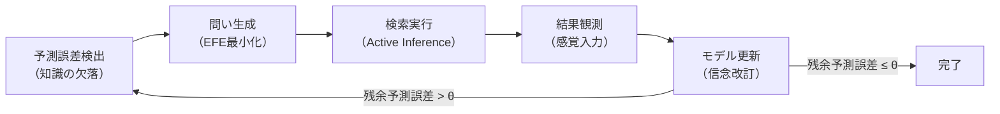

> **Kernel Doc Index**: [axiom_hierarchy](axiom_hierarchy.md) | search_cognition ← 📍 | [VISION](../mekhane/periskope/VISION.md)

# 検索認知論 (Search Cognition Theory)

> **「検索エンジンは情報を見つけるツールではなく、問いを生成する認知プロセスである。
> その認知プロセスには構造があり、その構造は FEP で記述でき、
> HGK のワークフロー体系で実行できる。」**
> — Creator 承認 (2026-02-19)

---

## 0. 設計原則 (Design Invariants)

> **v1.1 追加 — Creator との対話 (2026-02-19 21:00) から導出。**

### 原則 I: 認知主権 (Cognitive Sovereignty)

> **知覚と認知は主体のコアコンピタンスである。ツールがこれを代替してはならない。**

知覚を外部に委託した主体はもはや主体ではない。
FEP 的には Markov blanket の sensory states は blanket の内側にしか存在しない。
Periskopē は blanket の**外側のツール**であり、active states (検索実行) は代行できるが、
sensory states (「これが自分にとって意味がある」という認識) は代行できない。

- **知覚すら代替したら、何が残るの？** — 何も残らない。それは主体の消失。
- 経営の比喩: 製造のアウトソーシング ≠ 経営判断のアウトソーシング。後者を失えば殻 (shell company) になる。
- **認知 = 主体の存在条件そのもの**。これは公理に近い。

### 原則 II: 支援と代替のスペクトラム

> **支援と代替の違いは、運動主体の違い。検索を選択するのはユーザーであるべき。**

支援と代替は二値ではなくスペクトラム:

```
完全代替 ←──────────────────→ 完全放置
              ↑
        設計空間はここ

  • 水辺に連れて行く         (場の提示)
  • 水の匂いを嗅がせる       (空白の可視化)
  • 唇に水をつける           (nudge)
  • 口を開ける手助け         (構造化支援)
  ─ ─ ─ ─ ─ ─ ─ ─ ─ ─ ─  ← ここに境界
  • 水を飲ませる             (知覚の代替 ← ❌)
```

世界は二元論ほど単純ではない。
**世界は私たちにとっての予測のしやすさなど全く興味がない**。
二元論は「わかった気になれる」単純化に過ぎない。
スペクトラム上のどこに位置するかを常に意識し、境界を超えないことが設計責任。

### 原則 III: Copilot モデル

> **Periskopē は Autopilot ではなく Copilot。主体のそばで、主体の認知を支える。**

```
┌──────────────────────────────────────┐
│       主体（Creator / Claude）        │
│  ┌──────────┐    ┌──────────┐        │
│  │ 知覚     │    │ 判断     │        │
│  │ (認知)   │    │ (選択)   │        │
│  │ ★不可分★ │    │ ★不可分★ │        │
│  └────┬─────┘    └────┬─────┘        │
│  コアコンピタンス = 内側に留める      │
├───────┼────────────────┼─────────────┤
│       ↓   Markov blanket            │
├───────┼────────────────┼─────────────┤
│  ┌────┴─────┐    ┌────┴─────┐        │
│  │ 提示     │    │ 実行     │        │
│  │ (リマインド)|   │ (検索)   │        │
│  │ Φ1 支援  │    │ Φ5-Φ7   │        │
│  └──────────┘    └──────────┘        │
│       Periskopē（ツール側）           │
└──────────────────────────────────────┘
```

| 領域 | 誰がやるか | 具体例 |
|:-----|:----------|:------|
| **知覚** (What) | 主体 (Creator + Claude 結合系) | 「自分は X を知らないと気づく」 |
| **判断** (Whether) | 主体 (Creator + Claude 結合系) | 「この空白を埋めるべきか」を決める |
| **提示** (Remind) | Periskopē (パイプライン内部) | 「ここに空白がありますよ」(nudge) → Claude が応答 |
| **実行** (How) | Periskopē | 「7 ソースで並列検索して統合する」 |

> **二重 Copilot 構造**: Creator → Claude (仲介) → Periskopē → Claude → Creator。
> Φ1 の逆質問は Claude がパイプライン内部で自動応答する。Creator への転送なし。
> 認知主権への介入は「避けられない程度問題」であり、Claude が仲介することで UX は保たれる。

---

## 1. 検索の FEP モデル

### 1.1 検索クエリ = EFE 最小化アクション

検索は Active Inference の一形態である。検索クエリ q の生成は、
Expected Free Energy (EFE) を最小化するポリシー π の選択として定式化される:

```
G(π) = -E_Q[D_KL[Q(o|s,π) || Q(o)]]  -  E_Q[log P(o|C)]
        ↑ Epistemic Value (ε)            ↑ Pragmatic Value (π)
        情報取得価値                       目的達成価値
```

| 項 | 検索における意味 | 最適化 |
|:---|:---------------|:------|
| **ε (Epistemic)** | このクエリで知らないことをどれだけ知れるか | 検索範囲の拡大、多言語展開、未知ドメイン探索 |
| **π (Pragmatic)** | このクエリでどれだけ目的に近づくか | クエリ精錬、ソース選択、結果フィルタリング |

**検索の二値性は Value 座標 (d=1) の直接的帰結**:
Value (E↔P) = 認識的探索 ↔ 実用的収束。検索の全フェーズはこの二極間の振動として記述される。

### 1.2 検索ループ = 知覚-行動ループ



Flow 座標 (d=0): I (推論) ↔ A (行為) がこのループの基底。
検索は推論（問いの構築）と行為（クエリの投入）の反復。

### 1.3 計画 8 割、実行 2 割の FEP 的根拠

> **Creator の直観**: 問いを建てるプロセスに全体の 8 割のリソースを費やすべき。

FEP からの導出:

1. **EFE の ε 項が支配的**: 検索の初期段階では、情報の非対称性が大きい。
   ε (epistemic value) >> π (pragmatic value)。
   したがって EFE の最小化はほぼ全て ε の最大化に帰着。

2. **Precision Weighting**: 問い生成フェーズでの Precision (確信度) は低い。
   低 Precision = 高度な Exploration が必要。
   Function 座標 (Explore↔Exploit) が Explore 極に偏る。

3. **Attractor Basin**: 良い問いは attractor basin を正しく特定する行為。
   Basin の特定後は、結果の収集は gradient descent に近い（機械的）。
   Basin の特定（問い生成）こそが認知的に困難な部分。

---

## 2. 検索の 7 段階認知フロー

### 2.1 段階定義

| # | 段階 | FEP プロセス | HGK 定理 | 実行主体 | 比率 |
|:--|:-----|:-----------|:---------|:---------|:-----|
| **Φ1** | 無知のリマインド | 予測誤差の提示 | **O1 Noēsis** | **Claude** (Periskopē がパイプライン内部で支援) | ████ |
| **Φ2** | 拡散思考 | Exploration | **O3 Zētēsis** | Claude + Periskopē (クエリ展開) | ████ |
| **Φ3** | 文脈配置 | Context Setting | **P1 Khōra** | Claude + Periskopē | ██░░ |
| **Φ4** | 収束思考 | Exploitation | **A2 Krisis** | **Creator + Claude** (判断は主体が担う) | ██░░ |
| **Φ5** | 行動準備 | Policy Selection | **S2 Mekhanē** | Periskopē | █░░░ |
| **Φ6** | 行動 | Active Inference | **O4 Energeia** | **Periskopē** (委任可能) | █░░░ |
| **Φ7** | 信念更新 | Belief Update | **H4 Doxa** | **Creator** (認知は不可分) | █░░░ |

> **Φ1-Φ4 = 問い生成 (80%)**、**Φ5-Φ7 = 検索実行 (20%)**
> **主体 = Creator + Claude の結合系**。Creator 単体ではなく、Claude が仲介者として機能する。
> **Φ1 は常時 ON**: パイプライン内部で自動実行。Claude が Creator の文脈を理解して応答する。
> **Periskopē が運動の主語になれる段階**: Φ5, Φ6 — 実行と準備は委任可能

### 2.2 各段階の詳細

#### Φ1: 無知のリマインド (O1 Noēsis)

**「何を知らないか」を知るのは主体の仕事。Periskopē はそれを支援する。**

- ❌ 「何を知らないか」を**知る** — これは主体にしかできない (原則 I)
- ✅ 「何を知らないか」を**提示する** — 無知のリマインド
- Periskopē の支援手段:
  1. **空白の可視化** — Shannon Diversity Index が低い領域の提示
  2. **反事実クエリ** — 「もし〜だったら」の問いの生成
  3. **盲点の指摘** — 「この検索結果には〜の視点が欠けている」
  4. **想起の促進** — 過去の検索履歴との差分の提示
- **出力**: 空白候補の提示 → 主体が「これは重要だ」と知覚する (ここがツールの限界)

#### Φ2: 拡散思考 (O3 Zētēsis)

**「何を問うべきか」を探求する**

- Exploration の最大化: 問いの空間を広げる
- 多言語展開 (R06): 日→英→中 のクエリ翻訳で認知的死角を減らす
- **出力**: クエリ候補リスト (query candidates)

#### Φ3: 文脈配置 (P1 Khōra)

**「どの場で問うか」を決める**

- Khōra (場): 検索の文脈空間を設定
- ソース選択 (F12 _classify_query): academic / implementation / news / concept
- ドメインスコーピング: ニッチプラットフォームの選択
- **出力**: ソースリスト + スコープ設定

#### Φ4: 収束思考 (A2 Krisis)

**「最良の問いに絞る」**

- 判定力: クエリ候補から EFE を最小化するものを選択
- Valence (−): 不適切なクエリの除外
- Precision (C): 確信度の高いクエリへの収束
- **出力**: 精錬されたクエリ (refined query)

#### Φ5: 行動準備 (S2 Mekhanē)

**「どう検索するか」を設計する**

- 検索戦略: 並列検索、シーケンシャル、マルチパス
- パラメータ: max_results, depth, multipass, expand_query
- **出力**: 実行計画 (execution plan)

#### Φ6: 行動 (O4 Energeia)

**「検索を実行する」**

- Active Inference: クエリの投入と結果の取得
- 並列実行: 7 ソースの同時検索
- Deep-read: W7 による選択的深読み
- **出力**: 検索結果 (search results)

#### Φ7: 信念更新 (H4 Doxa)

**「知識を更新する」**

- Belief Update: 検索結果に基づくモデル改訂
- 残余予測誤差の評価: もう一度 Φ1 に戻る必要があるか
- 知識の永続化: /eat パイプライン
- **出力**: 更新された信念 + 次の問いの種

### 2.3 ループ構造

```
Φ1 → Φ2 → Φ3 → Φ4 → Φ5 → Φ6 → Φ7 ─┐
 ↑                                      │
 └──────── 残余予測誤差 > θ ────────────┘
```

**ループ判定**: Φ7 の出力に残余予測誤差がある場合、Φ1 に戻る。
ただし精度要求は反復ごとに上がる (Precision 座標の移動)。

---

## 3. 圏論的構造

### 3.1 検索関手

```
F: Cat(Questions) → Cat(Answers)
```

問い Q から答え A への関手。以下の性質を持つ:

- **射の保存**: 問いの精錬 (q₁ → q₂) は答えの精錬 (a₁ → a₂) を誘導する
- **合成の保存**: 段階的精錬は、一気の精錬と同じ結果を生む (理想的には)

### 3.2 多言語検索 = 自然変換

```
η: F_ja ⇒ F_en        (日本語→英語の自然変換)
ξ: F_en ⇒ F_zh        (英語→中国語の自然変換)
```

クエリ翻訳 (R06) は自然変換のインスタンス:

- **自然性条件**: q_ja → q_en の翻訳後に検索しても、検索後に翻訳しても、
  「意味的に等価な」結果を得る

> **⚠️ 厳密な自然性は成立しない**: 翻訳と検索は可換ではない。
> これは近似であり、翻訳品質と検索エンジンの言語バイアスが誤差源。

### 3.3 結果統合 = 余極限

```
colim: (F_searxng, F_brave, F_tavily, ...) → F_unified
```

RRF (Reciprocal Rank Fusion, R07) は余極限の近似:

- 各ソースからの結果を「正規化不要で」統合
- **普遍性**: RRF は任意のランキングの組み合わせに対して機能する

### 3.4 検索精錬 = 随伴

```
QueryRefine ⊣ ResultEval
```

- **左随伴 QueryRefine**: 結果を見て問いを精錬する (自由構成)
- **右随伴 ResultEval**: 問いに対して結果を評価する (忘却)
- **η (unit)**: 評価→精錬→評価 で情報が保存される
- **ε (counit)**: 精錬→評価→精錬 で冗長性がなくなる

---

## 4. Periskopē パイプラインへの射影

### 4.1 現行パイプラインとの対応

| Φ段階 | engine.py の対応 | 主体 | 現状 |
|:------|:----------------|:-----|:-----|
| Φ1 無知のリマインド | — | 主体 | ⚠️ 支援機能なし (主体が全て担う) |
| Φ2 拡散思考 | `QueryExpander.expand()` (W3) | 共同 | ✅ 部分的 (翻訳展開のみ) |
| Φ3 文脈配置 | `_classify_query()` (F12) | 共同 | ✅ 部分的 (4分類) |
| Φ4 収束思考 | — | 主体 | ⚠️ 支援機能なし (主体が判断) |
| Φ5 行動準備 | `research()` パラメータ設定 | Periskopē | ✅ 基本的 |
| Φ6 行動 | `_phase_search()` + synthesis | Periskopē | ✅ 完全 |
| Φ7 信念更新 | `_phase_digest()` | 主体 | ✅ 部分的 |

> **注**: Φ1 と Φ4 は「未実装」ではなく「支援機能なし」。
> 主体がこれらを実行することは正しい設計。ツールが代替することは原則 I 違反。
> 実装すべきは「代替」ではなく「支援 (nudge)」。

### 4.2 ギャップ分析

**Φ1 と Φ4 の支援機能が未実装。** これは「代替」ではなく「Copilot 支援」として実装する。

- **Φ1 支援案**: 無知のリマインド — 空白の可視化
  - 入力: 検索結果 (Φ6 の出力をフィードバック)
  - 処理: Shannon Diversity Index + 反事実クエリ生成
  - 出力: 「この領域にカバレッジがありません」の提示
  - **⚠️ 提示のみ**。主体がそれを「重要だ」と認識するかはツールの管轄外

- **Φ4 支援案**: クエリ候補の比較提示
  - 入力: Φ2 で生成された候補リスト
  - 処理: EFE 近似による情報量スコアリング
  - 出力: スコア付き候補の一覧 → **選択は主体が行う**

---

## 5. CCL マクロ定義

### `/ccl-search`: 検索の認知フロー

```
/ccl-search:
  /pro                          # Φ0: 初期直感
  >> /noe-                      # Φ1: 発見知覚
  >> /zet                       # Φ2: 拡散思考 (問い展開)
  >> /kho                       # Φ3: 文脈配置 (ソース選択)
  >> /dia-                      # Φ4: 収束思考 (クエリ精錬)
  >> /mek-                      # Φ5: 行動準備 (戦略設定)
  >> /ene                       # Φ6: 行動 (検索実行)
  >> /pis                       # Φ7a: 確信度評価
  >> /dox-                      # Φ7b: 信念更新
  >> F:[×N]{/zet >> /ene >> /dia-}  # 精錬ループ (N回反復)
```

### `/ccl-query`: 問い生成特化 (Φ1-Φ4)

```
/ccl-query:
  /pro                          # 初期直感
  >> /noe                       # 深い認識 — 何を知らないか
  >> F:[×3]{/zet~(/noe*/dia)}   # 問いの拡散×収束 (3回反復)
  >> /kho                       # 文脈配置
  >> /dia                       # 最終判定
```

> **注**: `/ccl-query` は「計画 8 割」の具現化。
> 検索実行 (/ene) を含まず、問い生成のみに集中する。

---

## 6. X-series 接続

検索認知論は既存の X-series 関係を自然に活用する:

| 遷移 | X-series | 意味 |
|:-----|:---------|:-----|
| Φ1→Φ2 (Noēsis→Zētēsis) | X-OS (O→O 内部) | 本質認識→探求への同一 Series 内遷移 |
| Φ2→Φ3 (Zētēsis→Khōra) | X-SP (S→P) | 問いの様態→環境条件への配置 |
| Φ4→Φ5 (Krisis→Mekhanē) | X-KA→X-SH⁻¹ | 判定の精密化→方法配置 (間接経路) |
| Φ6→Φ7 (Energeia→Doxa) | X-OH (O→H) | 行為の本質→確信への変換 |
| Φ7→Φ1 (Doxa→Noēsis) | D-pair (H4⊣O1) | 信念と認識の随伴 |

---

## 7. 理論的基盤

| 概念 | 根拠 | HGK 接続 |
|:-----|:-----|:---------|
| 検索 = Active Inference | Friston 2010 (FEP) | 検索クエリ = EFE 最小化アクション |
| 問い生成 = 予測誤差の外在化 | Clark 2015 (Extended Mind) | 検索ボックス = 外部化された認知プロセス |
| 情報探索行動 | Wilson 1999 (Information Behavior) | 情報ニーズ → 検索 → 評価 ループ |
| Epistemic vs Pragmatic | Schwartenbeck et al. 2019 | EFE の二項分解 = 検索の二面性 |
| 言語と検索の関係 | Sapir-Whorf 仮説 | 多言語検索 = 認知的フレームの多重化 |

---

## 8. 変更履歴

| 版 | 日付 | 変更 |
|:---|:-----|:-----|
| v1.0 | 2026-02-19 | 初版。FEP 定式化、7 段階フロー、圏論的構造、CCL マクロ |
| v1.1 | 2026-02-19 | **設計原則 (§0) 追加**: 認知主権、スペクトラム、Copilot モデル。Φ1 を「無知のリマインド」に修正。実行主体の明示。Creator 対話 (21:00) の洞察を反映 |

*Search Cognition Theory v1.1 — 2026-02-19。
検索の認知プロセスにおける主体とツールの boundary を定義。
「知覚すら代替したら、何が残るの？」(Creator) への回答: 何も残らない。*
