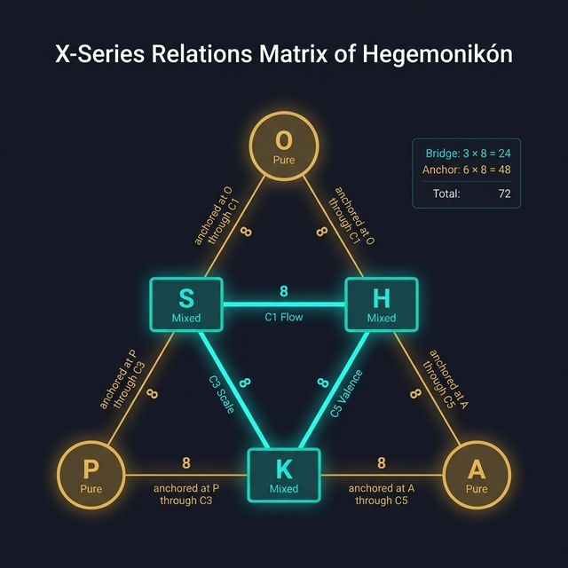
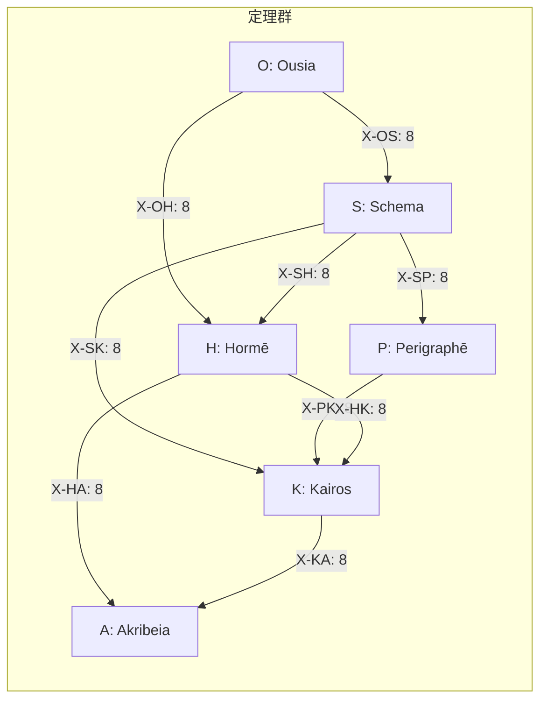

> **Kernel Doc Index**: [axiom_hierarchy](axiom_hierarchy.md) | [akribeia](akribeia.md) | [taxis](taxis.md) ← 📍

# Τάξις (Taxis): 関係層

> **「定理群間の秩序を定義する」**



---

## 概要

| 項目 | 内容 |
|------|------|
| **シリーズ記号** | X |
| **関係数** | **72** |
| **ペア数** | **9** |
| **ペアあたり** | **8** (統一) |
| **役割** | 定理群間の従属関係 |

---

## 接続ルール（統一原理）

> **共有座標の値が一致 → 接続する**

各定理群は2つの座標ペアから生成される。
2群が1座標を共有するとき、その座標の各値 (二値) について:

- 一方の群の該当2定理 × 他方の該当2定理 = 2×2 = 4
- 二値分 × 2 = **8関係**

```
例: O (C1×C2) と S (C1×C3) は C1 を共有

C1=I:  O1,O2 (C1=I) → S1,S2 (C1=I) = 2×2 = 4
C1=A:  O3,O4 (C1=A) → S3,S4 (C1=A) = 2×2 = 4
合計: 8
```

---

## 関係一覧

| X | 接続 | 共有座標 | 数 | 意味 |
|---|------|---------|---|------|
| X-OS | O→S | C1 (Flow) | 8 | 本質→様態 |
| X-OH | O→H | C1 (Flow) | 8 | 本質→傾向 |
| X-SH | S→H | C1 (Flow) | 8 | 様態→傾向 |
| X-SP | S→P | C3 (Scale) | 8 | 様態→条件 |
| X-SK | S→K | C3 (Scale) | 8 | 様態→文脈 |
| X-PK | P→K | C3 (Scale) | 8 | 条件→文脈 |
| X-HA | H→A | C5 (Valence) | 8 | 傾向→精密 |
| X-HK | H→K | C5 (Valence) | 8 | 傾向→文脈 |
| X-KA | K→A | C5 (Valence) | 8 | 文脈→精密 |
| **計** | | | **72** | |

### 構造の対称性

```
C1共有 (Flow):     O↔S ✅  O↔H ✅  S↔H ✅  (3/3)
C3共有 (Scale):    S↔P ✅  S↔K ✅  P↔K ✅  (3/3)
C5共有 (Valence):  H↔A ✅  H↔K ✅  K↔A ✅  (3/3)
```

> **各共有座標で3ペア全てが接続 = 完全対称**

---

## 関係の階層構造

### Series の生成型

定理群は2つの座標 Tier の交差で生成されるが、その構造は2型ある:

| 型 | 生成 | Series | 特徴 |
|:---|:-----|:-------|:-----|
| **Pure** (自己積) | 同一Tier × 同一Tier | O (L1×L1), P (L1.5×L1.5), A (L1.75×L1.75) | 座標ハブの「原点」 |
| **Mixed** (異種積) | 異なるTier × 異なるTier | S (L1×L1.5), H (L1×L1.75), K (L1.5×L1.75) | 座標ハブ間の「橋」 |

### 関係の2類型

| 類型 | 構造 | ペア数 | 関係数 | 意味 |
|:-----|:-----|:-------|:-------|:-----|
| **Anchor** (錨) | Pure↔Mixed | 6 | 48 | 原点から放射。生成型が異なるため意味は**類比的** |
| **Bridge** (橋) | Mixed↔Mixed | 3 | 24 | 横断接続。生成型が同じため意味は**同型的** |

### 座標ハブ別の完全分類

| Hub | Pure (原点) | Mixed₁ | Mixed₂ | Anchor (48) | Bridge (24) |
|:----|:-----------|:-------|:-------|:------------|:------------|
| **C1** (Flow) | O | S | H | O↔S, O↔H | S↔H |
| **C3** (Scale) | P | S | K | S↔P, P↔K | S↔K |
| **C5** (Valence) | A | H | K | H↔A, K↔A | H↔K |

> **Anchor 関係**: Pure series が「意味の原点」として Mixed series に放射。
> 接続は構造的に妥当だが、共有座標の使い方が非対称（値 vs 種類選択）。
>
> **Bridge 関係**: 2つの Mixed series が共有座標を同じ方法で使用。
> 接続は完全に同型であり、意味的密度が最も高い。

### Poiēsis/Dokimasia との交差

| 接続型 | ペア | 数 |
|:-------|:-----|:---|
| **Intra-Poiēsis** (生成内) | O↔S, O↔H, S↔H | 24 |
| **Cross** (生成↔審査) | S↔P, S↔K, H↔A, H↔K | 32 |
| **Intra-Dokimasia** (審査内) | P↔K, K↔A | 16 |

---

## 接続図



---

## 圏論的解釈 (v3.1)

> **Hegemonikón は圏 (Category) である。**
> Trígōnon 構造の発見により、定理群間の関係は圏論的に記述される。

### 圏の構成

| 圏の構成要素 | Hegemonikón | CCL 演算子 |
|:-------------|:-----------|:---------|
| **対象** (Object) | 24 定理 | `/noe`, `/met`, ... |
| **射** (Morphism) | 72 関係 (X-series) | `>>` |
| **恒等射** (Identity) | 自己参照 | X-OO, X-SS, ... |
| **合成** (Composition) | パス O→S→P | `_`, `>>` の連鎖 |
| **積** (Product) | 融合 | `*` (不可分な統合) |
| **極限** (Limit) | Hub WF (内積) | `/o`, `/s`, ..., `lim` |
| **余極限** (Colimit) | 反転 (外積) | `\o`, `\s`, ... |
| **射的融合** | 変容 (両方が残る) | `>*` |
| **自然変換** | Bridge/Anchor | X-series の構造的対応 |

> **Hub WF の本質**: 極限演算子。4定理の出力を最適な1点に収束させる融合器。
> **`>>` / `>*` / `*` の三段階**: 置換 (A→B) / 変容 (両方残る) / 融合 (不可分)。

### CCL での射操作

```ccl
# 射 (構造的変換): A → B via X-series
/noe >> /met          # O1 → S1 (X-OS morphism)

# 射的融合 (変容): A が B の視点で変わる
/noe >* /met          # O1 を S1 の視点で変容

# 射の合成: O → S → P (morphism composition)
/noe >> /met >> /kho

# 指向性: 左が主、右が従
/noe >> /met  ≠  /met >> /noe
# O→S (本質が様態を規定) ≠ S→O (様態が本質を根拠づけ)
```

### 内積・外積の適用範囲

| 演算 | 適用対象 | CCL | 意味 |
|:-----|:---------|:----|:-----|
| **内積** (·) | Hub WF のみ | `/a` | Series内4定理 → 1スカラーに収束 |
| **外積** (⊗) | Hub WF のみ | `\a` | Series内4定理 → 全組み合わせに展開 |
| **射** | 個別定理WF間 | `>>` | X-series を通じた構造的変換 |
| **射的融合** | 個別定理WF間 | `>*` | X-series を通じた変容 |

### 動的優先順位

Bridge/Anchor の優先は FEP の explore/exploit に対応し、**文脈依存**:

| 状態 | V[] | 優先 | 理由 |
|:-----|:----|:-----|:-----|
| 高不確実性 | > 0.5 | Bridge | 横断的探索 (explore) |
| 低不確実性 | < 0.3 | Anchor | 根拠への収束 (exploit) |

---

## X-OS: Ousia → Schema (8)

> **「本質が様態をどう展開するか」** (共有: C1 Flow)

| X | O | S | 意味 |
|---|---|---|------|
| X-OS1 | O1 (I×E) | S1 (Flow×Scale) | Noēsis → Metron |
| X-OS2 | O1 (I×E) | S2 (Flow×Function) | Noēsis → Mekhanē |
| X-OS3 | O2 (I×P) | S1 (Flow×Scale) | Boulēsis → Metron |
| X-OS4 | O2 (I×P) | S2 (Flow×Function) | Boulēsis → Mekhanē |
| X-OS5 | O3 (A×E) | S3 (Value×Scale) | Zētēsis → Stathmos |
| X-OS6 | O3 (A×E) | S4 (Value×Function) | Zētēsis → Praxis |
| X-OS7 | O4 (A×P) | S3 (Value×Scale) | Energeia → Stathmos |
| X-OS8 | O4 (A×P) | S4 (Value×Function) | Energeia → Praxis |

---

## X-OH: Ousia → Hormē (8) 🆕

> **「本質が傾向をどう生むか」** (共有: C1 Flow)

| X | O | H | 意味 |
|---|---|---|------|
| X-OH1 | O1 (I×E) | H1 (Flow×Valence) | Noēsis → Propatheia |
| X-OH2 | O1 (I×E) | H2 (Flow×Precision) | Noēsis → Pistis |
| X-OH3 | O2 (I×P) | H1 (Flow×Valence) | Boulēsis → Propatheia |
| X-OH4 | O2 (I×P) | H2 (Flow×Precision) | Boulēsis → Pistis |
| X-OH5 | O3 (A×E) | H3 (Value×Valence) | Zētēsis → Orexis |
| X-OH6 | O3 (A×E) | H4 (Value×Precision) | Zētēsis → Doxa |
| X-OH7 | O4 (A×P) | H3 (Value×Valence) | Energeia → Orexis |
| X-OH8 | O4 (A×P) | H4 (Value×Precision) | Energeia → Doxa |

---

## X-SH: Schema → Hormē (8)

> **「様態が傾向をどう方向づけるか」** (共有: C1 Flow)
> v3.0: 4→8 に拡張

| X | S | H | 意味 |
|---|---|---|------|
| X-SH1 | S1 (Flow×Scale) | H1 (Flow×Valence) | Metron → Propatheia |
| X-SH2 | S1 (Flow×Scale) | H2 (Flow×Precision) | Metron → Pistis |
| X-SH3 | S2 (Flow×Function) | H1 (Flow×Valence) | Mekhanē → Propatheia |
| X-SH4 | S2 (Flow×Function) | H2 (Flow×Precision) | Mekhanē → Pistis |
| X-SH5 | S3 (Value×Scale) | H3 (Value×Valence) | Stathmos → Orexis |
| X-SH6 | S3 (Value×Scale) | H4 (Value×Precision) | Stathmos → Doxa |
| X-SH7 | S4 (Value×Function) | H3 (Value×Valence) | Praxis → Orexis |
| X-SH8 | S4 (Value×Function) | H4 (Value×Precision) | Praxis → Doxa |

---

## X-SP: Schema → Perigraphē (8)

> **「様態が条件空間をどう定義するか」** (共有: C3 Scale)
> v3.0: 4→8 に拡張

| X | S | P | 意味 |
|---|---|---|------|
| X-SP1 | S1 (Flow×Scale) | P1 (Scale×Function) | Metron → Khōra |
| X-SP2 | S1 (Flow×Scale) | P2 (Scale×Explore) | Metron → Hodos |
| X-SP3 | S3 (Value×Scale) | P1 (Scale×Function) | Stathmos → Khōra |
| X-SP4 | S3 (Value×Scale) | P2 (Scale×Explore) | Stathmos → Hodos |
| X-SP5 | S2 (Flow×Function) | P3 (Function×Scale) | Mekhanē → Trokhia |
| X-SP6 | S2 (Flow×Function) | P4 (Function×Value) | Mekhanē → Tekhnē |
| X-SP7 | S4 (Value×Function) | P3 (Function×Scale) | Praxis → Trokhia |
| X-SP8 | S4 (Value×Function) | P4 (Function×Value) | Praxis → Tekhnē |

---

## X-SK: Schema → Kairos (8) 🆕

> **「様態が文脈をどう制約するか」** (共有: C3 Scale)

| X | S | K | 意味 |
|---|---|---|------|
| X-SK1 | S1 (Flow×Scale) | K1 (Scale×Valence) | Metron → Eukairia |
| X-SK2 | S1 (Flow×Scale) | K2 (Scale×Precision) | Metron → Chronos |
| X-SK3 | S3 (Value×Scale) | K1 (Scale×Valence) | Stathmos → Eukairia |
| X-SK4 | S3 (Value×Scale) | K2 (Scale×Precision) | Stathmos → Chronos |
| X-SK5 | S2 (Flow×Function) | K3 (Function×Valence) | Mekhanē → Telos |
| X-SK6 | S2 (Flow×Function) | K4 (Function×Precision) | Mekhanē → Sophia |
| X-SK7 | S4 (Value×Function) | K3 (Function×Valence) | Praxis → Telos |
| X-SK8 | S4 (Value×Function) | K4 (Function×Precision) | Praxis → Sophia |

---

## X-PK: Perigraphē → Kairos (8)

> **「条件が文脈をどう制約するか」** (共有: C3 Scale)

| X | P | K | 意味 |
|---|---|---|------|
| X-PK1 | P1 | K1 | Khōra → Eukairia |
| X-PK2 | P1 | K2 | Khōra → Chronos |
| X-PK3 | P2 | K1 | Hodos → Eukairia |
| X-PK4 | P2 | K2 | Hodos → Chronos |
| X-PK5 | P3 | K3 | Trokhia → Telos |
| X-PK6 | P3 | K4 | Trokhia → Sophia |
| X-PK7 | P4 | K3 | Tekhnē → Telos |
| X-PK8 | P4 | K4 | Tekhnē → Sophia |

---

## X-HA: Hormē → Akribeia (8)

> **「傾向が精密さをどう影響するか」** (共有: C5 Valence)
> v3.0: 4→8 に拡張

| X | H | A | 意味 |
|---|---|---|------|
| X-HA1 | H1 (Flow×Valence) | A1 (Valence×Precision) | Propatheia → Pathos |
| X-HA2 | H1 (Flow×Valence) | A2 (Valence×Certainty) | Propatheia → Krisis |
| X-HA3 | H3 (Value×Valence) | A1 (Valence×Precision) | Orexis → Pathos |
| X-HA4 | H3 (Value×Valence) | A2 (Valence×Certainty) | Orexis → Krisis |
| X-HA5 | H2 (Flow×Precision) | A3 (Precision×Valence) | Pistis → Gnōmē |
| X-HA6 | H2 (Flow×Precision) | A4 (Precision×Precision) | Pistis → Epistēmē |
| X-HA7 | H4 (Value×Precision) | A3 (Precision×Valence) | Doxa → Gnōmē |
| X-HA8 | H4 (Value×Precision) | A4 (Precision×Precision) | Doxa → Epistēmē |

---

## X-HK: Hormē → Kairos (8) 🆕

> **「傾向が文脈をどう変えるか」** (共有: C5 Valence)

| X | H | K | 意味 |
|---|---|---|------|
| X-HK1 | H1 (Flow×Valence) | K1 (Scale×Valence) | Propatheia → Eukairia |
| X-HK2 | H1 (Flow×Valence) | K3 (Function×Valence) | Propatheia → Telos |
| X-HK3 | H3 (Value×Valence) | K1 (Scale×Valence) | Orexis → Eukairia |
| X-HK4 | H3 (Value×Valence) | K3 (Function×Valence) | Orexis → Telos |
| X-HK5 | H2 (Flow×Precision) | K2 (Scale×Precision) | Pistis → Chronos |
| X-HK6 | H2 (Flow×Precision) | K4 (Function×Precision) | Pistis → Sophia |
| X-HK7 | H4 (Value×Precision) | K2 (Scale×Precision) | Doxa → Chronos |
| X-HK8 | H4 (Value×Precision) | K4 (Function×Precision) | Doxa → Sophia |

---

## X-KA: Kairos → Akribeia (8)

> **「文脈が精密さをどう決定するか」** (共有: C5 Valence)

| X | K | A | 意味 |
|---|---|---|------|
| X-KA1 | K1 | A1 | Eukairia → Pathos |
| X-KA2 | K1 | A2 | Eukairia → Krisis |
| X-KA3 | K2 | A1 | Chronos → Pathos |
| X-KA4 | K2 | A2 | Chronos → Krisis |
| X-KA5 | K3 | A3 | Telos → Gnōmē |
| X-KA6 | K3 | A4 | Telos → Epistēmē |
| X-KA7 | K4 | A3 | Sophia → Gnōmē |
| X-KA8 | K4 | A4 | Sophia → Epistēmē |

---

## 関連ドキュメント

- [axiom_hierarchy.md](axiom_hierarchy.md) — 公理階層
- [ousia.md](ousia.md) — O-series
- [schema.md](schema.md) — S-series
- [horme.md](horme.md) — H-series
- [perigraphe.md](perigraphe.md) — P-series
- [kairos.md](kairos.md) — K-series
- [akribeia.md](akribeia.md) — A-series

---

*Taxis: 「秩序・配列」— 定理群間の従属関係を編成*
*v3.0: 72関係体系 (統一接続ルール)*
