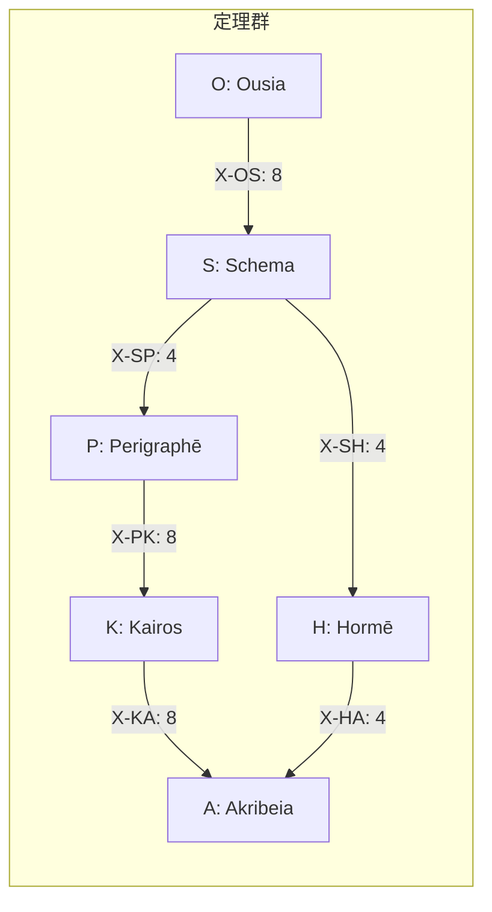

> **Kernel Doc Index**: [axiom_hierarchy](axiom_hierarchy.md) | [akribeia](akribeia.md) | [taxis](taxis.md) ← 📍

# Τάξις (Taxis): 関係層

> **「定理群間の秩序を定義する」**

---

## 概要

| 項目 | 内容 |
|------|------|
| **シリーズ記号** | X |
| **関係数** | 36 |
| **役割** | 定理群間の従属関係 |

---

## 関係一覧

| X | 接続 | 数 | 意味 |
|---|------|---|------|
| X-OS | O→S | 8 | 本質→様態 |
| X-SH | S→H | 4 | 様態→傾向 |
| X-SP | S→P | 4 | 様態→条件 |
| X-PK | P→K | 8 | 条件→文脈 |
| X-KA | K→A | 8 | 文脈→精密 |
| X-HA | H→A | 4 | 傾向→精密 |
| **計** | | **36** | |

---

## 接続図

---

## X-OS: Ousia → Schema (8)

> **「本質が様態をどう展開するか」**

| X | O | S | 意味 |
|---|---|---|------|
| X-OS1 | O1 | S1 | Noēsis → Metron |
| X-OS2 | O1 | S2 | Noēsis → Mekhanē |
| X-OS3 | O2 | S1 | Boulēsis → Metron |
| X-OS4 | O2 | S2 | Boulēsis → Mekhanē |
| X-OS5 | O3 | S3 | Zētēsis → Stathmos |
| X-OS6 | O3 | S4 | Zētēsis → Praxis |
| X-OS7 | O4 | S3 | Energeia → Stathmos |
| X-OS8 | O4 | S4 | Energeia → Praxis |

---

## X-SH: Schema → Hormē (4)

> **「様態が傾向をどう方向づけるか」**

| X | S | H | 意味 |
|---|---|---|------|
| X-SH1 | S1 | H1 | Metron → Propatheia |
| X-SH2 | S2 | H2 | Mekhanē → Pistis |
| X-SH3 | S3 | H3 | Stathmos → Orexis |
| X-SH4 | S4 | H4 | Praxis → Doxa |

---

## X-SP: Schema → Perigraphē (4)

> **「様態が条件空間をどう定義するか」**

| X | S | P | 意味 |
|---|---|---|------|
| X-SP1 | S1 | P1 | Metron → Khōra |
| X-SP2 | S2 | P2 | Mekhanē → Hodos |
| X-SP3 | S3 | P3 | Stathmos → Trokhia |
| X-SP4 | S4 | P4 | Praxis → Tekhnē |

---

## X-PK: Perigraphē → Kairos (8)

> **「条件が文脈をどう制約するか」**

| X | P | K | 意味 |
|---|---|---|------|
| X-PK1 | P1 | K1 | Khōra → Eukairia |
| X-PK2 | P1 | K2 | Khōra → Chronos |
| X-PK3 | P2 | K1 | Hodos → Eukairia |
| X-PK4 | P2 | K2 | Hodos → Chronos |
| X-PK5 | P3 | K3 | Trokhia → Telos |
| X-PK6 | P3 | K4 | Trokhia → Sophia |
| X-PK7 | P4 | K3 | Tekhnē → Telos |
| X-PK8 | P4 | K4 | Tekhnē → Sophia |

---

## X-KA: Kairos → Akribeia (8)

> **「文脈が精密さをどう決定するか」**

| X | K | A | 意味 |
|---|---|---|------|
| X-KA1 | K1 | A1 | Eukairia → Pathos |
| X-KA2 | K1 | A2 | Eukairia → Krisis |
| X-KA3 | K2 | A1 | Chronos → Pathos |
| X-KA4 | K2 | A2 | Chronos → Krisis |
| X-KA5 | K3 | A3 | Telos → Gnōmē |
| X-KA6 | K3 | A4 | Telos → Epistēmē |
| X-KA7 | K4 | A3 | Sophia → Gnōmē |
| X-KA8 | K4 | A4 | Sophia → Epistēmē |

---

## X-HA: Hormē → Akribeia (4)

> **「傾向が精密さをどう影響するか」**

| X | H | A | 意味 |
|---|---|---|------|
| X-HA1 | H1 | A1 | Propatheia → Pathos |
| X-HA2 | H2 | A2 | Pistis → Krisis |
| X-HA3 | H3 | A3 | Orexis → Gnōmē |
| X-HA4 | H4 | A4 | Doxa → Epistēmē |

---

## 関連ドキュメント

- [axiom_hierarchy.md](axiom_hierarchy.md) — 公理階層
- [ousia.md](ousia.md) — O-series
- [schema.md](schema.md) — S-series
- [horme.md](horme.md) — H-series
- [perigraphe.md](perigraphe.md) — P-series
- [kairos.md](kairos.md) — K-series
- [akribeia.md](akribeia.md) — A-series

---

*Taxis: 「秩序・配列」— 定理群間の従属関係を編成*
