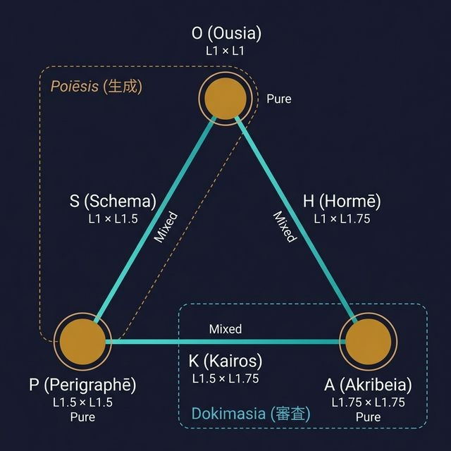

# Trígōnon (τρίγωνον) — 三角形構造

> **6定理群は完全グラフ K₃ (三角形) を形成する。**
> これはエレガントな偶然ではなく、3 Tier × 2座標 の構造から演繹的に必然。

---

## 1. 発見の核心

6つの定理群は、3つの座標 Tier (L1, L1.5, L1.75) から
**2つの Tier の直積** として生成される。

```
6 Series = C(3,2) + 3 = 3 cross-products + 3 self-products
         = 3 Mixed + 3 Pure
         = 3 edges + 3 vertices
         = K₃ (完全グラフ = 三角形)
```

---

## 2. Pure / Mixed 分類

### Pure (自己積) — **頂点**

同一 Tier の座標同士の直積。座標空間の「原点」。

| Series | 生成 | Tier | 意味 |
|:-------|:-----|:-----|:-----|
| **O** (Ousia) | L1 × L1 | Flow × Value | 本質 — 何であり何を |
| **P** (Perigraphē) | L1.5 × L1.5 | Scale × Function | 境界 — どこでどうやって |
| **A** (Akribeia) | L1.75 × L1.75 | Valence × Precision | 精密 — どちらへどの精度で |

### Mixed (異種積) — **辺**

異なる Tier の座標の直積。頂点間の「橋」。

| Series | 生成 | 橋渡し | 意味 |
|:-------|:-----|:-------|:-----|
| **S** (Schema) | L1 × L1.5 | O ↔ P | 様態 — 本質を境界に展開 |
| **H** (Hormē) | L1 × L1.75 | O ↔ A | 傾向 — 本質を精密に方向づけ |
| **K** (Kairos) | L1.5 × L1.75 | P ↔ A | 文脈 — 境界を精密に位置づけ |

---

## 3. 三角形

```
           O
          (L1²)
         ╱     ╲
        S       H
       ╱         ╲
      P ─── K ─── A
   (L1.5²)     (L1.75²)
```



### 詳細ビジュアライゼーション


| 構造要素 | Series | 定理数 | 役割 |
|:---------|:-------|:-------|:-----|
| 頂点 (3) | O, P, A | 12 | 自己完結的原点 |
| 辺 (3) | S, H, K | 12 | 頂点間の橋渡し |
| **合計** | 6 | **24** | |

---

## 4. 関係の階層

72関係も三角形構造から2つの類型に分かれる:

| 類型 | 構造 | ペア数 | 関係数 | 意味 |
|:-----|:-----|:-------|:-------|:-----|
| **Anchor** (錨) | 頂点↔辺 | 6 | 48 | 原点から放射。意味は**類比的** |
| **Bridge** (橋) | 辺↔辺 | 3 | 24 | 横断接続。意味は**同型的** |

### なぜ Bridge が上位か

- Bridge (24): 両 Series が共有座標を**同じ構造で**使用 → 完全同型
- Anchor (48): Pure 側は座標の「値」で、Mixed 側は座標の「種類」で使用 → 類比的

> Bridge は「必然的接続」、Anchor は「妥当な接続」。
> 24 が構造的上位層、48 がその展開。

### 座標ハブ別

| Hub | 座標 | Pure (原点) | Mixed₁ | Mixed₂ | Anchor | Bridge |
|:----|:-----|:-----------|:-------|:-------|:-------|:-------|
| C1 | Flow | O | S | H | O↔S, O↔H | S↔H |
| C3 | Scale | P | S | K | S↔P, P↔K | S↔K |
| C5 | Valence | A | H | K | H↔A, K↔A | H↔K |

---

## 5. Poiēsis / Dokimasia の構造的再検討

### 現行定義

| 分類 | Series | 意味 |
|:-----|:-------|:-----|
| Poiēsis (生成) | O, S, H | 内容の具現化 |
| Dokimasia (審査) | P, K, A | 条件の詳細化 |

### Trígōnon から見た再解釈

Poiēsis/Dokimasia は **Star/Complement 分割**:

```
Star(O) = O + その2辺 (S, H) = Poiēsis
Complement(O) = 対辺 K + 残り2頂点 (P, A) = Dokimasia
```

→ Poiēsis = **L1 を含む全 Series**
→ Dokimasia = **L1 を含まない全 Series**

### 妥当性の根拠

L1 は3つの Tier の中で**最も抽象的**:

| Tier | 座標 | 問い | 抽象度 |
|:-----|:-----|:-----|:-------|
| L1 | Flow (I/A), Value (E/P) | 何か・いくらか | 最高 |
| L1.5 | Scale, Function | どこで・どうやって | 中間 |
| L1.75 | Valence, Precision | どちらへ・どの精度で | 最低 |

→ 最も抽象的な Tier を含む Series が「生成」、含まない Series が「審査」。
これは意味的にも正しい: **抽象から生成し、具体で検証する**。

### 他の可能な分割

Star/Complement 分割は3通り存在する:

| 分割 | Star (頂点 + 2辺) | Complement (辺 + 2頂点) | 意味 |
|:-----|:-------------------|:------------------------|:-----|
| **Star(O)** | O, S, H | P, K, A | ≡ Poiēsis/Dokimasia |
| Star(P) | P, S, K | O, H, A | L1.5含む/含まない |
| Star(A) | A, H, K | O, S, P | L1.75含む/含まない |

Poiēsis/Dokimasia (= Star(O)) が最も自然な理由:

1. L1 は最も抽象的 → 生成/審査の区分に適合
2. O-series (Ousia = 本質) が三角形の「頂点」→ 最初に発動する Series
3. FEP において「予測モデル生成 → 検証」の流れと一致

> **結論**: Poiēsis/Dokimasia は構造的に正当。3通りの分割のうち最も自然。

### 非対称性の意味

| | Pure | Mixed | 合計 |
|:--|:-----|:------|:-----|
| Poiēsis | 1 (O) | 2 (S, H) | 3 |
| Dokimasia | 2 (P, A) | 1 (K) | 3 |

生成層は **1原点 + 2橋** = 発散構造 (1→2)
審査層は **2原点 + 1橋** = 収束構造 (2→1)

> 生成は1つの原点から発散し、審査は2つの原点に収束する。
> これは FEP の「予測→比較→更新」サイクルと整合する。

---

## 6. 数的構造

| 項目 | 数 | 意味 |
|:-----|:---|:-----|
| Tier | 3 | L1, L1.5, L1.75 |
| 座標 | 6 | 各 Tier に2座標 |
| 頂点 (Pure) | 3 | C(3,1) 自己積 |
| 辺 (Mixed) | 3 | C(3,2) 異種積 |
| 定理 | 24 | 6 × 4 (2×2 直積) |
| Anchor 関係 | 48 | 6ペア × 8 |
| Bridge 関係 | 24 | 3ペア × 8 |
| **総要素** | **96** | **24 × 4** |

> 96 = 24 × (1 + 3) : 各定理は平均3つの関係を持つ

---

## 7. 参照

- [axiom_hierarchy.md](axiom_hierarchy.md) — 公理階層
- [taxis.md](taxis.md) — 関係層 (X-series)
- [SACRED_TRUTH.md](SACRED_TRUTH.md) — 不変真理

---

*Trígōnon v1.0.0 — 2026-02-07*
