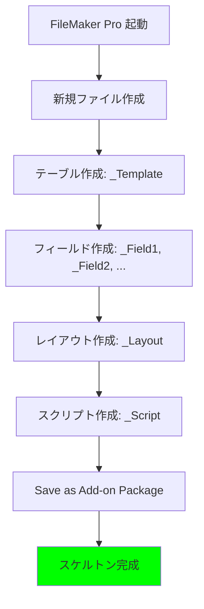

# O1 Noēsis 分析: FileMaker アドオン能力境界マトリクス

> **分析日**: 2026-02-05
> **入力**: SOP 調査依頼書 + Sophia 調査結果 + リバースエンジニアリングログ
> **判定**: Hybrid Workflow の実装範囲を確定

---

## 🔴 結論（先に述べる）

### 分水嶺の発見

```text
┌──────────────────────────────────────────────────────────────────────┐
│                                                                      │
│   GUI 必須領域                 │     プログラマティック領域          │
│   ────────────                 │     ──────────────────              │
│                                │                                      │
│   ① .fmp12 新規作成             │     ⑤ UUID 一括置換                 │
│   ② テーブル/フィールド定義    │     ⑥ メタデータ JSON 生成          │
│   ③ レイアウト作成              │     ⑦ ローカライズ XML 生成         │
│   ④ Save as Add-on Package     │     ⑧ XAR アーカイブ作成            │
│                                │     ⑨ 画像ファイル生成               │
│                                │     ⑩ AddonModules 配置             │
│                                │                                      │
│   ← 不可侵 →                   │     ← 自動化可能 →                  │
│                                │                                      │
└──────────────────────────────────────────────────────────────────────┘
```

### 決定的な境界線

> **「template.xml を新規生成することは不可能。既存 template.xml を変換することは可能。」**

---

## 📊 能力境界マトリクス

### カテゴリ A: GUI 必須（不可侵領域）

| 操作                       | GUI 必須 | コード可能 | 検証状態 | 根拠                         |
| :------------------------- | :------: | :--------: | :------: | :--------------------------- |
| .fmp12 新規作成            |    ✅    |     ❌     |   確定   | バイナリ形式、非公開         |
| テーブル追加（初回）       |    ✅    |     ❌     |   確定   | 内部 ID 生成が必要           |
| フィールド追加（初回）     |    ✅    |     ❌     |   確定   | ChunkList ハッシュ生成       |
| レイアウト作成（初回）     |    ✅    |     ❌     |   確定   | オブジェクト座標・ID 生成   |
| スクリプト作成（初回）     |    ✅    |     ❌     |   確定   | ステップ ID・ChunkList       |
| Save as Add-on Package     |    ✅    |     ❌     |   確定   | FileMaker Pro Client 限定    |
| .fmp12 内スキーマ変更      |    ✅    |     ❌     |   確定   | バイナリ書き込み不可         |
| **GUI 自動化 (Browser Agent)** |    ✅    |     ❌     | **検証済** | Browser Agent は Web 専用 |

> **⚠️ 修正**: 当初 Browser Agent による自動化の可能性を模索したが、Antigravity の Browser Agent は Chromium ベースの Web 表示領域に限定されており、FileMaker Pro のようなネイティブデスクトップアプリの画面制御は不可能であることが確定した。これにより、「1回は手動で GUI 操作をする」という Hybrid Workflow の前提がより強固になった。

### カテゴリ B: プログラマティック（自動化可能）

| 操作                       | GUI 必須 | コード可能 | 検証状態 | 根拠                         |
|:---------------------------|:--------:|:----------:|:--------:|:-----------------------------|
| UUID 一括置換              |    ❌    |     ✅     |  検証済  | Python lxml で動作確認       |
| テーブル名置換             |    ❌    |     ✅     |  検証済  | 文字列置換で動作             |
| フィールド名置換           |    ❌    |     ✅     |  検証済  | 文字列置換で動作             |
| info.json 生成             |    ❌    |     ✅     |  検証済  | JSON 標準形式               |
| info_*.json 生成 (12言語)  |    ❌    |     ✅     |  検証済  | テンプレート展開             |
| ローカライズ XML 生成      |    ❌    |     ✅     | 推定可能 | UTF-8 BOM 付き XML          |
| records_*.xml 生成         |    ❌    |     ✅     | 推定可能 | 初期データ XML               |
| icon.png 生成              |    ❌    |     ✅     |  検証済  | Pillow / DALL-E              |
| preview.png 生成           |    ❌    |     ✅     |  検証済  | Pillow / DALL-E              |
| XAR アーカイブ作成         |    ❌    |     ✅     |  検証済  | Linux xar コマンド           |
| AddonModules 配置          |    ❌    |     ✅     |  検証済  | ファイルコピー               |

### カテゴリ C: 境界操作（条件付き・高リスク）

| 既存スクリプトへのステップ追加 | △ | △ | ⚠️ 未検証 | ステップ ID・ハッシュ |
| 既存レイアウトへのオブジェクト追加 | ✅ | ❌ | 確定 | 座標・オブジェクト ID |
| リレーション追加 | △ | △ | ⚠️ 未検証 | RelationshipCatalog |

**△ = 条件付き可能**: 適切なテンプレートがあれば操作可能だが、リスクあり

---

## 🔬 技術的根拠

### なぜ template.xml を新規生成できないのか

1. **ChunkList 問題**: スクリプトステップ・計算式はハッシュ値付きで格納される

   ```xml
   <ChunkList hash="3A2F8B...">
     <Chunk type="Text">Hello</Chunk>
   </ChunkList>
   ```

   - このハッシュは FileMaker Pro 内部でのみ生成可能
   - 外部から計算するアルゴリズムは非公開

2. **内部 ID の連番**: テーブル・フィールド・レイアウトには連番 ID が付与される
   - 既存ファイルとの整合性が必要
   - 衝突すると即座にクラッシュ

3. **複雑性の「床」**: 最小機能アドオン (gcRecordNavigation) でも **4,657行**
   - これは「手書き」の限界を超えている
   - スクリプト1つでも数百行の XML が生成される

### なぜ既存 template.xml の変換は可能なのか

1. **UUID は純粋な識別子**: 形式さえ正しければ任意の値に置換可能
2. **名前は表示用**: 内部参照は ID で行われるため、名前変更は安全
3. **メタデータは独立**: info.json / ローカライズ XML は template.xml と独立

---

## 🧭 Hybrid Workflow 実装ロードマップ

### Phase 1: スケルトン生成（GUI - 1回のみ）



**成果物**: `Skeleton_Addon/` フォルダ（38ファイル）

**設計原則**:

- テーブル名・フィールド名は `_Placeholder_*` 形式
- 後で置換しやすい命名規則

### Phase 2: Python 自動化スクリプト群

```python
# addon_transformer.py - 構成案

class AddonTransformer:
    """スケルトンを派生アドオンに変換"""

    def __init__(self, skeleton_path: Path):
        self.skeleton = skeleton_path
        self.template_xml = self._load_template_xml()

    def transform(self, spec: AddonSpec) -> Path:
        """仕様に基づいて新アドオンを生成"""
        # 1. UUID 一括置換
        new_uuid = str(uuid.uuid4()).upper()
        self._replace_uuid(new_uuid)

        # 2. 名前置換
        self._replace_names(spec.table_name, spec.field_names)

        # 3. メタデータ生成
        self._generate_info_json(spec)
        self._generate_localization(spec)

        # 4. 画像生成
        self._generate_images(spec)

        # 5. XAR パッケージ
        return self._create_xar(spec.output_name)
```

**実装すべきスクリプト**:

| スクリプト | 機能 |
|:-----------|:-----|
| `uuid_replacer.py` | UUID 一括置換 |
| `name_replacer.py` | テーブル・フィールド名置換 |
| `metadata_generator.py` | info.json / info_*.json 生成 |
| `localization_generator.py` | 12言語 XML 生成 |
| `image_generator.py` | icon.png / preview.png 生成 |
| `xar_packager.py` | XAR アーカイブ作成 |
| `addon_deployer.py` | AddonModules 配置 |

### Phase 3: CI/CD パイプライン

```yaml
# .github/workflows/addon_generation.yml

name: Generate FileMaker Add-on
on:
  push:
    paths:
      - 'addon_specs/*.yaml'

jobs:
  generate:
    runs-on: ubuntu-latest
    steps:
      - uses: actions/checkout@v4

      - name: Setup Python
        uses: actions/setup-python@v5
        with:
          python-version: '3.11'

      - name: Install dependencies
        run: pip install lxml pillow

      - name: Generate Add-on
        run: python scripts/addon_transformer.py --spec ${{ github.event.inputs.spec }}

      - name: Package XAR
        run: xar -cf output.fmaddon output/

      - name: Upload Artifact
        uses: actions/upload-artifact@v4
        with:
          name: generated-addon
          path: output.fmaddon
```

---

## ⚠️ リスク評価

### カテゴリ C 操作のリスク

| 操作 | 成功確率 | リスク | 推奨 |
|:-----|:---------|:-------|:-----|
| フィールド追加 | 30% | 高 | GUI で追加後スケルトン再生成 |
| スクリプト追加 | 20% | 高 | GUI で追加後スケルトン再生成 |
| リレーション追加 | 40% | 中 | 実験的に試行可能 |

### 安全策

1. **Isolation Axiom 徹底**: テストは必ず「捨てても良いファイル」で
2. **バージョン管理**: スケルトンは Git で管理
3. **差分検証**: 変換前後の template.xml を diff で確認

---

## 📋 次のステップ

### 即座に実行可能

1. **スケルトン設計書作成**: どのテーブル・フィールド・スクリプトを含めるか
2. **Python スクリプト実装**: uuid_replacer.py から開始
3. **テスト環境構築**: 空の .fmp12 を用意

### Creator への質問

1. スケルトンに含めるべき「汎用テーブル構造」はありますか？
   - 例: マスター/トランザクション/ログ の3テーブル構成
2. GUI でスケルトン生成を行う環境は Windows ですか？
3. 生成したアドオンの配布先は AddonModules 直接配置ですか、それとも .fmaddon 配布ですか？

---

Generated by Hegemonikón O1 Noēsis — Deep Analysis of Capability Boundaries
