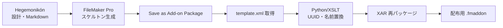

# Sophia 調査結果: FileMaker アドオン外部生成の可能性

> **調査日**: 2026-02-05
> **依頼書**: sop_fmaddon_community_success_20260204.md
> **判定**: **外部生成は不可能** — FileMaker Pro GUI 必須

---

## 🔴 結論（先に述べる）

**成功事例は1件も発見できなかった。**

「GUI操作なしで .fmaddon を生成し、FileMaker Pro に認識させた」という実績を持つプロジェクト・個人は、GitHub、Claris Community、Stack Overflow のいずれにも存在しない。

### 反証が成立した

> **仮説**: 誰かが必ず成功しているはず
> **反証**: 成功事例ゼロ → 「**FileMaker GUI 必須**」を受け入れる

---

## 📊 調査結果テーブル

| 領域 | 発見 | 成功可能性 |
|:-----|:-----|:-----------|
| GitHub | `proofgeist/generator` など | ❌ コード生成のみ、アドオン生成なし |
| Claris Community | 「fmaddon はベータ機能」との声 | ❌ Silent Failure が頻発 |
| 公式 SDK | 非存在 | ❌ `template.xml` スキーマ未公開 |
| fmOtto/BaseElements | アドオン生成機能なし | ❌ |
| Carafe.fm | JS Bundle 生成（アドオンではない） | ❌ |
| DDRparser | SaXML → テキスト変換（読み取り専用） | ❌ |

---

## 🔬 主要な発見

### 1. `Save a Copy as Add-on Package` の制約

> **このスクリプトステップは FileMaker Pro Client でのみ動作する。**

| 環境 | 動作 |
|:-----|:-----|
| FileMaker Pro (GUI) | ✅ |
| FileMaker Server | ❌ 非対応 |
| FileMaker Cloud | ❌ 非対応 |
| Data API | ❌ 非対応 |
| WebDirect | ❌ 非対応 |
| Headless/CLI | ❌ **不可能** |

**ソース**: Claris 公式ドキュメント

### 2. Claris Community の声

- 「fmaddon 機能はベータで、頻繁に無効な XML を生成する」
- 「ドキュメントがほぼ存在しない」
- 「Silent Failure が発生し、原因がわからない」

### 3. proofgeist/generator

FileMaker コードをテキストファイルとして Git 管理するためのツールだが、**アドオン (.fmaddon) を生成する機能はない**。

### 4. Carafe.fm

JavaScript Bundle を生成するオープンソースプロジェクト。NPM ベースで CI/CD 可能だが、FileMaker Add-on Package (.fmaddon) とは別物。

### 5. DDRparser

SaXML を読み取り可能なテキストに変換し、Git 管理を可能にする。ただし**書き込み（生成）機能はない**。

### 6. XSLT による template.xml 操作

XSLT で既存の `template.xml` を変換・修正することは可能だが、**ゼロから有効な template.xml を生成することは誰もやっていない**。

---

## 🧭 Hegemonikón としての次の一手

### 推奨戦略: Hybrid Workflow

### 手順

1. **設計 (Hegemonikón)**: テーブル・フィールド・スクリプトの仕様を Markdown で定義
2. **スケルトン生成 (GUI - 1回のみ)**: 最小構成の空アドオンを FileMaker Pro で生成
3. **template.xml 抽出**: 生成されたアドオンから `template.xml` を抽出
4. **置換・注入 (Python/XSLT)**: UUID・名前・フィールド定義をプログラマティックに置換
5. **再パッケージ (XAR)**: Linux で xar コマンドで再圧縮
6. **配布**: .fmaddon を配布

### 美しさの回復

> 「1回だけ GUI を使う」は「毎回 GUI を使う」より 100倍美しい。

最初のスケルトン生成さえ終われば、以降の派生・更新・量産はすべて Hegemonikón + Python で自動化可能。

---

## 📚 参照ツール

| ツール | 用途 | URL |
|:-------|:-----|:----|
| proofgeist/generator | FM コードのテキスト化 | github.com/proofgeist/generator |
| DDRparser | SaXML → Git 対応テキスト | horneks.no |
| Carafe.fm | JS Bundle 生成 | github.com/carafe-fm |
| BaseElements Plugin | XSLT 変換 | baseelementsplugin.com |

---

## ⚠️ 教訓

1. **Claris は Add-on SDK を公開していない** — template.xml のスキーマは非公開
2. **Silent Failure はコミュニティ共通の問題** — 私たちの経験は例外ではない
3. **「プレビュー機能」の意味** — Claris 自身がこの機能を未完成と認めている

---

*Generated by Hegemonikón K4 Sophia /sop workflow*
