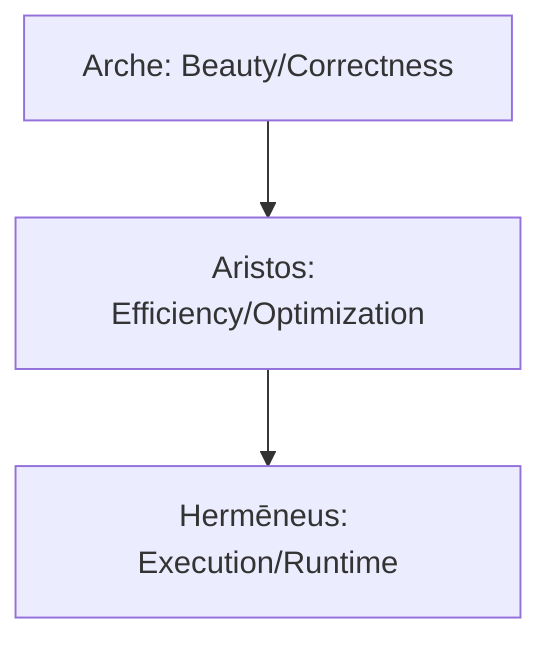

# Project Aristos (ἄριστος) Overview

> **"Arche defines the Best; Aristos achieves the Best."**

Project Aristos is the optimization-focused counterpart to Project Kalon. While Kalon establishes the structural (categorical/algebraic) correctness of CCL, Aristos focuses on the mathematical methods for maximizing efficiency, robustness, and strategic value.

---

## 1. Core Integration Domains

| Mathematical Field | Contribution to CCL | Application |
| :--- | :--- | :--- |
| **Graph Theory** | Path Optimization | Efficient workflow routing in Hermēneus. |
| **Algorithm Analysis** | Efficiency Scaling | pt-based cost optimization and complexity management. |
| **Genetic Algorithms** | Evolutionary Adaptation | Optimization of Derivative Selectors and heuristic refinement. |
| **Game Theory** | Strategic Equilibrium | Multi-agent orchestration and Synergeia load balancing. |

---

## 2. Structural Position

Aristos acts as the bridge between **Arche** (Definition of Beauty/Quality) and **Hermēneus** (Execution):

- **Arche**: "What is the geodesic?"
- **Aristos**: "How do we stay on the geodesic with minimal compute?"
- **Hermēneus**: "Execute the optimized path."

---

## 3. Implementation Phases

- **L1 (Graph Theory)**: Mapping the workflow graph as a navigable manifold with weighted edges based on past success rates.
- **L2 (GA)**: Implementing feedback loops for `/bou` (will) and `/noe` (intelligence) based on output fitness scores.
- **L3 (Algorithmic Analysis)**: Strict formalization of computational cost (pt) relative to information gain.
- **L4 (Game Theory)**: Nash equilibrium as the stable state for multi-agent interactions.

---
*Created: 2026-02-06*
*Reference: Project Kalon Math Digestion*
