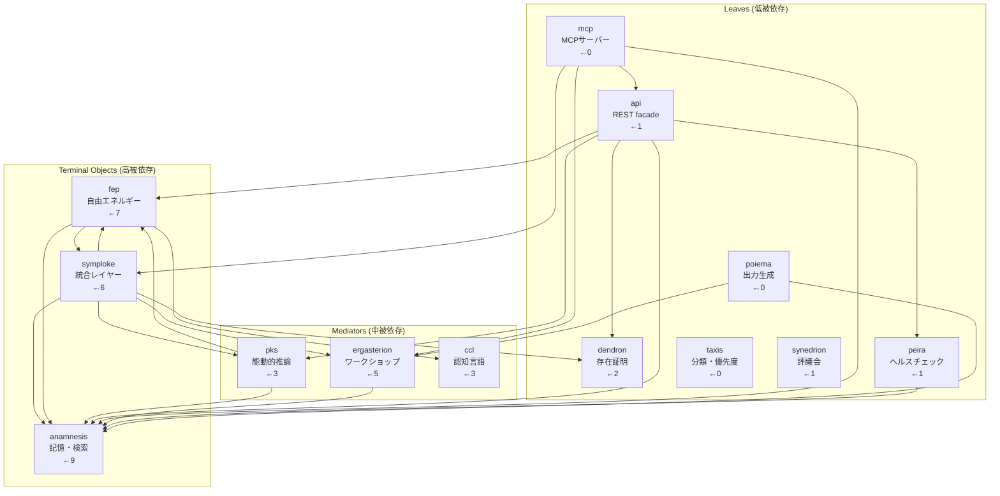

# mekhane/ Architecture — 圏としての実装層

> **最終更新**: 2026-02-10
> **導出**: O1 Noēsis + /m 熟読 + Dendron 100% 検証に基づく

---

## なぜ mekhane は1つのディレクトリなのか

mekhane を「大きすぎるから分割すべき」と考えるのは誤り。
mekhane は**圏 (Category)** である — 対象 (サブモジュール) と射 (import) の閉じた体系。

```
分割すると射 (import) が「外部依存」になる
→ mekhane.anamnesis が independent package になる
→ mekhane.fep からの import が cross-package dependency になる
→ バージョン管理・テスト・リリースの複雑性が爆発する
→ 自由エネルギー（予測誤差）が増大する
→ FEP に反する
```

**結論**: mekhane 内のサブモジュール間 import は**射 (morphism)** であり、同一圏内に留まるべき。

---

## 依存グラフ（射のネットワーク）



---

## 被依存度ランキング

| 順位 | モジュール | 被依存数 | 役割 | 圏論的位置 |
|:-----|:-----------|:---------|:-----|:-----------|
| 1 | **anamnesis** | 9 | 記憶・知識検索 (LanceDB) | **Terminal Object** — ほぼ全モジュールが依存 |
| 2 | **fep** | 7 | 自由エネルギー原理実装 | **Core Functor** — 認知エンジン |
| 3 | **symploke** | 6 | 統合・オーケストレーション | **Colimit** — 他モジュールを統合する普遍構成 |
| 4 | **ergasterion** | 5 | ワークショップ (digestor, tekhne) | **Product** — 生産ツール群 |
| 5 | **pks** | 3 | 能動的推論・知識推薦 | Active Inference 層 |
| 5 | **ccl** | 3 | 認知制御言語パーサー | 言語層 |
| 7 | **dendron** | 2 | 存在証明チェッカー | 品質保証層 |
| 8 | **api** | 1 | REST API facade | 外部接点 |
| 8 | **peira** | 1 | ヘルスチェック | 監視層 |
| 8 | **synedrion** | 1 | 多角的レビュー | 評価層 |

---

## 層構造

```
┌─────────────────────────────────────────────────────┐
│  Layer 0: 外部接点                                    │
│    api/     — REST facade (FastAPI)                   │
│    mcp/     — MCP servers (AI tool integration)      │
├─────────────────────────────────────────────────────┤
│  Layer 1: オーケストレーション                         │
│    symploke/ — 統合・/boot シーケンス                  │
│    orchestration/ — WF 管理 (thin)                    │
├─────────────────────────────────────────────────────┤
│  Layer 2: 認知能力                                    │
│    fep/     — 自由エネルギー原理 (pymdp)              │
│    pks/     — 能動的知識推薦                           │
│    ccl/     — CCL パーサー/ジェネレーター              │
│    taxis/   — 分類・優先度・スケジューリング           │
│    synedrion/ — 多角的レビュー                        │
├─────────────────────────────────────────────────────┤
│  Layer 3: 基盤サービス                                │
│    anamnesis/ — 記憶・ベクトル検索 (LanceDB)          │
│    dendron/   — 存在証明チェッカー                     │
│    peira/     — ヘルスチェック・監視                   │
│    poiema/    — 構造化出力生成                         │
│    synteleia/ — 統合テスト・品質ゲート                 │
├─────────────────────────────────────────────────────┤
│  Layer 4: ツール                                      │
│    ergasterion/ — 開発ワークショップ                   │
│    scripts/    — ユーティリティスクリプト               │
│    deploy/     — デプロイ設定                          │
└─────────────────────────────────────────────────────┘
```

**依存方向の原則**: 上位層は下位層に依存してよい。下位層は上位層に依存してはならない。

例外: `fep ↔ symploke` の循環依存が存在。これは FEP エージェントがシステム全体の状態を把握する必要があるための構造的必然。

---

## サブモジュール追加判断基準

新しいサブモジュールを mekhane/ 内に追加するか外に置くかの判断:

| 質問 | Yes → mekhane 内 | No → 外部 |
|:-----|:-----------------|:-----------|
| anamnesis を import するか？ | ✅ | — |
| fep と連携するか？ | ✅ | — |
| 既存の mekhane モジュールから import されるか？ | ✅ | — |
| 独立した CLI ツールとして動くか？ | — | ✅ 外部 |
| 外部パッケージとしてリリースする予定があるか？ | — | ✅ 外部 |

**3つ以上 Yes** → mekhane 内に配置。
**2つ以上 No** → 独立パッケージとして `hegemonikon/` 直下に配置。

---

## 命名規則

| 領域 | 言語 | 例 |
|:-----|:-----|:---|
| 認知的概念 (Layer 2) | ギリシャ語 | fep, ccl, taxis, synedrion |
| 基盤サービス (Layer 3) | ギリシャ語 | anamnesis, dendron, peira, poiema |
| ツール (Layer 4) | 英語 | ergasterion (例外: ギリシャ語), scripts, deploy |
| 外部接点 (Layer 0) | 英語 | api, mcp |

**原則**: 核心概念はギリシャ語、実務的ツールは英語。境界は明確ではないが、一貫性を優先。

---

## 数値サマリー

| 指標 | 値 |
|:-----|:---|
| サブディレクトリ数 | 26 |
| Python ファイル数 | ~400 |
| `__init__.py` あり | 15/26 (パッケージ化されたもの) |
| Dendron PROOF カバレッジ | **100.0%** |
| 射 (import 関係) の数 | 10+ 個のクロスモジュール依存 |
| Terminal Object | anamnesis (被依存 9) |
| Colimit | symploke (統合点) |

---

*mekhane は道具であり、道具は使う者の手の延長である。*
*Μηχανή — 仕組み、機構、手段。*
