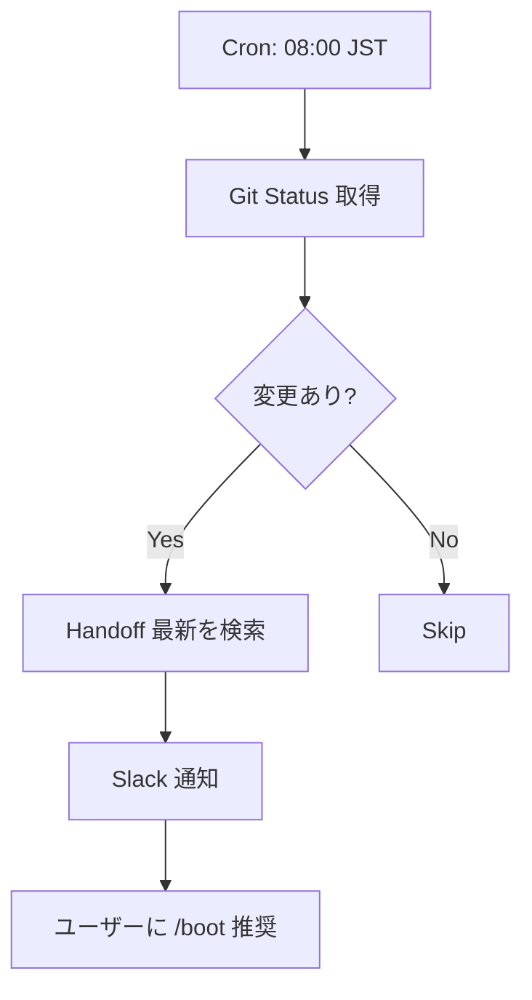

# n8n Boot Automation PoC v1.0

> **Origin**: CEP-001 活用計画 C (AI 自律化)
> **Goal**: /boot の一部を n8n で自動化する最小 PoC

---

## スコープ

| 含む | 含まない |
|:-----|:---------|
| Git status 取得 | Antigravity 連携 |
| Handoff 検索通知 | FEP A-matrix 読み込み |
| Slack 通知 | 完全自動 /boot |

---

## フロー設計



---

## n8n ノード構成

### 1. Schedule Trigger

- Type: `Cron`
- Time: `0 8 * * *` (08:00 JST)

### 2. Execute Command (Git Status)

```bash
cd /home/laihuip001/oikos/hegemonikon && git log -1 --oneline
```

### 3. HTTP Request (Handoff Search)

- Method: `GET /api/handoffs/latest`
- Headers: `Authorization: Bearer ${N8N_API_KEY}`

### 4. Slack Notification

```json
{
  "channel": "#hegemonikon",
  "text": "🌅 おはようございます！\n\n📋 Git: ${GIT_STATUS}\n📄 Handoff: ${HANDOFF_TITLE}\n\n→ /boot を推奨します"
}
```

---

## 実装ステップ

1. [ ] n8n Docker を起動
2. [ ] Slack Webhook を設定
3. [ ] フローを Import
4. [ ] Cron をテスト実行

---

## 次のステップ

- **WF-02 (Session Persistence)** へ拡張
- `/bye` 時の自動 Handoff 保存

---

*PoC v1.0 — Ready for n8n import*
