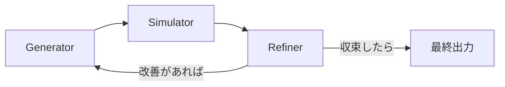

# Self-Optimization Workflow

> **Source:** 2026-02-10 プロンプト技法最前線サマリー
> **Purpose:** Generator→Simulator→Refiner の3段階ループによるプロンプト自己改善

---

## 概要

Self-Optimization は、tekhne-maker が生成したプロンプトを自動的に改善する
メタプロンプティング手法。3つのフェーズを反復し、品質を収束させる。

---

## 3段階ループ



### Phase 1: Generator（生成）

初期プロンプトを生成する。tekhne-maker の通常の出力。

```xml
<step_generate>
  ユーザーの要求に基づき、SKILL.md 形式のプロンプトを生成。
  Archetype 選定とテンプレート適用を実行。
</step_generate>
```

### Phase 2: Simulator（シミュレーション）

生成されたプロンプトを仮想実行し、失敗ケースを発見する。

```xml
<step_simulate>
  生成されたプロンプトに対して以下をシミュレート:
  1. **正常ケース:** 典型的な入力で期待通りの出力が得られるか
  2. **エッジケース:** 空入力、巨大入力、多言語入力
  3. **敵対的ケース:** prompt injection 試行、意図的な曖昧入力
  4. **形式チェック:** output_template で定義された構造が満たされるか
  
  結果を以下の形式で報告:
  | ケース | 入力 | 期待出力 | 実際の推定出力 | 合格 |
  |--------|------|----------|---------------|------|
</step_simulate>
```

### Phase 3: Refiner（改善）

シミュレーション結果に基づき、プロンプトを修正する。

```xml
<step_refine>
  シミュレーション結果の不合格ケースに対して:
  1. 根本原因を特定（制約不足 / 曖昧な指示 / 技術不足）
  2. 最小限の修正を提案（diff 形式）
  3. 修正後のプロンプトで再シミュレーション
  
  **収束条件:** 全ケースが合格 OR 3回反復で改善が停滞
</step_refine>
```

---

## tekhne-maker への統合

tekhne-maker の `@goal` セクションの Operating Modes に追加:

```
- **Optimize**: 「このプロンプトを最適化」→ Self-Optimization ループ実行
```

### 発動条件

| 条件 | 動作 |
|:-----|:-----|
| `Generate` モードの出力 | Simulator を1回実行（クイックチェック） |
| `Diagnose` モードの出力 | Refiner を1回実行（改善案付き診断） |
| `Optimize` モードの明示要求 | 3段階ループを最大3回反復 |

---

## コスト意識

| Archetype | ループ回数上限 | 理由 |
|:----------|:------------|:-----|
| Precision | 3 | 品質最優先 |
| Speed | 0 (省略) | シミュレーション時間がレイテンシ超過 |
| Autonomy | 1 | バランス |
| Creative | 1 | 多様性を殺さない |
| Safety | 3 | 安全性は妥協しない |

---

*v1.0 — Self-Optimization Workflow (2026-02-10)*
