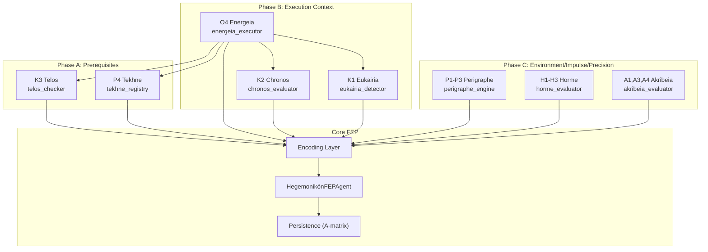

# Hegemonikón FEP Module

> **Free Energy Principle (FEP)** implementation for cognitive processes in the Hegemonikón framework.

## Overview

The FEP module provides Active Inference capabilities based on `pymdp`, integrating all 24 Hegemonikón theorems into a unified cognitive layer.

## Architecture



## Module Reference

| Module | Theorems | Purpose | Key Functions |
|:-------|:---------|:--------|:--------------|
| `fep_agent.py` | O1, O2 | Core Active Inference | `HegemonikónFEPAgent` |
| `telos_checker.py` | K3 | Goal-action alignment | `check_alignment()` |
| `tekhne_registry.py` | P4 | Action repertoire | `TekhnēRegistry`, `search_techniques()` |
| `energeia_executor.py` | O4 | 6-phase execution | `EnergеiaExecutor` |
| `chronos_evaluator.py` | K2 | Time constraints | `evaluate_time()` |
| `eukairia_detector.py` | K1 | Opportunity detection | `detect_opportunity()` |
| `perigraphe_engine.py` | P1-P3 | Scope/Path/Trajectory | `define_scope()`, `define_path()`, `define_trajectory()` |
| `horme_evaluator.py` | H1-H3 | Intuition/Confidence/Desire | `evaluate_propatheia()`, `evaluate_pistis()`, `evaluate_orexis()` |
| `akribeia_evaluator.py` | A1,A3,A4 | Emotion/Principles/Knowledge | `evaluate_pathos()`, `extract_gnome()`, `evaluate_episteme()` |

## Quick Start

### Basic Usage

```python
from mekhane.fep import (
    check_alignment,          # K3 Telos
    evaluate_time,            # K2 Chronos
    detect_opportunity,       # K1 Eukairia
    define_scope,             # P1 Khōra
    evaluate_pistis,          # H2 Pistis
    evaluate_episteme,        # A4 Epistēmē
)

# Goal-action alignment check
result = check_alignment("システム品質向上", "テストを追加")
print(result.status)  # AlignmentStatus.ALIGNED

# Time constraint evaluation
time_result = evaluate_time("実装タスク", "明日", estimated_hours=4)
print(time_result.slack)  # SlackLevel.ADEQUATE

# Opportunity detection
from mekhane.fep import OpportunityContext
ctx = OpportunityContext(environment_ready=0.8, resources_available=0.9)
opp = detect_opportunity("新機能リリース", ctx)
print(opp.decision)  # OpportunityDecision.GO
```

### FEP Agent Integration

All modules encode to a unified observation format:

```python
from mekhane.fep import (
    encode_telos_observation,
    encode_chronos_observation,
    encode_eukairia_observation,
)

# Each module produces: {context_clarity, urgency, confidence}
telos_obs = encode_telos_observation(telos_result)
chronos_obs = encode_chronos_observation(chronos_result)
eukairia_obs = encode_eukairia_observation(eukairia_result)

# Feed to FEP Agent
from mekhane.fep import HegemonikónFEPAgent
agent = HegemonikónFEPAgent()
# agent.step(combined_observation)
```

## Theorem Coverage

| Series | Theorems | Coverage |
|:-------|:---------|:---------|
| O (Ousia) | O1 Noēsis, O2 Boulēsis, O4 Energeia | ✅ 3/4 |
| S (Schema) | S2 Mekhanē (derivative_selector) | ✅ 1/4 |
| H (Hormē) | H1-H3 | ✅ 3/4 |
| P (Perigraphē) | P1-P4 | ✅ 4/4 |
| K (Kairos) | K1-K3 | ✅ 3/4 |
| A (Akribeia) | A1, A3, A4 | ✅ 3/4 |

**Total: 17/24 theorems (71%)**

## Testing

```bash
# Run all FEP tests
python -m pytest mekhane/fep/tests/ -v

# Current: 297 tests, 100% pass
```

## Version

- **v2.0** (2026-01-29): Phase A/B/C complete
- 8 new modules, 17 theorems covered
